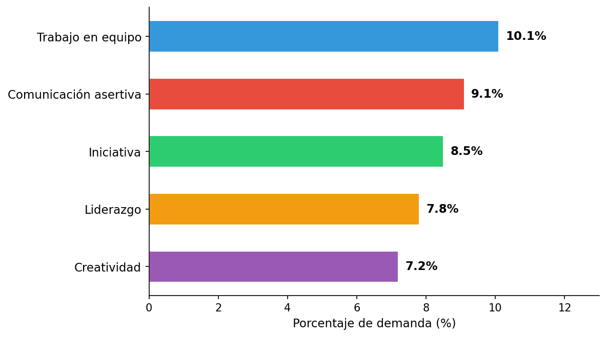
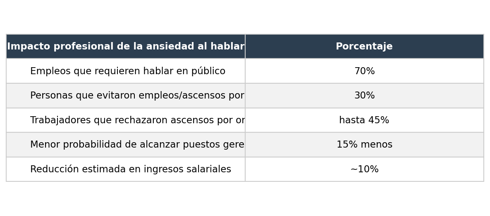
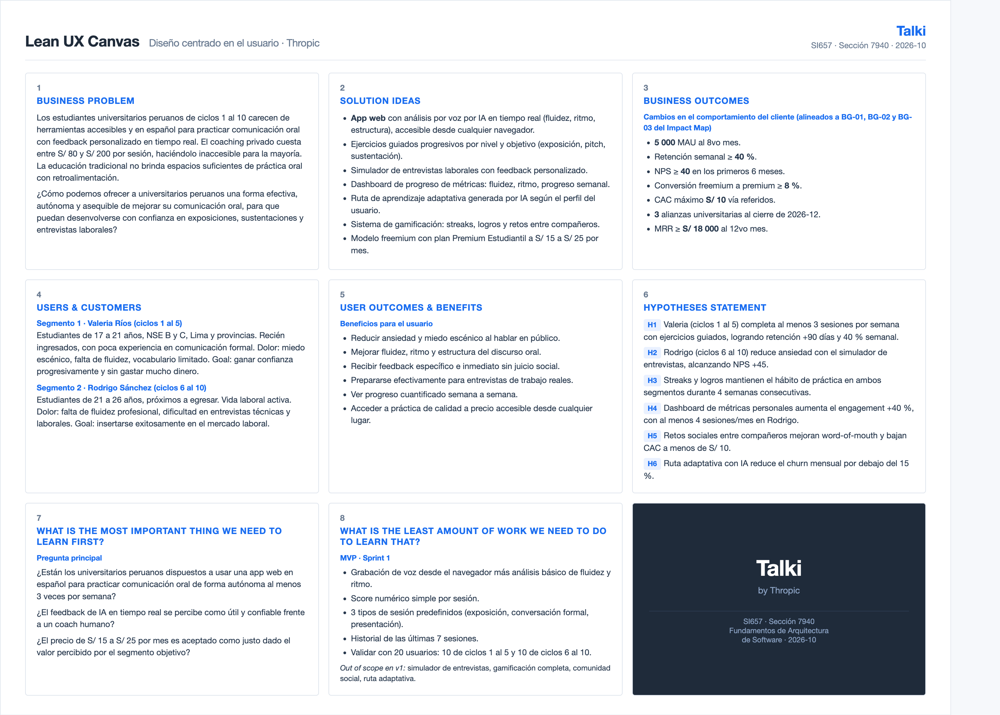
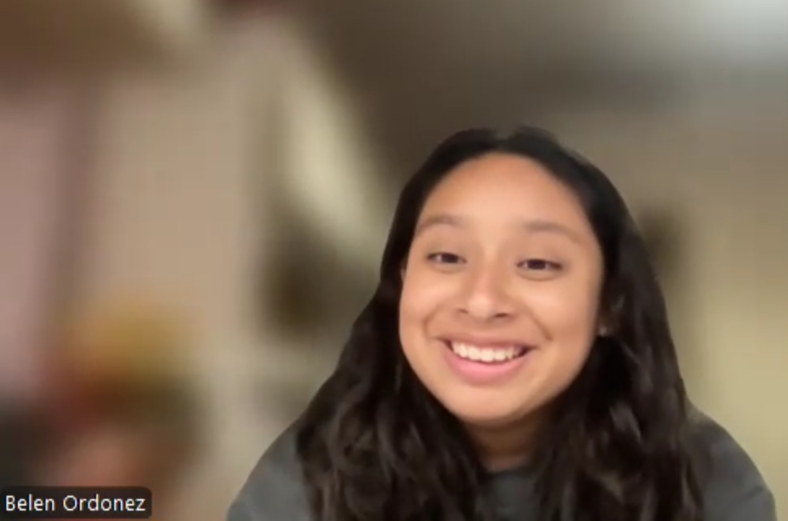
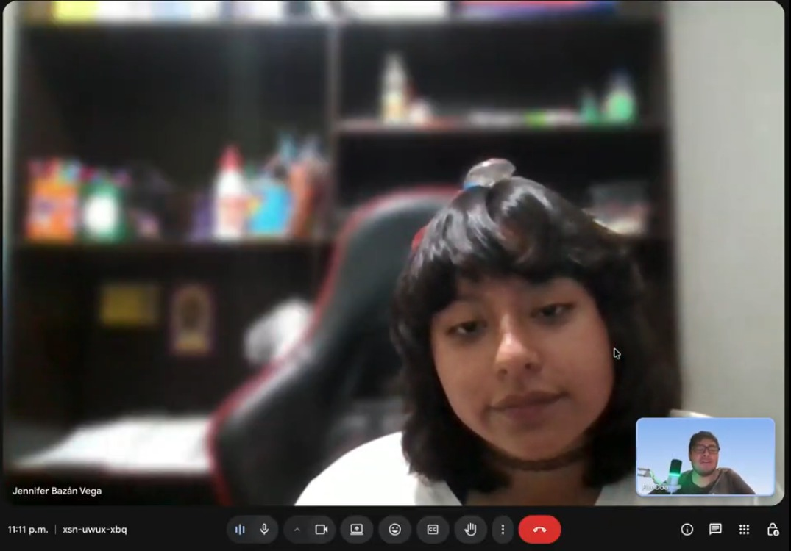
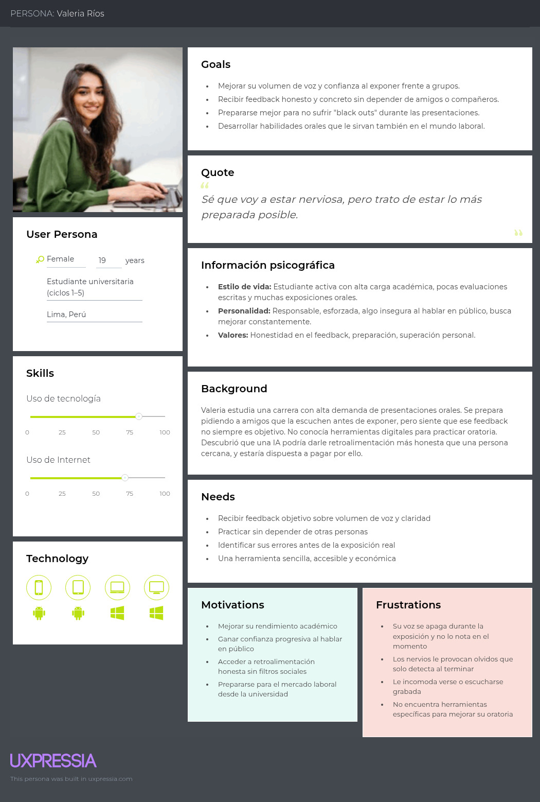
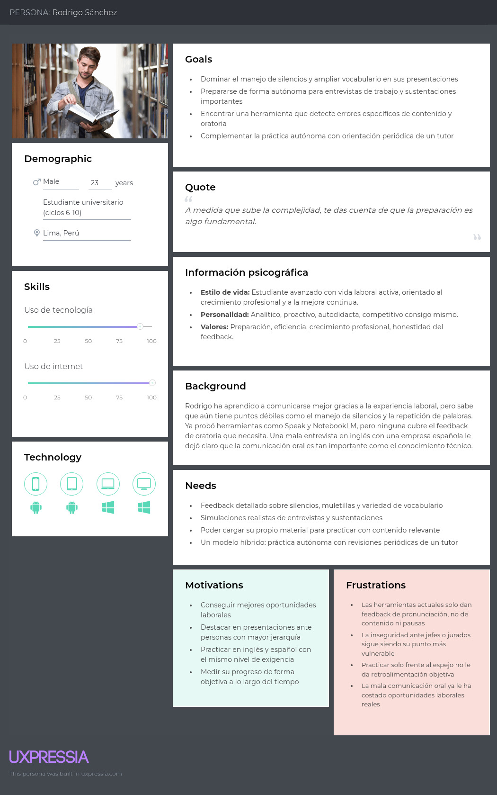
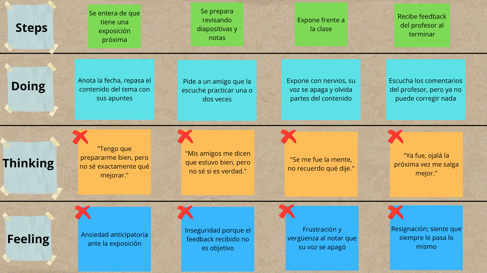

  

  

**Universidad Peruana de Ciencias Aplicadas**

 

**Ingeniería de Software**

**Periodo:** 2026-20

 

**1ASI0728 | Arquitecturas de Software Emergentes**

**NRC:** 16365

**Docente:** Valdivia Verde, Enrique Alejandro

### Informe de Trabajo Final

**Startup:** Thropic

**Producto:** Talki

 

**Integrantes:**

| Código | Apellidos y Nombres |
|--------|---------------------|
| U202313397 | Oroncoy Almeyda, Alejandro Daniel |
| U202312222 | Rivera Sosa, Eduardo Gael |
| U20241C134 | Tumi Oliden, Manuel Ignacio |
| U202310003 | Lang Nassi, Werner Khalil |
| U202313655 | Chi Cruzatt, Kevin Jorge |

 

**Septiembre, 2026**

  

# Registro de Versiones del Informe

| Versión | Fecha | Autor | Descripción de modificación |
| :---: | :---: | --- | --- |
| 0.1 | 08/09/2026 | Equipo Thropic | Creación de la estructura completa del informe de acuerdo con el formato oficial del Trabajo Final. |
| 0.2 | 08/09/2026 | Rivera Sosa, Eduardo Gael | Desarrollo de las secciones 1.1 a 1.3 (Startup Profile, Solution Profile, Lean UX Process y Segmentos objetivo) y 2.2 (Entrevistas), adaptando y actualizando el contenido validado en la fase inicial del proyecto Talki. |

# Project Report Collaboration Insights

Repositorio del informe: [talki-project-report](https://github.com/upc-pre-202620-si728-16365-thropic/talki-project-report)

En esta sección se incluirán, para cada entrega, las evidencias de colaboración del equipo obtenidas desde GitHub: commits, ramas, pull requests, participación de cada integrante y los gráficos de contribución correspondientes.

# Contenido

- [Capítulo I: Introducción](#capítulo-i-introducción)
  - [1.1. Startup Profile](#11-startup-profile)
    - [1.1.1. Descripción de la Startup](#111-descripción-de-la-startup)
    - [1.1.2. Perfiles de integrantes del equipo](#112-perfiles-de-integrantes-del-equipo)
  - [1.2. Solution Profile](#12-solution-profile)
    - [1.2.1. Antecedentes y problemática](#121-antecedentes-y-problemática)
    - [1.2.2. Lean UX Process](#122-lean-ux-process)
      - [1.2.2.1. Lean UX Problem Statements](#1221-lean-ux-problem-statements)
      - [1.2.2.2. Lean UX Assumptions](#1222-lean-ux-assumptions)
      - [1.2.2.3. Lean UX Hypothesis Statements](#1223-lean-ux-hypothesis-statements)
      - [1.2.2.4. Lean UX Canvas](#1224-lean-ux-canvas)
  - [1.3. Segmentos objetivo](#13-segmentos-objetivo)
- [Capítulo II: Requirements Elicitation & Analysis](#capítulo-ii-requirements-elicitation--analysis)
  - [2.1. Competidores](#21-competidores)
    - [2.1.1. Análisis competitivo](#211-análisis-competitivo)
    - [2.1.2. Estrategias y tácticas frente a competidores](#212-estrategias-y-tácticas-frente-a-competidores)
  - [2.2. Entrevistas](#22-entrevistas)
    - [2.2.1. Diseño de entrevistas](#221-diseño-de-entrevistas)
    - [2.2.2. Registro de entrevistas](#222-registro-de-entrevistas)
    - [2.2.3. Análisis de entrevistas](#223-análisis-de-entrevistas)
  - [2.3. Needfinding](#23-needfinding)
    - [2.3.1. User Personas](#231-user-personas)
    - [2.3.2. User Task Matrix](#232-user-task-matrix)
    - [2.3.3. Empathy Mapping](#233-empathy-mapping)
    - [2.3.4. As-is Scenario Mapping](#234-as-is-scenario-mapping)
  - [2.4. Ubiquitous Language](#24-ubiquitous-language)
- [Capítulo III: Requirements Specification](#capítulo-iii-requirements-specification)
  - [3.1. To-Be Scenario Mapping](#31-to-be-scenario-mapping)
  - [3.2. User Stories](#32-user-stories)
  - [3.3. Impact Mapping](#33-impact-mapping)
  - [3.4. Product Backlog](#34-product-backlog)
- [Capítulo IV: Strategic-Level Software Design](#capítulo-iv-strategic-level-software-design)
  - [4.1. Strategic-Level Attribute-Driven Design](#41-strategic-level-attribute-driven-design)
    - [4.1.1. Design Purpose](#411-design-purpose)
    - [4.1.2. Attribute-Driven Design Inputs](#412-attribute-driven-design-inputs)
      - [4.1.2.1. Primary Functionality (Primary User Stories)](#4121-primary-functionality-primary-user-stories)
      - [4.1.2.2. Quality Attribute Scenarios](#4122-quality-attribute-scenarios)
      - [4.1.2.3. Constraints](#4123-constraints)
    - [4.1.3. Architectural Drivers Backlog](#413-architectural-drivers-backlog)
    - [4.1.4. Architectural Design Decisions](#414-architectural-design-decisions)
    - [4.1.5. Quality Attribute Scenario Refinements](#415-quality-attribute-scenario-refinements)
  - [4.2. Strategic-Level Domain-Driven Design](#42-strategic-level-domain-driven-design)
    - [4.2.1. EventStorming](#421-eventstorming)
    - [4.2.2. Candidate Context Discovery](#422-candidate-context-discovery)
    - [4.2.3. Domain Message Flows Modeling](#423-domain-message-flows-modeling)
    - [4.2.4. Bounded Context Canvases](#424-bounded-context-canvases)
    - [4.2.5. Context Mapping](#425-context-mapping)
  - [4.3. Software Architecture](#43-software-architecture)
    - [4.3.1. System Landscape Diagram](#431-system-landscape-diagram)
    - [4.3.2. Context Level Diagrams](#432-context-level-diagrams)
    - [4.3.3. Container Level Diagrams](#433-container-level-diagrams)
    - [4.3.4. Deployment Diagrams](#434-deployment-diagrams)
- [Capítulo V: Tactical-Level Software Design](#capítulo-v-tactical-level-software-design)
  - [5.X. Bounded Context: Nombre del Bounded Context](#5x-bounded-context-nombre-del-bounded-context)
    - [5.X.1. Domain Layer](#5x1-domain-layer)
    - [5.X.2. Interface Layer](#5x2-interface-layer)
    - [5.X.3. Application Layer](#5x3-application-layer)
    - [5.X.4. Infrastructure Layer](#5x4-infrastructure-layer)
    - [5.X.5. Component Level Diagrams](#5x5-component-level-diagrams)
    - [5.X.6. Code Level Diagrams](#5x6-code-level-diagrams)
      - [5.X.6.1. Domain Layer Class Diagrams](#5x61-domain-layer-class-diagrams)
      - [5.X.6.2. Database Design Diagram](#5x62-database-design-diagram)
- [Capítulo VI: Solution UX Design](#capítulo-vi-solution-ux-design)
  - [6.1. Style Guidelines](#61-style-guidelines)
    - [6.1.1. General Style Guidelines](#611-general-style-guidelines)
    - [6.1.2. Web, Mobile and Devices Style Guidelines](#612-web-mobile-and-devices-style-guidelines)
  - [6.2. Information Architecture](#62-information-architecture)
    - [6.2.1. Organization Systems](#621-organization-systems)
    - [6.2.2. Labeling Systems](#622-labeling-systems)
    - [6.2.3. SEO Tags and Meta Tags](#623-seo-tags-and-meta-tags)
    - [6.2.4. Searching Systems](#624-searching-systems)
    - [6.2.5. Navigation Systems](#625-navigation-systems)
  - [6.3. Landing Page UI Design](#63-landing-page-ui-design)
    - [6.3.1. Landing Page Wireframe](#631-landing-page-wireframe)
    - [6.3.2. Landing Page Mock-up](#632-landing-page-mock-up)
  - [6.4. Applications UX/UI Design](#64-applications-uxui-design)
    - [6.4.1. Applications Wireframes](#641-applications-wireframes)
    - [6.4.2. Applications Wireflow Diagrams](#642-applications-wireflow-diagrams)
    - [6.4.3. Applications Mock-ups](#643-applications-mock-ups)
    - [6.4.4. Applications User Flow Diagrams](#644-applications-user-flow-diagrams)
  - [6.5. Applications Prototyping](#65-applications-prototyping)
- [Capítulo VII: Software Product Implementation, Validation & Deployment](#capítulo-vii-software-product-implementation-validation--deployment)
  - [7.1. Software Configuration Management](#71-software-configuration-management)
    - [7.1.1. Software Development Environment Configuration](#711-software-development-environment-configuration)
    - [7.1.2. Source Code Management](#712-source-code-management)
    - [7.1.3. Source Code Style Guide & Conventions](#713-source-code-style-guide--conventions)
    - [7.1.4. Software Deployment Configuration](#714-software-deployment-configuration)
  - [7.2. Solution Implementation](#72-solution-implementation)
    - [7.2.X. Sprint X](#72x-sprint-x)
      - [7.2.X.1. Sprint Planning X](#72x1-sprint-planning-x)
      - [7.2.X.2. Sprint Backlog X](#72x2-sprint-backlog-x)
      - [7.2.X.3. Development Evidence for Sprint Review](#72x3-development-evidence-for-sprint-review)
      - [7.2.X.4. Testing Suite Evidence for Sprint Review](#72x4-testing-suite-evidence-for-sprint-review)
      - [7.2.X.5. Execution Evidence for Sprint Review](#72x5-execution-evidence-for-sprint-review)
      - [7.2.X.6. Services Documentation Evidence for Sprint Review](#72x6-services-documentation-evidence-for-sprint-review)
      - [7.2.X.7. Software Deployment Evidence for Sprint Review](#72x7-software-deployment-evidence-for-sprint-review)
      - [7.2.X.8. Team Collaboration Insights during Sprint](#72x8-team-collaboration-insights-during-sprint)
  - [7.3. Validation Interviews](#73-validation-interviews)
    - [7.3.1. Diseño de entrevistas](#731-diseño-de-entrevistas)
    - [7.3.2. Registro de entrevistas](#732-registro-de-entrevistas)
    - [7.3.3. Evaluaciones según heurísticas](#733-evaluaciones-según-heurísticas)
  - [7.4. Video About-the-Product](#74-video-about-the-product)
- [Conclusiones y recomendaciones](#conclusiones-y-recomendaciones)
  - [Conclusiones](#conclusiones)
  - [Recomendaciones](#recomendaciones)
- [Video About-the-Team](#video-about-the-team)
- [Bibliografía](#bibliografía)
- [Anexos](#anexos)

# Student Outcome

El curso contribuye al cumplimiento del Student Outcome correspondiente. En esta sección se documentará, para cada integrante, cómo las actividades y evidencias del proyecto demuestran el logro del resultado de aprendizaje establecido por el curso.

| Criterio específico | Acciones realizadas | Conclusiones |
| --- | --- | --- |
| Comunica oralmente ideas y/o resultados con objetividad a público de diferentes especialidades y niveles jerárquicos, en el marco del desarrollo de un proyecto en ingeniería. | **TB1:**  **Gael:**  Expuse ante el equipo y el docente los fundamentos del Startup Profile y Solution Profile de Talki (misión, visión y problemática validada con datos de SUNEDU y estudios sobre ansiedad comunicativa), sustentando de forma objetiva el proceso Lean UX (problem statements, assumptions e hypothesis statements) y los hallazgos del diseño, registro y análisis de las entrevistas a los segmentos objetivo, argumentando con evidencia cuantitativa y cualitativa cómo estos resultados respaldan las decisiones de producto. | **TB1:**  La sustentación oral de los avances del TB1, desde el Startup Profile y Solution Profile hasta los Deployment Diagrams (sección 4.3.4), permitió comunicar de manera clara y objetiva la problemática validada, los requerimientos especificados y las decisiones de diseño arquitectónico ante audiencias con distintos niveles de conocimiento técnico (equipo y docente), facilitando el alineamiento de criterios y la retroalimentación oportuna para ajustar el rumbo del proyecto. |
| Comunica en forma escrita ideas y/o resultados con objetividad a público de diferentes especialidades y niveles jerárquicos, en el marco del desarrollo de un proyecto en ingeniería. | **TB1:**  **Gael:**  Redacté las secciones 1.1 (Startup Profile), 1.2 (Solution Profile y Lean UX Process), 1.3 (Segmentos objetivo) y 2.2 (Entrevistas) del informe, documentando de forma objetiva la problemática del negocio, el proceso Lean UX y los hallazgos del diseño, registro y análisis de las entrevistas, con un lenguaje adecuado tanto para el equipo técnico como para el docente. | **TB1:**  La documentación escrita del TB1, que abarca desde el Startup Profile hasta los Deployment Diagrams (sección 4.3.4), permitió comunicar de forma objetiva y estructurada la problemática validada, los requerimientos especificados y las decisiones de diseño arquitectónico, sirviendo como referencia técnica clara tanto para el equipo como para el docente. |

# Capítulo I: Introducción

## 1.1. Startup Profile

### 1.1.1. Descripción de la Startup

Thropic es una startup de tecnología educativa fundada por estudiantes de Ingeniería de Software de la Universidad Peruana de Ciencias Aplicadas (UPC), con la misión de democratizar el acceso a herramientas de desarrollo personal mediante inteligencia artificial.

**Misión:** Empoderar a los estudiantes universitarios a desarrollar habilidades de comunicación oral efectiva a través de tecnología accesible e inteligente.

**Visión:** Ser la plataforma líder en Latinoamérica para el desarrollo de habilidades de comunicación oral en el ámbito académico y profesional para 2030.

Talki es la solución principal de Thropic: una aplicación web que utiliza IA para analizar, evaluar y retroalimentar la comunicación oral de estudiantes universitarios en tiempo real, ayudándoles a mejorar su fluidez, pronunciación, estructura del discurso y confianza al hablar en público.

**Nombre del producto:** Talki proviene de la combinación de "Talk" (hablar, en inglés) con el sufijo "-i", que evoca inteligencia e innovación. El nombre representa la idea de contar con un compañero inteligente que ayuda a mejorar la forma de comunicarse oralmente.

### 1.1.2. Perfiles de integrantes del equipo

<table>
  <thead>
    <tr>
      <th>Perfil</th>
      <th>Foto</th>
    </tr>
  </thead>
  <tbody>
    <tr>
      <td><strong>Oroncoy Almeyda, Alejandro Daniel</strong> (U202313397) Tengo 19 años y soy estudiante de Ingeniería de Software en el quinto ciclo. Me considero una persona proactiva, autodidacta y orientada a objetivos. Disfruto aprender nuevas tecnologías por cuenta propia y busco siempre entregar resultados de calidad. Tengo experiencia en desarrollo backend con Java y Spring Boot, así como en Python y servicios cloud. Me motiva construir soluciones que generen impacto real, y en Thropic asumo con entusiasmo el reto de llevar Talki al mercado universitario peruano.</td>
      <td></td>
    </tr>
    <tr>
      <td><strong>Rivera Sosa, Eduardo Gael</strong> (U202312222) Tengo 20 años y soy estudiante de Ingeniería de Software en el quinto ciclo. Me caracterizo por ser responsable y orientado a resultados, con habilidades de liderazgo que facilitan la comunicación y el trabajo colaborativo. Tengo conocimientos en desarrollo frontend con Angular y experiencia en modelado de bases de datos relacionales. Siempre estoy dispuesto a abordar desafíos y encontrar soluciones en equipo, y en Thropic asumo la especificación de requerimientos como base técnica del producto.</td>
      <td></td>
    </tr>
    <tr>
      <td><strong>Tumi Oliden, Manuel Ignacio</strong> (U20241C134) Soy estudiante de Ingeniería de Software y me caracterizo por ser una persona colaborativa y adaptable, que se integra fácilmente a distintos métodos de trabajo. Tengo conocimientos en investigación de usuarios, diseño de entrevistas y análisis de necesidades, habilidades que aplico en la etapa de needfinding del proyecto. Prefiero apoyar al equipo desde la escucha activa y el análisis, y en mi tiempo libre disfruto del voleibol y los videojuegos.</td>
      <td></td>
    </tr>
    <tr>
      <td><strong>Lang Nassi, Werner Khalil</strong> (U202310003) Estudiante de la Universidad Peruana de Ciencias Aplicadas (UPC), cursando en 8.º ciclo. Tengo afinidad con la arquitectura de software y e desarollado habilidades con machine y deep learning. Ademas siempre estoy dispuesto a aprender nuevas metologias o habilidades que me ayuden a desarollarme en la carrera.</td>
      <td></td>
    </tr>
    <tr>
      <td><strong>Chi Cruzatt, Kevin Jorge</strong> (U202313655) Actualmente estoy cursando la carrera de ingeniería de Software y me encuentro en el 8° ciclo. Tengo experiencia utilizando diferentes metodologías de diseño, como Domain Driven Design (DDD) y CMV, además de frameworks como Laravel y Spring en lenguajes como Java, PHP, etc. Me considero una persona paciente y perseverante en situaciones difíciles.</td>
      <td></td>
    </tr>
  </tbody>
</table>

## 1.2. Solution Profile

### 1.2.1. Antecedentes y problemática

#### WHAT (Qué)

Las deficiencias en comunicación oral afectan el desempeño académico y profesional de los universitarios peruanos.

#### WHEN (Cuándo)

Se manifiesta principalmente al momento de realizar exposiciones, sustentaciones, entrevistas de trabajo y presentaciones profesionales.

#### WHERE (Dónde)

En aulas universitarias, plataformas virtuales y entornos laborales/prácticas.

#### WHO (Quién)

Estudiantes de educación superior peruanos (ciclos 1-10), especialmente aquellos sin acceso a coaching personalizado.

#### WHY (Por qué)

La educación tradicional no brinda suficientes espacios de práctica oral con feedback personalizado. El acceso a coaches es costoso y limitado.

#### HOW (Cómo)

Talki usa IA para grabar, analizar y retroalimentar la comunicación oral del usuario en tiempo real, con ejercicios progresivos y personalizados.

#### HOW MUCH (Cuánto)

Según la Superintendencia Nacional de Educación Superior Universitaria (SUNEDU, 2023), más de 1.5 millones de estudiantes se encuentran matriculados en universidades peruanas, representando un mercado potencial significativo para soluciones de desarrollo de competencias comunicativas.

En el plano de la ansiedad comunicativa, la literatura científica muestra cifras consistentemente elevadas. Maldonado et al. (2022), en un estudio experimental con universitarios publicado en la *Revista Latina de Comunicación Social*, confirmaron que la ansiedad al hablar en público impacta directamente el desempeño académico y la participación activa en clases. A nivel global, investigaciones compiladas por Teleprompter.com (2024) revelan que el **75% de las personas** experimenta algún nivel de ansiedad al hablar en público, y el **61% de universitarios** la reporta como un temor significativo.

_Figura 1: Prevalencia de la ansiedad al hablar en público en población universitaria_

_Nota._ Elaboración propia basada en Teleprompter.com (2024) y Crown Counseling (2024).

Respecto al impacto en la empleabilidad, un estudio descriptivo sobre competencias laborales blandas en egresados universitarios latinoamericanos (Redalyc, 2022) identificó que la **comunicación asertiva** es la segunda habilidad más demandada por empleadores (9.1%), solo detrás del trabajo en equipo (10.1%). Sin embargo, es también una de las competencias con mayores brechas en egresados.

_Figura 2: Habilidades blandas más demandadas por empleadores en Latinoamérica_

_Nota._ Elaboración propia basada en Redalyc (2022).

Finalmente, la ansiedad comunicativa no solo afecta el desempeño académico sino también la trayectoria profesional. Datos de Crown Counseling (2024) y Teleprompter.com (2024) indican que el **70% de los empleos** requiere algún nivel de oratoria o presentaciones; el **30% de las personas** ha evitado postular a empleos o ascensos debido a esta ansiedad; y quienes la padecen tienen un **15% menos de probabilidad** de alcanzar posiciones gerenciales.

_Figura 3: Impacto profesional de la ansiedad al hablar en público_

_Nota._ Elaboración propia basada en Crown Counseling (2024) y Teleprompter.com (2024).

Ante este escenario, el costo de un coach de oratoria privado en Lima oscila entre S/. 80 y S/. 200 por sesión (con frecuencia semanal recomendada), haciendo inaccesible el entrenamiento personalizado para la mayoría del segmento universitario. Talki aborda esta brecha mediante IA accesible desde cualquier navegador web, a una fracción del costo.

### 1.2.2. Lean UX Process

El proceso Lean UX aplicado en Thropic sigue el enfoque de validación continua de hipótesis mediante ciclos cortos de aprendizaje, construir y medir (Ries, 2011), con el objetivo de reducir el riesgo de construir un producto que el mercado no necesita.

#### 1.2.2.1. Lean UX Problem Statements

**Segmento 1:** Hemos observado que los estudiantes de ciclos 1-5 carecen de espacios seguros y accesibles para practicar la comunicación oral con feedback real. El impacto es bajo desempeño en exposiciones y pérdida de oportunidades académicas. ¿Cómo podríamos brindarles práctica guiada con IA para que ganen confianza progresivamente?

**Segmento 2:** Hemos observado que los estudiantes de ciclos 6-10 no tienen herramientas asequibles para prepararse para entrevistas laborales y presentaciones profesionales. El impacto es dificultad para insertarse en el mercado laboral. ¿Cómo podríamos simular entornos reales de comunicación profesional para que estén listos al graduarse?

#### 1.2.2.2. Lean UX Assumptions

##### Business Assumptions

1. Creemos que los usuarios pagarán una suscripción mensual de S/. 15-25 por acceso premium.
2. Creemos que el mayor canal de adquisición serán las redes sociales universitarias (Instagram, TikTok).
3. Creemos que los usuarios necesitan al menos 3 sesiones semanales para notar mejora en 30 días.
4. Creemos que las universidades adoptarán Talki como herramienta complementaria en cursos de comunicación.
5. Creemos que el NPS (Net Promoter Score) alcanzará 40+ en los primeros 6 meses.
6. Creemos que el costo de adquisición por usuario será menor a S/. 10 mediante estrategias de referidos.
7. Creemos que el 60% de usuarios retendrá la app más de 3 meses con gamificación efectiva.
8. Creemos que las alianzas con institutos y universidades serán nuestro principal canal B2B.
9. Creemos que los usuarios en ciclos 6-10 están dispuestos a pagar más por features de simulación de entrevistas.
10. Creemos que el mercado latinoamericano de edtech crecerá 25% anual los próximos 3 años.
11. Creemos que la diferenciación por idioma español y contexto peruano/latinoamericano será una ventaja competitiva sostenible.

##### User Assumptions

1. **¿Quién es el usuario?** Estudiantes universitarios peruanos de ciclos 1-10, de 17 a 26 años, nativos digitales con acceso a laptop/PC y conexión a internet.
2. **¿Dónde encaja nuestro producto en su vida?** En los momentos previos a exposiciones, durante el estudio en casa, y en transporte público.
3. **¿Qué problemas resuelve nuestro producto?** La falta de espacios seguros para practicar oralidad con feedback inmediato y personalizado.
4. **¿Cuándo y cómo es usado nuestro producto?** Sesiones de 10-20 minutos, principalmente en las noches, desde el navegador web en su laptop o PC.
5. **¿Qué características son importantes?** Feedback en tiempo real, ejercicios progresivos, historial de progreso, modo simulación de entrevistas.
6. **¿Cómo debe verse y comportarse el producto?** Intuitivo, motivador, con elementos de gamificación, lenguaje cercano y sin tecnicismos.

#### 1.2.2.3. Lean UX Hypothesis Statements

Cada hipótesis sigue el feature hypothesis template y explicita los cuatro componentes requeridos: business outcome medible, usuario segmentado (Valeria Ríos o Rodrigo Sánchez), beneficio percibido y feature asociada.

1. **H1 (Adopción).** Creemos que lograremos una retención semanal del 40% y una permanencia promedio de más de 90 días en Valeria Ríos (Segmento 1, ciclos 1 al 5) si la estudiante gana confianza al practicar exposiciones con feedback inmediato, mediante la feature de *ejercicios guiados con IA*.

2. **H2 (Conversión).** Creemos que lograremos una reducción de la ansiedad al hablar en público y un NPS de al menos 45 puntos en Rodrigo Sánchez (Segmento 2, ciclos 6 al 10) si el estudiante se prepara para entrevistas laborales reales en condiciones realistas, mediante la feature de *simulador de entrevistas con feedback en tiempo real*.

3. **H3 (Engagement).** Creemos que lograremos al menos 3 sesiones semanales sostenidas durante 4 semanas consecutivas en ambos segmentos si los estudiantes conservan el hábito de práctica gracias a refuerzos positivos, mediante la feature de *streaks y logros*.

4. **H4 (Engagement).** Creemos que lograremos un aumento del engagement de 40% (es decir, al menos 4 sesiones al mes) en Rodrigo Sánchez (Segmento 2) si el estudiante puede visualizar su progreso medible por habilidad en un lugar único, mediante la feature de *dashboard de métricas personales*.

5. **H5 (Adopción).** Creemos que lograremos un CAC por debajo de S/ 10 vía referidos en Valeria Ríos (Segmento 1) si la estudiante puede compartir logros con sus compañeros de clase, mediante la feature de *comunidad y retos entre amigos*.

6. **H6 (Retención).** Creemos que lograremos un churn mensual por debajo del 15% en ambos segmentos si los estudiantes reciben un plan de práctica personalizado según sus errores recurrentes, mediante la feature de *ruta de aprendizaje adaptativa con IA*.

#### 1.2.2.4. Lean UX Canvas

_Figura 4: Lean UX Canvas de Talki_

_Nota._ Elaboración propia (2026).

El canvas documenta de forma visual: business outcomes, problemas de usuario, oportunidades, soluciones propuestas, métricas clave de éxito y los supuestos que guían el desarrollo del producto, en línea con los problem statements, assumptions e hypothesis statements descritos en las secciones anteriores.

## 1.3. Segmentos objetivo

**Segmento 1: Estudiantes universitarios de ciclos 1 al 5**

*Aspectos Demográficos:*
- Edad: 17-21 años
- Sexo: Masculino y femenino
- Nivel socioeconómico: B y C
- Ciclo: 1 al 5 de educación superior universitaria

*Aspectos Geográficos:*
- País: Perú
- Región: Lima Metropolitana y principales ciudades del interior (Arequipa, Trujillo, Piura)
- Tipo de institución: Universidades privadas y públicas

*Aspectos Psicográficos:*
- Motivaciones: Mejorar calificaciones en cursos con exposiciones, ganar confianza al hablar en público, no pasar vergüenza frente a compañeros
- Dolores: Miedo escénico pronunciado, vocabulario académico limitado, falta de estructura al exponer, nerviosismo que bloquea el discurso
- Comportamientos digitales: Nativos digitales, uso intensivo de dispositivos digitales y navegador web, acostumbrados a plataformas de aprendizaje (Duolingo, YouTube), disponibles para sesiones cortas de 10-15 min

**Segmento 2: Estudiantes universitarios de ciclos 6 al 10**

*Aspectos Demográficos:*
- Edad: 21-26 años
- Sexo: Masculino y femenino
- Nivel socioeconómico: B y C
- Ciclo: 6 al 10 de educación superior universitaria, próximos a egresar

*Aspectos Geográficos:*
- País: Perú
- Región: Lima Metropolitana y principales ciudades con oferta laboral tecnológica
- Tipo de institución: Universidades con programas de prácticas preprofesionales activos

*Aspectos Psicográficos:*
- Motivaciones: Conseguir prácticas o primer empleo, destacar en entrevistas técnicas y de RR.HH., comunicar ideas con claridad en entornos profesionales
- Dolores: Dificultad para expresarse con fluidez y vocabulario profesional, ansiedad ante entrevistas de trabajo, falta de espacios reales de práctica con feedback concreto
- Comportamientos digitales: Usuarios activos de LinkedIn, plataformas de empleabilidad y apps de productividad; dispuestos a pagar por herramientas que generen ROI directo en su carrera

# Capítulo II: Requirements Elicitation & Analysis

## 2.1. Competidores

### 2.1.1. Análisis competitivo

Para identificar las fortalezas, debilidades y estrategias de nuestros competidores directos e indirectos, con el fin de definir la propuesta de valor diferenciada de Talki y detectar oportunidades de mercado no atendidas, se elaboró el siguiente **Competitive Analysis Landscape** comparando Talki con tres competidores relevantes en el espacio de aplicaciones de mejora de la comunicación oral: ELSA Speak, Speeko y Orai.

<table>
  <tr>
    <th colspan="6">Competitive Analysis Landscape</th>
  </tr>
  <tr>
    <td colspan="2" align="center"><b>¿Por qué llevar a cabo este análisis?</b></td>
    <td colspan="4">Para identificar las fortalezas, debilidades y estrategias de nuestros competidores directos e indirectos, con el fin de definir la propuesta de valor diferenciada de Talki y detectar oportunidades de mercado no atendidas.</td>
  </tr>
  <tr>
    <th colspan="2">Nombre</th>
    <th>Talki (Thropic)</th>
    <th>ELSA Speak</th>
    <th>Speeko</th>
    <th>Orai</th>
  </tr>
  <tr>
    <td colspan="2" align="center"><b>Logo</b></td>
    <td align="center"></td>
    <td align="center"></td>
    <td align="center"></td>
    <td align="center"></td>
  </tr>
  <tr>
    <td rowspan="2"><b>Perfil</b></td>
    <td><b>Overview</b></td>
    <td>Aplicación web con IA que analiza y retroalimenta la comunicación oral de estudiantes universitarios peruanos en tiempo real, en español.</td>
    <td>App de pronunciación en inglés con IA que evalúa y corrige la pronunciación del usuario en tiempo real mediante reconocimiento de voz avanzado.</td>
    <td>App de coaching para hablar en público con lecciones estructuradas impartidas por coaches reales y ejercicios de práctica.</td>
    <td>App móvil con IA que analiza la oratoria del usuario (ritmo, palabras de relleno, energía, expresión facial) y entrega retroalimentación inmediata y lecciones personalizadas.</td>
  </tr>
  <tr>
    <td><b>Ventaja competitiva ¿Qué valor ofrece a los clientes?</b></td>
    <td>Feedback en tiempo real en español con contexto académico peruano; enfocado en universitarios latinoamericanos.</td>
    <td>Motor de IA especializado en detección de errores fonéticos del inglés; más de 50M usuarios globales.</td>
    <td>Contenido creado por coaches profesionales de oratoria; estructura de cursos progresivos y micro-lecciones de 5 minutos.</td>
    <td>Análisis multimodal (voz + expresión facial) con plan de entrenamiento adaptativo; gamificación y seguimiento de progreso detallado.</td>
  </tr>
  <tr>
    <td rowspan="2"><b>Perfil de Marketing</b></td>
    <td><b>Mercado objetivo</b></td>
    <td>Estudiantes universitarios peruanos/latinoamericanos de ciclos 1-10.</td>
    <td>Hablantes no nativos de inglés que desean mejorar su pronunciación, principalmente en Asia y Latinoamérica.</td>
    <td>Profesionales y estudiantes angloparlantes que quieren mejorar su oratoria y liderazgo comunicacional.</td>
    <td>Profesionales, estudiantes y ejecutivos angloparlantes que necesitan mejorar presentaciones y discursos.</td>
  </tr>
  <tr>
    <td><b>Estrategias de Marketing</b></td>
    <td>Freemium, marketing universitario, referidos entre compañeros.</td>
    <td>Freemium, referidos, partnerships con instituciones educativas.</td>
    <td>Freemium, publicidad en LinkedIn y redes, membresías corporativas.</td>
    <td>Freemium con trial de 7 días, alianzas con instituciones educativas, plan Enterprise para equipos.</td>
  </tr>
  <tr>
    <td rowspan="3"><b>Perfil de Producto</b></td>
    <td><b>Productos &amp; Servicios</b></td>
    <td>Aplicación web con análisis de voz, ejercicios guiados, simulador de entrevistas y dashboard de progreso.</td>
    <td>App móvil (iOS/Android) con lecciones de pronunciación, conversación simulada y análisis fonético detallado.</td>
    <td>App móvil con cursos de oratoria, ejercicios diarios de 5 minutos y biblioteca de habilidades comunicacionales.</td>
    <td>App móvil (iOS/Android) con análisis de voz e imagen, lecciones gamificadas, historial de práctica y plan personalizado de 4 semanas.</td>
  </tr>
  <tr>
    <td><b>Precios y Costos</b></td>
    <td>Freemium; plan premium S/. 15-25/mes.</td>
    <td>Gratis con funciones limitadas; premium desde $6.99/mes.</td>
    <td>Gratis con funciones básicas; premium desde $9.99/mes.</td>
    <td>Gratis con funciones básicas; premium desde $9.99/mes o $39.99/año.</td>
  </tr>
  <tr>
    <td><b>Canales de distribución</b></td>
    <td>Sitio web (talki.com), compatible con navegadores modernos (Chrome, Edge, Safari, Firefox).</td>
    <td>App Store, Google Play, web.</td>
    <td>App Store, Google Play.</td>
    <td>App Store, Google Play.</td>
  </tr>
  <tr>
    <td rowspan="4"><b>Análisis SWOT</b></td>
    <td><b>Fortalezas</b></td>
    <td>Español nativo, contexto universitario peruano, IA personalizada, gamificación.</td>
    <td>IA muy precisa, gran base de usuarios global, contenido extenso y probado.</td>
    <td>Contenido de alta calidad creado por expertos, formato de micro-lecciones atractivo.</td>
    <td>Análisis multimodal avanzado, plan adaptativo personalizado, gamificación efectiva, disponible en iOS y Android.</td>
  </tr>
  <tr>
    <td><b>Oportunidades</b></td>
    <td>Mercado latinoamericano poco atendido, alianzas con universidades, expansión a otros países.</td>
    <td>Expansión a otros idiomas, mercado B2B con instituciones educativas.</td>
    <td>Mercado B2B corporativo, expansión a español y otros idiomas.</td>
    <td>Expansión a idiomas distintos del inglés, mercado educativo universitario latinoamericano sin atender.</td>
  </tr>
  <tr>
    <td><b>Debilidades</b></td>
    <td>Startup nueva sin track record, recursos limitados, marca poco conocida.</td>
    <td>Enfocado solo en pronunciación del inglés, no cubre comunicación oral en español.</td>
    <td>Sin IA para feedback en tiempo real, contenido exclusivamente en inglés.</td>
    <td>Solo disponible en inglés, sin adaptación al contexto académico ni latinoamericano.</td>
  </tr>
  <tr>
    <td><b>Amenazas</b></td>
    <td>Entrada de apps internacionales al mercado hispanohablante, competidores con mayor financiamiento.</td>
    <td>Competidores con IA generativa más avanzada, apps multiidioma con mayor alcance.</td>
    <td>Apps con IA generativa que ofrecen feedback personalizado, saturación del mercado edtech.</td>
    <td>Saturación del mercado edtech en inglés, nuevos competidores con IA generativa más potente.</td>
  </tr>
</table>

### 2.1.2. Estrategias y tácticas frente a competidores

A partir del análisis competitivo, Thropic adopta las siguientes estrategias para posicionar Talki en el mercado:

**Frente a ELSA Speak:**
ELSA Speak domina el mercado de pronunciación en inglés pero no atiende la comunicación oral en español ni el contexto académico latinoamericano. Talki se diferencia enfocándose exclusivamente en español con contexto universitario peruano, ofreciendo ejercicios de exposición académica y simulación de sustentaciones que ELSA no contempla.

**Frente a Speeko:**
Speeko utiliza contenido pregrabado por coaches sin feedback personalizado en tiempo real. Talki responde con IA generativa que analiza el discurso del usuario en el momento y entrega retroalimentación específica e inmediata, no guiones estáticos. Además, Speeko no tiene presencia en el mercado hispanohablante, lo que representa una ventana de oportunidad directa.

**Frente a Orai:**
Orai ofrece análisis de oratoria con IA de manera similar a Talki, pero opera exclusivamente en inglés y sin ninguna adaptación al contexto académico latinoamericano. Talki capitaliza esta brecha ofreciendo la misma profundidad de análisis (ritmo, fluidez, claridad) pero en español, con ejercicios diseñados para sustentaciones, exposiciones universitarias y entrevistas de prácticas preprofesionales típicas del sistema educativo peruano.

**Estrategia de diferenciación general:**

- *Localización:* Único producto diseñado para el contexto universitario peruano/latinoamericano en español
- *Precio accesible:* Modelo freemium con plan premium a S/. 15-25/mes, muy por debajo de los competidores internacionales
- *Alianzas universitarias:* Partnerships con facultades de Ingeniería y Comunicaciones de universidades peruanas para adopción institucional
- *Gamificación contextual:* Sistema de logros y streaks adaptado a los ciclos académicos peruanos (exposiciones, sustentaciones, entrevistas de prácticas)

## 2.2. Entrevistas

### 2.2.1. Diseño de entrevistas

El objetivo de las entrevistas es comprender las necesidades, frustraciones y hábitos de comunicación oral de los segmentos objetivo de Talki, así como su disposición a usar herramientas digitales para mejorar sus habilidades comunicativas.

---

**Segmento 1: Estudiantes universitarios de ciclos 1 al 5**

*Objetivos específicos:*
- Conocer cómo viven los primeros encuentros con exposiciones y presentaciones en la universidad.
- Identificar las inseguridades comunicativas más frecuentes en etapas tempranas de la carrera.
- Entender qué estrategias de práctica emplean actualmente y cuáles consideran insuficientes.
- Evaluar su apertura a recibir retroalimentación automatizada de una IA.

*Preguntas introductorias:*
1. ¿En qué universidad estudias, qué carrera sigues y en qué ciclo te encuentras?
2. ¿Con qué frecuencia tienes que hacer exposiciones, sustentaciones o participaciones orales en clases?

*Preguntas principales:*

3. ¿Cómo fue tu primera exposición en la universidad? ¿Qué recuerdas de esa experiencia?
4. ¿Qué aspectos de tu comunicación oral sientes que más necesitas trabajar en este punto de tu carrera? (nerviosismo, muletillas, fluidez, volumen, etc.)
5. ¿Cómo te preparas actualmente cuando tienes que exponer? ¿Cuánto tiempo le dedicas?
6. ¿Alguna vez tu desempeño oral no reflejó lo que realmente sabías del tema? ¿Qué ocurrió?
7. ¿Has usado alguna app o herramienta digital para mejorar tu forma de hablar o exponer? ¿Cómo fue?
8. ¿Te grabarías en video o audio para escucharte y corregirte? ¿Por qué sí o por qué no?
9. ¿Qué tan cómodo(a) te sentirías recibiendo retroalimentación de una IA sobre tu forma de hablar?
10. ¿Estarías dispuesto(a) a pagar por una app así? ¿Qué precio te parecería justo?

---

**Segmento 2: Estudiantes universitarios de ciclos 6 al 10**

*Objetivos específicos:*
- Entender cómo evolucionan las exigencias de comunicación oral en ciclos avanzados.
- Identificar si la preparación para prácticas preprofesionales o entrevistas laborales genera nuevas necesidades comunicativas.
- Conocer su nivel de autonomía para practicar y mejorar su oratoria.
- Determinar su disposición a adoptar una herramienta de IA especializada en comunicación académica y profesional.

*Preguntas introductorias:*
1. ¿En qué universidad estudias, qué carrera sigues y en qué ciclo te encuentras?
2. ¿Qué tipos de evaluaciones orales has tenido que enfrentar en los últimos ciclos? (sustentaciones, jurados, entrevistas de prácticas, etc.)

*Preguntas principales:*

3. Comparando tus primeros ciclos con ahora, ¿sientes que tu comunicación oral ha mejorado? ¿Qué crees que la cambió?
4. ¿Cuáles son los escenarios orales que todavía te generan más estrés o inseguridad?
5. ¿Cómo te preparas hoy para una sustentación importante o una entrevista de prácticas?
6. ¿Has sentido que tu forma de comunicarte oralmente te ha jugado en contra en alguna evaluación o proceso de selección? Cuéntame.
7. ¿Has probado alguna herramienta digital para practicar presentaciones o entrevistas? ¿Qué te pareció?
8. ¿Qué tipo de análisis de tu comunicación te resultaría más valioso: fluidez, claridad de ideas, manejo de silencios, muletillas, otro?
9. ¿Qué tan útil sería para ti una app con IA que simule sustentaciones o entrevistas de prácticas y te dé retroalimentación detallada?
10. ¿Usarías este tipo de herramienta de forma autónoma o preferirías poder compartir los resultados con un profesor o tutor?

### 2.2.2. Registro de entrevistas

**Segmento #1: Estudiantes universitarios de ciclos 1 al 5**

| Número de entrevista | Datos del entrevistado | Evidencia de entrevista |
|---|---|---|
| 1 | **Nombre:** Belén Ordoñez   **Universidad:** PUCP   **Ciclo:** 5to   **Carrera:** Comunicación para el Desarrollo    **Resumen:** Estudiante de quinto ciclo en la PUCP cuya carrera gira en torno a presentaciones orales: la mayoría de sus evaluaciones son exposiciones de proyectos. Recuerda haberse puesto nerviosa en su primera exposición universitaria. Su principal problema es que el volumen de su voz va disminuyendo conforme avanza en la presentación. Ha sufrido "black outs" durante exposiciones, terminando sin recordar lo que dijo. No conocía la existencia de herramientas digitales para mejorar la oratoria. Actualmente pide a amigos que la escuchen antes de exponer. Se sentiría más cómoda recibiendo retroalimentación de una IA por su mayor honestidad y franqueza. Estaría dispuesta a pagar entre 2 y 5 dólares mensuales por una app que realmente funcione. |  [📂 Ver entrevista](https://drive.google.com/drive/folders/1IwH1aTzPJ2Y5cYJS3yqF8UM4eHfprvLE?usp=sharing)   `00:00:00 a 00:06:12` |
| 2 | **Nombre:** Isabel Rodriguez   **Universidad:** Universidad de Lima   **Ciclo:** 5to   **Carrera:** Arquitectura    **Resumen:** Isabel estudia Arquitectura en la Universidad de Lima y tiene exposiciones prácticamente todas las semanas, especialmente resúmenes de talleres los viernes. Su primera experiencia expositiva fue buena en general, aunque reconoce que hubiera sido mejor con más dominio del curso. Los puntos que más necesita trabajar son el nerviosismo y la ampliación de vocabulario, pues tiende a repetir siempre las mismas palabras. Se prepara con una bitácora personal y revisando sus diapositivas el día anterior. Usa ChatGPT para preparar contenido, aunque de forma general. Olvida información relevante por el apuro de terminar la exposición rápido. Le parece muy interesante recibir retroalimentación de una IA por el ahorro de tiempo. Estaría dispuesta a pagar hasta 5 dólares mensuales, aunque querría comparar precios antes de decidir. |  [📂 Ver entrevista](https://drive.google.com/drive/folders/1IwH1aTzPJ2Y5cYJS3yqF8UM4eHfprvLE?usp=sharing)   `00:06:13 a 00:13:29` |
| 3 | **Nombre:** Juan Alejandro Elías López   **Universidad:** UPC   **Ciclo:** 4to   **Carrera:** Ingeniería de Software    **Resumen:** Juan Alejandro ya tenía experiencia en exposiciones desde la secundaria, por lo que su primera presentación universitaria no le generó nerviosismo. Considera que exponer es divertido. El aspecto que más necesita mejorar es la fluidez, especialmente en exposiciones finales de alta importancia donde el nerviosismo sí lo afecta. Se prepara escribiendo su guión a mano y memorizándolo en partes a lo largo de varios días, dedicando aproximadamente 2 horas diarias. Nunca ha sentido que una exposición no reflejara lo que sabía. No ha usado herramientas digitales para mejorar su oratoria. Estaría dispuesto a grabarse como nueva forma de práctica autónoma. Estaría abierto tanto a retroalimentación de IA como de un tutor humano, y el precio que pagaría dependería de las funcionalidades concretas que ofrezca la aplicación. |  [📂 Ver entrevista](https://drive.google.com/drive/folders/1IwH1aTzPJ2Y5cYJS3yqF8UM4eHfprvLE?usp=sharing)   `00:12:30 a 00:19:18` |

**Segmento #2: Estudiantes universitarios de ciclos 6 al 10**

| Número de entrevista | Datos del entrevistado | Evidencia de entrevista |
|---|---|---|
| 4 | **Nombre:** Gianger   **Universidad:** University of the People (EE.UU., modalidad remota)   **Ciclo:** 6to   **Carrera:** Computer Science    **Resumen:** Gianger estudia de forma remota en una universidad estadounidense y tiene una trayectoria oral variada: monografías, proyectos de software, debates, simulaciones de entrevistas y entrevistas reales de trabajo. Reconoce una mejora enorme desde sus inicios, impulsada principalmente por la experiencia laboral. Antes hablaba muy rápido y usaba muletillas constantemente. Hoy la presión aparece principalmente al presentar ante jefes o personas con mayor jerarquía. Se prepara con "chuletillas", guías de oratoria y autograbaciones para identificar puntos débiles. Vivió en carne propia cómo la mala comunicación le jugó en contra en una entrevista con una empresa española en inglés. Ha probado la herramienta "Speak", pero le falta feedback de contenido y manejo de silencios. Los análisis que más le aportarían son el manejo de silencios y la variedad de vocabulario. Ve una app con IA para simular sustentaciones y entrevistas como extremadamente útil, y prefiere un modelo híbrido con checkpoints periódicos con un tutor. |  [📂 Ver entrevista](https://drive.google.com/drive/folders/1IwH1aTzPJ2Y5cYJS3yqF8UM4eHfprvLE?usp=sharing)   `00:19:19 a 00:31:47` |
| 5 | **Nombre:** Jennifer   **Universidad:** Universidad Privada del Norte   **Ciclo:** 7mo   **Carrera:** Administración y Marketing    **Resumen:** Jennifer ha enfrentado sustentaciones de trabajos, exposiciones de proyectos, entrevistas y presentaciones ante jurados a lo largo de su carrera. Reconoce que su comunicación oral ha mejorado notablemente gracias a la práctica constante: en los primeros ciclos le costaba organizar sus ideas y se ponía nerviosa, hoy habla con mayor claridad y seguridad. Los escenarios que aún le generan estrés son las presentaciones ante un jurado y las entrevistas de prácticas, donde siente una evaluación más directa. Se prepara investigando el tema, organizando ideas, practicando frente al espejo o grabándose, y anticipando posibles preguntas. Ha vivido situaciones donde los nervios le hicieron olvidar ideas clave, afectando la claridad de su mensaje. No ha usado aplicaciones especializadas; solo grabaciones básicas con el celular o Zoom. El análisis que considera más valioso es el de fluidez y claridad de ideas. Ve muy útil una app con IA para practicar en un entorno realista con retroalimentación específica. Prefiere un uso híbrido: práctica autónoma combinada con orientación de un tutor o profesor. |  [📂 Ver entrevista](https://drive.google.com/drive/folders/1IwH1aTzPJ2Y5cYJS3yqF8UM4eHfprvLE?usp=sharing)   `00:31:47 a 00:39:18` |
| 6 | **Nombre:** Jorge Sinyun González   **Universidad:** Universidad Peruana de Ciencias Aplicadas (UPC)   **Ciclo:** 7mo a 8vo   **Carrera:** Ingeniería de Software    **Resumen:** Jorge identifica las presentaciones ante audiencias o profesores como su mayor dificultad, ya que la inseguridad al cometer errores y los nervios visibles pueden afectar directamente su nota. Siente que su comunicación ha mejorado en la medida que domina mejor los temas del curso, pero como habilidad pura de oratoria el avance ha sido leve. Se prepara revisando los requerimientos, tomando notas de apoyo y usando NotebookLM para generar preguntas y practicar respuestas. Tuvo un caso negativo en el curso de Agile Frameworks, donde tuvo que mirar constantemente las diapositivas por no dominar el flujo del tema, algo que el profesor notó y comentó. Practica hablando solo frente a la presentación o usando el método del espejo, y ha buscado apps de práctica de lenguaje sin encontrar una específica para oratoria. El análisis que considera más valioso es el de claridad de ideas, porque evidencia dominio del tema ante la audiencia. Ve la app con IA como extremadamente útil, especialmente si permite cargar el material propio para detectar puntos débiles de contenido y vocalización. Prefiere el modo autónomo por privacidad y comodidad, aunque reconoce el valor del feedback docente. |  [📂 Ver entrevista](https://drive.google.com/drive/folders/1IwH1aTzPJ2Y5cYJS3yqF8UM4eHfprvLE?usp=sharing)   `00:39:18 a 00:47:18` |

### 2.2.3. Análisis de entrevistas

---

**Segmento #1: Estudiantes universitarios de ciclos iniciales (1ro al 5to ciclo)**

---

**Belén Ordoñez (PUCP, 5to ciclo)**

Estudia Comunicación para el Desarrollo en la PUCP y se encuentra en su primer año de carrera. Las presentaciones son muy frecuentes en su carrera: la mayoría de las evaluaciones son exposiciones de proyectos, ya que hay pocos exámenes escritos. Recuerda haberse puesto nerviosa en su primera exposición universitaria. Su principal problema es que el volumen de su voz va bajando a medida que avanza la presentación, al punto de que ya no la escuchan. Se prepara intentando dominar el contenido del tema, aunque reconoce que hay cosas "fuera de su control". Ha experimentado "black outs" durante exposiciones: termina sin recordar lo que dijo, y solo después nota lo que le faltó. No conocía la existencia de aplicaciones para mejorar la oratoria. Le gustaría grabarse, aunque le cuesta escuchar su propia voz; actualmente pide a amigos que la escuchen y le den feedback. Se sentiría más cómoda recibiendo retroalimentación de una IA que de una persona, porque considera que la IA es más directa y honesta. Estaría dispuesta a usar una aplicación de pago entre 2 y 5 dólares mensuales, siempre que sea realmente buena.

**Puntos clave:**
- Exposiciones muy frecuentes (evaluación principal en su carrera).
- Mayor problema: **volumen de voz que decrece** durante la presentación.
- Ha sufrido **"black outs"** en exposiciones por los nervios y la adrenalina.
- **No conocía** herramientas digitales para mejorar la oratoria.
- Pide feedback a amigos; le cuesta escucharse o verse grabada.
- Prefiere retroalimentación de **IA sobre personas** por mayor honestidad.
- Dispuesta a pagar entre **2 y 5 dólares mensuales** si la app cumple.

---

**Isabel Rodriguez (Arquitectura, U. de Lima, 5to ciclo)**

Estudia arquitectura en la Universidad de Lima y está en quinto ciclo. Tiene exposiciones prácticamente todas las semanas, especialmente los viernes, con resúmenes de cursos de taller. Su primera experiencia fue buena en términos generales, aunque reconoce que hubiera sido mejor con mayor conocimiento del curso. Los aspectos que más necesita trabajar son el nerviosismo y la ampliación de vocabulario, ya que tiende a usar siempre las mismas palabras. Se prepara leyendo sus diapositivas y notas de una bitácora personal el día anterior y momentos antes de la clase. Usa IA generativa (ChatGPT) para preparar su contenido, aunque con ideas muy generales. Siente que a veces olvida información relevante que no puso en las láminas por el apuro de terminar rápido. Estaría dispuesta a grabarse para autocorregirse. Le parece interesante recibir retroalimentación de una IA, especialmente porque le ahorraría tiempo, algo valioso dada su carga académica. Estaría dispuesta a pagar por la aplicación, en especial si la ayuda a prepararse para algo importante. Sugiere un precio máximo de 5 dólares mensuales, aunque querría compararlo con otras opciones antes.

**Puntos clave:**
- Exposiciones **semanales**, especialmente en talleres.
- Necesita mejorar **nerviosismo y vocabulario** (tiende a repetir palabras).
- Se prepara con **bitácora personal y diapositivas** el día anterior.
- Usa **ChatGPT** para preparar contenido, pero de forma general.
- Olvida información relevante por el **apuro de terminar** la exposición.
- Valoraría una app de IA que **ahorre tiempo** dada su alta carga académica.
- Precio aceptable: hasta **5 dólares mensuales**.

---

**Juan Alejandro Elías López (Ing. Software, UPC, 4to ciclo)**

Estudia Ingeniería de Software en la UPC y está en cuarto ciclo. Ya venía con experiencia de exposiciones desde la secundaria, por lo que su primera presentación universitaria no fue especialmente nerviosa. Considera que sus exposiciones son divertidas. El aspecto en el que siente que más necesita mejorar es la fluidez, especialmente en exposiciones finales de alta importancia, donde el nerviosismo lo afecta. Se prepara escribiendo su guión a mano, memorizándolo en partes durante varios días, dedicando alrededor de 2 horas diarias. Nunca ha sentido que una exposición no reflejara lo que sabía, ya que siempre memorizaba sus puntos. Nunca ha usado herramientas digitales para mejorar su oratoria. Estaría dispuesto a grabarse para practicar de forma autónoma como algo nuevo a probar. Le gustaría tanto retroalimentación de una IA como de un profesor particular, sin descartar ninguna opción. El precio que pagaría dependería de las funcionalidades que ofrezca la aplicación.

**Puntos clave:**
- Experiencia previa en exposiciones desde secundaria; **no experimenta nerviosismo intenso**.
- Principal área de mejora: **fluidez** en exposiciones de alta importancia.
- Método de preparación: **guión escrito a mano y memorización** en partes (2 horas/día).
- **No ha usado** herramientas digitales de práctica oral.
- Abierto a grabarse como **método de práctica autónoma**.
- Prefiere retroalimentación **híbrida**: IA y tutor humano.
- El precio depende de las **funcionalidades ofrecidas**.

---

**Segmento #2: Estudiantes universitarios de ciclos avanzados (6to al 10mo ciclo)**

**Gianger (Computer Science, University of the People EE.UU., 6to ciclo)**

Estudiante peruano radicado en Lima que cursa Computer Science de forma remota en una universidad estadounidense (University of the People), se encuentra en sexto ciclo. Aunque su universidad es extranjera, se incluye en el estudio porque representa el caso de universitarios peruanos que complementan su formación local con programas internacionales 100% online y que enfrentan retos adicionales de comunicación oral en contextos bilingües, un perfil cada vez más frecuente en el mercado laboral tecnológico peruano. Ha tenido evaluaciones orales variadas: monografías, proyectos de software, debates y simulaciones de entrevistas, además de entrevistas reales de trabajo. Reconoce que su comunicación oral ha mejorado enormemente desde sus inicios universitarios, principalmente gracias al mundo laboral. Antes hablaba muy rápido, llenaba los silencios y usaba muletillas constantemente. Actualmente, los escenarios que aún le generan presión son las presentaciones ante jefes o personas con mayor jerarquía. Se prepara haciendo "chuletillas" (resúmenes de ideas principales), consultando guías de oratoria y grabándose para identificar sus puntos débiles. Ha reconocido que la mala comunicación le jugó en contra en sus primeras entrevistas de trabajo, especialmente una con una empresa española en inglés. Ha probado la herramienta digital "Speak", que le da feedback sobre pronunciación, entonación y relación de palabras, aunque no sobre contenido ni manejo de silencios. Considera que lo más valioso sería una app que analice silencios y variedad de vocabulario, dos de sus puntos más débiles. Ve una aplicación con IA para simular sustentaciones y entrevistas como "extremadamente útil", con feedback sobre gestos, pronunciación, muletillas y claridad de ideas. Prefiere un esquema híbrido: IA autónoma con checkpoints periódicos con un tutor humano.

**Puntos clave:**
- Experiencia amplia: debates, proyectos, simulaciones y **entrevistas reales de trabajo**.
- Ha mejorado mucho gracias a la **práctica laboral**; antes hablaba muy rápido y usaba muchas muletillas.
- Siente presión al presentar ante **personas con mayor jerarquía**.
- Se prepara con **chuletillas, guías de oratoria y autograbaciones**.
- La mala comunicación le costó oportunidades laborales, especialmente en **inglés**.
- Ha usado **"Speak"**, pero le falta feedback de contenido y manejo de silencios.
- Necesita mejorar **manejo de silencios y variedad de vocabulario**.
- Ve la app con IA como **extremadamente útil**; prefiere modelo **híbrido** (IA + tutor).

**Jennifer (Administración y Marketing, Universidad Privada del Norte, 7mo ciclo)**

Estudia Administración y Marketing en la Universidad Privada del Norte y se encuentra en séptimo ciclo. Ha enfrentado sustentaciones de trabajos, exposiciones de proyectos, entrevistas y presentaciones ante jurados. Reconoce que su comunicación oral ha mejorado bastante desde los primeros ciclos, cuando le costaba organizar sus ideas y se ponía nerviosa. La práctica constante le ha dado mayor claridad y seguridad. Los escenarios que aún le generan estrés son las presentaciones ante un jurado y las entrevistas de prácticas, donde siente una presión y evaluación más directa. Se prepara investigando bien el tema, organizando ideas, practicando frente al espejo o grabándose, y anticipando posibles preguntas. Ha experimentado que los nervios le han hecho olvidar ideas en momentos clave, afectando la claridad de su mensaje. No ha usado aplicaciones especializadas; solo se ha grabado con el celular o por Zoom. El análisis que considera más valioso es el de fluidez y claridad de ideas, como aspectos clave para mejorar su comunicación. Ve muy útil una app con IA que simule sustentaciones y entrevistas con retroalimentación específica, porque le permitiría practicar en un entorno más realista. Le gustaría utilizarla tanto de forma autónoma como compartiendo resultados con un tutor o profesor para recibir orientación adicional.

**Puntos clave:**
- Ha mejorado desde los primeros ciclos gracias a la **práctica constante**.
- Siente más presión en **jurados y entrevistas de prácticas**.
- Se prepara con investigación, espejo, grabaciones y **anticipación de preguntas**.
- Los nervios le han causado **olvidos** que afectaron la claridad del mensaje.
- No ha usado **apps especializadas**; solo grabaciones básicas.
- Análisis más valioso: **fluidez y claridad de ideas**.
- Ve la app como muy útil para practicar en un **entorno realista**.
- Prefiere uso **híbrido**: autónomo + compartir resultados con tutor.

---

**Jorge Sinyun González (Ing. Software, UPC, 7mo-8vo ciclo)**

Estudia Ingeniería de Software en la UPC y se encuentra entre el séptimo y octavo ciclo. Lo que más le ha costado a lo largo de su carrera son las presentaciones ante una audiencia o profesor, por la inseguridad al cometer errores y porque los nervios visibles pueden afectar la nota. Siente que su comunicación ha mejorado en la medida en que ha ganado confianza y dominio de los temas del curso, aunque como habilidad pura de oratoria el avance ha sido leve. Se prepara revisando los requerimientos de la entrevista, tomando notas de apoyo, y usando herramientas como NotebookLM para generar preguntas y practicar respuestas. Ha tenido un caso negativo en el curso de Agile Frameworks, donde tuvo que mirar constantemente las diapositivas por no dominar bien el flujo del tema, lo que fue notado por el profesor. Practica hablando solo viendo la presentación, usando el método del espejo o buscando aplicaciones de práctica de lenguaje, aunque no ha encontrado una que se enfoque en oratoria específicamente. Considera que el análisis más valioso es el de claridad de ideas, porque demuestra dominio del tema ante la audiencia. Ve una app con IA para simular sustentaciones y entrevistas como "extremadamente útil", especialmente si permite cargar el material propio para detectar puntos débiles de contenido y vocalización. Prefiere una herramienta autónoma por la privacidad y comodidad, aunque reconoce que el feedback del profesor ofrece orientación más alineada al curso.

**Puntos clave:**
- Mayor dificultad: **inseguridad y nervios visibles** ante audiencias y profesores.
- La mejora ha venido del **conocimiento del tema**, no de la habilidad oral en sí.
- Se prepara con **notas, NotebookLM** y práctica de preguntas y respuestas.
- Caso negativo en **Agile Frameworks** por no dominar el flujo del contenido.
- Practica con el espejo, hablando solo o buscando apps de lenguaje, sin encontrar algo específico de **oratoria**.
- Análisis más valioso: **claridad de ideas**.
- App con IA sería "**extremadamente útil**", especialmente si permite cargar contenido propio.
- Prefiere modo **autónomo** por privacidad, aunque valora el feedback docente.

---

**Síntesis cruzada de hallazgos**

Las fichas individuales anteriores recogen la evidencia bruta de cada entrevistado. A continuación se presentan los patrones convergentes y divergentes identificados al cruzar los seis casos, con el objetivo de extraer insights accionables para el diseño de Talki.

**Patrones convergentes (aplican a ambos segmentos):**

- **6 de 6** entrevistados consideran que una aplicación con IA especializada en oratoria sería "útil" o "extremadamente útil" para su preparación personal.
- **6 de 6** no han encontrado una aplicación digital enfocada específicamente en oratoria en español; las que conocen (Speak, ChatGPT, NotebookLM, grabadoras nativas) cubren partes del problema pero no el feedback completo.
- **5 de 6** reconocen que los nervios o la ansiedad los han llevado a olvidar contenido, perder fluidez o bajar el volumen durante una presentación importante (Belén, Isabel, Jennifer, Jorge, Juan Alejandro en exposiciones de alta importancia).
- **5 de 6** valoran recibir retroalimentación objetiva y directa, ya sea porque la IA es percibida como más honesta (Belén) o porque les ahorra tiempo frente al feedback de pares (Isabel, Jennifer).
- **4 de 6** se graban o están dispuestos a grabarse como método de práctica autónoma (Gianger, Jennifer, Juan Alejandro dispuesto, Jorge con su propio material).

**Divergencias por segmento:**

| Dimensión | Segmento 1 (ciclos 1 al 5) | Segmento 2 (ciclos 6 al 10) |
|---|---|---|
| Problema principal | Volumen, nerviosismo agudo, black outs, vocabulario repetitivo | Fluidez profesional, manejo de silencios, inseguridad ante jerarquías |
| Contexto de presentación | Exposiciones académicas frecuentes (semanales) | Sustentaciones, jurados, entrevistas laborales reales |
| Madurez oral percibida | Principiantes que buscan ganar confianza | Intermedios que buscan pulir un nivel ya existente |
| Herramientas usadas | Prácticamente ninguna | Speak, NotebookLM, grabaciones personales |
| Modelo de feedback preferido | Autónomo con IA (por honestidad y costo) | Híbrido (IA más checkpoints con tutor) |
| Disposición a pagar | USD 2 a 5 (S/ 7 a S/ 19) | Mayor, justificada por retorno profesional |

**Implicaciones para el diseño de Talki:**

1. **MVP debe cubrir feedback de voz básico en español** (volumen, fluidez, muletillas, vocabulario), validado por los seis entrevistados como brecha universal.
2. **El análisis por segmento debe adaptar profundidad y foco**: para el Segmento 1, ejercicios guiados y métricas simples; para el Segmento 2, simulador de entrevistas y análisis de silencios.
3. **La IA como juez imparcial es una ventaja competitiva validada**: cinco de seis entrevistados prefieren o aceptan feedback de IA por su objetividad, lo que reduce la fricción social que enfrentan con amigos o profesores.
4. **El modelo freemium con precio estudiantil es viable**: el rango de disposición a pagar se alinea con el plan Premium de S/ 15 a S/ 25 (ver nota siguiente).
5. **La opción híbrida (IA más tutor) debe considerarse para una fase posterior**, ya que dos entrevistados del Segmento 2 la prefieren explícitamente, aunque no es bloqueante para el MVP.

---

**Nota sobre la disposición a pagar**

Las entrevistadas del Segmento 1 (Belén e Isabel) expresaron su disposición a pagar un rango aproximado de **USD 2 a 5 mensuales** por una aplicación que realmente funcione. Considerando el tipo de cambio promedio de referencia (S/ 3.70 por USD), este rango equivale a **S/ 7 a S/ 19 mensuales**. El plan Premium Estudiantil de Talki, definido en la sección 1.2.2.2, en **S/ 15 a S/ 25 mensuales**, se encuentra dentro o muy cerca del techo indicado por las usuarias, lo que sugiere una aceptabilidad razonable del precio propuesto. Para el Segmento 2 (Rodrigo Sánchez y similares), la disposición a pagar es mayor por el retorno profesional esperado (entrevistas, ascensos, primer empleo), lo que habilita el tramo superior del rango y justifica mantener la horquilla S/ 15 a S/ 25 como precio de referencia.

## 2.3. Needfinding

### 2.3.1. User Personas

Para comprender mejor las necesidades, motivaciones y comportamientos de los usuarios clave de Talki, se han desarrollado dos perfiles de usuario o personas representativas. Estos perfiles sintetizan características típicas, objetivos y retos de los segmentos principales, facilitando el diseño centrado en el usuario y la toma de decisiones estratégicas durante el desarrollo de la plataforma.

**Persona 1: Valeria Ríos, la Estudiante en Formación Oral**

Estudiante universitaria de 19 años, residente en Lima, Perú, cursando los ciclos 1 al 5 de una carrera con alta demanda de presentaciones orales. Valeria representa a los estudiantes de ciclos iniciales que enfrentan con frecuencia exposiciones como principal forma de evaluación, pero carecen de herramientas y métodos efectivos para practicar. Se considera responsable y esforzada, aunque algo insegura al hablar en público y en busca de mejorar de forma constante. Sus principales frustraciones son que su voz se apaga durante la exposición sin que ella lo note y los "black outs" provocados por los nervios. Valora recibir retroalimentación honesta y objetiva que le permita identificar errores (como la pérdida de volumen de voz o los olvidos por nervios) y mejorar progresivamente su desempeño, sin depender de terceros y a un costo accesible.

> *"Sé que voy a estar nerviosa, pero trato de estar lo más preparada posible."*

**Persona 2: Rodrigo Sánchez, el Estudiante Avanzado con Miras Profesionales**

Estudiante universitario de 23 años, residente en Lima, Perú, cursando los ciclos 6 al 10 de Ingeniería de Software con vida laboral activa. Rodrigo encarna a los estudiantes avanzados que, habiendo ganado experiencia académica y laboral, reconocen que la comunicación oral es un factor decisivo en su desarrollo profesional. Es analítico, proactivo y autodidacta; domina herramientas digitales como Speak y NotebookLM, pero ninguna cubre el feedback de oratoria que necesita (manejo de silencios, muletillas, claridad de ideas). Una mala entrevista en inglés con una empresa española le dejó claro que la comunicación oral es tan importante como el conocimiento técnico. Busca una solución específica que le brinde análisis detallado de su oratoria y le permita prepararse de forma autónoma para sustentaciones importantes y entrevistas de trabajo reales, con la opción de complementar la práctica autónoma con orientación periódica de un tutor.

> *"A medida que sube la complejidad, te das cuenta de que la preparación es algo fundamental."*

### 2.3.2. User Task Matrix

<table>
  <thead>
    <tr>
      <th rowspan="2">Tareas</th>
      <th colspan="2">Valeria Ríos (Ciclos iniciales)</th>
      <th colspan="2">Rodrigo Sánchez (Ciclos avanzados)</th>
    </tr>
    <tr>
      <th>Frecuencia</th>
      <th>Importancia</th>
      <th>Frecuencia</th>
      <th>Importancia</th>
    </tr>
  </thead>
  <tbody>
    <tr>
      <td>Grabarse practicando una exposición</td>
      <td>Raramente</td>
      <td>Alta</td>
      <td>Casi siempre</td>
      <td>Muy alta</td>
    </tr>
    <tr>
      <td>Recibir retroalimentación sobre su oratoria</td>
      <td>A veces</td>
      <td>Muy alta</td>
      <td>Casi siempre</td>
      <td>Muy alta</td>
    </tr>
    <tr>
      <td>Practicar simulaciones de exposiciones</td>
      <td>A veces</td>
      <td>Alta</td>
      <td>Siempre</td>
      <td>Muy alta</td>
    </tr>
    <tr>
      <td>Practicar simulaciones de entrevistas de trabajo</td>
      <td>Nunca</td>
      <td>Media</td>
      <td>Casi siempre</td>
      <td>Muy alta</td>
    </tr>
    <tr>
      <td>Identificar muletillas y palabras repetidas</td>
      <td>Raramente</td>
      <td>Alta</td>
      <td>Casi siempre</td>
      <td>Alta</td>
    </tr>
    <tr>
      <td>Analizar volumen y claridad de voz</td>
      <td>A veces</td>
      <td>Muy alta</td>
      <td>A veces</td>
      <td>Alta</td>
    </tr>
    <tr>
      <td>Revisar historial de sesiones de práctica</td>
      <td>Raramente</td>
      <td>Media</td>
      <td>Casi siempre</td>
      <td>Alta</td>
    </tr>
    <tr>
      <td>Compartir resultados con un tutor o profesor</td>
      <td>A veces</td>
      <td>Media</td>
      <td>A veces</td>
      <td>Alta</td>
    </tr>
    <tr>
      <td>Cargar material propio para practicar</td>
      <td>Raramente</td>
      <td>Media</td>
      <td>Casi siempre</td>
      <td>Muy alta</td>
    </tr>
    <tr>
      <td>Consultar tips y guías de oratoria</td>
      <td>A veces</td>
      <td>Alta</td>
      <td>A veces</td>
      <td>Media</td>
    </tr>
  </tbody>
</table>

Las tareas más frecuentes para los perfiles de usuario en Talki muestran diferencias claras según el ciclo académico y las metas de cada uno. Valeria Ríos, como estudiante de ciclos iniciales, interactúa principalmente con las funciones de grabación, análisis de volumen de voz y recepción de retroalimentación general, considerándolas cruciales para superar su inseguridad al exponer. En contraste, Rodrigo Sánchez, estudiante avanzado con experiencia laboral, utiliza la plataforma de forma más estratégica y constante, priorizando las simulaciones de entrevistas de trabajo, la carga de material propio y el seguimiento de su historial de sesiones, actividades que realiza con alta frecuencia y considera muy importantes para su desarrollo profesional. Ambos perfiles coinciden en el valor de practicar simulaciones de exposiciones y recibir retroalimentación sobre su oratoria, aunque Rodrigo las ejecuta con mayor regularidad y profundidad.

Coincidencias:
- Ambos consideran de muy alta importancia recibir retroalimentación sobre su oratoria, aunque Rodrigo lo hace con mayor frecuencia.

- Comparten una actitud positiva hacia la práctica de simulaciones de exposiciones, siendo una tarea central para los dos perfiles.

- Las funciones de identificación de muletillas y análisis de claridad de voz tienen importancia alta para ambos, aunque con distinta frecuencia de uso.

Diferencias:
- Valeria prioriza el análisis de volumen y claridad de voz como su necesidad más urgente, mientras que Rodrigo enfoca su atención en el manejo de silencios, la variedad de vocabulario y la preparación para entrevistas laborales.

- Rodrigo utiliza con mucha mayor frecuencia la carga de material propio y el historial de sesiones, tareas que Valeria realiza raramente por encontrarse en etapas más básicas de práctica.

- Las simulaciones de entrevistas de trabajo son de muy alta importancia y frecuencia para Rodrigo, mientras que para Valeria tienen una importancia media y nunca las ha practicado aún, dado que su foco está en las exposiciones académicas.

### 2.3.3. Empathy Mapping

A continuación se presentan los mapas de empatía para los dos perfiles principales de usuarios de Talki: Valeria Ríos, estudiante universitaria de ciclos iniciales, y Rodrigo Sánchez, estudiante avanzado con experiencia laboral. Estos mapas permiten comprender en profundidad sus necesidades, pensamientos, sentimientos y comportamientos, facilitando un diseño centrado en el usuario.

**Segmento 1:**

El mapa de empatía de Valeria muestra que es una estudiante que enfrenta con frecuencia exposiciones orales como principal forma de evaluación, pero carece de métodos objetivos para practicar. Se siente frustrada porque los nervios le provocan olvidos y su voz se apaga durante las presentaciones, y no encuentra herramientas digitales específicas que la ayuden a mejorar de forma autónoma y accesible.

**Segmento 2:**

El mapa de empatía de Rodrigo refleja a un estudiante avanzado con clara conciencia de que la comunicación oral es decisiva para su desarrollo profesional. Busca una solución específica que vaya más allá de la pronunciación y le ofrezca análisis profundo de su oratoria, permitiéndole prepararse de forma autónoma para entrevistas de trabajo y sustentaciones importantes con feedback real y medible.

### 2.3.4. As-is Scenario Mapping

**Segmento 1**

Mediante este artefacto, se ha llevado a cabo la elaboración del As-is Scenario Mapping para el primer segmento. Este escenario refleja cómo los estudiantes universitarios que enfrentan exposiciones orales frecuentes se preparan actualmente para ellas, las dificultades que experimentan al no contar con herramientas objetivas de práctica, así como las emociones de ansiedad, frustración y resignación que acompañan cada etapa de su proceso expositivo.

**Segmento 2**

Mediante este artefacto, se ha llevado a cabo la elaboración del As-is Scenario Mapping para el segundo segmento. Este escenario describe cómo los estudiantes de ciclos superiores con experiencia laboral se preparan hoy en día para sustentaciones importantes y entrevistas de trabajo, evidenciando las limitaciones de las herramientas digitales actuales, los métodos de práctica poco objetivos a los que recurren y la incertidumbre que sienten al no poder medir su progreso de forma concreta.

## 2.4. Ubiquitous Language

El lenguaje ubicuo (Ubiquitous Language) establece un vocabulario común y compartido entre el equipo de desarrollo, los stakeholders y los usuarios de Talki. Este glosario garantiza que todos los términos del dominio de la comunicación oral y del análisis de oratoria se comprendan e interpreten de forma consistente a lo largo de todo el informe, el modelo de dominio y la implementación de la solución.

| Término (EN / ES) | Descripción |
|---|---|
| **Speaker / Orador** | Estudiante universitario que utiliza Talki para practicar y mejorar su comunicación oral mediante exposiciones, sustentaciones o simulaciones de entrevistas. |
| **Practice Session / Sesión de Práctica** | Actividad en la que el orador se graba practicando una exposición, sustentación o entrevista, y sobre la cual Talki ejecuta el análisis de su oratoria. |
| **Live Coach / Coach en Vivo** | Componente de IA que acompaña al orador durante la sesión de práctica en tiempo real, entregando retroalimentación inmediata sobre su desempeño oral. |
| **Voice Coach Score / Puntuación del Coach de Voz** | Métrica integral, generada por Talki al finalizar una sesión, que resume el desempeño del orador en cinco dimensiones: fluidez, claridad, volumen, vocabulario y confianza. |
| **Fluency / Fluidez** | Dimensión que mide la continuidad y el ritmo del discurso del orador, penalizando las interrupciones, titubeos y pausas involuntarias. |
| **Clarity / Claridad** | Dimensión que evalúa qué tan comprensible y bien organizada es la exposición de las ideas del orador. |
| **Volume / Volumen** | Dimensión que analiza la intensidad y estabilidad de la voz del orador durante la sesión, detectando por ejemplo la pérdida de volumen hacia el final de la presentación. |
| **Vocabulary / Vocabulario** | Dimensión que mide la riqueza y variedad léxica del discurso, identificando la repetición excesiva de palabras. |
| **Confidence / Confianza** | Dimensión que estima la seguridad percibida del orador a partir de indicadores acústicos y de fluidez. |
| **Filler Word / Muletilla** | Palabra o sonido de relleno (por ejemplo, "eh", "este", "o sea") que el orador utiliza de forma involuntaria y que Talki detecta y contabiliza como oportunidad de mejora. |
| **Silence Management / Manejo de Silencios** | Habilidad del orador para gestionar las pausas y silencios de su discurso; Talki mide la proporción de silencios para identificar pausas excesivas o incómodas. |
| **Feedback / Retroalimentación** | Conjunto de observaciones y recomendaciones específicas y accionables que Talki entrega al orador tras analizar su sesión de práctica. |
| **Interview Simulation / Simulación de Entrevista** | Modo de práctica en el que Talki recrea una entrevista de trabajo o de prácticas preprofesionales para que el orador ensaye sus respuestas y reciba análisis de su oratoria. |
| **Thesis Defense / Sustentación** | Modo de práctica orientado a exposiciones y sustentaciones académicas de alta importancia frente a un jurado o profesor. |
| **Progress Dashboard / Panel de Progreso** | Vista que consolida el historial de sesiones del orador y la evolución de cada dimensión del Voice Coach Score a lo largo del tiempo. |
| **Gamification / Gamificación** | Conjunto de mecánicas (logros, streaks y niveles) que incentivan la práctica constante del orador, adaptadas al calendario académico universitario. |
| **Freemium** | Modelo de negocio de Talki que ofrece funcionalidades básicas de forma gratuita y funcionalidades avanzadas mediante un plan premium de pago (S/. 15-25 mensuales). |

# Capítulo III: Requirements Specification

## 3.1. To-Be Scenario Mapping

## 3.2. User Stories

## 3.3. Impact Mapping

## 3.4. Product Backlog

# Capítulo IV: Strategic-Level Software Design

## 4.1. Strategic-Level Attribute-Driven Design

### 4.1.1. Design Purpose

### 4.1.2. Attribute-Driven Design Inputs

#### 4.1.2.1. Primary Functionality (Primary User Stories)

#### 4.1.2.2. Quality Attribute Scenarios

#### 4.1.2.3. Constraints

### 4.1.3. Architectural Drivers Backlog

### 4.1.4. Architectural Design Decisions

### 4.1.5. Quality Attribute Scenario Refinements

## 4.2. Strategic-Level Domain-Driven Design

### 4.2.1. EventStorming

### 4.2.2. Candidate Context Discovery

### 4.2.3. Domain Message Flows Modeling

### 4.2.4. Bounded Context Canvases

### 4.2.5. Context Mapping

## 4.3. Software Architecture

### 4.3.1. System Landscape Diagram

### 4.3.2. Context Level Diagrams

### 4.3.3. Container Level Diagrams

### 4.3.4. Deployment Diagrams

# Capítulo V: Tactical-Level Software Design

> La siguiente estructura se repite para cada Bounded Context identificado en el proyecto.

## 5.X. Bounded Context: Nombre del Bounded Context

### 5.X.1. Domain Layer

### 5.X.2. Interface Layer

### 5.X.3. Application Layer

### 5.X.4. Infrastructure Layer

### 5.X.5. Component Level Diagrams

### 5.X.6. Code Level Diagrams

#### 5.X.6.1. Domain Layer Class Diagrams

#### 5.X.6.2. Database Design Diagram

# Capítulo VI: Solution UX Design

## 6.1. Style Guidelines

### 6.1.1. General Style Guidelines

### 6.1.2. Web, Mobile and Devices Style Guidelines

## 6.2. Information Architecture

### 6.2.1. Organization Systems

### 6.2.2. Labeling Systems

### 6.2.3. SEO Tags and Meta Tags

### 6.2.4. Searching Systems

### 6.2.5. Navigation Systems

## 6.3. Landing Page UI Design

### 6.3.1. Landing Page Wireframe

### 6.3.2. Landing Page Mock-up

## 6.4. Applications UX/UI Design

### 6.4.1. Applications Wireframes

### 6.4.2. Applications Wireflow Diagrams

### 6.4.3. Applications Mock-ups

### 6.4.4. Applications User Flow Diagrams

## 6.5. Applications Prototyping

# Capítulo VII: Software Product Implementation, Validation & Deployment

## 7.1. Software Configuration Management

### 7.1.1. Software Development Environment Configuration

### 7.1.2. Source Code Management

### 7.1.3. Source Code Style Guide & Conventions

### 7.1.4. Software Deployment Configuration

## 7.2. Solution Implementation

### 7.2.X. Sprint X

#### 7.2.X.1. Sprint Planning X

#### 7.2.X.2. Sprint Backlog X

#### 7.2.X.3. Development Evidence for Sprint Review

#### 7.2.X.4. Testing Suite Evidence for Sprint Review

#### 7.2.X.5. Execution Evidence for Sprint Review

#### 7.2.X.6. Services Documentation Evidence for Sprint Review

#### 7.2.X.7. Software Deployment Evidence for Sprint Review

#### 7.2.X.8. Team Collaboration Insights during Sprint

## 7.3. Validation Interviews

### 7.3.1. Diseño de entrevistas

### 7.3.2. Registro de entrevistas

### 7.3.3. Evaluaciones según heurísticas

## 7.4. Video About-the-Product

# Conclusiones y recomendaciones

## Conclusiones

## Recomendaciones

# Video About-the-Team

# Bibliografía

# Anexos
