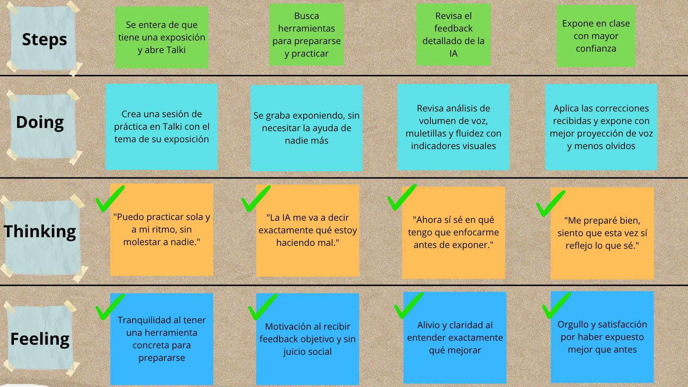
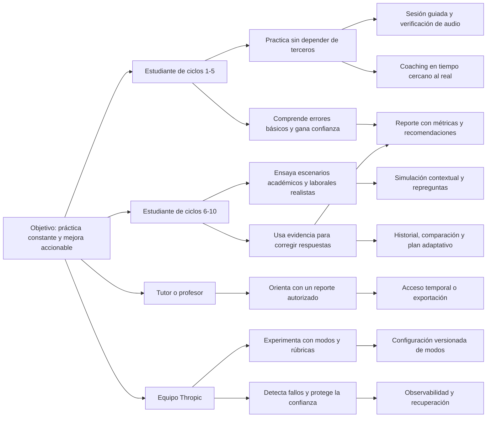

  

  

**Universidad Peruana de Ciencias Aplicadas**

 

**Ingeniería de Software**

**Periodo:** 2026-20

 

**1ASI0728 | Arquitecturas de Software Emergentes**

**NRC:** 16365

**Docente:** Valdivia Verde, Enrique Alejandro

### Informe de Trabajo Final

**Startup:** Thropic

**Producto:** Talki

 

**Integrantes:**

| Código | Apellidos y Nombres |
|--------|---------------------|
| U202313397 | Oroncoy Almeyda, Alejandro Daniel |
| U202312222 | Rivera Sosa, Eduardo Gael |
| U20241C134 | Tumi Oliden, Manuel Ignacio |
| U202310003 | Lang Nassi, Werner Khalil |
| U202313655 | Chi Cruzatt, Kevin Jorge |

 

**Septiembre, 2026**

  

# Registro de Versiones del Informe

| Versión | Fecha | Autor | Descripción de modificación |
| :---: | :---: | --- | --- |
| 0.1 | 08/09/2026 | Equipo Thropic | Creación de la estructura completa del informe de acuerdo con el formato oficial del Trabajo Final. |
| 0.2 | 08/09/2026 | Rivera Sosa, Eduardo Gael | Desarrollo de las secciones 1.1 a 1.3 (Startup Profile, Solution Profile, Lean UX Process y Segmentos objetivo) y 2.2 (Entrevistas), adaptando y actualizando el contenido validado en la fase inicial del proyecto Talki. |

# Project Report Collaboration Insights

Repositorio del informe: [talki-project-report](https://github.com/upc-pre-202620-si728-16365-thropic/talki-project-report)

En esta sección se incluirán, para cada entrega, las evidencias de colaboración del equipo obtenidas desde GitHub: commits, ramas, pull requests, participación de cada integrante y los gráficos de contribución correspondientes.

# Contenido

- [Capítulo I: Introducción](#capítulo-i-introducción)
  - [1.1. Startup Profile](#11-startup-profile)
    - [1.1.1. Descripción de la Startup](#111-descripción-de-la-startup)
    - [1.1.2. Perfiles de integrantes del equipo](#112-perfiles-de-integrantes-del-equipo)
  - [1.2. Solution Profile](#12-solution-profile)
    - [1.2.1. Antecedentes y problemática](#121-antecedentes-y-problemática)
    - [1.2.2. Lean UX Process](#122-lean-ux-process)
      - [1.2.2.1. Lean UX Problem Statements](#1221-lean-ux-problem-statements)
      - [1.2.2.2. Lean UX Assumptions](#1222-lean-ux-assumptions)
      - [1.2.2.3. Lean UX Hypothesis Statements](#1223-lean-ux-hypothesis-statements)
      - [1.2.2.4. Lean UX Canvas](#1224-lean-ux-canvas)
  - [1.3. Segmentos objetivo](#13-segmentos-objetivo)
- [Capítulo II: Requirements Elicitation & Analysis](#capítulo-ii-requirements-elicitation--analysis)
  - [2.1. Competidores](#21-competidores)
    - [2.1.1. Análisis competitivo](#211-análisis-competitivo)
    - [2.1.2. Estrategias y tácticas frente a competidores](#212-estrategias-y-tácticas-frente-a-competidores)
  - [2.2. Entrevistas](#22-entrevistas)
    - [2.2.1. Diseño de entrevistas](#221-diseño-de-entrevistas)
    - [2.2.2. Registro de entrevistas](#222-registro-de-entrevistas)
    - [2.2.3. Análisis de entrevistas](#223-análisis-de-entrevistas)
  - [2.3. Needfinding](#23-needfinding)
    - [2.3.1. User Personas](#231-user-personas)
    - [2.3.2. User Task Matrix](#232-user-task-matrix)
    - [2.3.3. Empathy Mapping](#233-empathy-mapping)
    - [2.3.4. As-is Scenario Mapping](#234-as-is-scenario-mapping)
  - [2.4. Ubiquitous Language](#24-ubiquitous-language)
- [Capítulo III: Requirements Specification](#capítulo-iii-requirements-specification)
  - [3.1. To-Be Scenario Mapping](#31-to-be-scenario-mapping)
  - [3.2. User Stories](#32-user-stories)
  - [3.3. Impact Mapping](#33-impact-mapping)
  - [3.4. Product Backlog](#34-product-backlog)
- [Capítulo IV: Strategic-Level Software Design](#capítulo-iv-strategic-level-software-design)
  - [4.1. Strategic-Level Attribute-Driven Design](#41-strategic-level-attribute-driven-design)
    - [4.1.1. Design Purpose](#411-design-purpose)
    - [4.1.2. Attribute-Driven Design Inputs](#412-attribute-driven-design-inputs)
      - [4.1.2.1. Primary Functionality (Primary User Stories)](#4121-primary-functionality-primary-user-stories)
      - [4.1.2.2. Quality Attribute Scenarios](#4122-quality-attribute-scenarios)
      - [4.1.2.3. Constraints](#4123-constraints)
    - [4.1.3. Architectural Drivers Backlog](#413-architectural-drivers-backlog)
    - [4.1.4. Architectural Design Decisions](#414-architectural-design-decisions)
    - [4.1.5. Quality Attribute Scenario Refinements](#415-quality-attribute-scenario-refinements)
  - [4.2. Strategic-Level Domain-Driven Design](#42-strategic-level-domain-driven-design)
    - [4.2.1. EventStorming](#421-eventstorming)
    - [4.2.2. Candidate Context Discovery](#422-candidate-context-discovery)
    - [4.2.3. Domain Message Flows Modeling](#423-domain-message-flows-modeling)
    - [4.2.4. Bounded Context Canvases](#424-bounded-context-canvases)
    - [4.2.5. Context Mapping](#425-context-mapping)
  - [4.3. Software Architecture](#43-software-architecture)
    - [4.3.1. System Landscape Diagram](#431-system-landscape-diagram)
    - [4.3.2. Context Level Diagrams](#432-context-level-diagrams)
    - [4.3.3. Container Level Diagrams](#433-container-level-diagrams)
    - [4.3.4. Deployment Diagrams](#434-deployment-diagrams)
- [Capítulo V: Tactical-Level Software Design](#capítulo-v-tactical-level-software-design)
  - [5.X. Bounded Context: Nombre del Bounded Context](#5x-bounded-context-nombre-del-bounded-context)
    - [5.X.1. Domain Layer](#5x1-domain-layer)
    - [5.X.2. Interface Layer](#5x2-interface-layer)
    - [5.X.3. Application Layer](#5x3-application-layer)
    - [5.X.4. Infrastructure Layer](#5x4-infrastructure-layer)
    - [5.X.5. Component Level Diagrams](#5x5-component-level-diagrams)
    - [5.X.6. Code Level Diagrams](#5x6-code-level-diagrams)
      - [5.X.6.1. Domain Layer Class Diagrams](#5x61-domain-layer-class-diagrams)
      - [5.X.6.2. Database Design Diagram](#5x62-database-design-diagram)
- [Capítulo VI: Solution UX Design](#capítulo-vi-solution-ux-design)
  - [6.1. Style Guidelines](#61-style-guidelines)
    - [6.1.1. General Style Guidelines](#611-general-style-guidelines)
    - [6.1.2. Web, Mobile and Devices Style Guidelines](#612-web-mobile-and-devices-style-guidelines)
  - [6.2. Information Architecture](#62-information-architecture)
    - [6.2.1. Organization Systems](#621-organization-systems)
    - [6.2.2. Labeling Systems](#622-labeling-systems)
    - [6.2.3. SEO Tags and Meta Tags](#623-seo-tags-and-meta-tags)
    - [6.2.4. Searching Systems](#624-searching-systems)
    - [6.2.5. Navigation Systems](#625-navigation-systems)
  - [6.3. Landing Page UI Design](#63-landing-page-ui-design)
    - [6.3.1. Landing Page Wireframe](#631-landing-page-wireframe)
    - [6.3.2. Landing Page Mock-up](#632-landing-page-mock-up)
  - [6.4. Applications UX/UI Design](#64-applications-uxui-design)
    - [6.4.1. Applications Wireframes](#641-applications-wireframes)
    - [6.4.2. Applications Wireflow Diagrams](#642-applications-wireflow-diagrams)
    - [6.4.3. Applications Mock-ups](#643-applications-mock-ups)
    - [6.4.4. Applications User Flow Diagrams](#644-applications-user-flow-diagrams)
  - [6.5. Applications Prototyping](#65-applications-prototyping)
- [Capítulo VII: Software Product Implementation, Validation & Deployment](#capítulo-vii-software-product-implementation-validation--deployment)
  - [7.1. Software Configuration Management](#71-software-configuration-management)
    - [7.1.1. Software Development Environment Configuration](#711-software-development-environment-configuration)
    - [7.1.2. Source Code Management](#712-source-code-management)
    - [7.1.3. Source Code Style Guide & Conventions](#713-source-code-style-guide--conventions)
    - [7.1.4. Software Deployment Configuration](#714-software-deployment-configuration)
  - [7.2. Solution Implementation](#72-solution-implementation)
    - [7.2.X. Sprint X](#72x-sprint-x)
      - [7.2.X.1. Sprint Planning X](#72x1-sprint-planning-x)
      - [7.2.X.2. Sprint Backlog X](#72x2-sprint-backlog-x)
      - [7.2.X.3. Development Evidence for Sprint Review](#72x3-development-evidence-for-sprint-review)
      - [7.2.X.4. Testing Suite Evidence for Sprint Review](#72x4-testing-suite-evidence-for-sprint-review)
      - [7.2.X.5. Execution Evidence for Sprint Review](#72x5-execution-evidence-for-sprint-review)
      - [7.2.X.6. Services Documentation Evidence for Sprint Review](#72x6-services-documentation-evidence-for-sprint-review)
      - [7.2.X.7. Software Deployment Evidence for Sprint Review](#72x7-software-deployment-evidence-for-sprint-review)
      - [7.2.X.8. Team Collaboration Insights during Sprint](#72x8-team-collaboration-insights-during-sprint)
  - [7.3. Validation Interviews](#73-validation-interviews)
    - [7.3.1. Diseño de entrevistas](#731-diseño-de-entrevistas)
    - [7.3.2. Registro de entrevistas](#732-registro-de-entrevistas)
    - [7.3.3. Evaluaciones según heurísticas](#733-evaluaciones-según-heurísticas)
  - [7.4. Video About-the-Product](#74-video-about-the-product)
- [Conclusiones y recomendaciones](#conclusiones-y-recomendaciones)
  - [Conclusiones](#conclusiones)
  - [Recomendaciones](#recomendaciones)
- [Video About-the-Team](#video-about-the-team)
- [Bibliografía](#bibliografía)
- [Anexos](#anexos)

# Student Outcome

El curso contribuye al cumplimiento del Student Outcome correspondiente. En esta sección se documentará, para cada integrante, cómo las actividades y evidencias del proyecto demuestran el logro del resultado de aprendizaje establecido por el curso.

| Criterio específico | Acciones realizadas | Conclusiones |
| --- | --- | --- |
| Comunica oralmente ideas y/o resultados con objetividad a público de diferentes especialidades y niveles jerárquicos, en el marco del desarrollo de un proyecto en ingeniería. | **TB1:**  **Gael:**  Expuse ante el equipo y el docente los fundamentos del Startup Profile y Solution Profile de Talki (misión, visión y problemática validada con datos de SUNEDU y estudios sobre ansiedad comunicativa), sustentando de forma objetiva el proceso Lean UX (problem statements, assumptions e hypothesis statements) y los hallazgos del diseño, registro y análisis de las entrevistas a los segmentos objetivo, argumentando con evidencia cuantitativa y cualitativa cómo estos resultados respaldan las decisiones de producto. | **TB1:**  La sustentación oral de los avances del TB1, desde el Startup Profile y Solution Profile hasta los Deployment Diagrams (sección 4.3.4), permitió comunicar de manera clara y objetiva la problemática validada, los requerimientos especificados y las decisiones de diseño arquitectónico ante audiencias con distintos niveles de conocimiento técnico (equipo y docente), facilitando el alineamiento de criterios y la retroalimentación oportuna para ajustar el rumbo del proyecto. |
| Comunica en forma escrita ideas y/o resultados con objetividad a público de diferentes especialidades y niveles jerárquicos, en el marco del desarrollo de un proyecto en ingeniería. | **TB1:**  **Gael:**  Redacté las secciones 1.1 (Startup Profile), 1.2 (Solution Profile y Lean UX Process), 1.3 (Segmentos objetivo) y 2.2 (Entrevistas) del informe, documentando de forma objetiva la problemática del negocio, el proceso Lean UX y los hallazgos del diseño, registro y análisis de las entrevistas, con un lenguaje adecuado tanto para el equipo técnico como para el docente. | **TB1:**  La documentación escrita del TB1, que abarca desde el Startup Profile hasta los Deployment Diagrams (sección 4.3.4), permitió comunicar de forma objetiva y estructurada la problemática validada, los requerimientos especificados y las decisiones de diseño arquitectónico, sirviendo como referencia técnica clara tanto para el equipo como para el docente. |

# Capítulo I: Introducción

## 1.1. Startup Profile

### 1.1.1. Descripción de la Startup

Thropic es una startup de tecnología educativa fundada por estudiantes de Ingeniería de Software de la Universidad Peruana de Ciencias Aplicadas (UPC), con la misión de democratizar el acceso a herramientas de desarrollo personal mediante inteligencia artificial.

**Misión:** Empoderar a los estudiantes universitarios a desarrollar habilidades de comunicación oral efectiva a través de tecnología accesible e inteligente.

**Visión:** Ser la plataforma líder en Latinoamérica para el desarrollo de habilidades de comunicación oral en el ámbito académico y profesional para 2030.

Talki es la solución principal de Thropic: una aplicación web que utiliza IA para analizar, evaluar y retroalimentar la comunicación oral de estudiantes universitarios en tiempo real, ayudándoles a mejorar su fluidez, pronunciación, estructura del discurso y confianza al hablar en público.

**Nombre del producto:** Talki proviene de la combinación de "Talk" (hablar, en inglés) con el sufijo "-i", que evoca inteligencia e innovación. El nombre representa la idea de contar con un compañero inteligente que ayuda a mejorar la forma de comunicarse oralmente.

### 1.1.2. Perfiles de integrantes del equipo

<table>
  <thead>
    <tr>
      <th>Perfil</th>
      <th>Foto</th>
    </tr>
  </thead>
  <tbody>
    <tr>
      <td><strong>Oroncoy Almeyda, Alejandro Daniel</strong> (U202313397) Tengo 19 años y soy estudiante de Ingeniería de Software en el quinto ciclo. Me considero una persona proactiva, autodidacta y orientada a objetivos. Disfruto aprender nuevas tecnologías por cuenta propia y busco siempre entregar resultados de calidad. Tengo experiencia en desarrollo backend con Java y Spring Boot, así como en Python y servicios cloud. Me motiva construir soluciones que generen impacto real, y en Thropic asumo con entusiasmo el reto de llevar Talki al mercado universitario peruano.</td>
      <td></td>
    </tr>
    <tr>
      <td><strong>Rivera Sosa, Eduardo Gael</strong> (U202312222) Tengo 20 años y soy estudiante de Ingeniería de Software en el quinto ciclo. Me caracterizo por ser responsable y orientado a resultados, con habilidades de liderazgo que facilitan la comunicación y el trabajo colaborativo. Tengo conocimientos en desarrollo frontend con Angular y experiencia en modelado de bases de datos relacionales. Siempre estoy dispuesto a abordar desafíos y encontrar soluciones en equipo, y en Thropic asumo la especificación de requerimientos como base técnica del producto.</td>
      <td></td>
    </tr>
    <tr>
      <td><strong>Tumi Oliden, Manuel Ignacio</strong> (U20241C134) Soy estudiante de Ingeniería de Software y me caracterizo por ser una persona colaborativa y adaptable, que se integra fácilmente a distintos métodos de trabajo. Tengo conocimientos en investigación de usuarios, diseño de entrevistas y análisis de necesidades, habilidades que aplico en la etapa de needfinding del proyecto. Prefiero apoyar al equipo desde la escucha activa y el análisis, y en mi tiempo libre disfruto del voleibol y los videojuegos.</td>
      <td></td>
    </tr>
    <tr>
      <td><strong>Lang Nassi, Werner Khalil</strong> (U202310003) Estudiante de la Universidad Peruana de Ciencias Aplicadas (UPC), cursando en 8.º ciclo. Tengo afinidad con la arquitectura de software y e desarollado habilidades con machine y deep learning. Ademas siempre estoy dispuesto a aprender nuevas metologias o habilidades que me ayuden a desarollarme en la carrera.</td>
      <td></td>
    </tr>
    <tr>
      <td><strong>Chi Cruzatt, Kevin Jorge</strong> (U202313655) Actualmente estoy cursando la carrera de ingeniería de Software y me encuentro en el 8° ciclo. Tengo experiencia utilizando diferentes metodologías de diseño, como Domain Driven Design (DDD) y CMV, además de frameworks como Laravel y Spring en lenguajes como Java, PHP, etc. Me considero una persona paciente y perseverante en situaciones difíciles.</td>
      <td></td>
    </tr>
  </tbody>
</table>

## 1.2. Solution Profile

### 1.2.1. Antecedentes y problemática

#### WHAT (Qué)

Las deficiencias en comunicación oral afectan el desempeño académico y profesional de los universitarios peruanos.

#### WHEN (Cuándo)

Se manifiesta principalmente al momento de realizar exposiciones, sustentaciones, entrevistas de trabajo y presentaciones profesionales.

#### WHERE (Dónde)

En aulas universitarias, plataformas virtuales y entornos laborales/prácticas.

#### WHO (Quién)

Estudiantes de educación superior peruanos (ciclos 1-10), especialmente aquellos sin acceso a coaching personalizado.

#### WHY (Por qué)

La educación tradicional no brinda suficientes espacios de práctica oral con feedback personalizado. El acceso a coaches es costoso y limitado.

#### HOW (Cómo)

Talki usa IA para grabar, analizar y retroalimentar la comunicación oral del usuario en tiempo real, con ejercicios progresivos y personalizados.

#### HOW MUCH (Cuánto)

Según la Superintendencia Nacional de Educación Superior Universitaria (SUNEDU, 2023), más de 1.5 millones de estudiantes se encuentran matriculados en universidades peruanas, representando un mercado potencial significativo para soluciones de desarrollo de competencias comunicativas.

En el plano de la ansiedad comunicativa, la literatura científica muestra cifras consistentemente elevadas. Maldonado et al. (2022), en un estudio experimental con universitarios publicado en la *Revista Latina de Comunicación Social*, confirmaron que la ansiedad al hablar en público impacta directamente el desempeño académico y la participación activa en clases. A nivel global, investigaciones compiladas por Teleprompter.com (2024) revelan que el **75% de las personas** experimenta algún nivel de ansiedad al hablar en público, y el **61% de universitarios** la reporta como un temor significativo.

_Figura 1: Prevalencia de la ansiedad al hablar en público en población universitaria_

_Nota._ Elaboración propia basada en Teleprompter.com (2024) y Crown Counseling (2024).

Respecto al impacto en la empleabilidad, un estudio descriptivo sobre competencias laborales blandas en egresados universitarios latinoamericanos (Redalyc, 2022) identificó que la **comunicación asertiva** es la segunda habilidad más demandada por empleadores (9.1%), solo detrás del trabajo en equipo (10.1%). Sin embargo, es también una de las competencias con mayores brechas en egresados.

_Figura 2: Habilidades blandas más demandadas por empleadores en Latinoamérica_

_Nota._ Elaboración propia basada en Redalyc (2022).

Finalmente, la ansiedad comunicativa no solo afecta el desempeño académico sino también la trayectoria profesional. Datos de Crown Counseling (2024) y Teleprompter.com (2024) indican que el **70% de los empleos** requiere algún nivel de oratoria o presentaciones; el **30% de las personas** ha evitado postular a empleos o ascensos debido a esta ansiedad; y quienes la padecen tienen un **15% menos de probabilidad** de alcanzar posiciones gerenciales.

_Figura 3: Impacto profesional de la ansiedad al hablar en público_

_Nota._ Elaboración propia basada en Crown Counseling (2024) y Teleprompter.com (2024).

Ante este escenario, el costo de un coach de oratoria privado en Lima oscila entre S/. 80 y S/. 200 por sesión (con frecuencia semanal recomendada), haciendo inaccesible el entrenamiento personalizado para la mayoría del segmento universitario. Talki aborda esta brecha mediante IA accesible desde cualquier navegador web, a una fracción del costo.

### 1.2.2. Lean UX Process

El proceso Lean UX aplicado en Thropic sigue el enfoque de validación continua de hipótesis mediante ciclos cortos de aprendizaje, construir y medir (Ries, 2011), con el objetivo de reducir el riesgo de construir un producto que el mercado no necesita.

#### 1.2.2.1. Lean UX Problem Statements

**Segmento 1:** Hemos observado que los estudiantes de ciclos 1-5 carecen de espacios seguros y accesibles para practicar la comunicación oral con feedback real. El impacto es bajo desempeño en exposiciones y pérdida de oportunidades académicas. ¿Cómo podríamos brindarles práctica guiada con IA para que ganen confianza progresivamente?

**Segmento 2:** Hemos observado que los estudiantes de ciclos 6-10 no tienen herramientas asequibles para prepararse para entrevistas laborales y presentaciones profesionales. El impacto es dificultad para insertarse en el mercado laboral. ¿Cómo podríamos simular entornos reales de comunicación profesional para que estén listos al graduarse?

#### 1.2.2.2. Lean UX Assumptions

##### Business Assumptions

1. Creemos que los usuarios pagarán una suscripción mensual de S/. 15-25 por acceso premium.
2. Creemos que el mayor canal de adquisición serán las redes sociales universitarias (Instagram, TikTok).
3. Creemos que los usuarios necesitan al menos 3 sesiones semanales para notar mejora en 30 días.
4. Creemos que las universidades adoptarán Talki como herramienta complementaria en cursos de comunicación.
5. Creemos que el NPS (Net Promoter Score) alcanzará 40+ en los primeros 6 meses.
6. Creemos que el costo de adquisición por usuario será menor a S/. 10 mediante estrategias de referidos.
7. Creemos que el 60% de usuarios retendrá la app más de 3 meses con gamificación efectiva.
8. Creemos que las alianzas con institutos y universidades serán nuestro principal canal B2B.
9. Creemos que los usuarios en ciclos 6-10 están dispuestos a pagar más por features de simulación de entrevistas.
10. Creemos que el mercado latinoamericano de edtech crecerá 25% anual los próximos 3 años.
11. Creemos que la diferenciación por idioma español y contexto peruano/latinoamericano será una ventaja competitiva sostenible.

##### User Assumptions

1. **¿Quién es el usuario?** Estudiantes universitarios peruanos de ciclos 1-10, de 17 a 26 años, nativos digitales con acceso a laptop/PC y conexión a internet.
2. **¿Dónde encaja nuestro producto en su vida?** En los momentos previos a exposiciones, durante el estudio en casa, y en transporte público.
3. **¿Qué problemas resuelve nuestro producto?** La falta de espacios seguros para practicar oralidad con feedback inmediato y personalizado.
4. **¿Cuándo y cómo es usado nuestro producto?** Sesiones de 10-20 minutos, principalmente en las noches, desde el navegador web en su laptop o PC.
5. **¿Qué características son importantes?** Feedback en tiempo real, ejercicios progresivos, historial de progreso, modo simulación de entrevistas.
6. **¿Cómo debe verse y comportarse el producto?** Intuitivo, motivador, con elementos de gamificación, lenguaje cercano y sin tecnicismos.

#### 1.2.2.3. Lean UX Hypothesis Statements

Cada hipótesis sigue el feature hypothesis template y explicita los cuatro componentes requeridos: business outcome medible, usuario segmentado (Valeria Ríos o Rodrigo Sánchez), beneficio percibido y feature asociada.

1. **H1 (Adopción).** Creemos que lograremos una retención semanal del 40% y una permanencia promedio de más de 90 días en Valeria Ríos (Segmento 1, ciclos 1 al 5) si la estudiante gana confianza al practicar exposiciones con feedback inmediato, mediante la feature de *ejercicios guiados con IA*.

2. **H2 (Conversión).** Creemos que lograremos una reducción de la ansiedad al hablar en público y un NPS de al menos 45 puntos en Rodrigo Sánchez (Segmento 2, ciclos 6 al 10) si el estudiante se prepara para entrevistas laborales reales en condiciones realistas, mediante la feature de *simulador de entrevistas con feedback en tiempo real*.

3. **H3 (Engagement).** Creemos que lograremos al menos 3 sesiones semanales sostenidas durante 4 semanas consecutivas en ambos segmentos si los estudiantes conservan el hábito de práctica gracias a refuerzos positivos, mediante la feature de *streaks y logros*.

4. **H4 (Engagement).** Creemos que lograremos un aumento del engagement de 40% (es decir, al menos 4 sesiones al mes) en Rodrigo Sánchez (Segmento 2) si el estudiante puede visualizar su progreso medible por habilidad en un lugar único, mediante la feature de *dashboard de métricas personales*.

5. **H5 (Adopción).** Creemos que lograremos un CAC por debajo de S/ 10 vía referidos en Valeria Ríos (Segmento 1) si la estudiante puede compartir logros con sus compañeros de clase, mediante la feature de *comunidad y retos entre amigos*.

6. **H6 (Retención).** Creemos que lograremos un churn mensual por debajo del 15% en ambos segmentos si los estudiantes reciben un plan de práctica personalizado según sus errores recurrentes, mediante la feature de *ruta de aprendizaje adaptativa con IA*.

#### 1.2.2.4. Lean UX Canvas

_Figura 4: Lean UX Canvas de Talki_

_Nota._ Elaboración propia (2026).

El canvas documenta de forma visual: business outcomes, problemas de usuario, oportunidades, soluciones propuestas, métricas clave de éxito y los supuestos que guían el desarrollo del producto, en línea con los problem statements, assumptions e hypothesis statements descritos en las secciones anteriores.

## 1.3. Segmentos objetivo

**Segmento 1: Estudiantes universitarios de ciclos 1 al 5**

*Aspectos Demográficos:*
- Edad: 17-21 años
- Sexo: Masculino y femenino
- Nivel socioeconómico: B y C
- Ciclo: 1 al 5 de educación superior universitaria

*Aspectos Geográficos:*
- País: Perú
- Región: Lima Metropolitana y principales ciudades del interior (Arequipa, Trujillo, Piura)
- Tipo de institución: Universidades privadas y públicas

*Aspectos Psicográficos:*
- Motivaciones: Mejorar calificaciones en cursos con exposiciones, ganar confianza al hablar en público, no pasar vergüenza frente a compañeros
- Dolores: Miedo escénico pronunciado, vocabulario académico limitado, falta de estructura al exponer, nerviosismo que bloquea el discurso
- Comportamientos digitales: Nativos digitales, uso intensivo de dispositivos digitales y navegador web, acostumbrados a plataformas de aprendizaje (Duolingo, YouTube), disponibles para sesiones cortas de 10-15 min

**Segmento 2: Estudiantes universitarios de ciclos 6 al 10**

*Aspectos Demográficos:*
- Edad: 21-26 años
- Sexo: Masculino y femenino
- Nivel socioeconómico: B y C
- Ciclo: 6 al 10 de educación superior universitaria, próximos a egresar

*Aspectos Geográficos:*
- País: Perú
- Región: Lima Metropolitana y principales ciudades con oferta laboral tecnológica
- Tipo de institución: Universidades con programas de prácticas preprofesionales activos

*Aspectos Psicográficos:*
- Motivaciones: Conseguir prácticas o primer empleo, destacar en entrevistas técnicas y de RR.HH., comunicar ideas con claridad en entornos profesionales
- Dolores: Dificultad para expresarse con fluidez y vocabulario profesional, ansiedad ante entrevistas de trabajo, falta de espacios reales de práctica con feedback concreto
- Comportamientos digitales: Usuarios activos de LinkedIn, plataformas de empleabilidad y apps de productividad; dispuestos a pagar por herramientas que generen ROI directo en su carrera

# Capítulo II: Requirements Elicitation & Analysis

## 2.1. Competidores

### 2.1.1. Análisis competitivo

Para identificar las fortalezas, debilidades y estrategias de nuestros competidores directos e indirectos, con el fin de definir la propuesta de valor diferenciada de Talki y detectar oportunidades de mercado no atendidas, se elaboró el siguiente **Competitive Analysis Landscape** comparando Talki con tres competidores relevantes en el espacio de aplicaciones de mejora de la comunicación oral: ELSA Speak, Speeko y Orai.

<table>
  <tr>
    <th colspan="6">Competitive Analysis Landscape</th>
  </tr>
  <tr>
    <td colspan="2" align="center"><b>¿Por qué llevar a cabo este análisis?</b></td>
    <td colspan="4">Para identificar las fortalezas, debilidades y estrategias de nuestros competidores directos e indirectos, con el fin de definir la propuesta de valor diferenciada de Talki y detectar oportunidades de mercado no atendidas.</td>
  </tr>
  <tr>
    <th colspan="2">Nombre</th>
    <th>Talki (Thropic)</th>
    <th>ELSA Speak</th>
    <th>Speeko</th>
    <th>Orai</th>
  </tr>
  <tr>
    <td colspan="2" align="center"><b>Logo</b></td>
    <td align="center"></td>
    <td align="center"></td>
    <td align="center"></td>
    <td align="center"></td>
  </tr>
  <tr>
    <td rowspan="2"><b>Perfil</b></td>
    <td><b>Overview</b></td>
    <td>Aplicación web con IA que analiza y retroalimenta la comunicación oral de estudiantes universitarios peruanos en tiempo real, en español.</td>
    <td>App de pronunciación en inglés con IA que evalúa y corrige la pronunciación del usuario en tiempo real mediante reconocimiento de voz avanzado.</td>
    <td>App de coaching para hablar en público con lecciones estructuradas impartidas por coaches reales y ejercicios de práctica.</td>
    <td>App móvil con IA que analiza la oratoria del usuario (ritmo, palabras de relleno, energía, expresión facial) y entrega retroalimentación inmediata y lecciones personalizadas.</td>
  </tr>
  <tr>
    <td><b>Ventaja competitiva ¿Qué valor ofrece a los clientes?</b></td>
    <td>Feedback en tiempo real en español con contexto académico peruano; enfocado en universitarios latinoamericanos.</td>
    <td>Motor de IA especializado en detección de errores fonéticos del inglés; más de 50M usuarios globales.</td>
    <td>Contenido creado por coaches profesionales de oratoria; estructura de cursos progresivos y micro-lecciones de 5 minutos.</td>
    <td>Análisis multimodal (voz + expresión facial) con plan de entrenamiento adaptativo; gamificación y seguimiento de progreso detallado.</td>
  </tr>
  <tr>
    <td rowspan="2"><b>Perfil de Marketing</b></td>
    <td><b>Mercado objetivo</b></td>
    <td>Estudiantes universitarios peruanos/latinoamericanos de ciclos 1-10.</td>
    <td>Hablantes no nativos de inglés que desean mejorar su pronunciación, principalmente en Asia y Latinoamérica.</td>
    <td>Profesionales y estudiantes angloparlantes que quieren mejorar su oratoria y liderazgo comunicacional.</td>
    <td>Profesionales, estudiantes y ejecutivos angloparlantes que necesitan mejorar presentaciones y discursos.</td>
  </tr>
  <tr>
    <td><b>Estrategias de Marketing</b></td>
    <td>Freemium, marketing universitario, referidos entre compañeros.</td>
    <td>Freemium, referidos, partnerships con instituciones educativas.</td>
    <td>Freemium, publicidad en LinkedIn y redes, membresías corporativas.</td>
    <td>Freemium con trial de 7 días, alianzas con instituciones educativas, plan Enterprise para equipos.</td>
  </tr>
  <tr>
    <td rowspan="3"><b>Perfil de Producto</b></td>
    <td><b>Productos &amp; Servicios</b></td>
    <td>Aplicación web con análisis de voz, ejercicios guiados, simulador de entrevistas y dashboard de progreso.</td>
    <td>App móvil (iOS/Android) con lecciones de pronunciación, conversación simulada y análisis fonético detallado.</td>
    <td>App móvil con cursos de oratoria, ejercicios diarios de 5 minutos y biblioteca de habilidades comunicacionales.</td>
    <td>App móvil (iOS/Android) con análisis de voz e imagen, lecciones gamificadas, historial de práctica y plan personalizado de 4 semanas.</td>
  </tr>
  <tr>
    <td><b>Precios y Costos</b></td>
    <td>Freemium; plan premium S/. 15-25/mes.</td>
    <td>Gratis con funciones limitadas; premium desde $6.99/mes.</td>
    <td>Gratis con funciones básicas; premium desde $9.99/mes.</td>
    <td>Gratis con funciones básicas; premium desde $9.99/mes o $39.99/año.</td>
  </tr>
  <tr>
    <td><b>Canales de distribución</b></td>
    <td>Sitio web (talki.com), compatible con navegadores modernos (Chrome, Edge, Safari, Firefox).</td>
    <td>App Store, Google Play, web.</td>
    <td>App Store, Google Play.</td>
    <td>App Store, Google Play.</td>
  </tr>
  <tr>
    <td rowspan="4"><b>Análisis SWOT</b></td>
    <td><b>Fortalezas</b></td>
    <td>Español nativo, contexto universitario peruano, IA personalizada, gamificación.</td>
    <td>IA muy precisa, gran base de usuarios global, contenido extenso y probado.</td>
    <td>Contenido de alta calidad creado por expertos, formato de micro-lecciones atractivo.</td>
    <td>Análisis multimodal avanzado, plan adaptativo personalizado, gamificación efectiva, disponible en iOS y Android.</td>
  </tr>
  <tr>
    <td><b>Oportunidades</b></td>
    <td>Mercado latinoamericano poco atendido, alianzas con universidades, expansión a otros países.</td>
    <td>Expansión a otros idiomas, mercado B2B con instituciones educativas.</td>
    <td>Mercado B2B corporativo, expansión a español y otros idiomas.</td>
    <td>Expansión a idiomas distintos del inglés, mercado educativo universitario latinoamericano sin atender.</td>
  </tr>
  <tr>
    <td><b>Debilidades</b></td>
    <td>Startup nueva sin track record, recursos limitados, marca poco conocida.</td>
    <td>Enfocado solo en pronunciación del inglés, no cubre comunicación oral en español.</td>
    <td>Sin IA para feedback en tiempo real, contenido exclusivamente en inglés.</td>
    <td>Solo disponible en inglés, sin adaptación al contexto académico ni latinoamericano.</td>
  </tr>
  <tr>
    <td><b>Amenazas</b></td>
    <td>Entrada de apps internacionales al mercado hispanohablante, competidores con mayor financiamiento.</td>
    <td>Competidores con IA generativa más avanzada, apps multiidioma con mayor alcance.</td>
    <td>Apps con IA generativa que ofrecen feedback personalizado, saturación del mercado edtech.</td>
    <td>Saturación del mercado edtech en inglés, nuevos competidores con IA generativa más potente.</td>
  </tr>
</table>

### 2.1.2. Estrategias y tácticas frente a competidores

A partir del análisis competitivo, Thropic adopta las siguientes estrategias para posicionar Talki en el mercado:

**Frente a ELSA Speak:**
ELSA Speak domina el mercado de pronunciación en inglés pero no atiende la comunicación oral en español ni el contexto académico latinoamericano. Talki se diferencia enfocándose exclusivamente en español con contexto universitario peruano, ofreciendo ejercicios de exposición académica y simulación de sustentaciones que ELSA no contempla.

**Frente a Speeko:**
Speeko utiliza contenido pregrabado por coaches sin feedback personalizado en tiempo real. Talki responde con IA generativa que analiza el discurso del usuario en el momento y entrega retroalimentación específica e inmediata, no guiones estáticos. Además, Speeko no tiene presencia en el mercado hispanohablante, lo que representa una ventana de oportunidad directa.

**Frente a Orai:**
Orai ofrece análisis de oratoria con IA de manera similar a Talki, pero opera exclusivamente en inglés y sin ninguna adaptación al contexto académico latinoamericano. Talki capitaliza esta brecha ofreciendo la misma profundidad de análisis (ritmo, fluidez, claridad) pero en español, con ejercicios diseñados para sustentaciones, exposiciones universitarias y entrevistas de prácticas preprofesionales típicas del sistema educativo peruano.

**Estrategia de diferenciación general:**

- *Localización:* Único producto diseñado para el contexto universitario peruano/latinoamericano en español
- *Precio accesible:* Modelo freemium con plan premium a S/. 15-25/mes, muy por debajo de los competidores internacionales
- *Alianzas universitarias:* Partnerships con facultades de Ingeniería y Comunicaciones de universidades peruanas para adopción institucional
- *Gamificación contextual:* Sistema de logros y streaks adaptado a los ciclos académicos peruanos (exposiciones, sustentaciones, entrevistas de prácticas)

## 2.2. Entrevistas

### 2.2.1. Diseño de entrevistas

El objetivo de las entrevistas es comprender las necesidades, frustraciones y hábitos de comunicación oral de los segmentos objetivo de Talki, así como su disposición a usar herramientas digitales para mejorar sus habilidades comunicativas.

---

**Segmento 1: Estudiantes universitarios de ciclos 1 al 5**

*Objetivos específicos:*
- Conocer cómo viven los primeros encuentros con exposiciones y presentaciones en la universidad.
- Identificar las inseguridades comunicativas más frecuentes en etapas tempranas de la carrera.
- Entender qué estrategias de práctica emplean actualmente y cuáles consideran insuficientes.
- Evaluar su apertura a recibir retroalimentación automatizada de una IA.

*Preguntas introductorias:*
1. ¿En qué universidad estudias, qué carrera sigues y en qué ciclo te encuentras?
2. ¿Con qué frecuencia tienes que hacer exposiciones, sustentaciones o participaciones orales en clases?

*Preguntas principales:*

3. ¿Cómo fue tu primera exposición en la universidad? ¿Qué recuerdas de esa experiencia?
4. ¿Qué aspectos de tu comunicación oral sientes que más necesitas trabajar en este punto de tu carrera? (nerviosismo, muletillas, fluidez, volumen, etc.)
5. ¿Cómo te preparas actualmente cuando tienes que exponer? ¿Cuánto tiempo le dedicas?
6. ¿Alguna vez tu desempeño oral no reflejó lo que realmente sabías del tema? ¿Qué ocurrió?
7. ¿Has usado alguna app o herramienta digital para mejorar tu forma de hablar o exponer? ¿Cómo fue?
8. ¿Te grabarías en video o audio para escucharte y corregirte? ¿Por qué sí o por qué no?
9. ¿Qué tan cómodo(a) te sentirías recibiendo retroalimentación de una IA sobre tu forma de hablar?
10. ¿Estarías dispuesto(a) a pagar por una app así? ¿Qué precio te parecería justo?

---

**Segmento 2: Estudiantes universitarios de ciclos 6 al 10**

*Objetivos específicos:*
- Entender cómo evolucionan las exigencias de comunicación oral en ciclos avanzados.
- Identificar si la preparación para prácticas preprofesionales o entrevistas laborales genera nuevas necesidades comunicativas.
- Conocer su nivel de autonomía para practicar y mejorar su oratoria.
- Determinar su disposición a adoptar una herramienta de IA especializada en comunicación académica y profesional.

*Preguntas introductorias:*
1. ¿En qué universidad estudias, qué carrera sigues y en qué ciclo te encuentras?
2. ¿Qué tipos de evaluaciones orales has tenido que enfrentar en los últimos ciclos? (sustentaciones, jurados, entrevistas de prácticas, etc.)

*Preguntas principales:*

3. Comparando tus primeros ciclos con ahora, ¿sientes que tu comunicación oral ha mejorado? ¿Qué crees que la cambió?
4. ¿Cuáles son los escenarios orales que todavía te generan más estrés o inseguridad?
5. ¿Cómo te preparas hoy para una sustentación importante o una entrevista de prácticas?
6. ¿Has sentido que tu forma de comunicarte oralmente te ha jugado en contra en alguna evaluación o proceso de selección? Cuéntame.
7. ¿Has probado alguna herramienta digital para practicar presentaciones o entrevistas? ¿Qué te pareció?
8. ¿Qué tipo de análisis de tu comunicación te resultaría más valioso: fluidez, claridad de ideas, manejo de silencios, muletillas, otro?
9. ¿Qué tan útil sería para ti una app con IA que simule sustentaciones o entrevistas de prácticas y te dé retroalimentación detallada?
10. ¿Usarías este tipo de herramienta de forma autónoma o preferirías poder compartir los resultados con un profesor o tutor?

### 2.2.2. Registro de entrevistas

**Segmento #1: Estudiantes universitarios de ciclos 1 al 5**

| Número de entrevista | Datos del entrevistado | Evidencia de entrevista |
|---|---|---|
| 1 | **Nombre:** Belén Ordoñez   **Universidad:** PUCP   **Ciclo:** 5to   **Carrera:** Comunicación para el Desarrollo    **Resumen:** Estudiante de quinto ciclo en la PUCP cuya carrera gira en torno a presentaciones orales: la mayoría de sus evaluaciones son exposiciones de proyectos. Recuerda haberse puesto nerviosa en su primera exposición universitaria. Su principal problema es que el volumen de su voz va disminuyendo conforme avanza en la presentación. Ha sufrido "black outs" durante exposiciones, terminando sin recordar lo que dijo. No conocía la existencia de herramientas digitales para mejorar la oratoria. Actualmente pide a amigos que la escuchen antes de exponer. Se sentiría más cómoda recibiendo retroalimentación de una IA por su mayor honestidad y franqueza. Estaría dispuesta a pagar entre 2 y 5 dólares mensuales por una app que realmente funcione. |  [📂 Ver entrevista](https://drive.google.com/drive/folders/1IwH1aTzPJ2Y5cYJS3yqF8UM4eHfprvLE?usp=sharing)   `00:00:00 a 00:06:12` |
| 2 | **Nombre:** Isabel Rodriguez   **Universidad:** Universidad de Lima   **Ciclo:** 5to   **Carrera:** Arquitectura    **Resumen:** Isabel estudia Arquitectura en la Universidad de Lima y tiene exposiciones prácticamente todas las semanas, especialmente resúmenes de talleres los viernes. Su primera experiencia expositiva fue buena en general, aunque reconoce que hubiera sido mejor con más dominio del curso. Los puntos que más necesita trabajar son el nerviosismo y la ampliación de vocabulario, pues tiende a repetir siempre las mismas palabras. Se prepara con una bitácora personal y revisando sus diapositivas el día anterior. Usa ChatGPT para preparar contenido, aunque de forma general. Olvida información relevante por el apuro de terminar la exposición rápido. Le parece muy interesante recibir retroalimentación de una IA por el ahorro de tiempo. Estaría dispuesta a pagar hasta 5 dólares mensuales, aunque querría comparar precios antes de decidir. |  [📂 Ver entrevista](https://drive.google.com/drive/folders/1IwH1aTzPJ2Y5cYJS3yqF8UM4eHfprvLE?usp=sharing)   `00:06:13 a 00:13:29` |
| 3 | **Nombre:** Juan Alejandro Elías López   **Universidad:** UPC   **Ciclo:** 4to   **Carrera:** Ingeniería de Software    **Resumen:** Juan Alejandro ya tenía experiencia en exposiciones desde la secundaria, por lo que su primera presentación universitaria no le generó nerviosismo. Considera que exponer es divertido. El aspecto que más necesita mejorar es la fluidez, especialmente en exposiciones finales de alta importancia donde el nerviosismo sí lo afecta. Se prepara escribiendo su guión a mano y memorizándolo en partes a lo largo de varios días, dedicando aproximadamente 2 horas diarias. Nunca ha sentido que una exposición no reflejara lo que sabía. No ha usado herramientas digitales para mejorar su oratoria. Estaría dispuesto a grabarse como nueva forma de práctica autónoma. Estaría abierto tanto a retroalimentación de IA como de un tutor humano, y el precio que pagaría dependería de las funcionalidades concretas que ofrezca la aplicación. |  [📂 Ver entrevista](https://drive.google.com/drive/folders/1IwH1aTzPJ2Y5cYJS3yqF8UM4eHfprvLE?usp=sharing)   `00:12:30 a 00:19:18` |

**Segmento #2: Estudiantes universitarios de ciclos 6 al 10**

| Número de entrevista | Datos del entrevistado | Evidencia de entrevista |
|---|---|---|
| 4 | **Nombre:** Gianger   **Universidad:** University of the People (EE.UU., modalidad remota)   **Ciclo:** 6to   **Carrera:** Computer Science    **Resumen:** Gianger estudia de forma remota en una universidad estadounidense y tiene una trayectoria oral variada: monografías, proyectos de software, debates, simulaciones de entrevistas y entrevistas reales de trabajo. Reconoce una mejora enorme desde sus inicios, impulsada principalmente por la experiencia laboral. Antes hablaba muy rápido y usaba muletillas constantemente. Hoy la presión aparece principalmente al presentar ante jefes o personas con mayor jerarquía. Se prepara con "chuletillas", guías de oratoria y autograbaciones para identificar puntos débiles. Vivió en carne propia cómo la mala comunicación le jugó en contra en una entrevista con una empresa española en inglés. Ha probado la herramienta "Speak", pero le falta feedback de contenido y manejo de silencios. Los análisis que más le aportarían son el manejo de silencios y la variedad de vocabulario. Ve una app con IA para simular sustentaciones y entrevistas como extremadamente útil, y prefiere un modelo híbrido con checkpoints periódicos con un tutor. |  [📂 Ver entrevista](https://drive.google.com/drive/folders/1IwH1aTzPJ2Y5cYJS3yqF8UM4eHfprvLE?usp=sharing)   `00:19:19 a 00:31:47` |
| 5 | **Nombre:** Jennifer   **Universidad:** Universidad Privada del Norte   **Ciclo:** 7mo   **Carrera:** Administración y Marketing    **Resumen:** Jennifer ha enfrentado sustentaciones de trabajos, exposiciones de proyectos, entrevistas y presentaciones ante jurados a lo largo de su carrera. Reconoce que su comunicación oral ha mejorado notablemente gracias a la práctica constante: en los primeros ciclos le costaba organizar sus ideas y se ponía nerviosa, hoy habla con mayor claridad y seguridad. Los escenarios que aún le generan estrés son las presentaciones ante un jurado y las entrevistas de prácticas, donde siente una evaluación más directa. Se prepara investigando el tema, organizando ideas, practicando frente al espejo o grabándose, y anticipando posibles preguntas. Ha vivido situaciones donde los nervios le hicieron olvidar ideas clave, afectando la claridad de su mensaje. No ha usado aplicaciones especializadas; solo grabaciones básicas con el celular o Zoom. El análisis que considera más valioso es el de fluidez y claridad de ideas. Ve muy útil una app con IA para practicar en un entorno realista con retroalimentación específica. Prefiere un uso híbrido: práctica autónoma combinada con orientación de un tutor o profesor. |  [📂 Ver entrevista](https://drive.google.com/drive/folders/1IwH1aTzPJ2Y5cYJS3yqF8UM4eHfprvLE?usp=sharing)   `00:31:47 a 00:39:18` |
| 6 | **Nombre:** Jorge Sinyun González   **Universidad:** Universidad Peruana de Ciencias Aplicadas (UPC)   **Ciclo:** 7mo a 8vo   **Carrera:** Ingeniería de Software    **Resumen:** Jorge identifica las presentaciones ante audiencias o profesores como su mayor dificultad, ya que la inseguridad al cometer errores y los nervios visibles pueden afectar directamente su nota. Siente que su comunicación ha mejorado en la medida que domina mejor los temas del curso, pero como habilidad pura de oratoria el avance ha sido leve. Se prepara revisando los requerimientos, tomando notas de apoyo y usando NotebookLM para generar preguntas y practicar respuestas. Tuvo un caso negativo en el curso de Agile Frameworks, donde tuvo que mirar constantemente las diapositivas por no dominar el flujo del tema, algo que el profesor notó y comentó. Practica hablando solo frente a la presentación o usando el método del espejo, y ha buscado apps de práctica de lenguaje sin encontrar una específica para oratoria. El análisis que considera más valioso es el de claridad de ideas, porque evidencia dominio del tema ante la audiencia. Ve la app con IA como extremadamente útil, especialmente si permite cargar el material propio para detectar puntos débiles de contenido y vocalización. Prefiere el modo autónomo por privacidad y comodidad, aunque reconoce el valor del feedback docente. |  [📂 Ver entrevista](https://drive.google.com/drive/folders/1IwH1aTzPJ2Y5cYJS3yqF8UM4eHfprvLE?usp=sharing)   `00:39:18 a 00:47:18` |

### 2.2.3. Análisis de entrevistas

---

**Segmento #1: Estudiantes universitarios de ciclos iniciales (1ro al 5to ciclo)**

---

**Belén Ordoñez (PUCP, 5to ciclo)**

Estudia Comunicación para el Desarrollo en la PUCP y se encuentra en su primer año de carrera. Las presentaciones son muy frecuentes en su carrera: la mayoría de las evaluaciones son exposiciones de proyectos, ya que hay pocos exámenes escritos. Recuerda haberse puesto nerviosa en su primera exposición universitaria. Su principal problema es que el volumen de su voz va bajando a medida que avanza la presentación, al punto de que ya no la escuchan. Se prepara intentando dominar el contenido del tema, aunque reconoce que hay cosas "fuera de su control". Ha experimentado "black outs" durante exposiciones: termina sin recordar lo que dijo, y solo después nota lo que le faltó. No conocía la existencia de aplicaciones para mejorar la oratoria. Le gustaría grabarse, aunque le cuesta escuchar su propia voz; actualmente pide a amigos que la escuchen y le den feedback. Se sentiría más cómoda recibiendo retroalimentación de una IA que de una persona, porque considera que la IA es más directa y honesta. Estaría dispuesta a usar una aplicación de pago entre 2 y 5 dólares mensuales, siempre que sea realmente buena.

**Puntos clave:**
- Exposiciones muy frecuentes (evaluación principal en su carrera).
- Mayor problema: **volumen de voz que decrece** durante la presentación.
- Ha sufrido **"black outs"** en exposiciones por los nervios y la adrenalina.
- **No conocía** herramientas digitales para mejorar la oratoria.
- Pide feedback a amigos; le cuesta escucharse o verse grabada.
- Prefiere retroalimentación de **IA sobre personas** por mayor honestidad.
- Dispuesta a pagar entre **2 y 5 dólares mensuales** si la app cumple.

---

**Isabel Rodriguez (Arquitectura, U. de Lima, 5to ciclo)**

Estudia arquitectura en la Universidad de Lima y está en quinto ciclo. Tiene exposiciones prácticamente todas las semanas, especialmente los viernes, con resúmenes de cursos de taller. Su primera experiencia fue buena en términos generales, aunque reconoce que hubiera sido mejor con mayor conocimiento del curso. Los aspectos que más necesita trabajar son el nerviosismo y la ampliación de vocabulario, ya que tiende a usar siempre las mismas palabras. Se prepara leyendo sus diapositivas y notas de una bitácora personal el día anterior y momentos antes de la clase. Usa IA generativa (ChatGPT) para preparar su contenido, aunque con ideas muy generales. Siente que a veces olvida información relevante que no puso en las láminas por el apuro de terminar rápido. Estaría dispuesta a grabarse para autocorregirse. Le parece interesante recibir retroalimentación de una IA, especialmente porque le ahorraría tiempo, algo valioso dada su carga académica. Estaría dispuesta a pagar por la aplicación, en especial si la ayuda a prepararse para algo importante. Sugiere un precio máximo de 5 dólares mensuales, aunque querría compararlo con otras opciones antes.

**Puntos clave:**
- Exposiciones **semanales**, especialmente en talleres.
- Necesita mejorar **nerviosismo y vocabulario** (tiende a repetir palabras).
- Se prepara con **bitácora personal y diapositivas** el día anterior.
- Usa **ChatGPT** para preparar contenido, pero de forma general.
- Olvida información relevante por el **apuro de terminar** la exposición.
- Valoraría una app de IA que **ahorre tiempo** dada su alta carga académica.
- Precio aceptable: hasta **5 dólares mensuales**.

---

**Juan Alejandro Elías López (Ing. Software, UPC, 4to ciclo)**

Estudia Ingeniería de Software en la UPC y está en cuarto ciclo. Ya venía con experiencia de exposiciones desde la secundaria, por lo que su primera presentación universitaria no fue especialmente nerviosa. Considera que sus exposiciones son divertidas. El aspecto en el que siente que más necesita mejorar es la fluidez, especialmente en exposiciones finales de alta importancia, donde el nerviosismo lo afecta. Se prepara escribiendo su guión a mano, memorizándolo en partes durante varios días, dedicando alrededor de 2 horas diarias. Nunca ha sentido que una exposición no reflejara lo que sabía, ya que siempre memorizaba sus puntos. Nunca ha usado herramientas digitales para mejorar su oratoria. Estaría dispuesto a grabarse para practicar de forma autónoma como algo nuevo a probar. Le gustaría tanto retroalimentación de una IA como de un profesor particular, sin descartar ninguna opción. El precio que pagaría dependería de las funcionalidades que ofrezca la aplicación.

**Puntos clave:**
- Experiencia previa en exposiciones desde secundaria; **no experimenta nerviosismo intenso**.
- Principal área de mejora: **fluidez** en exposiciones de alta importancia.
- Método de preparación: **guión escrito a mano y memorización** en partes (2 horas/día).
- **No ha usado** herramientas digitales de práctica oral.
- Abierto a grabarse como **método de práctica autónoma**.
- Prefiere retroalimentación **híbrida**: IA y tutor humano.
- El precio depende de las **funcionalidades ofrecidas**.

---

**Segmento #2: Estudiantes universitarios de ciclos avanzados (6to al 10mo ciclo)**

**Gianger (Computer Science, University of the People EE.UU., 6to ciclo)**

Estudiante peruano radicado en Lima que cursa Computer Science de forma remota en una universidad estadounidense (University of the People), se encuentra en sexto ciclo. Aunque su universidad es extranjera, se incluye en el estudio porque representa el caso de universitarios peruanos que complementan su formación local con programas internacionales 100% online y que enfrentan retos adicionales de comunicación oral en contextos bilingües, un perfil cada vez más frecuente en el mercado laboral tecnológico peruano. Ha tenido evaluaciones orales variadas: monografías, proyectos de software, debates y simulaciones de entrevistas, además de entrevistas reales de trabajo. Reconoce que su comunicación oral ha mejorado enormemente desde sus inicios universitarios, principalmente gracias al mundo laboral. Antes hablaba muy rápido, llenaba los silencios y usaba muletillas constantemente. Actualmente, los escenarios que aún le generan presión son las presentaciones ante jefes o personas con mayor jerarquía. Se prepara haciendo "chuletillas" (resúmenes de ideas principales), consultando guías de oratoria y grabándose para identificar sus puntos débiles. Ha reconocido que la mala comunicación le jugó en contra en sus primeras entrevistas de trabajo, especialmente una con una empresa española en inglés. Ha probado la herramienta digital "Speak", que le da feedback sobre pronunciación, entonación y relación de palabras, aunque no sobre contenido ni manejo de silencios. Considera que lo más valioso sería una app que analice silencios y variedad de vocabulario, dos de sus puntos más débiles. Ve una aplicación con IA para simular sustentaciones y entrevistas como "extremadamente útil", con feedback sobre gestos, pronunciación, muletillas y claridad de ideas. Prefiere un esquema híbrido: IA autónoma con checkpoints periódicos con un tutor humano.

**Puntos clave:**
- Experiencia amplia: debates, proyectos, simulaciones y **entrevistas reales de trabajo**.
- Ha mejorado mucho gracias a la **práctica laboral**; antes hablaba muy rápido y usaba muchas muletillas.
- Siente presión al presentar ante **personas con mayor jerarquía**.
- Se prepara con **chuletillas, guías de oratoria y autograbaciones**.
- La mala comunicación le costó oportunidades laborales, especialmente en **inglés**.
- Ha usado **"Speak"**, pero le falta feedback de contenido y manejo de silencios.
- Necesita mejorar **manejo de silencios y variedad de vocabulario**.
- Ve la app con IA como **extremadamente útil**; prefiere modelo **híbrido** (IA + tutor).

**Jennifer (Administración y Marketing, Universidad Privada del Norte, 7mo ciclo)**

Estudia Administración y Marketing en la Universidad Privada del Norte y se encuentra en séptimo ciclo. Ha enfrentado sustentaciones de trabajos, exposiciones de proyectos, entrevistas y presentaciones ante jurados. Reconoce que su comunicación oral ha mejorado bastante desde los primeros ciclos, cuando le costaba organizar sus ideas y se ponía nerviosa. La práctica constante le ha dado mayor claridad y seguridad. Los escenarios que aún le generan estrés son las presentaciones ante un jurado y las entrevistas de prácticas, donde siente una presión y evaluación más directa. Se prepara investigando bien el tema, organizando ideas, practicando frente al espejo o grabándose, y anticipando posibles preguntas. Ha experimentado que los nervios le han hecho olvidar ideas en momentos clave, afectando la claridad de su mensaje. No ha usado aplicaciones especializadas; solo se ha grabado con el celular o por Zoom. El análisis que considera más valioso es el de fluidez y claridad de ideas, como aspectos clave para mejorar su comunicación. Ve muy útil una app con IA que simule sustentaciones y entrevistas con retroalimentación específica, porque le permitiría practicar en un entorno más realista. Le gustaría utilizarla tanto de forma autónoma como compartiendo resultados con un tutor o profesor para recibir orientación adicional.

**Puntos clave:**
- Ha mejorado desde los primeros ciclos gracias a la **práctica constante**.
- Siente más presión en **jurados y entrevistas de prácticas**.
- Se prepara con investigación, espejo, grabaciones y **anticipación de preguntas**.
- Los nervios le han causado **olvidos** que afectaron la claridad del mensaje.
- No ha usado **apps especializadas**; solo grabaciones básicas.
- Análisis más valioso: **fluidez y claridad de ideas**.
- Ve la app como muy útil para practicar en un **entorno realista**.
- Prefiere uso **híbrido**: autónomo + compartir resultados con tutor.

---

**Jorge Sinyun González (Ing. Software, UPC, 7mo-8vo ciclo)**

Estudia Ingeniería de Software en la UPC y se encuentra entre el séptimo y octavo ciclo. Lo que más le ha costado a lo largo de su carrera son las presentaciones ante una audiencia o profesor, por la inseguridad al cometer errores y porque los nervios visibles pueden afectar la nota. Siente que su comunicación ha mejorado en la medida en que ha ganado confianza y dominio de los temas del curso, aunque como habilidad pura de oratoria el avance ha sido leve. Se prepara revisando los requerimientos de la entrevista, tomando notas de apoyo, y usando herramientas como NotebookLM para generar preguntas y practicar respuestas. Ha tenido un caso negativo en el curso de Agile Frameworks, donde tuvo que mirar constantemente las diapositivas por no dominar bien el flujo del tema, lo que fue notado por el profesor. Practica hablando solo viendo la presentación, usando el método del espejo o buscando aplicaciones de práctica de lenguaje, aunque no ha encontrado una que se enfoque en oratoria específicamente. Considera que el análisis más valioso es el de claridad de ideas, porque demuestra dominio del tema ante la audiencia. Ve una app con IA para simular sustentaciones y entrevistas como "extremadamente útil", especialmente si permite cargar el material propio para detectar puntos débiles de contenido y vocalización. Prefiere una herramienta autónoma por la privacidad y comodidad, aunque reconoce que el feedback del profesor ofrece orientación más alineada al curso.

**Puntos clave:**
- Mayor dificultad: **inseguridad y nervios visibles** ante audiencias y profesores.
- La mejora ha venido del **conocimiento del tema**, no de la habilidad oral en sí.
- Se prepara con **notas, NotebookLM** y práctica de preguntas y respuestas.
- Caso negativo en **Agile Frameworks** por no dominar el flujo del contenido.
- Practica con el espejo, hablando solo o buscando apps de lenguaje, sin encontrar algo específico de **oratoria**.
- Análisis más valioso: **claridad de ideas**.
- App con IA sería "**extremadamente útil**", especialmente si permite cargar contenido propio.
- Prefiere modo **autónomo** por privacidad, aunque valora el feedback docente.

---

**Síntesis cruzada de hallazgos**

Las fichas individuales anteriores recogen la evidencia bruta de cada entrevistado. A continuación se presentan los patrones convergentes y divergentes identificados al cruzar los seis casos, con el objetivo de extraer insights accionables para el diseño de Talki.

**Patrones convergentes (aplican a ambos segmentos):**

- **6 de 6** entrevistados consideran que una aplicación con IA especializada en oratoria sería "útil" o "extremadamente útil" para su preparación personal.
- **6 de 6** no han encontrado una aplicación digital enfocada específicamente en oratoria en español; las que conocen (Speak, ChatGPT, NotebookLM, grabadoras nativas) cubren partes del problema pero no el feedback completo.
- **5 de 6** reconocen que los nervios o la ansiedad los han llevado a olvidar contenido, perder fluidez o bajar el volumen durante una presentación importante (Belén, Isabel, Jennifer, Jorge, Juan Alejandro en exposiciones de alta importancia).
- **5 de 6** valoran recibir retroalimentación objetiva y directa, ya sea porque la IA es percibida como más honesta (Belén) o porque les ahorra tiempo frente al feedback de pares (Isabel, Jennifer).
- **4 de 6** se graban o están dispuestos a grabarse como método de práctica autónoma (Gianger, Jennifer, Juan Alejandro dispuesto, Jorge con su propio material).

**Divergencias por segmento:**

| Dimensión | Segmento 1 (ciclos 1 al 5) | Segmento 2 (ciclos 6 al 10) |
|---|---|---|
| Problema principal | Volumen, nerviosismo agudo, black outs, vocabulario repetitivo | Fluidez profesional, manejo de silencios, inseguridad ante jerarquías |
| Contexto de presentación | Exposiciones académicas frecuentes (semanales) | Sustentaciones, jurados, entrevistas laborales reales |
| Madurez oral percibida | Principiantes que buscan ganar confianza | Intermedios que buscan pulir un nivel ya existente |
| Herramientas usadas | Prácticamente ninguna | Speak, NotebookLM, grabaciones personales |
| Modelo de feedback preferido | Autónomo con IA (por honestidad y costo) | Híbrido (IA más checkpoints con tutor) |
| Disposición a pagar | USD 2 a 5 (S/ 7 a S/ 19) | Mayor, justificada por retorno profesional |

**Implicaciones para el diseño de Talki:**

1. **MVP debe cubrir feedback de voz básico en español** (volumen, fluidez, muletillas, vocabulario), validado por los seis entrevistados como brecha universal.
2. **El análisis por segmento debe adaptar profundidad y foco**: para el Segmento 1, ejercicios guiados y métricas simples; para el Segmento 2, simulador de entrevistas y análisis de silencios.
3. **La IA como juez imparcial es una ventaja competitiva validada**: cinco de seis entrevistados prefieren o aceptan feedback de IA por su objetividad, lo que reduce la fricción social que enfrentan con amigos o profesores.
4. **El modelo freemium con precio estudiantil es viable**: el rango de disposición a pagar se alinea con el plan Premium de S/ 15 a S/ 25 (ver nota siguiente).
5. **La opción híbrida (IA más tutor) debe considerarse para una fase posterior**, ya que dos entrevistados del Segmento 2 la prefieren explícitamente, aunque no es bloqueante para el MVP.

---

**Nota sobre la disposición a pagar**

Las entrevistadas del Segmento 1 (Belén e Isabel) expresaron su disposición a pagar un rango aproximado de **USD 2 a 5 mensuales** por una aplicación que realmente funcione. Considerando el tipo de cambio promedio de referencia (S/ 3.70 por USD), este rango equivale a **S/ 7 a S/ 19 mensuales**. El plan Premium Estudiantil de Talki, definido en la sección 1.2.2.2, en **S/ 15 a S/ 25 mensuales**, se encuentra dentro o muy cerca del techo indicado por las usuarias, lo que sugiere una aceptabilidad razonable del precio propuesto. Para el Segmento 2 (Rodrigo Sánchez y similares), la disposición a pagar es mayor por el retorno profesional esperado (entrevistas, ascensos, primer empleo), lo que habilita el tramo superior del rango y justifica mantener la horquilla S/ 15 a S/ 25 como precio de referencia.

## 2.3. Needfinding

### 2.3.1. User Personas

Para comprender mejor las necesidades, motivaciones y comportamientos de los usuarios clave de Talki, se han desarrollado dos perfiles de usuario o personas representativas. Estos perfiles sintetizan características típicas, objetivos y retos de los segmentos principales, facilitando el diseño centrado en el usuario y la toma de decisiones estratégicas durante el desarrollo de la plataforma.

**Persona 1: Valeria Ríos, la Estudiante en Formación Oral**

Estudiante universitaria de 19 años, residente en Lima, Perú, cursando los ciclos 1 al 5 de una carrera con alta demanda de presentaciones orales. Valeria representa a los estudiantes de ciclos iniciales que enfrentan con frecuencia exposiciones como principal forma de evaluación, pero carecen de herramientas y métodos efectivos para practicar. Se considera responsable y esforzada, aunque algo insegura al hablar en público y en busca de mejorar de forma constante. Sus principales frustraciones son que su voz se apaga durante la exposición sin que ella lo note y los "black outs" provocados por los nervios. Valora recibir retroalimentación honesta y objetiva que le permita identificar errores (como la pérdida de volumen de voz o los olvidos por nervios) y mejorar progresivamente su desempeño, sin depender de terceros y a un costo accesible.

> *"Sé que voy a estar nerviosa, pero trato de estar lo más preparada posible."*

**Persona 2: Rodrigo Sánchez, el Estudiante Avanzado con Miras Profesionales**

Estudiante universitario de 23 años, residente en Lima, Perú, cursando los ciclos 6 al 10 de Ingeniería de Software con vida laboral activa. Rodrigo encarna a los estudiantes avanzados que, habiendo ganado experiencia académica y laboral, reconocen que la comunicación oral es un factor decisivo en su desarrollo profesional. Es analítico, proactivo y autodidacta; domina herramientas digitales como Speak y NotebookLM, pero ninguna cubre el feedback de oratoria que necesita (manejo de silencios, muletillas, claridad de ideas). Una mala entrevista en inglés con una empresa española le dejó claro que la comunicación oral es tan importante como el conocimiento técnico. Busca una solución específica que le brinde análisis detallado de su oratoria y le permita prepararse de forma autónoma para sustentaciones importantes y entrevistas de trabajo reales, con la opción de complementar la práctica autónoma con orientación periódica de un tutor.

> *"A medida que sube la complejidad, te das cuenta de que la preparación es algo fundamental."*

### 2.3.2. User Task Matrix

<table>
  <thead>
    <tr>
      <th rowspan="2">Tareas</th>
      <th colspan="2">Valeria Ríos (Ciclos iniciales)</th>
      <th colspan="2">Rodrigo Sánchez (Ciclos avanzados)</th>
    </tr>
    <tr>
      <th>Frecuencia</th>
      <th>Importancia</th>
      <th>Frecuencia</th>
      <th>Importancia</th>
    </tr>
  </thead>
  <tbody>
    <tr>
      <td>Grabarse practicando una exposición</td>
      <td>Raramente</td>
      <td>Alta</td>
      <td>Casi siempre</td>
      <td>Muy alta</td>
    </tr>
    <tr>
      <td>Recibir retroalimentación sobre su oratoria</td>
      <td>A veces</td>
      <td>Muy alta</td>
      <td>Casi siempre</td>
      <td>Muy alta</td>
    </tr>
    <tr>
      <td>Practicar simulaciones de exposiciones</td>
      <td>A veces</td>
      <td>Alta</td>
      <td>Siempre</td>
      <td>Muy alta</td>
    </tr>
    <tr>
      <td>Practicar simulaciones de entrevistas de trabajo</td>
      <td>Nunca</td>
      <td>Media</td>
      <td>Casi siempre</td>
      <td>Muy alta</td>
    </tr>
    <tr>
      <td>Identificar muletillas y palabras repetidas</td>
      <td>Raramente</td>
      <td>Alta</td>
      <td>Casi siempre</td>
      <td>Alta</td>
    </tr>
    <tr>
      <td>Analizar volumen y claridad de voz</td>
      <td>A veces</td>
      <td>Muy alta</td>
      <td>A veces</td>
      <td>Alta</td>
    </tr>
    <tr>
      <td>Revisar historial de sesiones de práctica</td>
      <td>Raramente</td>
      <td>Media</td>
      <td>Casi siempre</td>
      <td>Alta</td>
    </tr>
    <tr>
      <td>Compartir resultados con un tutor o profesor</td>
      <td>A veces</td>
      <td>Media</td>
      <td>A veces</td>
      <td>Alta</td>
    </tr>
    <tr>
      <td>Cargar material propio para practicar</td>
      <td>Raramente</td>
      <td>Media</td>
      <td>Casi siempre</td>
      <td>Muy alta</td>
    </tr>
    <tr>
      <td>Consultar tips y guías de oratoria</td>
      <td>A veces</td>
      <td>Alta</td>
      <td>A veces</td>
      <td>Media</td>
    </tr>
  </tbody>
</table>

Las tareas más frecuentes para los perfiles de usuario en Talki muestran diferencias claras según el ciclo académico y las metas de cada uno. Valeria Ríos, como estudiante de ciclos iniciales, interactúa principalmente con las funciones de grabación, análisis de volumen de voz y recepción de retroalimentación general, considerándolas cruciales para superar su inseguridad al exponer. En contraste, Rodrigo Sánchez, estudiante avanzado con experiencia laboral, utiliza la plataforma de forma más estratégica y constante, priorizando las simulaciones de entrevistas de trabajo, la carga de material propio y el seguimiento de su historial de sesiones, actividades que realiza con alta frecuencia y considera muy importantes para su desarrollo profesional. Ambos perfiles coinciden en el valor de practicar simulaciones de exposiciones y recibir retroalimentación sobre su oratoria, aunque Rodrigo las ejecuta con mayor regularidad y profundidad.

Coincidencias:
- Ambos consideran de muy alta importancia recibir retroalimentación sobre su oratoria, aunque Rodrigo lo hace con mayor frecuencia.

- Comparten una actitud positiva hacia la práctica de simulaciones de exposiciones, siendo una tarea central para los dos perfiles.

- Las funciones de identificación de muletillas y análisis de claridad de voz tienen importancia alta para ambos, aunque con distinta frecuencia de uso.

Diferencias:
- Valeria prioriza el análisis de volumen y claridad de voz como su necesidad más urgente, mientras que Rodrigo enfoca su atención en el manejo de silencios, la variedad de vocabulario y la preparación para entrevistas laborales.

- Rodrigo utiliza con mucha mayor frecuencia la carga de material propio y el historial de sesiones, tareas que Valeria realiza raramente por encontrarse en etapas más básicas de práctica.

- Las simulaciones de entrevistas de trabajo son de muy alta importancia y frecuencia para Rodrigo, mientras que para Valeria tienen una importancia media y nunca las ha practicado aún, dado que su foco está en las exposiciones académicas.

### 2.3.3. Empathy Mapping

A continuación se presentan los mapas de empatía para los dos perfiles principales de usuarios de Talki: Valeria Ríos, estudiante universitaria de ciclos iniciales, y Rodrigo Sánchez, estudiante avanzado con experiencia laboral. Estos mapas permiten comprender en profundidad sus necesidades, pensamientos, sentimientos y comportamientos, facilitando un diseño centrado en el usuario.

**Segmento 1:**

El mapa de empatía de Valeria muestra que es una estudiante que enfrenta con frecuencia exposiciones orales como principal forma de evaluación, pero carece de métodos objetivos para practicar. Se siente frustrada porque los nervios le provocan olvidos y su voz se apaga durante las presentaciones, y no encuentra herramientas digitales específicas que la ayuden a mejorar de forma autónoma y accesible.

**Segmento 2:**

El mapa de empatía de Rodrigo refleja a un estudiante avanzado con clara conciencia de que la comunicación oral es decisiva para su desarrollo profesional. Busca una solución específica que vaya más allá de la pronunciación y le ofrezca análisis profundo de su oratoria, permitiéndole prepararse de forma autónoma para entrevistas de trabajo y sustentaciones importantes con feedback real y medible.

### 2.3.4. As-is Scenario Mapping

**Segmento 1**

Mediante este artefacto, se ha llevado a cabo la elaboración del As-is Scenario Mapping para el primer segmento. Este escenario refleja cómo los estudiantes universitarios que enfrentan exposiciones orales frecuentes se preparan actualmente para ellas, las dificultades que experimentan al no contar con herramientas objetivas de práctica, así como las emociones de ansiedad, frustración y resignación que acompañan cada etapa de su proceso expositivo.

**Segmento 2**

Mediante este artefacto, se ha llevado a cabo la elaboración del As-is Scenario Mapping para el segundo segmento. Este escenario describe cómo los estudiantes de ciclos superiores con experiencia laboral se preparan hoy en día para sustentaciones importantes y entrevistas de trabajo, evidenciando las limitaciones de las herramientas digitales actuales, los métodos de práctica poco objetivos a los que recurren y la incertidumbre que sienten al no poder medir su progreso de forma concreta.

## 2.4. Ubiquitous Language

El lenguaje ubicuo (Ubiquitous Language) establece un vocabulario común y compartido entre el equipo de desarrollo, los stakeholders y los usuarios de Talki. Este glosario garantiza que todos los términos del dominio de la comunicación oral y del análisis de oratoria se comprendan e interpreten de forma consistente a lo largo de todo el informe, el modelo de dominio y la implementación de la solución.

| Término (EN / ES) | Descripción |
|---|---|
| **Speaker / Orador** | Estudiante universitario que utiliza Talki para practicar y mejorar su comunicación oral mediante exposiciones, sustentaciones o simulaciones de entrevistas. |
| **Practice Session / Sesión de Práctica** | Actividad en la que el orador se graba practicando una exposición, sustentación o entrevista, y sobre la cual Talki ejecuta el análisis de su oratoria. |
| **Live Coach / Coach en Vivo** | Componente de IA que acompaña al orador durante la sesión de práctica en tiempo real, entregando retroalimentación inmediata sobre su desempeño oral. |
| **Voice Coach Score / Puntuación del Coach de Voz** | Métrica integral, generada por Talki al finalizar una sesión, que resume el desempeño del orador en cinco dimensiones: fluidez, claridad, volumen, vocabulario y confianza. |
| **Fluency / Fluidez** | Dimensión que mide la continuidad y el ritmo del discurso del orador, penalizando las interrupciones, titubeos y pausas involuntarias. |
| **Clarity / Claridad** | Dimensión que evalúa qué tan comprensible y bien organizada es la exposición de las ideas del orador. |
| **Volume / Volumen** | Dimensión que analiza la intensidad y estabilidad de la voz del orador durante la sesión, detectando por ejemplo la pérdida de volumen hacia el final de la presentación. |
| **Vocabulary / Vocabulario** | Dimensión que mide la riqueza y variedad léxica del discurso, identificando la repetición excesiva de palabras. |
| **Confidence / Confianza** | Dimensión que estima la seguridad percibida del orador a partir de indicadores acústicos y de fluidez. |
| **Filler Word / Muletilla** | Palabra o sonido de relleno (por ejemplo, "eh", "este", "o sea") que el orador utiliza de forma involuntaria y que Talki detecta y contabiliza como oportunidad de mejora. |
| **Silence Management / Manejo de Silencios** | Habilidad del orador para gestionar las pausas y silencios de su discurso; Talki mide la proporción de silencios para identificar pausas excesivas o incómodas. |
| **Feedback / Retroalimentación** | Conjunto de observaciones y recomendaciones específicas y accionables que Talki entrega al orador tras analizar su sesión de práctica. |
| **Interview Simulation / Simulación de Entrevista** | Modo de práctica en el que Talki recrea una entrevista de trabajo o de prácticas preprofesionales para que el orador ensaye sus respuestas y reciba análisis de su oratoria. |
| **Thesis Defense / Sustentación** | Modo de práctica orientado a exposiciones y sustentaciones académicas de alta importancia frente a un jurado o profesor. |
| **Progress Dashboard / Panel de Progreso** | Vista que consolida el historial de sesiones del orador y la evolución de cada dimensión del Voice Coach Score a lo largo del tiempo. |
| **Gamification / Gamificación** | Conjunto de mecánicas (logros, streaks y niveles) que incentivan la práctica constante del orador, adaptadas al calendario académico universitario. |
| **Freemium** | Modelo de negocio de Talki que ofrece funcionalidades básicas de forma gratuita y funcionalidades avanzadas mediante un plan premium de pago (S/. 15-25 mensuales). |

# Capítulo III: Requirements Specification

## 3.1. To-Be Scenario Mapping

El *To-Be Scenario Mapping* representa la experiencia futura de los dos segmentos objetivo cuando incorporan Talki a su preparación académica y profesional. Los escenarios se construyen a partir de los hallazgos de las entrevistas: necesidad de practicar de manera autónoma, recibir retroalimentación objetiva, detectar muletillas, controlar volumen y silencios, cargar material propio y observar un progreso medible.

### Segmento 1: Valeria Ríos — estudiantes de ciclos 1 al 5

Valeria debe preparar una exposición académica, pero no dispone de un profesor o compañero que pueda escuchar todos sus ensayos. Con Talki puede configurar una práctica guiada, ensayar en un espacio privado y obtener recomendaciones concretas antes de exponer.

| Fase | Acciones del usuario | Respuesta de Talki | Pensamiento o emoción esperada | Oportunidad de diseño |
|---|---|---|---|---|
| Preparación | Registra la exposición, define duración y carga material de apoyo. | Recomienda un modo de práctica y criterios de evaluación adecuados al contexto académico. | “Sé exactamente qué voy a practicar.” | Configuración breve, lenguaje no técnico y plantillas por tipo de exposición. |
| Verificación | Prueba el micrófono, confirma el consentimiento y revisa que el entorno sea adecuado. | Ejecuta una prueba de audio y explica qué datos serán procesados. | Seguridad y control sobre su información. | Privacidad visible y prevención de sesiones inválidas por mala captura. |
| Práctica | Ensaya sin depender de otra persona. | Transcribe y analiza en tiempo cercano al real; ofrece señales discretas de ritmo, volumen y pausas. | Menor vergüenza y mayor concentración. | Retroalimentación útil sin interrumpir el discurso. |
| Reporte | Revisa los resultados al terminar. | Entrega un *Voice Coach Score*, hallazgos concretos, ejemplos del discurso y acciones prioritarias. | “Ahora sé qué hice mal y cómo corregirlo.” | Convertir métricas en recomendaciones accionables. |
| Iteración | Repite la sesión enfocándose en un punto débil. | Compara la nueva sesión con la anterior y muestra evolución. | Motivación por progreso visible. | Ciclo corto de práctica, feedback y repetición. |

### Segmento 2: Rodrigo Sánchez — estudiantes de ciclos 6 al 10

Rodrigo se prepara para una entrevista de prácticas o una sustentación ante jurado. Necesita un entorno más exigente, preguntas contextualizadas y un análisis que vaya más allá de la pronunciación. Talki le permite cargar material, simular el escenario y evaluar tanto la forma como la claridad de sus respuestas.

| Fase | Acciones del usuario | Respuesta de Talki | Pensamiento o emoción esperada | Oportunidad de diseño |
|---|---|---|---|---|
| Contextualización | Carga CV, oferta laboral, rúbrica o diapositivas. | Extrae el contexto relevante y propone objetivos de práctica. | “La simulación se parece a mi situación real.” | Personalización sin exigir una configuración extensa. |
| Simulación | Responde preguntas y repreguntas. | Mantiene una conversación por voz, adapta dificultad y registra métricas. | Presión controlada, semejante al escenario real. | IA conversacional con límites de tiempo y turnos claros. |
| Evaluación | Consulta resultados por competencia. | Explica claridad, manejo de silencios, muletillas, vocabulario, estructura y confianza. | Comprensión precisa de fortalezas y brechas. | Evidencia trazable a fragmentos del discurso. |
| Plan de mejora | Selecciona prioridades para la siguiente práctica. | Genera ejercicios y recomendaciones según errores recurrentes. | Sensación de progreso dirigido. | Ruta adaptativa basada en historial, no en consejos genéricos. |
| Colaboración opcional | Decide compartir resultados. | Genera un acceso temporal y revocable al reporte. | Control sobre quién accede a su desempeño. | Privacidad por defecto y consentimiento explícito. |

Los dos escenarios convergen en el flujo **configurar → verificar → practicar → analizar → recomendar → repetir**. La diferencia está en la profundidad: Valeria necesita orientación simple y confianza progresiva; Rodrigo requiere simulación contextual, repreguntas, evidencia detallada y seguimiento profesional.

## 3.2. User Stories

Para conservar la trazabilidad con el proyecto desarrollado en el ciclo anterior, se mantienen los identificadores **US01–US28** y se actualiza su redacción cuando corresponde. Las historias **US29–US38** amplían el backlog con privacidad, material contextual, simulación, continuidad, procesamiento asíncrono, aprendizaje adaptativo y coaching en vivo, capacidades necesarias para la versión actual de Talki.

Los criterios de aceptación se especifican como escenarios **Dado–Cuando–Entonces**, de modo que cada historia pueda verificarse durante el sprint.

| Epic / Story ID | Título | User Story | Criterios de aceptación principales |
|---|---|---|---|
| EP01 | Página de aterrizaje | Como visitante, quiero comprender el valor y condiciones de Talki antes de registrarme. | No corresponde. |
| US01 | Visualizar beneficios | Como visitante, quiero conocer los beneficios de Talki para evaluar si responde a mis necesidades. | La página muestra beneficios diferenciados para ciclos iniciales y avanzados; el contenido es accesible en dispositivos web compatibles. |
| US02 | Ver planes y precios | Como visitante, quiero consultar los planes para evaluar su conveniencia. | Los planes muestran precio, límites y funcionalidades; no se presenta una funcionalidad como incluida si no está disponible. |
| US03 | Ver testimonios | Como visitante, quiero revisar experiencias de estudiantes para generar confianza. | Solo se publican testimonios autorizados; se identifica el segmento sin exponer información innecesaria. |
| US04 | Enviar una consulta | Como visitante, quiero contactar al equipo para resolver dudas. | Los campos se validan; el envío se confirma; los datos se usan únicamente para responder la consulta. |
| EP02 | Identidad y perfil | Como estudiante, quiero gestionar mi cuenta y perfil para utilizar Talki de forma segura y personalizada. | No corresponde. |
| US05 | Registrar una cuenta | Como estudiante, quiero registrarme para conservar mis sesiones y progreso. | Un correo no registrado crea la cuenta y solicita verificación; un correo existente no genera duplicados. |
| US06 | Iniciar sesión | Como estudiante registrado, quiero autenticarme para acceder a mis recursos. | Credenciales válidas generan una sesión; los errores no revelan qué credencial falló; se aplican límites a intentos anómalos. |
| US07 | Recuperar contraseña | Como estudiante, quiero restablecer mi contraseña para recuperar el acceso. | El enlace es temporal y de un solo uso; la respuesta no confirma si un correo ajeno existe. |
| US08 | Editar perfil | Como estudiante, quiero actualizar universidad, carrera, ciclo y objetivos para personalizar mi experiencia. | Los campos se validan; los cambios se reflejan en recomendaciones futuras; el usuario conserva control sobre datos opcionales. |
| US28 | Cerrar sesión | Como estudiante, quiero cerrar sesión de manera segura para proteger mi cuenta. | El refresh token se revoca y las credenciales locales se eliminan; el access token conserva una vigencia corta y no renovable. Si existe una práctica en curso, se advierte antes de cerrar. |
| EP03 | Preparación de la práctica | Como estudiante, quiero configurar el escenario, objetivos y material antes de practicar. | No corresponde. |
| US09 | Crear una sesión | Como estudiante, quiero crear una sesión para organizar un nuevo ensayo. | La sesión se crea en estado borrador; título y objetivo se validan; el usuario puede cancelar antes de iniciar. |
| US10 | Seleccionar tipo de sesión | Como estudiante, quiero elegir pitch, exposición, entrevista o sustentación para utilizar una rúbrica adecuada. | Cada modo explica propósito y criterios; la selección configura el comportamiento del coach y del reporte. |
| US11 | Configurar duración objetivo | Como estudiante, quiero definir una duración para practicar el manejo del tiempo. | La duración se valida; el cronómetro muestra avance; alcanzar el límite genera una señal no bloqueante. |
| US23 | Seleccionar segmento académico | Como estudiante, quiero indicar si pertenezco a ciclos 1–5 o 6–10 para adaptar profundidad y lenguaje. | El segmento puede actualizarse; no restringe arbitrariamente funciones; cambia recomendaciones posteriores. |
| US24 | Establecer metas | Como estudiante, quiero definir metas de mejora para enfocar mis prácticas. | Las metas son medibles y editables; el reporte relaciona recomendaciones con metas vigentes. |
| US25 | Seleccionar áreas de enfoque | Como estudiante, quiero elegir fluidez, claridad, volumen, vocabulario u otra área para priorizar el análisis. | La selección no oculta alertas críticas; el reporte distingue métricas priorizadas y complementarias. |
| US29 | Verificar micrófono y consentimiento | Como estudiante, quiero probar el audio y conocer qué datos se procesarán para evitar una sesión inválida y controlar mi privacidad. | No se inicia sin permiso y consentimiento; la prueba valida nivel de entrada; se informa retención y eliminación. |
| US30 | Cargar material de contexto | Como estudiante, quiero adjuntar CV, oferta laboral, rúbrica, texto o diapositivas para obtener una práctica contextualizada. | Se validan formato y tamaño; el usuario puede eliminar el material; la IA utiliza solo archivos autorizados. |
| EP04 | Práctica oral asistida | Como estudiante, quiero controlar la práctica y recibir asistencia mientras hablo. | No corresponde. |
| US12 | Iniciar grabación y transcripción | Como estudiante, quiero iniciar la práctica y visualizar la transcripción para monitorear lo que digo. | Con permisos válidos comienza la captura; la transcripción incremental se muestra; un fallo de permisos ofrece instrucciones. |
| US13 | Pausar y reanudar | Como estudiante, quiero pausar y reanudar sin perder el progreso confirmado. | El estado y cronómetro se actualizan consistentemente; al reanudar no se duplica la transcripción. |
| US14 | Finalizar y guardar | Como estudiante, quiero finalizar la sesión y conservar la transcripción para obtener feedback. | Se solicita confirmación; finalizar ocurre una sola vez; se guarda el estado y comienza el análisis. |
| US31 | Simular entrevista o sustentación | Como estudiante avanzado, quiero responder preguntas y repreguntas contextualizadas para prepararme para escenarios exigentes. | La IA utiliza material autorizado; respeta turnos y tiempo; las repreguntas son pertinentes; el usuario puede terminar. |
| US34 | Recuperar una sesión interrumpida | Como estudiante, quiero reanudar o cerrar correctamente una práctica tras una desconexión para no perder todo el esfuerzo. | Se detecta la desconexión; se conserva el último estado válido; se ofrece reanudar o generar resultado parcial identificado. |
| US38 | Recibir coaching en tiempo cercano al real | Como estudiante, quiero recibir señales discretas sobre ritmo, volumen y pausas para corregirme sin perder el hilo. | Las señales se entregan dentro del umbral de latencia; pueden silenciarse; no bloquean la captura ni interrumpen la voz. |
| EP05 | Feedback y análisis con IA | Como estudiante, quiero recibir resultados comprensibles y accionables para saber qué mejorar. | No corresponde. |
| US15 | Recibir feedback general | Como estudiante, quiero obtener un resumen global para comprender mi desempeño. | Incluye puntuación, fortalezas y oportunidades; una sesión insuficiente se identifica sin fabricar conclusiones. |
| US16 | Analizar muletillas | Como estudiante, quiero identificar muletillas y su frecuencia para reducirlas. | Se muestran tipo, conteo y evidencia; un resultado sin muletillas se comunica sin afirmar perfección absoluta. |
| US17 | Analizar palabras clave | Como estudiante, quiero revisar conceptos principales para validar cobertura temática. | Las palabras provienen de la transcripción y contexto autorizado; se distinguen términos usados y sugeridos. |
| US18 | Mejorar el léxico | Como estudiante, quiero recibir alternativas de vocabulario para enriquecer mi expresión. | Las sugerencias consideran contexto y segmento; no reemplazan palabras técnicas correctas por sinónimos imprecisos. |
| US19 | Recibir sugerencias por sección | Como estudiante, quiero recomendaciones relacionadas con fragmentos concretos para saber dónde actuar. | Cada sugerencia referencia evidencia; se priorizan pocas acciones; se evita feedback genérico no trazable. |
| US26 | Recibir recomendaciones por segmento | Como estudiante, quiero feedback con profundidad apropiada a mi etapa académica. | La misma evidencia puede explicarse con distinto nivel; las métricas base mantienen definiciones consistentes. |
| US37 | Consultar estado y reintentar análisis | Como estudiante, quiero saber si el reporte está procesándose, listo o falló para no quedar sin respuesta. | El estado es visible; un fallo recuperable habilita reintento; no se generan reportes duplicados. |
| EP06 | Historial, progreso y adaptación | Como estudiante, quiero observar mi evolución y mantener el hábito de práctica. | No corresponde. |
| US20 | Consultar historial | Como estudiante, quiero revisar mis sesiones anteriores para recuperar reportes. | Solo se muestran recursos del propietario; se ordenan y filtran; cada elemento abre el reporte correcto. |
| US21 | Ver progreso | Como estudiante, quiero visualizar tendencias para reconocer evolución por habilidad. | Las métricas indican versión y periodo; no se mezclan datos incompatibles; se explican cambios relevantes. |
| US22 | Comparar sesiones | Como estudiante, quiero comparar dos prácticas para identificar mejoras y retrocesos. | Solo se comparan sesiones compatibles; se muestran variaciones y evidencia; un cambio pequeño no se sobredimensiona. |
| US35 | Mantener rachas y logros | Como estudiante, quiero recibir refuerzos positivos por práctica consistente y hitos reales. | Las reglas son transparentes; sesiones inválidas no cuentan; cada logro se concede una sola vez y compartirlo es opcional. |
| US36 | Recibir un plan adaptativo | Como estudiante, quiero ejercicios basados en errores recurrentes para enfocar mejor mi tiempo. | El plan utiliza historial suficiente; explica la razón de cada recomendación; se recalcula con nueva evidencia. |
| EP07 | Reportes, colaboración y privacidad | Como estudiante, quiero exportar o compartir resultados únicamente bajo mi control. | No corresponde. |
| US27 | Exportar transcripción y feedback | Como estudiante, quiero exportar un reporte para revisarlo sin conexión o presentarlo a un tutor. | El archivo identifica fecha y versiones; respeta la privacidad; no incluye material no autorizado. |
| US32 | Compartir temporalmente un reporte | Como estudiante, quiero dar acceso limitado a un tutor para recibir orientación adicional. | El enlace tiene expiración y revocación; no expone otras sesiones; el tutor no puede modificar datos. |
| US33 | Revocar consentimiento y eliminar datos | Como estudiante, quiero retirar permisos o eliminar sesiones para conservar control de mi información. | La revocación impide nuevos accesos; el borrado cambia el estado inmediatamente y activa la purga; queda evidencia de auditoría. |

Las siguientes **Technical Stories** representan restricciones sin interacción directa de usuario final. Se priorizan y verifican igual que las User Stories, en vez de ocultarlas como decisiones de implementación.

| ID | Título | Technical Story | Criterio de aceptación Given–When–Then |
|---|---|---|---|
| TS01 | Consentimiento verificable | Como equipo, necesitamos registrar consentimiento antes de procesar voz o material para cumplir la política de privacidad del piloto. | **Given** una sesión sin consentimiento, **When** se intenta iniciarla, **Then** el sistema la bloquea y registra la versión aceptada al consentir. |
| TS02 | Audio efímero | Como equipo, necesitamos no persistir audio crudo por defecto para minimizar exposición y costo. | **Given** una sesión finalizada sin consentimiento adicional, **When** vence su ventana temporal, **Then** no queda audio crudo accesible. |
| TS03 | Base tecnológica existente | Como equipo, necesitamos mantener compatibilidad con Spring Boot, PostgreSQL y RabbitMQ para evolucionar el trabajo previo. | **Given** un servicio nuevo, **When** se integra al piloto, **Then** usa contratos compatibles con la base técnica acordada. |
| TS04 | Trazabilidad versionada | Como equipo, necesitamos versionar código, contratos, rúbricas y análisis en GitHub para que sean revisables. | **Given** un cambio de contrato o rúbrica, **When** se integra, **Then** queda identificado por versión y revisión de Pull Request. |
| TS05 | Experiencia web en español | Como equipo, necesitamos entregar el piloto web en español para el segmento definido. | **Given** un navegador moderno con micrófono disponible, **When** un estudiante abre Talki, **Then** puede completar el flujo en español sin requerir una app nativa. |
| TS06 | Presupuesto y plazo académico | Como equipo, necesitamos operar dentro del presupuesto y calendario del curso para entregar un piloto viable. | **Given** una alternativa arquitectónica, **When** se evalúa, **Then** se descarta si excede el presupuesto o el plazo acordado. |

### Escenarios de aceptación

| Historia | Dado | Cuando | Entonces |
|---|---|---|---|
| US01 | el visitante abre la landing page | consulta beneficios | ve beneficios diferenciados y accesibles por segmento. |
| US02 | el visitante consulta planes | selecciona un plan | ve precio, límites y funcionalidades reales. |
| US03 | existe un testimonio autorizado | el visitante lo consulta | ve segmento sin datos personales innecesarios. |
| US04 | el visitante completa el formulario | envía una consulta válida | recibe confirmación y los datos se usan solo para responder. |
| US05 | el correo no está registrado | completa registro válido | se crea una cuenta única y se solicita verificación. |
| US06 | el estudiante ingresa credenciales | intenta iniciar sesión | accede con datos válidos sin revelar qué credencial falló. |
| US07 | el estudiante solicita recuperación | usa el enlace recibido | restablece una vez dentro de su vigencia. |
| US08 | el estudiante edita su perfil | guarda cambios válidos | se actualizan futuras recomendaciones. |
| US09 | el estudiante autenticado inicia una práctica | registra título y objetivo | se crea un borrador cancelable. |
| US10 | existe un borrador | el estudiante elige un modo | Talki explica criterios y configura el reporte. |
| US11 | existe un borrador | define una duración válida | el cronómetro la muestra y avisa sin bloquear. |
| US12 | hay permisos de micrófono | inicia la práctica | se captura audio y aparece transcripción incremental. |
| US13 | la práctica está activa o pausada | pausa o reanuda | conserva estado, cronómetro y transcripción sin duplicados. |
| US14 | la práctica está activa | confirma finalización | guarda un estado único e inicia análisis. |
| US15 | el análisis tiene evidencia suficiente | finaliza procesamiento | entrega puntuación, fortalezas y oportunidades. |
| US16 | existe una transcripción | consulta muletillas | ve tipo, conteo y evidencia. |
| US17 | existe transcripción y contexto autorizado | consulta palabras clave | distingue términos usados y sugeridos. |
| US18 | existe una recomendación léxica | el estudiante la consulta | recibe alternativas apropiadas al contexto. |
| US19 | el análisis está listo | consulta una sugerencia | ve evidencia y una acción priorizada. |
| US20 | el estudiante tiene sesiones | abre historial | ve solo recursos propios, ordenados correctamente. |
| US21 | existen sesiones compatibles | consulta progreso | ve métricas con versión y período. |
| US22 | selecciona dos sesiones compatibles | las compara | ve cambios y evidencia sin sobredimensionarlos. |
| US23 | el estudiante selecciona su ciclo | guarda el segmento | cambian recomendaciones sin bloquear funciones. |
| US24 | el estudiante define una meta | la guarda | el reporte relaciona recomendaciones con ella. |
| US25 | el estudiante selecciona un área | inicia análisis | prioriza esa métrica sin ocultar alertas críticas. |
| US26 | existe evidencia de práctica | recibe feedback | la explicación se adapta a su segmento. |
| US27 | el estudiante es propietario | exporta un reporte | recibe fecha, versiones y solo datos autorizados. |
| US28 | existe una sesión autenticada | el estudiante cierra sesión | se revoca refresh token y se eliminan credenciales locales. |
| US29 | aún no hay consentimiento | prueba audio o inicia | Talki bloquea captura hasta consentimiento y validación. |
| US30 | el estudiante selecciona un archivo | lo adjunta | valida formato y tamaño, y permite eliminarlo. |
| US31 | el estudiante avanzado inicia simulación | responde preguntas | la IA respeta turnos, tiempo y material autorizado. |
| US32 | el propietario comparte un reporte | crea o revoca enlace | el acceso es temporal, limitado y revocable. |
| US33 | el propietario solicita revocación o borrado | confirma la acción | se bloquean accesos y se activa purga auditable. |
| US34 | ocurre una desconexión | vuelve a la práctica | conserva estado válido y ofrece reanudar o cierre parcial. |
| US35 | existe una sesión válida | alcanza un hito | concede el logro una sola vez. |
| US36 | existe historial suficiente | solicita un plan | recibe ejercicios justificados por errores recurrentes. |
| US37 | el análisis falla recuperablemente | consulta estado o reintenta | ve estado y evita reportes duplicados. |
| US38 | el estudiante habla durante práctica | recibe una señal | obtiene coaching silenciable sin interrumpir captura. |

## 3.3. Impact Mapping

El Impact Map conecta los objetivos de negocio con los actores, los cambios de comportamiento esperados y los entregables que los hacen posibles. El objetivo no es implementar todas las ideas, sino priorizar aquellas que aportan evidencia sobre adopción, práctica sostenida y mejora percibida.

### Objetivo del piloto

**Validar que Talki fomenta una práctica oral constante y accionable**, buscando que al menos el 40 % de usuarios activos mantenga tres sesiones semanales durante cuatro semanas y pueda identificar una mejora concreta mediante la comparación de sus reportes.

### Business Goals SMART

| ID | Objetivo de negocio | Indicador y horizonte |
|---|---|---|
| BG-01 | Validar práctica sostenida en el piloto. | Al cierre de 4 semanas, al menos 40 % de usuarios activos completa 3 sesiones por semana. |
| BG-02 | Validar que el feedback permite una mejora accionable. | Al cierre de 4 semanas, al menos 60 % de quienes completan 2 sesiones marca una recomendación como aplicada o registra una mejora en la métrica asociada. |
| BG-03 | Reducir la fricción de la primera práctica. | Durante la prueba de usabilidad del piloto, al menos 90 % de participantes inicia una sesión válida en 3 minutos o menos, sin ayuda. |
| BG-04 | Validar utilidad para escenarios avanzados. | Al cierre del piloto, al menos 70 % de estudiantes de ciclos 6–10 que prueban una simulación contextualizada la califica útil para entrevista o sustentación. |
| BG-05 | Sostener confianza en el tratamiento de datos. | Durante el piloto, 100 % de sesiones registra consentimiento antes de capturar audio y 100 % de enlaces revocados deja de otorgar acceso de inmediato. |

| Actor | Impacto esperado | Entregables relacionados | Historias |
|---|---|---|---|
| Estudiante de ciclos 1 al 5 | Practica con menor fricción, reconoce problemas de volumen, fluidez y muletillas, y repite el ensayo con un objetivo claro. | Configuración guiada, prueba de audio, coaching discreto, feedback accionable. | US09, US10, US23, US25, US29, US12–US16, US19, US26, US38. |
| Estudiante de ciclos 6 al 10 | Se prepara para entrevistas, jurados y sustentaciones mediante escenarios contextualizados y compara su desempeño. | Material contextual, simulación, repreguntas, historial, comparación y plan adaptativo. | US24, US30, US31, US17–US22, US36. |
| Tutor o profesor | Brinda orientación sin requerir acceso permanente a la cuenta o a todas las sesiones. | Exportación y acceso temporal revocable. | US27, US32. |
| Equipo Thropic | Valida hipótesis, incorpora nuevos modos y mantiene el servicio confiable sin exponer datos privados. | Versionado, recuperación, estado de análisis, eliminación y observabilidad. | US33, US34, US37; decisiones ADD del capítulo IV. |

La siguiente trazabilidad complementa el diagrama y asegura que cada meta SMART se conecte con una persona, cambio de comportamiento, entregable y User Stories concretas.

| Business Goal | Persona | Impacto esperado | Deliverable | User Stories |
|---|---|---|---|---|
| BG-01: práctica sostenida | Valeria y Rodrigo | Incorporan tres prácticas semanales a su rutina. | Configuración guiada, sesión, coaching y feedback. | US09, US12, US14, US15, US26, US38. |
| BG-02: mejora accionable | Valeria y Rodrigo | Identifican y aplican una recomendación basada en evidencia. | Reporte con métricas, sugerencias y comparación. | US16–US22, US36. |
| BG-03: menor fricción inicial | Valeria | Inicia una primera práctica sin asistencia. | Onboarding, prueba de micrófono y consentimiento. | US05, US09, US10, US29. |
| BG-04: utilidad avanzada | Rodrigo | Usa una simulación contextual para prepararse para entrevista o sustentación. | Carga de material, simulación y repreguntas. | US30, US31. |
| BG-05: confianza en datos | Valeria, Rodrigo y tutor | Comparte o elimina información manteniendo control. | Enlaces temporales, revocación y borrado. | US27, US32, US33. |

### Hipótesis de impacto

1. Si el inicio de una sesión requiere pocos pasos y verifica previamente el audio, aumentará la cantidad de prácticas válidas completadas.
2. Si la retroalimentación identifica errores concretos y los relaciona con evidencia, el estudiante podrá elegir una acción de mejora en lugar de recibir consejos genéricos.
3. Si los escenarios utilizan material real del usuario, los estudiantes avanzados percibirán mayor utilidad para entrevistas y sustentaciones.
4. Si el progreso se expresa mediante comparaciones válidas y recomendaciones adaptativas, aumentará la repetición de sesiones.
5. Si la privacidad es visible y controlable, disminuirá la resistencia a grabarse y cargar material personal.

## 3.4. Product Backlog

El Product Backlog conserva la identificación histórica del proyecto y añade las historias US29–US38. La priorización combina MoSCoW con *story points* como estimación relativa; estos valores deberán refinarse durante el Sprint Planning.

| Orden | ID | Título | Prioridad | SP | Dependencias | Entrega objetivo |
|---:|---|---|:---:|---:|---|---|
| 1 | US05 | Registrar una cuenta | Must | 5 | — | MVP |
| 2 | US06 | Iniciar sesión | Must | 5 | US05 | MVP |
| 3 | US28 | Cerrar sesión | Must | 1 | US06 | MVP |
| 4 | US09 | Crear una sesión | Must | 3 | US06 | MVP |
| 5 | US10 | Seleccionar tipo de sesión | Must | 3 | US09 | MVP |
| 6 | US23 | Seleccionar segmento académico | Must | 2 | US05 | MVP |
| 7 | US29 | Verificar micrófono y consentimiento | Must | 5 | US09 | MVP |
| 8 | US12 | Iniciar grabación y transcripción | Must | 8 | US09, US29 | MVP |
| 9 | US13 | Pausar y reanudar | Should | 3 | US12 | MVP |
| 10 | US14 | Finalizar y guardar | Must | 3 | US12 | MVP |
| 11 | US38 | Recibir coaching en tiempo cercano al real | Must | 13 | US12 | MVP |
| 12 | US15 | Recibir feedback general | Must | 8 | US14 | MVP |
| 13 | US16 | Analizar muletillas | Should | 5 | US14 | MVP |
| 14 | US19 | Recibir sugerencias por sección | Should | 5 | US15 | MVP |
| 15 | US26 | Recibir recomendaciones por segmento | Must | 5 | US15, US23 | MVP |
| 16 | US37 | Consultar estado y reintentar análisis | Must | 5 | US14, US15 | MVP |
| 17 | US20 | Consultar historial | Should | 3 | US06, US15 | MVP |
| 18 | US33 | Revocar consentimiento y eliminar datos | Must | 8 | US06, US20 | MVP |
| 19 | US34 | Recuperar una sesión interrumpida | Must | 8 | US12, US14 | MVP |
| 20 | US08 | Editar perfil | Must | 3 | US06 | Incremento 2 |
| 21 | US11 | Configurar duración objetivo | Should | 2 | US09 | Incremento 2 |
| 22 | US24 | Establecer metas | Could | 3 | US08 | Incremento 2 |
| 23 | US25 | Seleccionar áreas de enfoque | Could | 3 | US09 | Incremento 2 |
| 24 | US30 | Cargar material de contexto | Should | 8 | US09 | Incremento 2 |
| 25 | US31 | Simular entrevista o sustentación | Should | 13 | US10, US30, US38 | Incremento 2 |
| 26 | US17 | Analizar palabras clave | Should | 5 | US14, US30 | Incremento 2 |
| 27 | US18 | Mejorar el léxico | Could | 5 | US17 | Incremento 2 |
| 28 | US21 | Ver progreso | Should | 5 | US20 | Incremento 2 |
| 29 | US22 | Comparar sesiones | Could | 5 | US20, US21 | Incremento 2 |
| 30 | US36 | Recibir un plan adaptativo | Should | 8 | US19, US21, US22 | Incremento 2 |
| 31 | US27 | Exportar transcripción y feedback | Could | 3 | US15 | Incremento 2 |
| 32 | US32 | Compartir temporalmente un reporte | Should | 5 | US15, US33 | Incremento 2 |
| 33 | US35 | Mantener rachas y logros | Could | 5 | US20 | Incremento 3 |
| 34 | US07 | Recuperar contraseña | Should | 3 | US05 | Incremento 3 |
| 35 | US01 | Visualizar beneficios | Could | 2 | — | Incremento 3 |
| 36 | US02 | Ver planes y precios | Could | 2 | — | Incremento 3 |
| 37 | US03 | Ver testimonios | Could | 1 | — | Incremento 3 |
| 38 | US04 | Enviar una consulta | Could | 2 | — | Incremento 3 |

Las Technical Stories también son ítems del Product Backlog. Se ejecutan transversalmente desde el MVP y se mantienen visibles para que restricciones y decisiones de arquitectura sean planificables.

| Orden | ID | Título | Prioridad | SP | Dependencias | Entrega objetivo |
|---:|---|---|:---:|---:|---|---|
| 39 | TS01 | Consentimiento verificable | Must | 3 | US29 | MVP |
| 40 | TS02 | Audio efímero | Must | 3 | US12, US14 | MVP |
| 41 | TS03 | Base tecnológica existente | Must | 5 | — | MVP |
| 42 | TS04 | Trazabilidad versionada | Must | 3 | — | MVP |
| 43 | TS05 | Experiencia web en español | Must | 3 | US05, US09 | MVP |
| 44 | TS06 | Presupuesto y plazo académico | Must | 2 | — | MVP |

### Criterio de priorización

- El orden se determina primero por el **valor de negocio para validar el piloto** (practicar, obtener retroalimentación accionable y repetir con confianza), no por el orden técnico de implementación. Por ello, autenticación y seguridad aparecen solamente cuando habilitan ese flujo y su privacidad.
- **Must:** conforma el circuito mínimo de valor y las salvaguardas necesarias para operar: acceso → preparación → práctica → análisis → feedback → historial, privacidad y recuperación.
- **Should:** incrementa contextualización, profundidad del entrenamiento, adaptación y colaboración.
- **Could:** fortalece engagement, adquisición y conveniencia, pero no bloquea la validación inicial.

La tabla constituye el Product Backlog versionado del equipo para TB1. Las User Stories y sus criterios quedan redactados en este informe, de acuerdo con el enunciado; su evolución queda trazada mediante los commits y Pull Requests de esta rama.

### Definición de Ready

Una historia puede ingresar a un sprint cuando posee actor, beneficio, criterios de aceptación verificables, dependencias identificadas, datos o contratos necesarios y una estimación acordada por el equipo.

### Definición de Done

Una historia se considera terminada cuando está integrada, cumple los criterios de aceptación, cuenta con pruebas pertinentes, no introduce defectos críticos, actualiza contratos o documentación afectados y dispone de evidencia para el Sprint Review.

# Capítulo IV: Strategic-Level Software Design

## 4.1. Strategic-Level Attribute-Driven Design

El diseño estratégico de Talki utiliza Attribute-Driven Design (ADD) para transformar la funcionalidad primaria, los atributos de calidad y las restricciones en decisiones arquitectónicas justificadas. En esta etapa se diseña el sistema como un todo; la descomposición táctica de cada contexto se desarrollará en capítulos posteriores.

### 4.1.1. Design Purpose

El propósito del diseño es definir una arquitectura capaz de soportar una experiencia web de práctica oral asistida por inteligencia artificial, con interacción por voz en tiempo cercano al real y análisis posterior confiable. La arquitectura debe permitir que Talki evolucione desde un piloto universitario hacia una solución extensible, sin comprometer privacidad, trazabilidad ni capacidad de sustituir proveedores externos.

**Elemento a diseñar:** sistema Talki completo, incluyendo cliente web, punto de entrada, gestión de identidad, ciclo de sesiones, interacción con IA, análisis, puntuación, progreso, engagement, notificaciones e infraestructura transversal.

**Objetivos de diseño:**

1. Mantener una interacción suficientemente fluida para coaching y simulaciones por voz.
2. Entregar un único reporte coherente aunque existan reintentos, duplicados o fallos parciales.
3. Proteger audio, transcripciones, material cargado y resultados mediante privacidad por defecto.
4. Permitir nuevos modos, rúbricas y proveedores de IA con cambios localizados.
5. Escalar los componentes de procesamiento de forma independiente conforme aumenten las sesiones.
6. Diagnosticar el recorrido de una sesión sin registrar contenido sensible innecesario.

| Stakeholder | Preocupaciones principales |
|---|---|
| Estudiante | Latencia, claridad del feedback, control de datos, continuidad de la sesión, facilidad de uso. |
| Tutor o profesor | Acceso autorizado y limitado a resultados comprensibles. |
| Equipo de producto | Velocidad para experimentar con modos, rúbricas y prompts; medición de uso. |
| Equipo de desarrollo | Separación de responsabilidades, contratos estables, pruebas y despliegues independientes. |
| Soporte y operaciones | Recuperación ante fallos, trazabilidad, alertas y diagnóstico sin exponer datos privados. |
| Universidad o aliado institucional | Seguridad, gobernanza, disponibilidad y posibilidad de integración futura. |

**Fuera del alcance de esta iteración:** definición táctica completa de agregados, clases, repositorios y esquemas de cada Bounded Context; implementación de una aplicación móvil nativa; evaluación clínica de ansiedad; y decisiones comerciales definitivas de facturación institucional.

### 4.1.2. Attribute-Driven Design Inputs

Los inputs se clasifican en funcionalidad primaria, escenarios de atributos de calidad y restricciones. Esta separación evita tratar decisiones tecnológicas como requisitos y permite justificar cada decisión posterior.

#### 4.1.2.1. Primary Functionality (Primary User Stories)

Las historias primarias se seleccionan por su relevancia para el valor del negocio, complejidad técnica e influencia sobre la forma de la arquitectura. Los identificadores mantienen continuidad con el backlog histórico.

| PF ID | Historias | Funcionalidad primaria | Razón de influencia arquitectónica |
|---|---|---|---|
| PF-01 | US05, US06, US28 | Autenticar usuarios y proteger el acceso a sus recursos. | Define identidad, tokens, autorización por propiedad y límites de seguridad. |
| PF-02 | US09, US10, US23, US24, US25, US29, US30 | Configurar y validar una sesión antes de iniciarla. | Introduce ciclo de estados, dispositivos, consentimiento, material contextual y rúbricas. |
| PF-03 | US12, US13, US14, US34 | Orquestar captura, pausa, reanudación, finalización y recuperación. | Requiere consistencia de estado y manejo de desconexiones. |
| PF-04 | US38 | Proporcionar coaching en tiempo cercano al real. | Impulsa comunicación bidireccional, baja latencia, control de carga y escalamiento. |
| PF-05 | US30, US31 | Ejecutar simulaciones contextualizadas con preguntas y repreguntas. | Requiere integración con IA, aislamiento del proveedor, contexto autorizado y límites de sesión. |
| PF-06 | US15, US16, US17, US18, US19, US26, US37 | Procesar métricas, puntuación, recomendaciones y estado del análisis. | Favorece pipeline asíncrono, idempotencia, trazabilidad y consistencia eventual. |
| PF-07 | US20, US21, US22, US35, US36 | Mantener historial, comparación, engagement y recomendaciones adaptativas. | Requiere modelos de lectura, versionado de métricas y procesamiento de evolución. |
| PF-08 | US27, US32, US33 | Exportar, compartir y eliminar información bajo control del usuario. | Define permisos temporales, revocación, retención y propagación de borrado. |

#### 4.1.2.2. Quality Attribute Scenarios

Cada escenario incluye fuente, estímulo, entorno, artefacto, respuesta y medida de respuesta, de modo que el atributo sea verificable. Las cifras indicadas son objetivos iniciales de diseño para el piloto, no resultados ya demostrados; deberán ratificarse o ajustarse con pruebas de rendimiento, resiliencia y usabilidad.

| ID | Atributo | Fuente y estímulo | Entorno | Artefacto | Respuesta | Medida de respuesta | Prioridad |
|---|---|---|---|---|---|---|:---:|
| QAS-PER-01 | Rendimiento / escalabilidad | Un estudiante habla y el sistema recibe un nuevo fragmento de audio. | Operación normal bajo la concurrencia objetivo definida para el piloto. | Canal en vivo, orquestador y adaptador de IA. | Procesa el fragmento y entrega una señal de coaching sin bloquear la captura. | Objetivo inicial: latencia extremo a extremo p95 ≤ 2 s y tasa de error < 1 %; ambos valores deben validarse mediante pruebas de carga. | H/H |
| QAS-PER-02 | Rendimiento | Un estudiante finaliza una práctica de hasta 20 minutos. | Carga normal. | Pipeline de análisis y reporte. | Completa transcripción, métricas, puntuación y recomendaciones. | Objetivo inicial: 95 % de reportes disponibles en ≤ 60 s desde la finalización; el umbral final se ajustará con mediciones del piloto. | H/H |
| QAS-SEC-01 | Seguridad | Un usuario intenta consultar o modificar una sesión ajena. | Operación normal o intento malicioso. | Gateway, servicio de identidad y recurso de sesión/reporte. | Deniega la operación sin revelar datos y registra el intento. | 100 % de solicitudes no autorizadas rechazadas; evento de auditoría emitido en ≤ 5 s. | H/H |
| QAS-PRI-01 | Privacidad | El propietario revoca un enlace o solicita eliminar una sesión. | Operación normal. | Compartición, sesión, transcripción, métricas y almacenamiento asociado. | Revoca acceso, marca el recurso para eliminación y propaga la orden. | Enlace inutilizable inmediatamente; borrado lógico objetivo ≤ 1 min; purga física dentro del plazo establecido por la política de retención, con meta inicial ≤ 24 h cuando no exista obligación de conservación. | H/H |
| QAS-REL-01 | Confiabilidad | El bus entrega el mismo evento de finalización hasta diez veces. | Reintentos posteriores a una falla. | Consumidores de análisis, scoring y progreso. | Reconoce duplicados y conserva un único resultado válido. | Un solo resultado por `session_id + analysis_version`; ninguna actualización de progreso duplicada. | H/H |
| QAS-AVA-01 | Disponibilidad / resiliencia | El proveedor de IA deja de responder durante una sesión. | Sesión activa. | Adaptador de IA, orquestador y sesión. | Detecta la falla, evita cascada, conserva estado válido e informa opciones de reintento o cierre parcial. | Detección ≤ 10 s; sin pérdida de metadatos confirmados; recuperación o degradación explícita. | H/H |
| QAS-MOD-01 | Modificabilidad | Producto solicita añadir el modo “debate” con una nueva rúbrica. | Desarrollo normal. | Catálogo de modos, prompts, rúbricas y orquestación. | Se añade una estrategia/configuración sin modificar el ciclo central de sesión. | Objetivo inicial: cambio realizado en ≤ 2 persona-días y pruebas del flujo central sin regresiones; debe validarse durante una iteración real. | H/H |
| QAS-INT-01 | Interoperabilidad | Se requiere sustituir Gemini o añadir un proveedor alternativo. | Evolución planificada. | Capa de integración de IA. | Implementa un adaptador que respeta el contrato interno y sus capacidades declaradas. | Cambios confinados a integración/configuración y suite contractual aprobada; como referencia inicial, ≤ 5 persona-días para un proveedor con capacidades equivalentes. | H/H |
| QAS-OBS-01 | Observabilidad | Soporte recibe el identificador de una sesión con reporte fallido. | Producción o entorno de prueba integrado. | Gateway, servicios y bus de eventos. | Correlaciona logs, métricas y trazas sin consultar el contenido privado. | Componente y etapa causante identificados en ≤ 15 min. | M/H |
| QAS-USA-01 | Usabilidad | Un estudiante nuevo intenta iniciar su primera práctica. | Primera visita con permisos de micrófono disponibles. | Cliente web y flujo de preparación. | Explica pasos, valida audio y conduce al inicio. | Al menos 90 % de participantes de prueba inicia una sesión válida en ≤ 3 min sin asistencia. | H/M |

#### 4.1.2.3. Constraints

| ID | Restricción | Justificación e implicación |
|---|---|---|
| C-01 | La primera integración de conversación por voz utilizará Gemini Live API. | Es el proveedor disponible para el piloto; debe quedar aislado para evitar dependencia irreversible. |
| C-02 | El audio crudo no se persistirá por defecto. | Reduce riesgo de privacidad y costo; solo podrá conservarse mediante consentimiento y una política explícita futura. |
| C-03 | La experiencia inicial será web y en español. | El cliente deberá funcionar en navegadores modernos con permiso de micrófono; la terminología y rúbricas parten del contexto hispanohablante. |
| C-04 | Se reutilizará la base técnica existente de Talki: servicios Spring Boot, PostgreSQL y RabbitMQ. | La arquitectura debe evolucionar los activos previos y mantener compatibilidad razonable con sus contratos. |
| C-05 | El equipo está formado por cinco estudiantes y trabaja bajo el calendario académico del curso. | Las decisiones deben ser implementables, observables y documentables dentro del semestre; se evitará fragmentación innecesaria. |
| C-06 | El piloto opera con presupuesto limitado y servicios cloud administrados. | Se prioriza escalamiento gradual, límites de consumo y componentes open-source cuando no incrementen la carga operativa. |
| C-07 | El código y la documentación se gestionan mediante GitHub, ramas y Pull Requests. | Las decisiones, contratos y evidencias deben quedar versionados y revisables. |
| C-08 | El usuario debe consentir el procesamiento de voz y material cargado. | Ninguna sesión puede comenzar sin permisos; la revocación y eliminación deben formar parte del diseño. |
| C-09 | Los reportes históricos deben indicar la versión de la rúbrica y del análisis. | Evita comparar resultados producidos con criterios incompatibles y permite reproducibilidad. |

**Precisión de ADD:** la disponibilidad inicial de Gemini Live (C-01) se trata como una condición del piloto, no como una razón para acoplar el dominio al proveedor. La decisión de integración se compara explícitamente en 4.1.4; las restricciones C-02 a C-09 se implementan mediante TS01–TS06 y las historias de consentimiento, borrado y trazabilidad.

### 4.1.3. Architectural Drivers Backlog

Los candidatos se priorizan con dos dimensiones: importancia para stakeholders e impacto sobre la arquitectura. Los elementos H/H son los drivers principales; todas las restricciones se consideran drivers por tener cero grados de libertad.

| Orden | Driver ID | Tipo | Descripción | Importancia / impacto | Evidencia o QAS relacionado |
|---:|---|---|---|:---:|---|
| 1 | AD-Q02 | Calidad | Proteger voz, material, transcripciones y reportes mediante autorización y privacidad por defecto. | H/H | QAS-SEC-01, QAS-PRI-01. |
| 2 | AD-F03 | Funcional | Mantener el ciclo consistente de una sesión y soportar recuperación. | H/H | PF-03, QAS-AVA-01. |
| 3 | AD-F04 | Funcional | Proporcionar coaching bidireccional en tiempo cercano al real. | H/H | PF-04, QAS-PER-01. |
| 4 | AD-F06 | Funcional | Generar transcripción, métricas, puntuación y recomendaciones después de finalizar. | H/H | PF-06, QAS-PER-02, QAS-REL-01. |
| 5 | AD-Q03 | Calidad | Garantizar procesamiento idempotente frente a duplicados y reintentos. | H/H | QAS-REL-01. |
| 6 | AD-Q05 | Calidad | Degradar y recuperarse ante fallas del proveedor o de componentes internos. | H/H | QAS-AVA-01. |
| 7 | AD-F05 | Funcional | Ejecutar simulaciones contextualizadas con material autorizado. | H/H | PF-05. |
| 8 | AD-Q04 | Calidad | Incorporar modos, rúbricas y proveedores con cambios localizados. | H/M | QAS-MOD-01, QAS-INT-01. |
| 9 | AD-F01 | Funcional | Autenticar usuarios y asegurar propiedad de sesiones y reportes. | H/M | PF-01, QAS-SEC-01. |
| 10 | AD-Q01 | Calidad | Sostener latencia y capacidad del flujo en vivo durante el piloto. | H/M | QAS-PER-01, QAS-PER-02. |
| 11 | AD-F08 | Funcional | Revocar compartición y eliminar datos de una sesión. | H/M | PF-08, QAS-PRI-01. |
| 12 | AD-Q06 | Calidad | Trazar una sesión entre componentes sin registrar contenido privado. | M/H | QAS-OBS-01. |
| 13 | AD-F07 | Funcional | Mantener historial, comparación y recomendaciones adaptativas. | H/M | PF-07. |
| 14 | AD-Q07 | Calidad | Reducir fricción para iniciar una primera sesión válida. | H/M | QAS-USA-01. |
| 15 | AD-C01 | Restricción | Usar la integración de voz disponible para el piloto, encapsulada tras una interfaz interna. | Restricción | C-01. |
| 16 | AD-C02 | Restricción | No persistir audio crudo por defecto. | Restricción | C-02, TS02. |
| 17 | AD-C03 | Restricción | Entregar una experiencia web en español. | Restricción | C-03, TS05. |
| 18 | AD-C04 | Restricción | Reutilizar Spring Boot, PostgreSQL y RabbitMQ. | Restricción | C-04, TS03. |
| 19 | AD-C05 | Restricción | Mantener una solución realizable por cinco estudiantes durante el semestre. | Restricción | C-05, TS06. |
| 20 | AD-C06 | Restricción | Operar con presupuesto limitado y servicios cloud administrados. | Restricción | C-06, TS06. |
| 21 | AD-C07 | Restricción | Versionar código y documentación mediante GitHub y Pull Requests. | Restricción | C-07, TS04. |
| 22 | AD-C08 | Restricción | Obtener consentimiento antes de procesar voz o material cargado. | Restricción | C-08, TS01. |
| 23 | AD-C09 | Restricción | Versionar rúbricas y análisis en los reportes históricos. | Restricción | C-09, TS04. |

### 4.1.4. Architectural Design Decisions

Las decisiones se presentan como propuestas estratégicas para TB1. Su implementación y refinamiento táctico deberán validarse en los capítulos posteriores y durante los sprints.

#### Proceso de decisión por iteración ADD

En cada iteración se toma el siguiente driver de mayor prioridad, se revisan las restricciones aplicables, se seleccionan tácticas candidatas y se comparan patrones o alternativas por su capacidad de satisfacer el escenario medible. Se elige la alternativa que cubre el driver sin violar restricciones de privacidad, plazo, presupuesto o base técnica; el *trade-off* queda registrado y se vuelve a iterar con el siguiente driver. Así, las decisiones no parten de una tecnología preferida: parten de PF, QAS y constraints trazables.

#### Candidate Pattern Evaluation Matrix

Los tres patrones se evalúan contra los mismos siete drivers H/H. Cada celda resume el principal pro o contra para ese driver.

| Driver H/H | Monolito modular | Microservicios + REST síncrono | Microservicios + Event-Driven |
|---|---|---|---|
| AD-Q02: privacidad y autorización | **Pro:** una política central. **Contra:** mayor radio de exposición. | **Pro:** separación de datos. **Contra:** propaga autorización en cada llamada. | **Pro:** ownership y minimización por servicio. **Contra:** auditar eventos exige gobierno. |
| AD-F03: ciclo de sesión y recuperación | **Pro:** transacción simple. **Contra:** una falla afecta todo el ciclo. | **Pro:** separa sesión y captura. **Contra:** acoplamiento temporal al recuperar. | **Pro:** checkpoints y recuperación desacoplada. **Contra:** consistencia eventual. |
| AD-F04: coaching en vivo | **Pro:** camino corto. **Contra:** escala todo el sistema. | **Pro:** WebSocket especializado. **Contra:** dependencia del servicio en vivo. | **Pro:** aísla eventos secundarios. **Contra:** no reemplaza WebSocket para el audio en vivo. |
| AD-F06: análisis y reporte | **Pro:** respuesta directa. **Contra:** bloquea al usuario durante el análisis. | **Pro:** servicios especializados. **Contra:** cadena síncrona vulnerable a fallas. | **Pro:** colas, reintentos e idempotencia. **Contra:** reporte con consistencia eventual. |
| AD-Q03: idempotencia | **Pro:** transacción única. **Contra:** difícil escalar procesos pesados. | **Pro:** contratos claros. **Contra:** reintentos entre servicios duplican trabajo. | **Pro:** Outbox/Inbox y consumidores idempotentes. **Contra:** requiere gobierno de eventos. |
| AD-Q05: degradación ante fallas | **Pro:** menor operación. **Contra:** punto único de falla. | **Pro:** aislamiento parcial. **Contra:** una dependencia lenta bloquea la cadena. | **Pro:** circuit breaker, DLQ y degradación. **Contra:** mayor complejidad operativa. |
| AD-F05: simulación contextual | **Pro:** integración IA rápida. **Contra:** acopla proveedor y dominio. | **Pro:** adaptador por servicio. **Contra:** llamadas bloqueantes. | **Pro:** adaptador IA aislado y eventos para resultados. **Contra:** más contratos que mantener. |

**Conclusión:** se selecciona **Microservicios + Event-Driven** para el pipeline de sesión y análisis porque satisface mejor los drivers de confiabilidad, recuperación e idempotencia. Se complementa con REST para comandos/consultas y WebSocket para coaching en vivo; el patrón no se aplica como sustituto del canal de baja latencia.

| ID | Categoría ADD | Decisión | Drivers | Alternativas consideradas | Trade-off principal |
|---|---|---|---|---|---|
| ADD-01 | Asignación de responsabilidades | Separar capacidades en servicios de identidad, sesiones, coach en vivo, análisis, scoring, progreso, engagement y notificaciones, evitando un servicio por entidad. | AD-F03, AD-F04, AD-F06, AD-Q04. | Monolito único; microservicio por tabla. | Permite evolución y escalamiento independiente, pero incrementa coordinación y operación; se controla agrupando por capacidad. |
| ADD-02 | Mapeo y asignación | Exponer un API Gateway/BFF como punto de entrada del cliente web. | AD-F01, AD-Q01, AD-Q02, AD-Q06. | Cliente invocando cada servicio directamente. | Centraliza autenticación, límites y composición; debe mantenerse stateless para no convertirse en punto único de falla. |
| ADD-03 | Modelo de coordinación | Utilizar REST para comandos/consultas inmediatas y WebSocket para la interacción de voz en vivo. | AD-F03, AD-F04, AD-Q01. | Solo REST; comunicación en vivo basada únicamente en polling. | WebSocket reduce sobrecarga y habilita bidireccionalidad, pero exige heartbeats, reconexión y backpressure. |
| ADD-04 | Modelo de coordinación | Procesar la finalización y análisis mediante eventos RabbitMQ. | AD-F06, AD-Q03, AD-Q05. | Cadena síncrona entre servicios; tareas periódicas sobre base de datos. | Desacopla y permite reintentos, a cambio de consistencia eventual y gobierno de contratos. |
| ADD-05 | Modelo de coordinación / confiabilidad | Diseñar consumidores idempotentes usando `session_id + analysis_version` y aplicar Inbox/Outbox cuando una operación combine persistencia y publicación. | AD-Q03, AD-C04. | Confiar en entrega única; deduplicación manual ocasional. | Evita dobles reportes y progreso duplicado; añade índices, registros de procesamiento y limpieza. |
| ADD-06 | Elección de tecnología / interoperabilidad | Encapsular Gemini Live y proveedores futuros detrás de un AI Provider Adapter y una Anti-Corruption Layer. | AD-F05, AD-Q04, AD-C01. | Invocar directamente el SDK desde la lógica de dominio. | Reduce acoplamiento; el contrato común puede no exponer todas las funciones exclusivas del proveedor. |
| ADD-07 | Modelo de datos | Aplicar Database per Service con PostgreSQL; utilizar JSONB para resultados semiestructurados versionados. | AD-F06, AD-F07, AD-Q03, AD-C03. | Base de datos compartida; almacenamiento documental para todo. | Preserva ownership y transacciones locales; las vistas cruzadas requieren eventos o modelos de lectura. |
| ADD-08 | Gestión de recursos / privacidad | Procesar audio en memoria o almacenamiento temporal con TTL y no conservarlo por defecto. | AD-Q02, AD-C02. | Guardar todas las grabaciones. | Reduce riesgo y costo, pero limita reprocesamiento; se conservan transcript autorizado, métricas y versiones. |
| ADD-09 | Seguridad | Utilizar tokens de corta duración, refresh rotativo, RBAC y autorización por propiedad del recurso. | AD-F01, AD-Q02. | Sesión central de servidor; API keys por usuario. | Escala y desacopla, pero requiere revocación, rotación segura y validación coherente en gateway y servicios. |
| ADD-10 | Resiliencia | Aplicar timeouts, circuit breaker, reintentos limitados con *exponential backoff*, DLQ y respuesta degradada. | AD-Q05, AD-Q01. | Reintentos indefinidos; fallo inmediato sin recuperación. | Evita cascadas y mejora continuidad; algunos resultados podrán ser parciales y deberán etiquetarse claramente. |
| ADD-11 | Tiempo de enlace / modificabilidad | Externalizar modos, prompts y rúbricas como configuración versionada y seleccionar comportamientos mediante Strategy/Factory. | AD-Q04, AD-C04. | Condicionales embebidos en el orquestador. | Facilita experimentación y reproducción histórica, pero requiere gobierno de versiones y compatibilidad. |
| ADD-12 | Gestión de recursos | Mantener servicios de procesamiento stateless cuando sea posible, usar colas acotadas, backpressure y escalamiento horizontal. | AD-Q01, AD-Q05. | Estado local permanente en una sola instancia. | Facilita capacidad y recuperación; obliga a externalizar el estado durable y manejar saturación explícitamente. |
| ADD-13 | Operación | Incorporar logs estructurados, métricas, health checks y trazas con `correlation_id`, `session_id` y `event_id`, excluyendo contenido sensible. | AD-Q06, AD-Q03, AD-Q05. | Logs de texto aislados por servicio. | Reduce el tiempo de diagnóstico; incrementa volumen de telemetría y exige reglas de privacidad. |
| ADD-14 | Interfaces | Versionar contratos REST y eventos, mantener compatibilidad hacia atrás y ejecutar pruebas contractuales. | AD-Q04, AD-Q03, AD-C04. | Cambios coordinados manualmente entre todos los componentes. | Habilita despliegues independientes, pero añade mantenimiento de esquemas y versiones. |

La combinación resultante separa dos necesidades diferentes: el **flujo en vivo**, que prioriza baja latencia y continuidad, y el **pipeline posterior**, que prioriza confiabilidad, idempotencia y trazabilidad. Las integraciones de IA permanecen aisladas para que su evolución no contamine el dominio central.

### 4.1.5. Quality Attribute Scenario Refinements

Los escenarios de mayor prioridad se refinan con tácticas, decisiones asociadas, elementos afectados, prueba verificable y riesgos residuales.

La siguiente matriz conserva la estructura de refinamiento ADD: cada fila conecta escenario, objetivo de negocio, atributo relevante, estímulo, fuente, entorno, artefacto, respuesta, medida, preguntas y riesgos pendientes.

| Scenario(s) | Business Goals | Relevant Quality Attributes | Stimulus | Stimulus Source | Environment | Artifact | Response | Response Measure | Questions | Issues |
|---|---|---|---|---|---|---|---|---|---|---|
| QAS-PER-01: coaching en vivo | BG-01, BG-03 | Rendimiento, escalabilidad | Llega un nuevo fragmento de audio. | Estudiante que practica. | Carga normal del piloto. | Cliente, WebSocket, Live Coach y adaptador IA. | Procesa y entrega una señal sin bloquear captura. | p95 ≤ 2 s; error < 1 %, validados por prueba de carga. | ¿Cuál es la concurrencia aprobada y el presupuesto de latencia externo? | Variabilidad del proveedor; degradar señales secundarias antes de la captura. |
| QAS-PER-02 y QAS-REL-01: reporte único | BG-01, BG-02 | Rendimiento, confiabilidad | Finalización o reentrega de un mismo evento hasta diez veces. | Estudiante y RabbitMQ. | Carga normal y reintentos tras falla. | Pipeline de análisis, scoring y progreso. | Genera un reporte único y consistente. | 95 % ≤ 60 s; un resultado por `session_id + analysis_version`. | ¿Qué capacidad de cola se requiere en el piloto? | Eventos fuera de orden; usar versión, máquina de estados e Inbox/Outbox. |
| QAS-SEC-01 y QAS-PRI-01: acceso y borrado | BG-05 | Seguridad, privacidad | Acceso ajeno, revocación de enlace o solicitud de borrado. | Usuario no autorizado o propietario. | Operación normal o intento malicioso. | Gateway, identidad, sesión, reporte y almacenamiento. | Deniega acceso, revoca enlace y propaga borrado. | 100 % de accesos ajenos rechazados; enlace inválido inmediato; borrado lógico ≤ 1 min. | ¿Cuál es el plazo contractual de purga física? | Procesamiento temporal por tercero; minimizar datos y registrar consentimiento. |
| QAS-AVA-01 y QAS-OBS-01: caída y diagnóstico | BG-01, BG-05 | Disponibilidad, resiliencia, observabilidad | El proveedor no responde o soporte recibe una sesión fallida. | Proveedor IA o agente de soporte. | Sesión activa o producción. | Adaptador IA, orquestador, sesión, logs y trazas. | Evita cascada, conserva estado y correlaciona la causa. | Detección ≤ 10 s; componente identificado ≤ 15 min. | ¿Qué nivel de servicio ofrece el proveedor? | Desconexión prolongada; permitir cierre seguro o resultado parcial etiquetado. |
| QAS-MOD-01 y QAS-INT-01: evolución | BG-04 | Modificabilidad, interoperabilidad | Se solicita el modo debate o un proveedor alterno. | Equipo de producto. | Evolución planificada. | Catálogo de modos, rúbricas, orquestador y adaptador IA. | Incorpora configuración/adaptador sin cambiar el ciclo central. | Modo ≤ 2 persona-días; proveedor equivalente ≤ 5 persona-días y suite contractual aprobada. | ¿Qué capacidades son realmente comunes entre proveedores? | Capacidades exclusivas; declararlas opcionales y aislar extensiones. |

#### Refinamiento QAS-PER-01 — Latencia del coaching en vivo

| Elemento | Refinamiento |
|---|---|
| Objetivo de negocio | Mantener una conversación natural y permitir correcciones sin interrumpir al estudiante. |
| Tácticas | Procesamiento incremental, conexión persistente, colas acotadas, backpressure, servicios stateless, escalamiento horizontal y degradación de señales secundarias antes de afectar la captura. |
| Decisiones relacionadas | ADD-02, ADD-03, ADD-06, ADD-12. |
| Elementos involucrados | Cliente web, API Gateway/WebSocket, Live Coach y AI Provider Adapter. |
| Verificación | Prueba de carga con la concurrencia objetivo aprobada para el piloto, audio simulado y medición p50/p95/p99; contrastar el objetivo inicial p95 ≤ 2 s y tasa de error < 1 %. |
| Riesgo residual | Latencia variable del proveedor. Mitigación: timeout, circuit breaker, aviso de degradación y métricas separadas entre latencia interna y externa. |

#### Refinamiento QAS-REL-01 — Idempotencia del pipeline

| Elemento | Refinamiento |
|---|---|
| Objetivo de negocio | Entregar un solo reporte coherente y evitar procesamiento o progreso duplicado. |
| Tácticas | Idempotent Consumer, claves únicas, Inbox/Outbox, acknowledgements después de persistir, reintentos limitados y Dead-Letter Queue. |
| Decisiones relacionadas | ADD-04, ADD-05, ADD-07, ADD-14. |
| Elementos involucrados | RabbitMQ, análisis, scoring, progreso y bases de datos propias. |
| Verificación | Publicar el mismo evento diez veces, reiniciar consumidores durante el procesamiento y comprobar un único resultado por `session_id + analysis_version`. |
| Riesgo residual | Eventos fuera de orden. Mitigación: versión, timestamp, máquina de estados y rechazo o espera de transiciones inválidas. |

#### Refinamiento QAS-SEC-01 y QAS-PRI-01 — Seguridad y privacidad

| Elemento | Refinamiento |
|---|---|
| Objetivo de negocio | Lograr confianza para que el estudiante practique y cargue material sensible. |
| Tácticas | Autenticación robusta, autorización por rol y ownership, mínimo privilegio, TLS, secretos externos, acceso temporal, consentimiento explícito, minimización y retención con TTL, auditoría sin contenido privado. |
| Decisiones relacionadas | ADD-02, ADD-08, ADD-09, ADD-13. |
| Elementos involucrados | Identity, Gateway, Session, almacenamiento temporal, reportes compartibles y auditoría. |
| Verificación | Pruebas de autorización horizontal, acceso con otro usuario, revocación de enlace, eliminación propagada y revisión automatizada de PII/secretos en logs. |
| Riesgo residual | El proveedor externo procesa voz durante la sesión. Mitigación: consentimiento informado, configuración contractual de no retención cuando exista y envío exclusivo de datos necesarios. |

#### Refinamiento QAS-MOD-01 y QAS-INT-01 — Nuevos modos y proveedores

| Elemento | Refinamiento |
|---|---|
| Objetivo de negocio | Probar rápidamente escenarios académicos/profesionales y evitar dependencia irreversible de un proveedor. |
| Tácticas | Strategy/Factory, configuración versionada, puertos y adaptadores, contrato canónico, feature flags y pruebas contractuales. |
| Decisiones relacionadas | ADD-06, ADD-11, ADD-14. |
| Elementos involucrados | Catálogo de modos, Live Coach, Scoring, AI Provider Adapter y configuración. |
| Verificación | Implementar un modo “debate” sin modificar el ciclo de sesión; sustituir el adaptador por un fake o segundo proveedor y ejecutar la misma suite contractual. |
| Riesgo residual | Funciones exclusivas del proveedor no encajan en el contrato común. Mitigación: capacidades opcionales declaradas y extensiones aisladas. |

#### Refinamiento QAS-AVA-01 y QAS-OBS-01 — Recuperación y diagnóstico

| Elemento | Refinamiento |
|---|---|
| Objetivo de negocio | Evitar que una falla externa haga perder toda la práctica y reducir el tiempo de soporte. |
| Tácticas | Heartbeats, checkpoint de estado, timeout, circuit breaker, retry limitado, health checks, correlation IDs, métricas RED, alertas y trazas distribuidas. |
| Decisiones relacionadas | ADD-03, ADD-10, ADD-12, ADD-13. |
| Elementos involucrados | Cliente, Gateway, Live Coach, Session, proveedor de IA y plataforma de observabilidad. |
| Verificación | Inyectar caída del proveedor y reinicio de una instancia durante una sesión; comprobar detección ≤ 10 s, conservación del estado confirmado y diagnóstico del componente en ≤ 15 min. |
| Riesgo residual | Una desconexión extensa puede impedir continuar en vivo. Mitigación: permitir cierre seguro, conservar metadatos válidos y ofrecer una nueva sesión o un análisis parcial claramente etiquetado. |

#### Matriz final de trazabilidad

| Driver | QAS | Decisiones principales | Historias relacionadas |
|---|---|---|---|
| AD-F01 / AD-Q02 | QAS-SEC-01, QAS-PRI-01 | ADD-02, ADD-08, ADD-09, ADD-13 | US05, US06, US28, US29, US32, US33. |
| AD-F03 / AD-Q05 | QAS-AVA-01 | ADD-03, ADD-10, ADD-12, ADD-13 | US12, US13, US14, US34, US37. |
| AD-F04 / AD-Q01 | QAS-PER-01 | ADD-02, ADD-03, ADD-06, ADD-12 | US38. |
| AD-F06 / AD-Q03 | QAS-PER-02, QAS-REL-01 | ADD-04, ADD-05, ADD-07, ADD-14 | US15–US19, US26, US37. |
| AD-Q04 / AD-C01 | QAS-MOD-01, QAS-INT-01 | ADD-06, ADD-11, ADD-14 | US10, US23–US25, US30, US31, US36. |
| AD-Q06 | QAS-OBS-01 | ADD-02, ADD-13 | US34, US37. |
| AD-Q07 | QAS-USA-01 | ADD-02, ADD-03, ADD-11 | US09, US10, US23, US29. |

## 4.2. Strategic-Level Domain-Driven Design

### 4.2.1. EventStorming

### 4.2.2. Candidate Context Discovery

### 4.2.3. Domain Message Flows Modeling

### 4.2.4. Bounded Context Canvases

### 4.2.5. Context Mapping

## 4.3. Software Architecture

### 4.3.1. System Landscape Diagram

### 4.3.2. Context Level Diagrams

### 4.3.3. Container Level Diagrams

### 4.3.4. Deployment Diagrams

# Capítulo V: Tactical-Level Software Design

> La siguiente estructura se repite para cada Bounded Context identificado en el proyecto.

## 5.X. Bounded Context: Nombre del Bounded Context

### 5.X.1. Domain Layer

### 5.X.2. Interface Layer

### 5.X.3. Application Layer

### 5.X.4. Infrastructure Layer

### 5.X.5. Component Level Diagrams

### 5.X.6. Code Level Diagrams

#### 5.X.6.1. Domain Layer Class Diagrams

#### 5.X.6.2. Database Design Diagram

# Capítulo VI: Solution UX Design

## 6.1. Style Guidelines

### 6.1.1. General Style Guidelines

### 6.1.2. Web, Mobile and Devices Style Guidelines

## 6.2. Information Architecture

### 6.2.1. Organization Systems

### 6.2.2. Labeling Systems

### 6.2.3. SEO Tags and Meta Tags

### 6.2.4. Searching Systems

### 6.2.5. Navigation Systems

## 6.3. Landing Page UI Design

### 6.3.1. Landing Page Wireframe

### 6.3.2. Landing Page Mock-up

## 6.4. Applications UX/UI Design

### 6.4.1. Applications Wireframes

### 6.4.2. Applications Wireflow Diagrams

### 6.4.3. Applications Mock-ups

### 6.4.4. Applications User Flow Diagrams

## 6.5. Applications Prototyping

# Capítulo VII: Software Product Implementation, Validation & Deployment

## 7.1. Software Configuration Management

### 7.1.1. Software Development Environment Configuration

### 7.1.2. Source Code Management

### 7.1.3. Source Code Style Guide & Conventions

### 7.1.4. Software Deployment Configuration

## 7.2. Solution Implementation

### 7.2.X. Sprint X

#### 7.2.X.1. Sprint Planning X

#### 7.2.X.2. Sprint Backlog X

#### 7.2.X.3. Development Evidence for Sprint Review

#### 7.2.X.4. Testing Suite Evidence for Sprint Review

#### 7.2.X.5. Execution Evidence for Sprint Review

#### 7.2.X.6. Services Documentation Evidence for Sprint Review

#### 7.2.X.7. Software Deployment Evidence for Sprint Review

#### 7.2.X.8. Team Collaboration Insights during Sprint

## 7.3. Validation Interviews

### 7.3.1. Diseño de entrevistas

### 7.3.2. Registro de entrevistas

### 7.3.3. Evaluaciones según heurísticas

## 7.4. Video About-the-Product

# Conclusiones y recomendaciones

## Conclusiones

## Recomendaciones

# Video About-the-Team

# Bibliografía

# Anexos
