

  

  

**Universidad Peruana de Ciencias Aplicadas**

 

**Ingeniería de Software**

**Periodo:** 2026-20

 

**1ASI0728 | Arquitecturas de Software Emergentes**

**NRC:** 16365

**Docente:** Valdivia Verde, Enrique Alejandro

### Informe de Trabajo Final

**Startup:** Thropic

**Producto:** Talki

 

**Integrantes:**

| Código | Apellidos y Nombres |
|--------|---------------------|
| U202313397 | Oroncoy Almeyda, Alejandro Daniel |
| U202312222 | Rivera Sosa, Eduardo Gael |
| U20241C134 | Tumi Oliden, Manuel Ignacio |
| U202310003 | Lang Nassi, Werner Khalil |
| U202313655 | Chi Cruzatt, Kevin Jorge |

 

**Octubre, 2026**

  

# Registro de Versiones del Informe

| Versión | Fecha | Autor / coautoría registrada | Descripción de modificación |
| :---: | :---: | --- | --- |
| 0.1 | 08/09/2026 | Equipo Thropic | Creación de la estructura completa del informe de acuerdo con el formato oficial del Trabajo Final. |
| 0.2 | 08/09/2026 | Rivera Sosa, Eduardo Gael | Desarrollo de las secciones 1.1 a 1.3 (Startup Profile, Solution Profile, Lean UX Process y Segmentos objetivo) y 2.2 (Entrevistas), adaptando y actualizando el contenido validado en la fase inicial del proyecto Talki. |
| 0.3 | 10/09/2026 | Tumi Oliden, Manuel Ignacio | Desarrollo de las secciones 2.1 a 2.4: análisis de competidores, entrevistas, needfinding y lenguaje ubicuo de Talki. |
| 0.4 | 10/09/2026 | Chi Cruzatt, Kevin Jorge | Incorporación y actualización de su perfil como integrante del equipo en el informe. |
| 0.5 | 19/09/2026 | Lang Nassi, Werner Khalil | Desarrollo de la sección 4.2 (Strategic-Level Domain-Driven Design): EventStorming, Candidate Context Discovery, Domain Message Flows, Bounded Context Canvases y Context Mapping, con DSL de Structurizr del context map. |
| 0.6 | 19/09/2026 | Oroncoy Almeyda, Alejandro Daniel | Desarrollo de las secciones 3.1 a 4.1.5: especificación de requisitos y diseño estratégico basado en ADD. |
| 0.7 | 19/09/2026 | Equipo Thropic | Complementación del Student Outcome con la trazabilidad de los aportes de cada integrante en el TB1. |
| 0.8 | 19/09/2026 | Chi Cruzatt, Kevin Jorge | Desarrollo de la sección 4.3 (Software Architecture) y elaboración de los diagramas System Landscape, Context Level, Container Level y Deployment. |
| 0.9 | 19/09/2026 | Equipo Thropic | Incorporación del avance de conclusiones y recomendaciones, bibliografía, anexos y evidencia de colaboración del TB1. |
| 1.0 | 02/10/2026 | Oroncoy Almeyda, Alejandro Daniel Tumi Oliden, Manuel Ignacio Lang Nassi, Werner Khalil Rivera Sosa, Eduardo Gael Chi Cruzatt, Kevin Jorge | Desarrollo del diseño táctico y UX del TP; incorporación de modelos, diagramas, pantallas y prototipo web/móvil. Revisión del equipo y feedback docente pendientes. |
| 1.1 | 02/10/2026 | Oroncoy Almeyda, Alejandro Daniel Rivera Sosa, Eduardo Gael Chi Cruzatt, Kevin Jorge | Ajuste de UX para conservar las pantallas del cliente Talki como base: retirada de seis mock-ups web duplicados, unificación visual de complementos y uso del cliente web como prototipo principal. |
| 1.2 | 02/10/2026 | Oroncoy Almeyda, Alejandro Daniel Rivera Sosa, Eduardo Gael Chi Cruzatt, Kevin Jorge | Alineación de la paleta de colores y las tablas de las pantallas complementarias con la identidad visual de Talki en sus temas claro y oscuro. |
| 1.3 | 02/10/2026 | Oroncoy Almeyda, Alejandro Daniel Rivera Sosa, Eduardo Gael Chi Cruzatt, Kevin Jorge | Presentación de wireframes, mock-ups y estados críticos mediante descripción e imágenes web/móvil dentro del informe. |
| 1.4 | 02/10/2026 | Oroncoy Almeyda, Alejandro Daniel Tumi Oliden, Manuel Ignacio Lang Nassi, Werner Khalil Rivera Sosa, Eduardo Gael Chi Cruzatt, Kevin Jorge | Revisión editorial de los capítulos V y VI, sustitución de rayas largas y acceso directo a los diseños de la landing desde el catálogo. |
| 1.5 | 02/10/2026 | Oroncoy Almeyda, Alejandro Daniel Tumi Oliden, Manuel Ignacio Lang Nassi, Werner Khalil Rivera Sosa, Eduardo Gael Chi Cruzatt, Kevin Jorge | Revisión de la redacción de diseño: tipografía, colores, componentes, navegación y prototipado; aclaración de las descripciones de modelos de dominio. |
| 1.6 | 02/10/2026 | Oroncoy Almeyda, Alejandro Daniel Rivera Sosa, Eduardo Gael | Justificación de la identidad visual y simplificación de la paleta por función de diseño, sin referencias a archivos CSS. |
| 1.7 | 02/10/2026 | Oroncoy Almeyda, Alejandro Daniel Tumi Oliden, Manuel Ignacio Lang Nassi, Werner Khalil Rivera Sosa, Eduardo Gael Chi Cruzatt, Kevin Jorge | Revisión integral de V y VI: organización de capas por propósito, trazabilidad consolidada, diagramas de componentes corregidos y descripciones diferenciadas de wireframes y mock-ups. |
| 1.8 | 02/10/2026 | Oroncoy Almeyda, Alejandro Daniel Tumi Oliden, Manuel Ignacio Lang Nassi, Werner Khalil Chi Cruzatt, Kevin Jorge | Retirada de las consultas de disponibilidad técnica de Interface Layer para centrar el diseño táctico en las operaciones del producto. |
| 1.9 | 02/10/2026 | Oroncoy Almeyda, Alejandro Daniel Tumi Oliden, Manuel Ignacio Lang Nassi, Werner Khalil Rivera Sosa, Eduardo Gael Chi Cruzatt, Kevin Jorge | Desarrollo de las explicaciones de cada capa, identificación de controladores y contratos, organización de repositorios y adaptadores, guías de estilo y navegación por plataforma y wireflows con pantallas web y móvil. |
| 1.10 | 02/10/2026 | Oroncoy Almeyda, Alejandro Daniel Tumi Oliden, Manuel Ignacio Lang Nassi, Werner Khalil Rivera Sosa, Eduardo Gael Chi Cruzatt, Kevin Jorge | Organización de Domain Layer por tipo de elemento, separación de comandos, consultas y coordinación de eventos, tablas de capas uniformes y rotulado de figuras web/móvil. |
| 1.11 | 02/10/2026 | Oroncoy Almeyda, Alejandro Daniel Tumi Oliden, Manuel Ignacio Lang Nassi, Werner Khalil Rivera Sosa, Eduardo Gael Chi Cruzatt, Kevin Jorge | Retirada de enlaces de fuentes editables, revisión de congruencia entre modelos y explicaciones, ajuste de datos de progreso y cuenta, y relación de las pantallas con el diseño táctico. |
| 1.12 | 02/10/2026 | Oroncoy Almeyda, Alejandro Daniel | Incorporación de las correcciones documentales del feedback Hito1: tareas de usuario, escenarios Gherkin, contratos técnicos, backlog, C4 y clases UML de dominio. Datos de entrevistas y evidencias audiovisuales pendientes de confirmación. |
| 1.13 | 05/10/2026 | Oroncoy Almeyda, Alejandro Daniel | Actualización del Student Outcome con los criterios de comunicación oral y escrita del TP, las secciones asociadas a cada integrante y la distinción entre documentación disponible y revisión/sustentación pendientes. |
| 1.14 | 05/10/2026 | Oroncoy Almeyda, Alejandro Daniel | Corrección de la denominación de entregas: TB1 y TP; detalle del material documentado según el reparto de secciones de cada integrante en el Student Outcome. |
| 1.15 | 05/10/2026 | Oroncoy Almeyda, Alejandro Daniel | Organización del Student Outcome según el formato del ejemplo: TB1 y TP dentro de cada criterio, con acciones por integrante y conclusiones de ambas entregas. |
| 1.16 | 05/10/2026 | Oroncoy Almeyda, Alejandro Daniel | Revisión del tono del Student Outcome: redacción en primera persona y distinción entre documentación realizada, revisión asignada y sustentación pendiente. |
| 1.17 | 05/10/2026 | Oroncoy Almeyda, Alejandro Daniel | Corrección integral del TP: modelos UML, componentes C4, contratos, persistencia, trazabilidad IV–VI, wireflows por objetivo, guías visuales, metadatos, internacionalización propuesta y síntesis de entrevistas. Actualización del Student Outcome y preparación de evidencias; revisión individual y materiales audiovisuales pendientes. |
| 1.18 | 05/10/2026 | Oroncoy Almeyda, Alejandro Daniel | Reorganización de la información de colaboración: evidencias de GitHub en Project Report Collaboration Insights, aportes en Student Outcome e informe de participación en Anexos. Retirada de tablas y explicaciones duplicadas. |
| 1.19 | 05/10/2026 | Oroncoy Almeyda, Alejandro Daniel | Revisión de congruencia del feedback: idioma de interfaz y conversación, materiales y voz móvil en despliegue, evidencia conservada del reporte, confirmaciones de purga y presentación de rúbricas y puntuaciones parciales. Ajuste del Student Outcome oral del TB1 según las omisiones señaladas por el profesor. |

La edición de las versiones 1.0–1.12 fue realizada por Alejandro Daniel Oroncoy Almeyda. Los demás nombres corresponden a los coautores registrados en los commits del avance, asociados en esta tabla por las secciones correspondientes. La revisión individual de esos integrantes continúa pendiente.

# Project Report Collaboration Insights

Repositorio del informe: [talki-project-report](https://github.com/upc-pre-202620-si728-16365-thropic/talki-project-report)

A continuación se presentan los analíticos de colaboración y commits del repositorio del informe en GitHub.

Las capturas se consultaron el 02/10/2026. El gráfico de Contributors corresponde a `main` y excluye merges: en esa vista GitHub muestra siete commits de Alejandro. Su alcance no incluye el avance consolidado en `develop`; por eso se complementa con el historial de esa rama y con commits identificables de los cinco integrantes del primer hito.

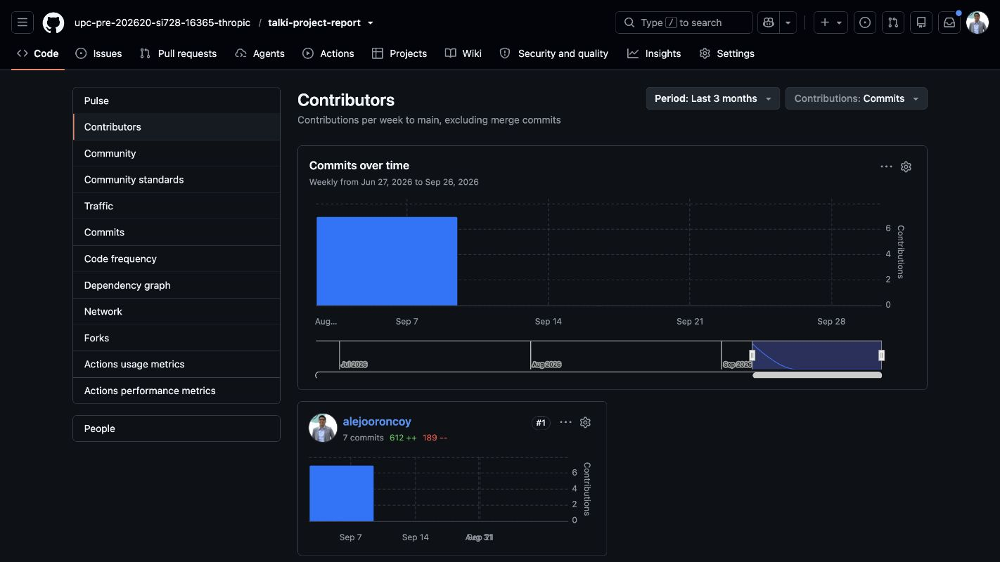

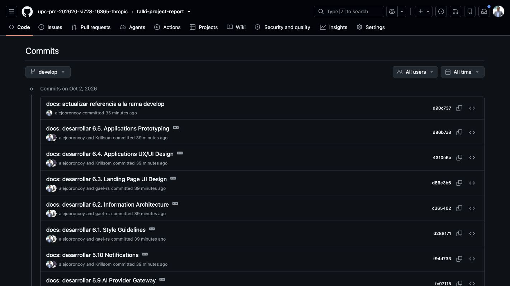

| Integrante | Commit del primer hito | Contenido registrado |
| --- | --- | --- |
| Eduardo Gael Rivera Sosa | [2bdb301](https://github.com/upc-pre-202620-si728-16365-thropic/talki-project-report/commit/2bdb3017ae4799ec8e55b56c86cbaa0c1de18c58) | Startup, Lean UX y entrevistas. |
| Manuel Ignacio Tumi Oliden | [25285e7](https://github.com/upc-pre-202620-si728-16365-thropic/talki-project-report/commit/25285e781945fde3575f80b021ad794c2c4822e3) | Competidores y needfinding. |
| Alejandro Daniel Oroncoy Almeyda | [40003d1](https://github.com/upc-pre-202620-si728-16365-thropic/talki-project-report/commit/40003d1d6af89de404d59ceb16d22f0e4b0b1464) | Requisitos y ADD. |
| Werner Khalil Lang Nassi | [bb379c3](https://github.com/upc-pre-202620-si728-16365-thropic/talki-project-report/commit/bb379c3595f2b85027c4db8eea77eff9841ccb4d) | Diseño estratégico DDD. |
| Kevin Jorge Chi Cruzatt | [c3a8b2a](https://github.com/upc-pre-202620-si728-16365-thropic/talki-project-report/commit/c3a8b2a740ee4d68092e836678812f322d64f696) | Diagramas de arquitectura. |

**Eduardo: Startup, Lean UX y entrevistas.**

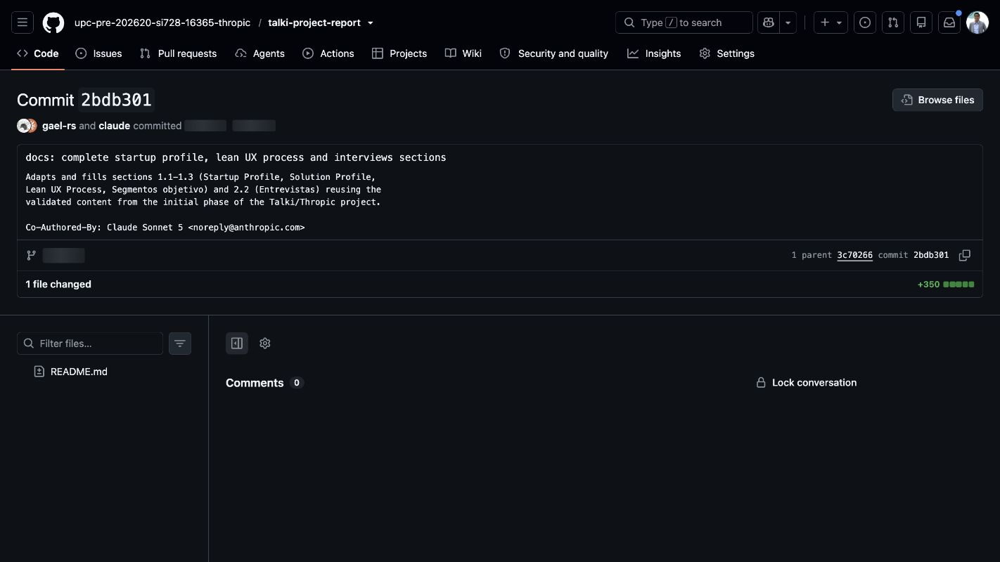

**Manuel: competidores y needfinding.**

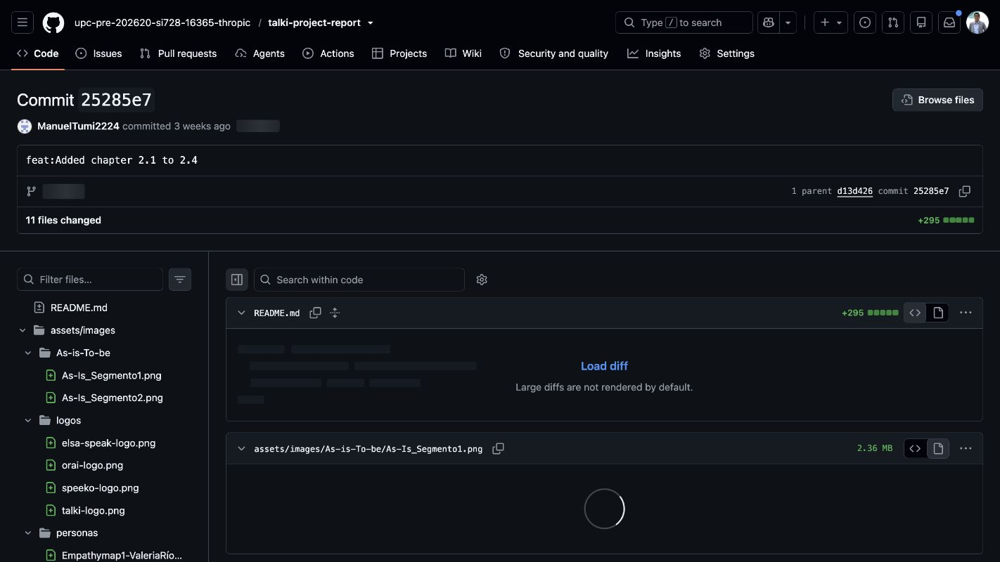

**Alejandro: requisitos y ADD.**

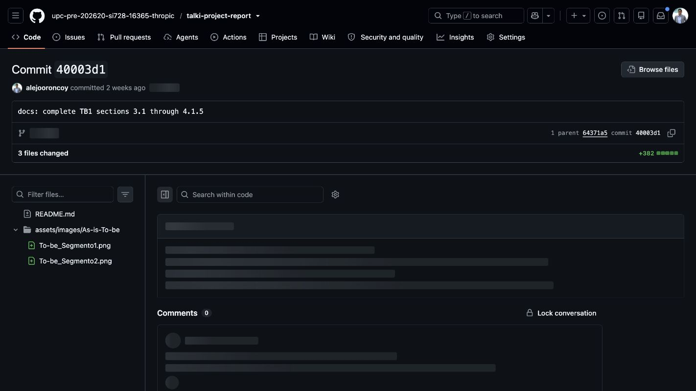

**Werner: diseño estratégico DDD.**

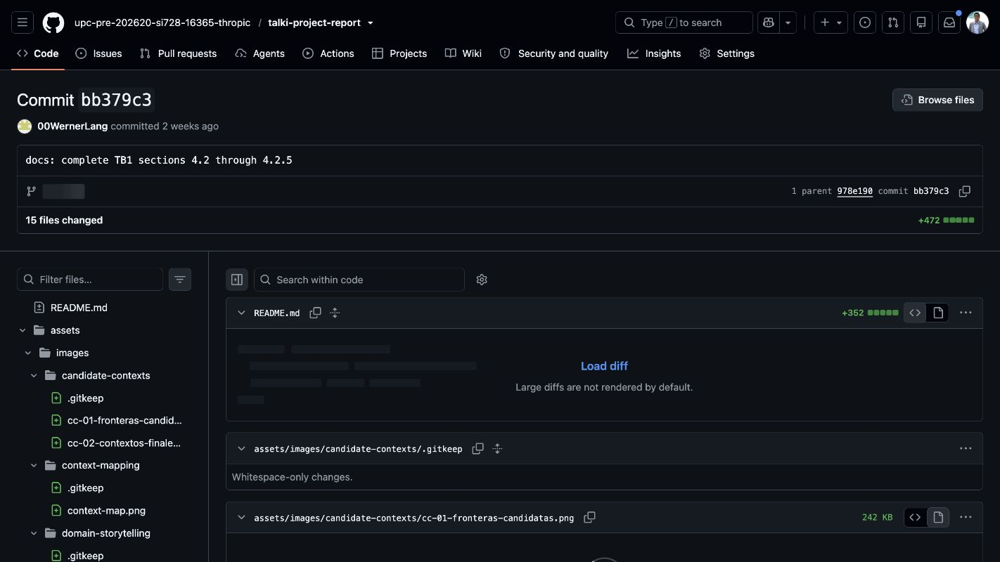

**Kevin: diagramas de arquitectura.**

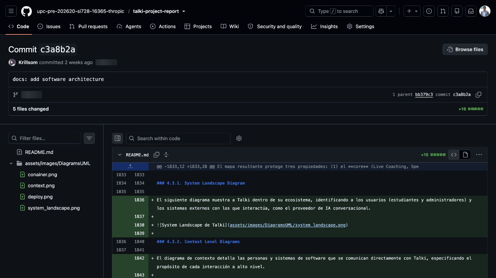

El avance actualizado del informe se consulta en el [historial de develop](https://github.com/upc-pre-202620-si728-16365-thropic/talki-project-report/commits/develop/). Las capturas anteriores documentan el TB1; no representan los analíticos del TP.

# Contenido

- [Registro de Versiones del Informe](#registro-de-versiones-del-informe)
- [Project Report Collaboration Insights](#project-report-collaboration-insights)
- [Student Outcome](#student-outcome)
- [Capítulo I: Introducción](#capítulo-i-introducción)
  - [1.1. Startup Profile](#11-startup-profile)
    - [1.1.1. Descripción de la Startup](#111-descripción-de-la-startup)
    - [1.1.2. Perfiles de integrantes del equipo](#112-perfiles-de-integrantes-del-equipo)
  - [1.2. Solution Profile](#12-solution-profile)
    - [1.2.1. Antecedentes y problemática](#121-antecedentes-y-problemática)
    - [1.2.2. Lean UX Process](#122-lean-ux-process)
      - [1.2.2.1. Lean UX Problem Statements](#1221-lean-ux-problem-statements)
      - [1.2.2.2. Lean UX Assumptions](#1222-lean-ux-assumptions)
      - [1.2.2.3. Lean UX Hypothesis Statements](#1223-lean-ux-hypothesis-statements)
      - [1.2.2.4. Lean UX Canvas](#1224-lean-ux-canvas)
  - [1.3. Segmentos objetivo](#13-segmentos-objetivo)
- [Capítulo II: Requirements Elicitation & Analysis](#capítulo-ii-requirements-elicitation--analysis)
  - [2.1. Competidores](#21-competidores)
    - [2.1.1. Análisis competitivo](#211-análisis-competitivo)
    - [2.1.2. Estrategias y tácticas frente a competidores](#212-estrategias-y-tácticas-frente-a-competidores)
  - [2.2. Entrevistas](#22-entrevistas)
    - [2.2.1. Diseño de entrevistas](#221-diseño-de-entrevistas)
    - [2.2.2. Registro de entrevistas](#222-registro-de-entrevistas)
    - [2.2.3. Análisis de entrevistas](#223-análisis-de-entrevistas)
  - [2.3. Needfinding](#23-needfinding)
    - [2.3.1. User Personas](#231-user-personas)
    - [2.3.2. User Task Matrix](#232-user-task-matrix)
    - [2.3.3. Empathy Mapping](#233-empathy-mapping)
    - [2.3.4. As-is Scenario Mapping](#234-as-is-scenario-mapping)
  - [2.4. Ubiquitous Language](#24-ubiquitous-language)
- [Capítulo III: Requirements Specification](#capítulo-iii-requirements-specification)
  - [3.1. To-Be Scenario Mapping](#31-to-be-scenario-mapping)
  - [3.2. User Stories](#32-user-stories)
  - [3.3. Impact Mapping](#33-impact-mapping)
  - [3.4. Product Backlog](#34-product-backlog)
- [Capítulo IV: Strategic-Level Software Design](#capítulo-iv-strategic-level-software-design)
  - [4.1. Strategic-Level Attribute-Driven Design](#41-strategic-level-attribute-driven-design)
    - [4.1.1. Design Purpose](#411-design-purpose)
    - [4.1.2. Attribute-Driven Design Inputs](#412-attribute-driven-design-inputs)
      - [4.1.2.1. Primary Functionality (Primary User Stories)](#4121-primary-functionality-primary-user-stories)
      - [4.1.2.2. Quality Attribute Scenarios](#4122-quality-attribute-scenarios)
      - [4.1.2.3. Constraints](#4123-constraints)
    - [4.1.3. Architectural Drivers Backlog](#413-architectural-drivers-backlog)
    - [4.1.4. Architectural Design Decisions](#414-architectural-design-decisions)
    - [4.1.5. Quality Attribute Scenario Refinements](#415-quality-attribute-scenario-refinements)
  - [4.2. Strategic-Level Domain-Driven Design](#42-strategic-level-domain-driven-design)
    - [4.2.1. EventStorming](#421-eventstorming)
    - [4.2.2. Candidate Context Discovery](#422-candidate-context-discovery)
    - [4.2.3. Domain Message Flows Modeling](#423-domain-message-flows-modeling)
    - [4.2.4. Bounded Context Canvases](#424-bounded-context-canvases)
    - [4.2.5. Context Mapping](#425-context-mapping)
  - [4.3. Software Architecture](#43-software-architecture)
    - [4.3.1. System Landscape Diagram](#431-system-landscape-diagram)
    - [4.3.2. Context Level Diagrams](#432-context-level-diagrams)
    - [4.3.3. Container Level Diagrams](#433-container-level-diagrams)
    - [4.3.4. Deployment Diagrams](#434-deployment-diagrams)
- [Capítulo V: Tactical-Level Software Design](#capítulo-v-tactical-level-software-design)
  - [Organización por capas](#organización-por-capas)
  - [5.1. Bounded Context: Live Coaching](#51-bounded-context-live-coaching)
    - [5.1.1. Domain Layer](#511-domain-layer)
    - [5.1.2. Interface Layer](#512-interface-layer)
    - [5.1.3. Application Layer](#513-application-layer)
    - [5.1.4. Infrastructure Layer](#514-infrastructure-layer)
    - [5.1.5. Bounded Context Software Architecture Component Level Diagrams](#515-bounded-context-software-architecture-component-level-diagrams)
    - [5.1.6. Bounded Context Software Architecture Code Level Diagrams](#516-bounded-context-software-architecture-code-level-diagrams)
      - [5.1.6.1. Bounded Context Domain Layer Class Diagrams](#5161-bounded-context-domain-layer-class-diagrams)
      - [5.1.6.2. Bounded Context Database Design Diagram](#5162-bounded-context-database-design-diagram)
  - [5.2. Bounded Context: Speech Analysis](#52-bounded-context-speech-analysis)
    - [5.2.1. Domain Layer](#521-domain-layer)
    - [5.2.2. Interface Layer](#522-interface-layer)
    - [5.2.3. Application Layer](#523-application-layer)
    - [5.2.4. Infrastructure Layer](#524-infrastructure-layer)
    - [5.2.5. Bounded Context Software Architecture Component Level Diagrams](#525-bounded-context-software-architecture-component-level-diagrams)
    - [5.2.6. Bounded Context Software Architecture Code Level Diagrams](#526-bounded-context-software-architecture-code-level-diagrams)
      - [5.2.6.1. Bounded Context Domain Layer Class Diagrams](#5261-bounded-context-domain-layer-class-diagrams)
      - [5.2.6.2. Bounded Context Database Design Diagram](#5262-bounded-context-database-design-diagram)
  - [5.3. Bounded Context: Scoring & Feedback](#53-bounded-context-scoring--feedback)
    - [5.3.1. Domain Layer](#531-domain-layer)
    - [5.3.2. Interface Layer](#532-interface-layer)
    - [5.3.3. Application Layer](#533-application-layer)
    - [5.3.4. Infrastructure Layer](#534-infrastructure-layer)
    - [5.3.5. Bounded Context Software Architecture Component Level Diagrams](#535-bounded-context-software-architecture-component-level-diagrams)
    - [5.3.6. Bounded Context Software Architecture Code Level Diagrams](#536-bounded-context-software-architecture-code-level-diagrams)
      - [5.3.6.1. Bounded Context Domain Layer Class Diagrams](#5361-bounded-context-domain-layer-class-diagrams)
      - [5.3.6.2. Bounded Context Database Design Diagram](#5362-bounded-context-database-design-diagram)
  - [5.4. Bounded Context: Practice Session Management](#54-bounded-context-practice-session-management)
    - [5.4.1. Domain Layer](#541-domain-layer)
    - [5.4.2. Interface Layer](#542-interface-layer)
    - [5.4.3. Application Layer](#543-application-layer)
    - [5.4.4. Infrastructure Layer](#544-infrastructure-layer)
    - [5.4.5. Bounded Context Software Architecture Component Level Diagrams](#545-bounded-context-software-architecture-component-level-diagrams)
    - [5.4.6. Bounded Context Software Architecture Code Level Diagrams](#546-bounded-context-software-architecture-code-level-diagrams)
      - [5.4.6.1. Bounded Context Domain Layer Class Diagrams](#5461-bounded-context-domain-layer-class-diagrams)
      - [5.4.6.2. Bounded Context Database Design Diagram](#5462-bounded-context-database-design-diagram)
  - [5.5. Bounded Context: Progress & Adaptation](#55-bounded-context-progress--adaptation)
    - [5.5.1. Domain Layer](#551-domain-layer)
    - [5.5.2. Interface Layer](#552-interface-layer)
    - [5.5.3. Application Layer](#553-application-layer)
    - [5.5.4. Infrastructure Layer](#554-infrastructure-layer)
    - [5.5.5. Bounded Context Software Architecture Component Level Diagrams](#555-bounded-context-software-architecture-component-level-diagrams)
    - [5.5.6. Bounded Context Software Architecture Code Level Diagrams](#556-bounded-context-software-architecture-code-level-diagrams)
      - [5.5.6.1. Bounded Context Domain Layer Class Diagrams](#5561-bounded-context-domain-layer-class-diagrams)
      - [5.5.6.2. Bounded Context Database Design Diagram](#5562-bounded-context-database-design-diagram)
  - [5.6. Bounded Context: Sharing & Retention](#56-bounded-context-sharing--retention)
    - [5.6.1. Domain Layer](#561-domain-layer)
    - [5.6.2. Interface Layer](#562-interface-layer)
    - [5.6.3. Application Layer](#563-application-layer)
    - [5.6.4. Infrastructure Layer](#564-infrastructure-layer)
    - [5.6.5. Bounded Context Software Architecture Component Level Diagrams](#565-bounded-context-software-architecture-component-level-diagrams)
    - [5.6.6. Bounded Context Software Architecture Code Level Diagrams](#566-bounded-context-software-architecture-code-level-diagrams)
      - [5.6.6.1. Bounded Context Domain Layer Class Diagrams](#5661-bounded-context-domain-layer-class-diagrams)
      - [5.6.6.2. Bounded Context Database Design Diagram](#5662-bounded-context-database-design-diagram)
  - [5.7. Bounded Context: Gamification](#57-bounded-context-gamification)
    - [5.7.1. Domain Layer](#571-domain-layer)
    - [5.7.2. Interface Layer](#572-interface-layer)
    - [5.7.3. Application Layer](#573-application-layer)
    - [5.7.4. Infrastructure Layer](#574-infrastructure-layer)
    - [5.7.5. Bounded Context Software Architecture Component Level Diagrams](#575-bounded-context-software-architecture-component-level-diagrams)
    - [5.7.6. Bounded Context Software Architecture Code Level Diagrams](#576-bounded-context-software-architecture-code-level-diagrams)
      - [5.7.6.1. Bounded Context Domain Layer Class Diagrams](#5761-bounded-context-domain-layer-class-diagrams)
      - [5.7.6.2. Bounded Context Database Design Diagram](#5762-bounded-context-database-design-diagram)
  - [5.8. Bounded Context: Identity & Access](#58-bounded-context-identity--access)
    - [5.8.1. Domain Layer](#581-domain-layer)
    - [5.8.2. Interface Layer](#582-interface-layer)
    - [5.8.3. Application Layer](#583-application-layer)
    - [5.8.4. Infrastructure Layer](#584-infrastructure-layer)
    - [5.8.5. Bounded Context Software Architecture Component Level Diagrams](#585-bounded-context-software-architecture-component-level-diagrams)
    - [5.8.6. Bounded Context Software Architecture Code Level Diagrams](#586-bounded-context-software-architecture-code-level-diagrams)
      - [5.8.6.1. Bounded Context Domain Layer Class Diagrams](#5861-bounded-context-domain-layer-class-diagrams)
      - [5.8.6.2. Bounded Context Database Design Diagram](#5862-bounded-context-database-design-diagram)
  - [5.9. Bounded Context: AI Provider Gateway](#59-bounded-context-ai-provider-gateway)
    - [5.9.1. Domain Layer](#591-domain-layer)
    - [5.9.2. Interface Layer](#592-interface-layer)
    - [5.9.3. Application Layer](#593-application-layer)
    - [5.9.4. Infrastructure Layer](#594-infrastructure-layer)
    - [5.9.5. Bounded Context Software Architecture Component Level Diagrams](#595-bounded-context-software-architecture-component-level-diagrams)
    - [5.9.6. Bounded Context Software Architecture Code Level Diagrams](#596-bounded-context-software-architecture-code-level-diagrams)
      - [5.9.6.1. Bounded Context Domain Layer Class Diagrams](#5961-bounded-context-domain-layer-class-diagrams)
      - [5.9.6.2. Bounded Context Database Design Diagram](#5962-bounded-context-database-design-diagram)
  - [5.10. Bounded Context: Notifications](#510-bounded-context-notifications)
    - [5.10.1. Domain Layer](#5101-domain-layer)
    - [5.10.2. Interface Layer](#5102-interface-layer)
    - [5.10.3. Application Layer](#5103-application-layer)
    - [5.10.4. Infrastructure Layer](#5104-infrastructure-layer)
    - [5.10.5. Bounded Context Software Architecture Component Level Diagrams](#5105-bounded-context-software-architecture-component-level-diagrams)
    - [5.10.6. Bounded Context Software Architecture Code Level Diagrams](#5106-bounded-context-software-architecture-code-level-diagrams)
      - [5.10.6.1. Bounded Context Domain Layer Class Diagrams](#51061-bounded-context-domain-layer-class-diagrams)
      - [5.10.6.2. Bounded Context Database Design Diagram](#51062-bounded-context-database-design-diagram)
  - [Contratos y garantías de integración](#contratos-y-garantías-de-integración)
  - [Trazabilidad del diseño táctico](#trazabilidad-del-diseño-táctico)
- [Capítulo VI: Solution UX Design](#capítulo-vi-solution-ux-design)
  - [6.1. Style Guidelines](#61-style-guidelines)
    - [6.1.1. General Style Guidelines](#611-general-style-guidelines)
    - [6.1.2. Web, Mobile and Devices Style Guidelines](#612-web-mobile-and-devices-style-guidelines)
  - [6.2. Information Architecture](#62-information-architecture)
    - [6.2.1. Organization Systems](#621-organization-systems)
    - [6.2.2. Labeling Systems](#622-labeling-systems)
    - [6.2.3. SEO Tags and Meta Tags](#623-seo-tags-and-meta-tags)
    - [6.2.4. Searching Systems](#624-searching-systems)
    - [6.2.5. Navigation Systems](#625-navigation-systems)
  - [6.3. Landing Page UI Design](#63-landing-page-ui-design)
    - [6.3.1. Landing Page Wireframe](#631-landing-page-wireframe)
    - [6.3.2. Landing Page Mock-up](#632-landing-page-mock-up)
  - [6.4. Applications UX/UI Design](#64-applications-uxui-design)
    - [6.4.1. Applications Wireframes](#641-applications-wireframes)
    - [6.4.2. Applications Wireflow Diagrams](#642-applications-wireflow-diagrams)
    - [6.4.3. Applications Mock-ups](#643-applications-mock-ups)
    - [6.4.4. Applications User Flow Diagrams](#644-applications-user-flow-diagrams)
  - [6.5. Applications Prototyping](#65-applications-prototyping)
- [Capítulo VII: Software Product Implementation, Validation & Deployment](#capítulo-vii-software-product-implementation-validation--deployment)
  - [7.1. Software Configuration Management](#71-software-configuration-management)
    - [7.1.1. Software Development Environment Configuration](#711-software-development-environment-configuration)
    - [7.1.2. Source Code Management](#712-source-code-management)
    - [7.1.3. Source Code Style Guide & Conventions](#713-source-code-style-guide--conventions)
    - [7.1.4. Software Deployment Configuration](#714-software-deployment-configuration)
  - [7.2. Solution Implementation](#72-solution-implementation)
    - [7.2.X. Sprint X](#72x-sprint-x)
      - [7.2.X.1. Sprint Planning X](#72x1-sprint-planning-x)
      - [7.2.X.2. Sprint Backlog X](#72x2-sprint-backlog-x)
      - [7.2.X.3. Development Evidence for Sprint Review](#72x3-development-evidence-for-sprint-review)
      - [7.2.X.4. Testing Suite Evidence for Sprint Review](#72x4-testing-suite-evidence-for-sprint-review)
      - [7.2.X.5. Execution Evidence for Sprint Review](#72x5-execution-evidence-for-sprint-review)
      - [7.2.X.6. Services Documentation Evidence for Sprint Review](#72x6-services-documentation-evidence-for-sprint-review)
      - [7.2.X.7. Software Deployment Evidence for Sprint Review](#72x7-software-deployment-evidence-for-sprint-review)
      - [7.2.X.8. Team Collaboration Insights during Sprint](#72x8-team-collaboration-insights-during-sprint)
  - [7.3. Validation Interviews](#73-validation-interviews)
    - [7.3.1. Diseño de entrevistas](#731-diseño-de-entrevistas)
    - [7.3.2. Registro de entrevistas](#732-registro-de-entrevistas)
    - [7.3.3. Evaluaciones según heurísticas](#733-evaluaciones-según-heurísticas)
  - [7.4. Video About-the-Product](#74-video-about-the-product)
- [Conclusiones y recomendaciones](#conclusiones-y-recomendaciones)
  - [Conclusiones](#conclusiones)
  - [Recomendaciones](#recomendaciones)
- [Video About-the-Team](#video-about-the-team)
- [Bibliografía](#bibliografía)
- [Anexos](#anexos)

# Student Outcome

**Entregas registradas: TB1 y TP.**

El curso contribuye al cumplimiento del Student Outcome ABET:

**ABET – EAC - Student Outcome 3**

**Criterio: Capacidad de comunicarse efectivamente con un rango de audiencias.**

En el siguiente cuadro se describe las acciones realizadas y enunciados de conclusiones por parte del grupo, que permiten sustentar el haber alcanzado el logro del ABET – EAC - Student Outcome 3.

El registro es acumulativo: conserva TB1 e incorpora TP. Para el TP se distingue la documentación disponible de la revisión individual y la sustentación aún pendientes; las acciones futuras no se registran como logros realizados.

| Criterio específico | Acciones realizadas | Conclusiones |
| --- | --- | --- |
| Comunica oralmente ideas y/o resultados con objetividad a público de diferentes especialidades y niveles jerárquicos, en el marco del desarrollo de un proyecto en ingeniería. | **TB1:**  **Eduardo Gael Rivera Sosa:** Expuse los fundamentos del Startup Profile y Solution Profile de Talki, el proceso Lean UX y los hallazgos de las entrevistas, sustentándolos con evidencia cuantitativa y cualitativa.  **Manuel Ignacio Tumi Oliden:** Expliqué el análisis de competidores, el needfinding, las personas, la matriz de tareas, los empathy maps y el lenguaje ubicuo para conectar los hallazgos con las necesidades de Talki.  **Alejandro Daniel Oroncoy Almeyda:** Sustenté el To-Be Scenario Mapping, las user stories, el Impact Mapping, el Product Backlog y el diseño ADD, relacionando requisitos, drivers, decisiones y escenarios de calidad.  **Werner Khalil Lang Nassi:** Mi sección del TB1 reúne el EventStorming, el descubrimiento de bounded contexts, los flujos de mensajes, los Bounded Context Canvases y el Context Mapping. El feedback docente señala que los canvases no se expusieron en el video; debo incorporarlos a la demostración corregida.  **Kevin Jorge Chi Cruzatt:** Mi sección del TB1 reúne los diagramas System Landscape, Context Level, Container Level y Deployment. El feedback docente señala que el Landscape no se expuso en el video; debo mostrarlo y explicar sus actores y sistemas externos en la demostración corregida.  **TP:**  **Preparación de la sustentación, pendiente de exposición.**  **Eduardo Gael Rivera Sosa:** Explicaré las guías de estilo, la organización de la información y el diseño de la landing page (6.1–6.3), relacionando las decisiones visuales y de navegación con las necesidades de los estudiantes.  **Manuel Ignacio Tumi Oliden:** Explicaré Speech Analysis, Scoring & Feedback y Progress & Adaptation (5.2, 5.3 y 5.5), mostrando cómo el discurso se convierte en métricas, evaluación y seguimiento del progreso mediante sus capas, componentes C4, clases UML y datos.  **Alejandro Daniel Oroncoy Almeyda:** Sustentaré Live Coaching, Practice Session Management y AI Provider Gateway (5.1, 5.4 y 5.9), y explicaré la relación entre requisitos, bounded contexts, arquitectura y recorrido de práctica.  **Werner Khalil Lang Nassi:** Explicaré Sharing & Retention, Gamification e Identity & Access (5.6–5.8), destacando las reglas de acceso, consentimiento, eliminación, rachas y logros y su representación en los modelos.  **Kevin Jorge Chi Cruzatt:** Explicaré Notifications y el diseño UX/UI y prototipado de las aplicaciones (5.10, 6.4 y 6.5), mostrando wireframes, mock-ups, user flows y el recorrido web/móvil con apoyo de las historias de usuario. | **TB1:**  El informe TB1 reúne la investigación, los requisitos y el diseño estratégico. El feedback docente identificó omisiones en la presentación individual a cámara y en la demostración del Landscape y los Bounded Context Canvases. Estas observaciones requieren una evidencia audiovisual corregida; la documentación de los artefactos no acredita por sí sola su comunicación oral.  **TP:**  Los modelos UML y las pantallas permiten explicar cómo las decisiones de diseño responden a las necesidades de Talki. El reparto organiza la exposición para una audiencia de negocio y de ingeniería, utilizando ejemplos del recorrido de preparación, práctica y revisión del feedback. La sustentación individual del TP y su evidencia audiovisual continúan pendientes. |
| Comunica en forma escrita ideas y/o resultados con objetividad a público de diferentes especialidades y niveles jerárquicos, en el marco del desarrollo de un proyecto en ingeniería. | **TB1:**  **Eduardo Gael Rivera Sosa:** Redacté las secciones 1.1 (Startup Profile), 1.2 (Solution Profile y Lean UX Process), 1.3 (Segmentos objetivo) y 2.2 (Entrevistas), documentando la problemática, el proceso Lean UX y los hallazgos de las entrevistas.  **Manuel Ignacio Tumi Oliden:** Redacté las secciones 2.1 a 2.4, documentando competidores, needfinding, personas, matriz de tareas, mapas de empatía, escenarios As-Is y lenguaje ubicuo.  **Alejandro Daniel Oroncoy Almeyda:** Redacté las secciones 3.1 a 4.1.5, documentando los escenarios To-Be, user stories, impacto, backlog, drivers arquitectónicos, decisiones de diseño y refinamientos de escenarios de calidad.  **Werner Khalil Lang Nassi:** Redacté las secciones 4.2 a 4.2.5, documentando EventStorming, candidate context discovery, domain message flows, bounded context canvases y Context Mapping.  **Kevin Jorge Chi Cruzatt:** Redacté la sección 4.3 (Software Architecture) e incorporé los diagramas System Landscape, Context Level, Container Level y Deployment para documentar la arquitectura de Talki.  **TP:**  **Eduardo Gael Rivera Sosa:** Quedé asignado a la revisión de las guías de estilo, la arquitectura de información y el diseño de la landing page ([6.1](#61-style-guidelines), [6.2](#62-information-architecture) y [6.3](#63-landing-page-ui-design)). Mi revisión debe comprobar que la identidad visual, la navegación y la presentación del contenido respondan a las necesidades de los estudiantes.  **Manuel Ignacio Tumi Oliden:** Quedé asignado a la revisión del diseño táctico de Speech Analysis, Scoring & Feedback y Progress & Adaptation ([5.2](#52-bounded-context-speech-analysis), [5.3](#53-bounded-context-scoring--feedback) y [5.5](#55-bounded-context-progress--adaptation)). Debo revisar las responsabilidades de las capas y los diagramas de componentes, clases y datos, relacionándolos con el análisis del discurso, la evaluación y el seguimiento del progreso.  **Alejandro Daniel Oroncoy Almeyda:** Documenté el diseño táctico de Live Coaching, Practice Session Management y AI Provider Gateway ([5.1](#51-bounded-context-live-coaching), [5.4](#54-bounded-context-practice-session-management) y [5.9](#59-bounded-context-ai-provider-gateway)), explicando sus capas y relacionando los modelos con los requisitos de Talki. Consolidé los capítulos V y VI e incorporé las correcciones de tareas, criterios Gherkin, Technical Stories, backlog y vistas C4. En la revisión del TP completé los modelos de consentimiento, estado de análisis, configuración, planes y notificaciones; precisé contratos y restricciones de datos y relacioné los objetivos del usuario con wireflows web y móvil. Separé componentes C4 y clases UML para facilitar su explicación a una audiencia de ingeniería y revisé las afirmaciones de entrevistas para distinguir evidencia e hipótesis.  **Werner Khalil Lang Nassi:** Quedé asignado a la revisión del diseño táctico de Sharing & Retention, Gamification e Identity & Access ([5.6](#56-bounded-context-sharing--retention), [5.7](#57-bounded-context-gamification) y [5.8](#58-bounded-context-identity--access)). Debo comprobar que las reglas de acceso, consentimiento, eliminación, rachas y logros se expresen de forma consistente en las capas y los diagramas de componentes, clases y persistencia.  **Kevin Jorge Chi Cruzatt:** Quedé asignado a la revisión de Notifications, Applications UX/UI Design y Applications Prototyping ([5.10](#510-bounded-context-notifications), [6.4](#64-applications-uxui-design) y [6.5](#65-applications-prototyping)). Debo revisar la explicación de las notificaciones y la relación entre wireframes, mock-ups, wireflows, user flows y prototipado web/móvil, incluyendo los estados de error y privacidad. | **TB1:**  El informe consolidó los aportes de los cinco integrantes en una secuencia trazable: contexto y evidencia de investigación, especificación de requisitos y diseño estratégico. La documentación ofrece una referencia clara para el equipo y el docente, diferenciando los hallazgos de producto de las decisiones técnicas que orientan Talki.  **TP:**  La documentación del TP conecta los requisitos y el diseño estratégico con las capas, modelos UML, datos y recorridos de usuario de Talki. El reparto identifica las secciones que corresponden a cada integrante y ofrece un material concreto para su revisión y sustentación. Las tablas, imágenes y referencias facilitan la comprensión del proyecto para audiencias de negocio y de ingeniería. Las correcciones individuales y la exposición deberán incorporarse como evidencia de la participación de cada integrante. |

# Capítulo I: Introducción

## 1.1. Startup Profile

### 1.1.1. Descripción de la Startup

Thropic es una startup de tecnología educativa fundada por estudiantes de Ingeniería de Software de la Universidad Peruana de Ciencias Aplicadas (UPC), con la misión de democratizar el acceso a herramientas de desarrollo personal mediante inteligencia artificial.

**Misión:** Empoderar a los estudiantes universitarios a desarrollar habilidades de comunicación oral efectiva a través de tecnología accesible e inteligente.

**Visión:** Ser la plataforma líder en Latinoamérica para el desarrollo de habilidades de comunicación oral en el ámbito académico y profesional para 2030.

Talki es la solución principal de Thropic: una aplicación web que utiliza IA para analizar, evaluar y retroalimentar la comunicación oral de estudiantes universitarios en tiempo real, ayudándoles a mejorar su fluidez, pronunciación, estructura del discurso y confianza al hablar en público.

**Nombre del producto:** Talki proviene de la combinación de "Talk" (hablar, en inglés) con el sufijo "-i", que evoca inteligencia e innovación. El nombre representa la idea de contar con un compañero inteligente que ayuda a mejorar la forma de comunicarse oralmente.

### 1.1.2. Perfiles de integrantes del equipo

<table>
  <thead>
    <tr>
      <th>Perfil</th>
      <th>Foto</th>
    </tr>
  </thead>
  <tbody>
    <tr>
      <td><strong>Oroncoy Almeyda, Alejandro Daniel</strong> (U202313397) Tengo 19 años y soy estudiante de Ingeniería de Software en el quinto ciclo. Me considero una persona proactiva, autodidacta y orientada a objetivos. Disfruto aprender nuevas tecnologías por cuenta propia y busco siempre entregar resultados de calidad. Tengo experiencia en desarrollo backend con Java y Spring Boot, así como en Python y servicios cloud. Me motiva construir soluciones que generen impacto real, y en Thropic asumo con entusiasmo el reto de llevar Talki al mercado universitario peruano.</td>
      <td></td>
    </tr>
    <tr>
      <td><strong>Rivera Sosa, Eduardo Gael</strong> (U202312222) Tengo 20 años y soy estudiante de Ingeniería de Software en el quinto ciclo. Me caracterizo por ser responsable y orientado a resultados, con habilidades de liderazgo que facilitan la comunicación y el trabajo colaborativo. Tengo conocimientos en desarrollo frontend con Angular y experiencia en modelado de bases de datos relacionales. Siempre estoy dispuesto a abordar desafíos y encontrar soluciones en equipo, y en Thropic asumo la especificación de requerimientos como base técnica del producto.</td>
      <td></td>
    </tr>
    <tr>
      <td><strong>Tumi Oliden, Manuel Ignacio</strong> (U20241C134) Soy estudiante de Ingeniería de Software y me caracterizo por ser una persona colaborativa y adaptable, que se integra fácilmente a distintos métodos de trabajo. Tengo conocimientos en investigación de usuarios, diseño de entrevistas y análisis de necesidades, habilidades que aplico en la etapa de needfinding del proyecto. Prefiero apoyar al equipo desde la escucha activa y el análisis, y en mi tiempo libre disfruto del voleibol y los videojuegos.</td>
      <td></td>
    </tr>
    <tr>
      <td><strong>Lang Nassi, Werner Khalil</strong> (U202310003) Estudiante de la Universidad Peruana de Ciencias Aplicadas (UPC), cursando en 8.º ciclo. Tengo afinidad con la arquitectura de software y e desarollado habilidades con machine y deep learning. Ademas siempre estoy dispuesto a aprender nuevas metologias o habilidades que me ayuden a desarollarme en la carrera.</td>
      <td></td>
    </tr>
    <tr>
      <td><strong>Chi Cruzatt, Kevin Jorge</strong> (U202313655) Actualmente estoy cursando la carrera de ingeniería de Software y me encuentro en el 8° ciclo. Tengo experiencia utilizando diferentes metodologías de diseño, como Domain Driven Design (DDD) y CMV, además de frameworks como Laravel y Spring en lenguajes como Java, PHP, etc. Me considero una persona paciente y perseverante en situaciones difíciles.</td>
      <td></td>
    </tr>
  </tbody>
</table>

## 1.2. Solution Profile

### 1.2.1. Antecedentes y problemática

#### WHAT (Qué)

Las deficiencias en comunicación oral afectan el desempeño académico y profesional de los universitarios peruanos.

#### WHEN (Cuándo)

Se manifiesta principalmente al momento de realizar exposiciones, sustentaciones, entrevistas de trabajo y presentaciones profesionales.

#### WHERE (Dónde)

En aulas universitarias, plataformas virtuales y entornos laborales/prácticas.

#### WHO (Quién)

Estudiantes de educación superior peruanos (ciclos 1-10), especialmente aquellos sin acceso a coaching personalizado.

#### WHY (Por qué)

La educación tradicional no brinda suficientes espacios de práctica oral con feedback personalizado. El acceso a coaches es costoso y limitado.

#### HOW (Cómo)

Talki usa IA para grabar, analizar y retroalimentar la comunicación oral del usuario en tiempo real, con ejercicios progresivos y personalizados.

#### HOW MUCH (Cuánto)

Según la Superintendencia Nacional de Educación Superior Universitaria (SUNEDU, 2023), más de 1.5 millones de estudiantes se encuentran matriculados en universidades peruanas, representando un mercado potencial significativo para soluciones de desarrollo de competencias comunicativas.

En el plano de la ansiedad comunicativa, la literatura científica muestra cifras consistentemente elevadas. Maldonado et al. (2022), en un estudio experimental con universitarios publicado en la *Revista Latina de Comunicación Social*, confirmaron que la ansiedad al hablar en público impacta directamente el desempeño académico y la participación activa en clases. A nivel global, investigaciones compiladas por Teleprompter.com (2024) revelan que el **75% de las personas** experimenta algún nivel de ansiedad al hablar en público, y el **61% de universitarios** la reporta como un temor significativo.

_Figura 1: Prevalencia de la ansiedad al hablar en público en población universitaria_

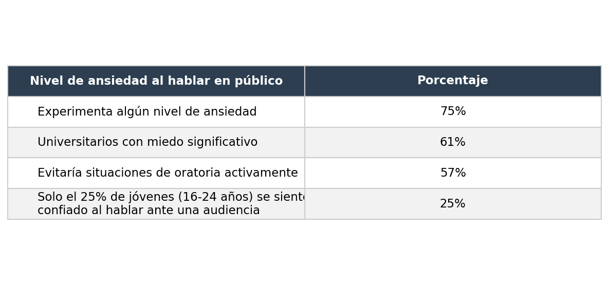

_Nota._ Elaboración propia basada en Teleprompter.com (2024) y Crown Counseling (2024).

Respecto al impacto en la empleabilidad, un estudio descriptivo sobre competencias laborales blandas en egresados universitarios latinoamericanos (Redalyc, 2022) identificó que la **comunicación asertiva** es la segunda habilidad más demandada por empleadores (9.1%), solo detrás del trabajo en equipo (10.1%). Sin embargo, es también una de las competencias con mayores brechas en egresados.

_Figura 2: Habilidades blandas más demandadas por empleadores en Latinoamérica_

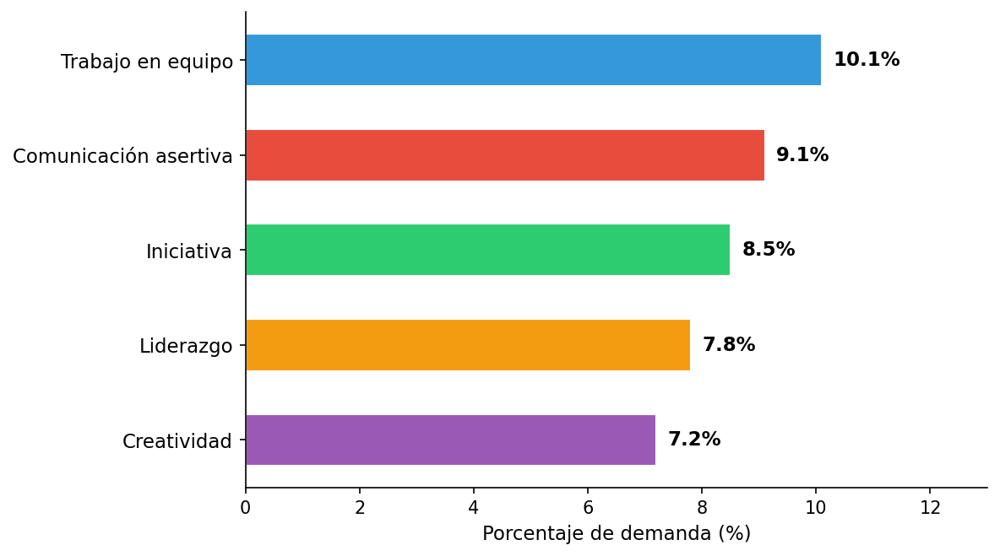

_Nota._ Elaboración propia basada en Redalyc (2022).

Finalmente, la ansiedad comunicativa no solo afecta el desempeño académico sino también la trayectoria profesional. Datos de Crown Counseling (2024) y Teleprompter.com (2024) indican que el **70% de los empleos** requiere algún nivel de oratoria o presentaciones; el **30% de las personas** ha evitado postular a empleos o ascensos debido a esta ansiedad; y quienes la padecen tienen un **15% menos de probabilidad** de alcanzar posiciones gerenciales.

_Figura 3: Impacto profesional de la ansiedad al hablar en público_

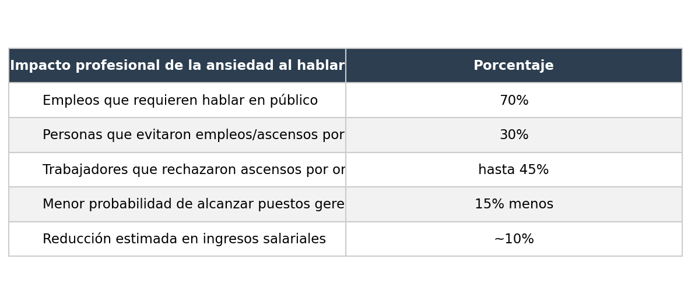

_Nota._ Elaboración propia basada en Crown Counseling (2024) y Teleprompter.com (2024).

Ante este escenario, el costo de un coach de oratoria privado en Lima oscila entre S/. 80 y S/. 200 por sesión (con frecuencia semanal recomendada), haciendo inaccesible el entrenamiento personalizado para la mayoría del segmento universitario. Talki aborda esta brecha mediante IA accesible desde cualquier navegador web, a una fracción del costo.

### 1.2.2. Lean UX Process

El proceso Lean UX aplicado en Thropic sigue el enfoque de validación continua de hipótesis mediante ciclos cortos de aprendizaje, construir y medir (Ries, 2011), con el objetivo de reducir el riesgo de construir un producto que el mercado no necesita.

#### 1.2.2.1. Lean UX Problem Statements

**Segmento 1:** Hemos observado que los estudiantes de ciclos 1-5 carecen de espacios seguros y accesibles para practicar la comunicación oral con feedback real. El impacto es bajo desempeño en exposiciones y pérdida de oportunidades académicas. ¿Cómo podríamos brindarles práctica guiada con IA para que ganen confianza progresivamente?

**Segmento 2:** Hemos observado que los estudiantes de ciclos 6-10 no tienen herramientas asequibles para prepararse para entrevistas laborales y presentaciones profesionales. El impacto es dificultad para insertarse en el mercado laboral. ¿Cómo podríamos simular entornos reales de comunicación profesional para que estén listos al graduarse?

#### 1.2.2.2. Lean UX Assumptions

##### Business Assumptions

1. Creemos que los usuarios pagarán una suscripción mensual de S/. 15-25 por acceso premium.
2. Creemos que el mayor canal de adquisición serán las redes sociales universitarias (Instagram, TikTok).
3. Creemos que los usuarios necesitan al menos 3 sesiones semanales para notar mejora en 30 días.
4. Creemos que las universidades adoptarán Talki como herramienta complementaria en cursos de comunicación.
5. Creemos que el NPS (Net Promoter Score) alcanzará 40+ en los primeros 6 meses.
6. Creemos que el costo de adquisición por usuario será menor a S/. 10 mediante estrategias de referidos.
7. Creemos que el 60% de usuarios retendrá la app más de 3 meses con gamificación efectiva.
8. Creemos que las alianzas con institutos y universidades serán nuestro principal canal B2B.
9. Creemos que los usuarios en ciclos 6-10 están dispuestos a pagar más por features de simulación de entrevistas.
10. Creemos que el mercado latinoamericano de edtech crecerá 25% anual los próximos 3 años.
11. Creemos que la diferenciación por idioma español y contexto peruano/latinoamericano será una ventaja competitiva sostenible.

##### User Assumptions

1. **¿Quién es el usuario?** Estudiantes universitarios peruanos de ciclos 1-10, de 17 a 26 años, nativos digitales con acceso a laptop/PC y conexión a internet.
2. **¿Dónde encaja nuestro producto en su vida?** En los momentos previos a exposiciones, durante el estudio en casa, y en transporte público.
3. **¿Qué problemas resuelve nuestro producto?** La falta de espacios seguros para practicar oralidad con feedback inmediato y personalizado.
4. **¿Cuándo y cómo es usado nuestro producto?** Sesiones de 10-20 minutos, principalmente en las noches, desde el navegador web en su laptop o PC.
5. **¿Qué características son importantes?** Feedback en tiempo real, ejercicios progresivos, historial de progreso, modo simulación de entrevistas.
6. **¿Cómo debe verse y comportarse el producto?** Intuitivo, motivador, con elementos de gamificación, lenguaje cercano y sin tecnicismos.

#### 1.2.2.3. Lean UX Hypothesis Statements

Cada hipótesis sigue el feature hypothesis template y explicita los cuatro componentes requeridos: business outcome medible, usuario segmentado (Valeria Ríos o Rodrigo Sánchez), beneficio percibido y feature asociada.

1. **H1 (Adopción).** Creemos que lograremos una retención semanal del 40% y una permanencia promedio de más de 90 días en Valeria Ríos (Segmento 1, ciclos 1 al 5) si la estudiante gana confianza al practicar exposiciones con feedback inmediato, mediante la feature de *ejercicios guiados con IA*.

2. **H2 (Conversión).** Creemos que lograremos una reducción de la ansiedad al hablar en público y un NPS de al menos 45 puntos en Rodrigo Sánchez (Segmento 2, ciclos 6 al 10) si el estudiante se prepara para entrevistas laborales reales en condiciones realistas, mediante la feature de *simulador de entrevistas con feedback en tiempo real*.

3. **H3 (Engagement).** Creemos que lograremos al menos 3 sesiones semanales sostenidas durante 4 semanas consecutivas en ambos segmentos si los estudiantes conservan el hábito de práctica gracias a refuerzos positivos, mediante la feature de *streaks y logros*.

4. **H4 (Engagement).** Creemos que lograremos un aumento del engagement de 40% (es decir, al menos 4 sesiones al mes) en Rodrigo Sánchez (Segmento 2) si el estudiante puede visualizar su progreso medible por habilidad en un lugar único, mediante la feature de *dashboard de métricas personales*.

5. **H5 (Adopción).** Creemos que lograremos un CAC por debajo de S/ 10 vía referidos en Valeria Ríos (Segmento 1) si la estudiante puede compartir logros con sus compañeros de clase, mediante la feature de *comunidad y retos entre amigos*.

6. **H6 (Retención).** Creemos que lograremos un churn mensual por debajo del 15% en ambos segmentos si los estudiantes reciben un plan de práctica personalizado según sus errores recurrentes, mediante la feature de *ruta de aprendizaje adaptativa con IA*.

#### 1.2.2.4. Lean UX Canvas

_Figura 4: Lean UX Canvas de Talki_

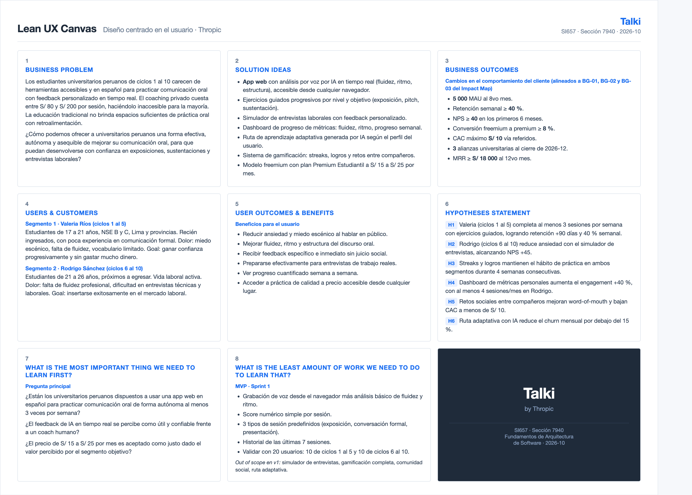

_Nota._ Elaboración propia (2026).

El canvas documenta de forma visual: business outcomes, problemas de usuario, oportunidades, soluciones propuestas, métricas clave de éxito y los supuestos que guían el desarrollo del producto, en línea con los problem statements, assumptions e hypothesis statements descritos en las secciones anteriores.

## 1.3. Segmentos objetivo

**Segmento 1: Estudiantes universitarios de ciclos 1 al 5**

*Aspectos Demográficos:*
- Edad: 17-21 años
- Sexo: Masculino y femenino
- Nivel socioeconómico: B y C
- Ciclo: 1 al 5 de educación superior universitaria

*Aspectos Geográficos:*
- País: Perú
- Región: Lima Metropolitana y principales ciudades del interior (Arequipa, Trujillo, Piura)
- Tipo de institución: Universidades privadas y públicas

*Aspectos Psicográficos:*
- Motivaciones: Mejorar calificaciones en cursos con exposiciones, ganar confianza al hablar en público, no pasar vergüenza frente a compañeros
- Dolores: Miedo escénico pronunciado, vocabulario académico limitado, falta de estructura al exponer, nerviosismo que bloquea el discurso
- Comportamientos digitales: Nativos digitales, uso intensivo de dispositivos digitales y navegador web, acostumbrados a plataformas de aprendizaje (Duolingo, YouTube), disponibles para sesiones cortas de 10-15 min

**Segmento 2: Estudiantes universitarios de ciclos 6 al 10**

*Aspectos Demográficos:*
- Edad: 21-26 años
- Sexo: Masculino y femenino
- Nivel socioeconómico: B y C
- Ciclo: 6 al 10 de educación superior universitaria, próximos a egresar

*Aspectos Geográficos:*
- País: Perú
- Región: Lima Metropolitana y principales ciudades con oferta laboral tecnológica
- Tipo de institución: Universidades con programas de prácticas preprofesionales activos

*Aspectos Psicográficos:*
- Motivaciones: Conseguir prácticas o primer empleo, destacar en entrevistas técnicas y de RR.HH., comunicar ideas con claridad en entornos profesionales
- Dolores: Dificultad para expresarse con fluidez y vocabulario profesional, ansiedad ante entrevistas de trabajo, falta de espacios reales de práctica con feedback concreto
- Comportamientos digitales: Usuarios activos de LinkedIn, plataformas de empleabilidad y apps de productividad; dispuestos a pagar por herramientas que generen ROI directo en su carrera

# Capítulo II: Requirements Elicitation & Analysis

## 2.1. Competidores

### 2.1.1. Análisis competitivo

Para identificar las fortalezas, debilidades y estrategias de nuestros competidores directos e indirectos, con el fin de definir la propuesta de valor diferenciada de Talki y detectar oportunidades de mercado no atendidas, se elaboró el siguiente **Competitive Analysis Landscape** comparando Talki con tres competidores relevantes en el espacio de aplicaciones de mejora de la comunicación oral: ELSA Speak, Speeko y Orai.

<table>
  <tr>
    <th colspan="6">Competitive Analysis Landscape</th>
  </tr>
  <tr>
    <td colspan="2" align="center"><b>¿Por qué llevar a cabo este análisis?</b></td>
    <td colspan="4">Para identificar las fortalezas, debilidades y estrategias de nuestros competidores directos e indirectos, con el fin de definir la propuesta de valor diferenciada de Talki y detectar oportunidades de mercado no atendidas.</td>
  </tr>
  <tr>
    <th colspan="2">Nombre</th>
    <th>Talki (Thropic)</th>
    <th>ELSA Speak</th>
    <th>Speeko</th>
    <th>Orai</th>
  </tr>
  <tr>
    <td colspan="2" align="center"><b>Logo</b></td>
    <td align="center"></td>
    <td align="center"></td>
    <td align="center"></td>
    <td align="center">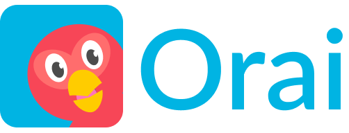</td>
  </tr>
  <tr>
    <td rowspan="2"><b>Perfil</b></td>
    <td><b>Overview</b></td>
    <td>Aplicación web con IA que analiza y retroalimenta la comunicación oral de estudiantes universitarios peruanos en tiempo real, en español.</td>
    <td>App de pronunciación en inglés con IA que evalúa y corrige la pronunciación del usuario en tiempo real mediante reconocimiento de voz avanzado.</td>
    <td>App de coaching para hablar en público con lecciones estructuradas impartidas por coaches reales y ejercicios de práctica.</td>
    <td>App móvil con IA que analiza la oratoria del usuario (ritmo, palabras de relleno, energía, expresión facial) y entrega retroalimentación inmediata y lecciones personalizadas.</td>
  </tr>
  <tr>
    <td><b>Ventaja competitiva ¿Qué valor ofrece a los clientes?</b></td>
    <td>Feedback en tiempo real en español con contexto académico peruano; enfocado en universitarios latinoamericanos.</td>
    <td>Motor de IA especializado en detección de errores fonéticos del inglés; más de 50M usuarios globales.</td>
    <td>Contenido creado por coaches profesionales de oratoria; estructura de cursos progresivos y micro-lecciones de 5 minutos.</td>
    <td>Análisis multimodal (voz + expresión facial) con plan de entrenamiento adaptativo; gamificación y seguimiento de progreso detallado.</td>
  </tr>
  <tr>
    <td rowspan="2"><b>Perfil de Marketing</b></td>
    <td><b>Mercado objetivo</b></td>
    <td>Estudiantes universitarios peruanos/latinoamericanos de ciclos 1-10.</td>
    <td>Hablantes no nativos de inglés que desean mejorar su pronunciación, principalmente en Asia y Latinoamérica.</td>
    <td>Profesionales y estudiantes angloparlantes que quieren mejorar su oratoria y liderazgo comunicacional.</td>
    <td>Profesionales, estudiantes y ejecutivos angloparlantes que necesitan mejorar presentaciones y discursos.</td>
  </tr>
  <tr>
    <td><b>Estrategias de Marketing</b></td>
    <td>Freemium, marketing universitario, referidos entre compañeros.</td>
    <td>Freemium, referidos, partnerships con instituciones educativas.</td>
    <td>Freemium, publicidad en LinkedIn y redes, membresías corporativas.</td>
    <td>Freemium con trial de 7 días, alianzas con instituciones educativas, plan Enterprise para equipos.</td>
  </tr>
  <tr>
    <td rowspan="3"><b>Perfil de Producto</b></td>
    <td><b>Productos &amp; Servicios</b></td>
    <td>Aplicación web con análisis de voz, ejercicios guiados, simulador de entrevistas y dashboard de progreso.</td>
    <td>App móvil (iOS/Android) con lecciones de pronunciación, conversación simulada y análisis fonético detallado.</td>
    <td>App móvil con cursos de oratoria, ejercicios diarios de 5 minutos y biblioteca de habilidades comunicacionales.</td>
    <td>App móvil (iOS/Android) con análisis de voz e imagen, lecciones gamificadas, historial de práctica y plan personalizado de 4 semanas.</td>
  </tr>
  <tr>
    <td><b>Precios y Costos</b></td>
    <td>Freemium; plan premium S/. 15-25/mes.</td>
    <td>Gratis con funciones limitadas; premium desde $6.99/mes.</td>
    <td>Gratis con funciones básicas; premium desde $9.99/mes.</td>
    <td>Gratis con funciones básicas; premium desde $9.99/mes o $39.99/año.</td>
  </tr>
  <tr>
    <td><b>Canales de distribución</b></td>
    <td>Sitio web (talki.com), compatible con navegadores modernos (Chrome, Edge, Safari, Firefox).</td>
    <td>App Store, Google Play, web.</td>
    <td>App Store, Google Play.</td>
    <td>App Store, Google Play.</td>
  </tr>
  <tr>
    <td rowspan="4"><b>Análisis SWOT</b></td>
    <td><b>Fortalezas</b></td>
    <td>Español nativo, contexto universitario peruano, IA personalizada, gamificación.</td>
    <td>IA muy precisa, gran base de usuarios global, contenido extenso y probado.</td>
    <td>Contenido de alta calidad creado por expertos, formato de micro-lecciones atractivo.</td>
    <td>Análisis multimodal avanzado, plan adaptativo personalizado, gamificación efectiva, disponible en iOS y Android.</td>
  </tr>
  <tr>
    <td><b>Oportunidades</b></td>
    <td>Mercado latinoamericano poco atendido, alianzas con universidades, expansión a otros países.</td>
    <td>Expansión a otros idiomas, mercado B2B con instituciones educativas.</td>
    <td>Mercado B2B corporativo, expansión a español y otros idiomas.</td>
    <td>Expansión a idiomas distintos del inglés, mercado educativo universitario latinoamericano sin atender.</td>
  </tr>
  <tr>
    <td><b>Debilidades</b></td>
    <td>Startup nueva sin track record, recursos limitados, marca poco conocida.</td>
    <td>Enfocado solo en pronunciación del inglés, no cubre comunicación oral en español.</td>
    <td>Sin IA para feedback en tiempo real, contenido exclusivamente en inglés.</td>
    <td>Solo disponible en inglés, sin adaptación al contexto académico ni latinoamericano.</td>
  </tr>
  <tr>
    <td><b>Amenazas</b></td>
    <td>Entrada de apps internacionales al mercado hispanohablante, competidores con mayor financiamiento.</td>
    <td>Competidores con IA generativa más avanzada, apps multiidioma con mayor alcance.</td>
    <td>Apps con IA generativa que ofrecen feedback personalizado, saturación del mercado edtech.</td>
    <td>Saturación del mercado edtech en inglés, nuevos competidores con IA generativa más potente.</td>
  </tr>
</table>

### 2.1.2. Estrategias y tácticas frente a competidores

A partir del análisis competitivo, Thropic adopta las siguientes estrategias para posicionar Talki en el mercado:

**Frente a ELSA Speak:**
ELSA Speak domina el mercado de pronunciación en inglés pero no atiende la comunicación oral en español ni el contexto académico latinoamericano. Talki se diferencia enfocándose exclusivamente en español con contexto universitario peruano, ofreciendo ejercicios de exposición académica y simulación de sustentaciones que ELSA no contempla.

**Frente a Speeko:**
Speeko utiliza contenido pregrabado por coaches sin feedback personalizado en tiempo real. Talki responde con IA generativa que analiza el discurso del usuario en el momento y entrega retroalimentación específica e inmediata, no guiones estáticos. Además, Speeko no tiene presencia en el mercado hispanohablante, lo que representa una ventana de oportunidad directa.

**Frente a Orai:**
Orai ofrece análisis de oratoria con IA de manera similar a Talki, pero opera exclusivamente en inglés y sin ninguna adaptación al contexto académico latinoamericano. Talki capitaliza esta brecha ofreciendo la misma profundidad de análisis (ritmo, fluidez, claridad) pero en español, con ejercicios diseñados para sustentaciones, exposiciones universitarias y entrevistas de prácticas preprofesionales típicas del sistema educativo peruano.

**Estrategia de diferenciación general:**

- *Localización:* Único producto diseñado para el contexto universitario peruano/latinoamericano en español
- *Precio accesible:* Modelo freemium con plan premium a S/. 15-25/mes, muy por debajo de los competidores internacionales
- *Alianzas universitarias:* Partnerships con facultades de Ingeniería y Comunicaciones de universidades peruanas para adopción institucional
- *Gamificación contextual:* Sistema de logros y streaks adaptado a los ciclos académicos peruanos (exposiciones, sustentaciones, entrevistas de prácticas)

## 2.2. Entrevistas

### 2.2.1. Diseño de entrevistas

El objetivo de las entrevistas es comprender las necesidades, frustraciones y hábitos de comunicación oral de los segmentos objetivo de Talki, así como su disposición a usar herramientas digitales para mejorar sus habilidades comunicativas.

---

**Segmento 1: Estudiantes universitarios de ciclos 1 al 5**

*Objetivos específicos:*
- Conocer cómo viven los primeros encuentros con exposiciones y presentaciones en la universidad.
- Identificar las inseguridades comunicativas más frecuentes en etapas tempranas de la carrera.
- Entender qué estrategias de práctica emplean actualmente y cuáles consideran insuficientes.
- Evaluar su apertura a recibir retroalimentación automatizada de una IA.

*Preguntas introductorias:*
1. ¿En qué universidad estudias, qué carrera sigues y en qué ciclo te encuentras?
2. ¿Con qué frecuencia tienes que hacer exposiciones, sustentaciones o participaciones orales en clases?

*Preguntas principales:*

3. ¿Cómo fue tu primera exposición en la universidad? ¿Qué recuerdas de esa experiencia?
4. ¿Qué aspectos de tu comunicación oral sientes que más necesitas trabajar en este punto de tu carrera? (nerviosismo, muletillas, fluidez, volumen, etc.)
5. ¿Cómo te preparas actualmente cuando tienes que exponer? ¿Cuánto tiempo le dedicas?
6. ¿Alguna vez tu desempeño oral no reflejó lo que realmente sabías del tema? ¿Qué ocurrió?
7. ¿Has usado alguna app o herramienta digital para mejorar tu forma de hablar o exponer? ¿Cómo fue?
8. ¿Te grabarías en video o audio para escucharte y corregirte? ¿Por qué sí o por qué no?
9. ¿Qué tan cómodo(a) te sentirías recibiendo retroalimentación de una IA sobre tu forma de hablar?
10. ¿Estarías dispuesto(a) a pagar por una app así? ¿Qué precio te parecería justo?

---

**Segmento 2: Estudiantes universitarios de ciclos 6 al 10**

*Objetivos específicos:*
- Entender cómo evolucionan las exigencias de comunicación oral en ciclos avanzados.
- Identificar si la preparación para prácticas preprofesionales o entrevistas laborales genera nuevas necesidades comunicativas.
- Conocer su nivel de autonomía para practicar y mejorar su oratoria.
- Determinar su disposición a adoptar una herramienta de IA especializada en comunicación académica y profesional.

*Preguntas introductorias:*
1. ¿En qué universidad estudias, qué carrera sigues y en qué ciclo te encuentras?
2. ¿Qué tipos de evaluaciones orales has tenido que enfrentar en los últimos ciclos? (sustentaciones, jurados, entrevistas de prácticas, etc.)

*Preguntas principales:*

3. Comparando tus primeros ciclos con ahora, ¿sientes que tu comunicación oral ha mejorado? ¿Qué crees que la cambió?
4. ¿Cuáles son los escenarios orales que todavía te generan más estrés o inseguridad?
5. ¿Cómo te preparas hoy para una sustentación importante o una entrevista de prácticas?
6. ¿Has sentido que tu forma de comunicarte oralmente te ha jugado en contra en alguna evaluación o proceso de selección? Cuéntame.
7. ¿Has probado alguna herramienta digital para practicar presentaciones o entrevistas? ¿Qué te pareció?
8. ¿Qué tipo de análisis de tu comunicación te resultaría más valioso: fluidez, claridad de ideas, manejo de silencios, muletillas, otro?
9. ¿Qué tan útil sería para ti una app con IA que simule sustentaciones o entrevistas de prácticas y te dé retroalimentación detallada?
10. ¿Usarías este tipo de herramienta de forma autónoma o preferirías poder compartir los resultados con un profesor o tutor?

### 2.2.2. Registro de entrevistas

La ficha conserva las capturas, enlaces y tiempos publicados. Los enlaces identifican la carpeta de evidencias; falta identificar el archivo exacto de cada entrevista. Los intervalos de Isabel y Juan Alejandro se solapan en el registro actual y requieren comprobación contra la grabación antes de usarlos como tiempos definitivos. La edad, el distrito y los apellidos indicados como pendientes requieren confirmación con los entrevistados; no se deducen a partir de su universidad o ciclo.

**Segmento #1: Estudiantes universitarios de ciclos 1 al 5**

| Número de entrevista | Datos del entrevistado | Evidencia de entrevista |
|---|---|---|
| 1 | **Nombre:** Belén Ordoñez   **Edad:** Pendiente de confirmar   **Distrito:** Pendiente de confirmar   **Universidad:** PUCP   **Ciclo:** 5to   **Carrera:** Comunicación para el Desarrollo    **Resumen:** Estudiante de quinto ciclo en la PUCP cuya carrera gira en torno a presentaciones orales: la mayoría de sus evaluaciones son exposiciones de proyectos. Recuerda haberse puesto nerviosa en su primera exposición universitaria. Su principal problema es que el volumen de su voz va disminuyendo conforme avanza en la presentación. Ha sufrido "black outs" durante exposiciones, terminando sin recordar lo que dijo. No conocía la existencia de herramientas digitales para mejorar la oratoria. Actualmente pide a amigos que la escuchen antes de exponer. Se sentiría más cómoda recibiendo retroalimentación de una IA por su mayor honestidad y franqueza. Estaría dispuesta a pagar entre 2 y 5 dólares mensuales por una app que realmente funcione. |  [📂 Ver entrevista](https://drive.google.com/drive/folders/1IwH1aTzPJ2Y5cYJS3yqF8UM4eHfprvLE?usp=sharing)   `00:00:00 a 00:06:12` |
| 2 | **Nombre:** Isabel Rodriguez   **Edad:** Pendiente de confirmar   **Distrito:** Pendiente de confirmar   **Universidad:** Universidad de Lima   **Ciclo:** 5to   **Carrera:** Arquitectura    **Resumen:** Isabel estudia Arquitectura en la Universidad de Lima y tiene exposiciones prácticamente todas las semanas, especialmente resúmenes de talleres los viernes. Su primera experiencia expositiva fue buena en general, aunque reconoce que hubiera sido mejor con más dominio del curso. Los puntos que más necesita trabajar son el nerviosismo y la ampliación de vocabulario, pues tiende a repetir siempre las mismas palabras. Se prepara con una bitácora personal y revisando sus diapositivas el día anterior. Usa ChatGPT para preparar contenido, aunque de forma general. Olvida información relevante por el apuro de terminar la exposición rápido. Le parece muy interesante recibir retroalimentación de una IA por el ahorro de tiempo. Estaría dispuesta a pagar hasta 5 dólares mensuales, aunque querría comparar precios antes de decidir. |  [📂 Ver entrevista](https://drive.google.com/drive/folders/1IwH1aTzPJ2Y5cYJS3yqF8UM4eHfprvLE?usp=sharing)   `00:06:13 a 00:13:29` |
| 3 | **Nombre:** Juan Alejandro Elías López   **Edad:** Pendiente de confirmar   **Distrito:** Pendiente de confirmar   **Universidad:** UPC   **Ciclo:** 4to   **Carrera:** Ingeniería de Software    **Resumen:** Juan Alejandro ya tenía experiencia en exposiciones desde la secundaria, por lo que su primera presentación universitaria no le generó nerviosismo. Considera que exponer es divertido. El aspecto que más necesita mejorar es la fluidez, especialmente en exposiciones finales de alta importancia donde el nerviosismo sí lo afecta. Se prepara escribiendo su guión a mano y memorizándolo en partes a lo largo de varios días, dedicando aproximadamente 2 horas diarias. Nunca ha sentido que una exposición no reflejara lo que sabía. No ha usado herramientas digitales para mejorar su oratoria. Estaría dispuesto a grabarse como nueva forma de práctica autónoma. Estaría abierto tanto a retroalimentación de IA como de un tutor humano, y el precio que pagaría dependería de las funcionalidades concretas que ofrezca la aplicación. |  [📂 Ver entrevista](https://drive.google.com/drive/folders/1IwH1aTzPJ2Y5cYJS3yqF8UM4eHfprvLE?usp=sharing)   `00:12:30 a 00:19:18` |

**Segmento #2: Estudiantes universitarios de ciclos 6 al 10**

| Número de entrevista | Datos del entrevistado | Evidencia de entrevista |
|---|---|---|
| 4 | **Nombre:** Gian Guerra   **Edad:** Pendiente de confirmar   **Distrito:** Surco   **Universidad:** University of the People (EE.UU., modalidad remota)   **Ciclo:** 6to   **Carrera:** Computer Science    **Resumen:** Gian Guerra estudia de forma remota en una universidad estadounidense y tiene una trayectoria oral variada: monografías, proyectos de software, debates, simulaciones de entrevistas y entrevistas reales de trabajo. Reconoce una mejora enorme desde sus inicios, impulsada principalmente por la experiencia laboral. Antes hablaba muy rápido y usaba muletillas constantemente. Hoy la presión aparece principalmente al presentar ante jefes o personas con mayor jerarquía. Se prepara con "chuletillas", guías de oratoria y autograbaciones para identificar puntos débiles. Vivió en carne propia cómo la mala comunicación le jugó en contra en una entrevista con una empresa española en inglés. Ha probado la herramienta "Speak", pero le falta feedback de contenido y manejo de silencios. Los análisis que más le aportarían son el manejo de silencios y la variedad de vocabulario. Ve una app con IA para simular sustentaciones y entrevistas como extremadamente útil, y prefiere un modelo híbrido con checkpoints periódicos con un tutor. |  [📂 Ver entrevista](https://drive.google.com/drive/folders/1IwH1aTzPJ2Y5cYJS3yqF8UM4eHfprvLE?usp=sharing)   `00:19:19 a 00:31:47` |
| 5 | **Nombre:** Jennifer Bazan   **Edad:** Pendiente de confirmar   **Distrito:** El Agustino   **Universidad:** Universidad Privada del Norte   **Ciclo:** 7mo   **Carrera:** Administración y Marketing    **Resumen:** Jennifer Bazan ha enfrentado sustentaciones de trabajos, exposiciones de proyectos, entrevistas y presentaciones ante jurados a lo largo de su carrera. Reconoce que su comunicación oral ha mejorado notablemente gracias a la práctica constante: en los primeros ciclos le costaba organizar sus ideas y se ponía nerviosa, hoy habla con mayor claridad y seguridad. Los escenarios que aún le generan estrés son las presentaciones ante un jurado y las entrevistas de prácticas, donde siente una evaluación más directa. Se prepara investigando el tema, organizando ideas, practicando frente al espejo o grabándose, y anticipando posibles preguntas. Ha vivido situaciones donde los nervios le hicieron olvidar ideas clave, afectando la claridad de su mensaje. No ha usado aplicaciones especializadas; solo grabaciones básicas con el celular o Zoom. El análisis que considera más valioso es el de fluidez y claridad de ideas. Ve muy útil una app con IA para practicar en un entorno realista con retroalimentación específica. Prefiere un uso híbrido: práctica autónoma combinada con orientación de un tutor o profesor. | 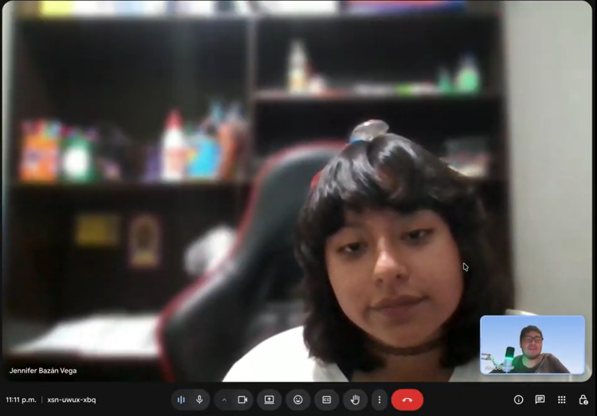 [📂 Ver entrevista](https://drive.google.com/drive/folders/1IwH1aTzPJ2Y5cYJS3yqF8UM4eHfprvLE?usp=sharing)   `00:31:47 a 00:39:18` |
| 6 | **Nombre:** Jorge Sinyun González   **Edad:** Pendiente de confirmar   **Distrito:** Pendiente de confirmar   **Universidad:** Universidad Peruana de Ciencias Aplicadas (UPC)   **Ciclo:** 7mo a 8vo   **Carrera:** Ingeniería de Software    **Resumen:** Jorge identifica las presentaciones ante audiencias o profesores como su mayor dificultad, ya que la inseguridad al cometer errores y los nervios visibles pueden afectar directamente su nota. Siente que su comunicación ha mejorado en la medida que domina mejor los temas del curso, pero como habilidad pura de oratoria el avance ha sido leve. Se prepara revisando los requerimientos, tomando notas de apoyo y usando NotebookLM para generar preguntas y practicar respuestas. Tuvo un caso negativo en el curso de Agile Frameworks, donde tuvo que mirar constantemente las diapositivas por no dominar el flujo del tema, algo que el profesor notó y comentó. Practica hablando solo frente a la presentación o usando el método del espejo, y ha buscado apps de práctica de lenguaje sin encontrar una específica para oratoria. El análisis que considera más valioso es el de claridad de ideas, porque evidencia dominio del tema ante la audiencia. Ve la app con IA como extremadamente útil, especialmente si permite cargar el material propio para detectar puntos débiles de contenido y vocalización. Prefiere el modo autónomo por privacidad y comodidad, aunque reconoce el valor del feedback docente. |  [📂 Ver entrevista](https://drive.google.com/drive/folders/1IwH1aTzPJ2Y5cYJS3yqF8UM4eHfprvLE?usp=sharing)   `00:39:18 a 00:47:18` |

### 2.2.3. Análisis de entrevistas

---

**Segmento #1: Estudiantes universitarios de ciclos iniciales (1ro al 5to ciclo)**

---

**Belén Ordoñez (PUCP, 5to ciclo)**

Estudia Comunicación para el Desarrollo en la PUCP y se encuentra en quinto ciclo. Las presentaciones son muy frecuentes en su carrera: la mayoría de las evaluaciones son exposiciones de proyectos, ya que hay pocos exámenes escritos. Recuerda haberse puesto nerviosa en su primera exposición universitaria. Su principal problema es que el volumen de su voz va bajando a medida que avanza la presentación, al punto de que ya no la escuchan. Se prepara intentando dominar el contenido del tema, aunque reconoce que hay cosas "fuera de su control". Ha experimentado "black outs" durante exposiciones: termina sin recordar lo que dijo, y solo después nota lo que le faltó. No conocía la existencia de aplicaciones para mejorar la oratoria. Le gustaría grabarse, aunque le cuesta escuchar su propia voz; actualmente pide a amigos que la escuchen y le den feedback. Se sentiría más cómoda recibiendo retroalimentación de una IA que de una persona, porque considera que la IA es más directa y honesta. Estaría dispuesta a usar una aplicación de pago entre 2 y 5 dólares mensuales, siempre que sea realmente buena.

**Puntos clave:**
- Exposiciones muy frecuentes (evaluación principal en su carrera).
- Mayor problema: **volumen de voz que decrece** durante la presentación.
- Ha sufrido **"black outs"** en exposiciones por los nervios y la adrenalina.
- **No conocía** herramientas digitales para mejorar la oratoria.
- Pide feedback a amigos; le cuesta escucharse o verse grabada.
- Prefiere retroalimentación de **IA sobre personas** por mayor honestidad.
- Dispuesta a pagar entre **2 y 5 dólares mensuales** si la app cumple.

---

**Isabel Rodriguez (Arquitectura, U. de Lima, 5to ciclo)**

Estudia arquitectura en la Universidad de Lima y está en quinto ciclo. Tiene exposiciones prácticamente todas las semanas, especialmente los viernes, con resúmenes de cursos de taller. Su primera experiencia fue buena en términos generales, aunque reconoce que hubiera sido mejor con mayor conocimiento del curso. Los aspectos que más necesita trabajar son el nerviosismo y la ampliación de vocabulario, ya que tiende a usar siempre las mismas palabras. Se prepara leyendo sus diapositivas y notas de una bitácora personal el día anterior y momentos antes de la clase. Usa IA generativa (ChatGPT) para preparar su contenido, aunque con ideas muy generales. Siente que a veces olvida información relevante que no puso en las láminas por el apuro de terminar rápido. Estaría dispuesta a grabarse para autocorregirse. Le parece interesante recibir retroalimentación de una IA, especialmente porque le ahorraría tiempo, algo valioso dada su carga académica. Estaría dispuesta a pagar por la aplicación, en especial si la ayuda a prepararse para algo importante. Sugiere un precio máximo de 5 dólares mensuales, aunque querría compararlo con otras opciones antes.

**Puntos clave:**
- Exposiciones **semanales**, especialmente en talleres.
- Necesita mejorar **nerviosismo y vocabulario** (tiende a repetir palabras).
- Se prepara con **bitácora personal y diapositivas** el día anterior.
- Usa **ChatGPT** para preparar contenido, pero de forma general.
- Olvida información relevante por el **apuro de terminar** la exposición.
- Valoraría una app de IA que **ahorre tiempo** dada su alta carga académica.
- Precio aceptable: hasta **5 dólares mensuales**.

---

**Juan Alejandro Elías López (Ing. Software, UPC, 4to ciclo)**

Estudia Ingeniería de Software en la UPC y está en cuarto ciclo. Ya venía con experiencia de exposiciones desde la secundaria, por lo que su primera presentación universitaria no fue especialmente nerviosa. Considera que sus exposiciones son divertidas. El aspecto en el que siente que más necesita mejorar es la fluidez, especialmente en exposiciones finales de alta importancia, donde el nerviosismo lo afecta. Se prepara escribiendo su guión a mano, memorizándolo en partes durante varios días, dedicando alrededor de 2 horas diarias. Nunca ha sentido que una exposición no reflejara lo que sabía, ya que siempre memorizaba sus puntos. Nunca ha usado herramientas digitales para mejorar su oratoria. Estaría dispuesto a grabarse para practicar de forma autónoma como algo nuevo a probar. Le gustaría tanto retroalimentación de una IA como de un profesor particular, sin descartar ninguna opción. El precio que pagaría dependería de las funcionalidades que ofrezca la aplicación.

**Puntos clave:**
- Experiencia previa en exposiciones desde secundaria; **no experimenta nerviosismo intenso**.
- Principal área de mejora: **fluidez** en exposiciones de alta importancia.
- Método de preparación: **guión escrito a mano y memorización** en partes (2 horas/día).
- **No ha usado** herramientas digitales de práctica oral.
- Abierto a grabarse como **método de práctica autónoma**.
- Prefiere retroalimentación **híbrida**: IA y tutor humano.
- El precio depende de las **funcionalidades ofrecidas**.

---

**Segmento #2: Estudiantes universitarios de ciclos avanzados (6to al 10mo ciclo)**

**Gian Guerra (Computer Science, University of the People EE.UU., 6to ciclo)**

Estudiante peruano radicado en Lima que cursa Computer Science de forma remota en una universidad estadounidense (University of the People), se encuentra en sexto ciclo. Aunque su universidad es extranjera, se incluye en el estudio porque representa el caso de universitarios peruanos que complementan su formación local con programas internacionales 100% online y que enfrentan retos adicionales de comunicación oral en contextos bilingües, un perfil cada vez más frecuente en el mercado laboral tecnológico peruano. Ha tenido evaluaciones orales variadas: monografías, proyectos de software, debates y simulaciones de entrevistas, además de entrevistas reales de trabajo. Reconoce que su comunicación oral ha mejorado enormemente desde sus inicios universitarios, principalmente gracias al mundo laboral. Antes hablaba muy rápido, llenaba los silencios y usaba muletillas constantemente. Actualmente, los escenarios que aún le generan presión son las presentaciones ante jefes o personas con mayor jerarquía. Se prepara haciendo "chuletillas" (resúmenes de ideas principales), consultando guías de oratoria y grabándose para identificar sus puntos débiles. Ha reconocido que la mala comunicación le jugó en contra en sus primeras entrevistas de trabajo, especialmente una con una empresa española en inglés. Ha probado la herramienta digital "Speak", que le da feedback sobre pronunciación, entonación y relación de palabras, aunque no sobre contenido ni manejo de silencios. Considera que lo más valioso sería una app que analice silencios y variedad de vocabulario, dos de sus puntos más débiles. Ve una aplicación con IA para simular sustentaciones y entrevistas como "extremadamente útil", con feedback sobre gestos, pronunciación, muletillas y claridad de ideas. Prefiere un esquema híbrido: IA autónoma con checkpoints periódicos con un tutor humano.

**Puntos clave:**
- Experiencia amplia: debates, proyectos, simulaciones y **entrevistas reales de trabajo**.
- Ha mejorado mucho gracias a la **práctica laboral**; antes hablaba muy rápido y usaba muchas muletillas.
- Siente presión al presentar ante **personas con mayor jerarquía**.
- Se prepara con **chuletillas, guías de oratoria y autograbaciones**.
- La mala comunicación le costó oportunidades laborales, especialmente en **inglés**.
- Ha usado **"Speak"**, pero le falta feedback de contenido y manejo de silencios.
- Necesita mejorar **manejo de silencios y variedad de vocabulario**.
- Ve la app con IA como **extremadamente útil**; prefiere modelo **híbrido** (IA + tutor).

**Jennifer Bazan (Administración y Marketing, Universidad Privada del Norte, 7mo ciclo)**

Estudia Administración y Marketing en la Universidad Privada del Norte y se encuentra en séptimo ciclo. Ha enfrentado sustentaciones de trabajos, exposiciones de proyectos, entrevistas y presentaciones ante jurados. Reconoce que su comunicación oral ha mejorado bastante desde los primeros ciclos, cuando le costaba organizar sus ideas y se ponía nerviosa. La práctica constante le ha dado mayor claridad y seguridad. Los escenarios que aún le generan estrés son las presentaciones ante un jurado y las entrevistas de prácticas, donde siente una presión y evaluación más directa. Se prepara investigando bien el tema, organizando ideas, practicando frente al espejo o grabándose, y anticipando posibles preguntas. Ha experimentado que los nervios le han hecho olvidar ideas en momentos clave, afectando la claridad de su mensaje. No ha usado aplicaciones especializadas; solo se ha grabado con el celular o por Zoom. El análisis que considera más valioso es el de fluidez y claridad de ideas, como aspectos clave para mejorar su comunicación. Ve muy útil una app con IA que simule sustentaciones y entrevistas con retroalimentación específica, porque le permitiría practicar en un entorno más realista. Le gustaría utilizarla tanto de forma autónoma como compartiendo resultados con un tutor o profesor para recibir orientación adicional.

**Puntos clave:**
- Ha mejorado desde los primeros ciclos gracias a la **práctica constante**.
- Siente más presión en **jurados y entrevistas de prácticas**.
- Se prepara con investigación, espejo, grabaciones y **anticipación de preguntas**.
- Los nervios le han causado **olvidos** que afectaron la claridad del mensaje.
- No ha usado **apps especializadas**; solo grabaciones básicas.
- Análisis más valioso: **fluidez y claridad de ideas**.
- Ve la app como muy útil para practicar en un **entorno realista**.
- Prefiere uso **híbrido**: autónomo + compartir resultados con tutor.

---

**Jorge Sinyun González (Ing. Software, UPC, 7mo-8vo ciclo)**

Estudia Ingeniería de Software en la UPC y se encuentra entre el séptimo y octavo ciclo. Lo que más le ha costado a lo largo de su carrera son las presentaciones ante una audiencia o profesor, por la inseguridad al cometer errores y porque los nervios visibles pueden afectar la nota. Siente que su comunicación ha mejorado en la medida en que ha ganado confianza y dominio de los temas del curso, aunque como habilidad pura de oratoria el avance ha sido leve. Se prepara revisando los requerimientos de la entrevista, tomando notas de apoyo, y usando herramientas como NotebookLM para generar preguntas y practicar respuestas. Ha tenido un caso negativo en el curso de Agile Frameworks, donde tuvo que mirar constantemente las diapositivas por no dominar bien el flujo del tema, lo que fue notado por el profesor. Practica hablando solo viendo la presentación, usando el método del espejo o buscando aplicaciones de práctica de lenguaje, aunque no ha encontrado una que se enfoque en oratoria específicamente. Considera que el análisis más valioso es el de claridad de ideas, porque demuestra dominio del tema ante la audiencia. Ve una app con IA para simular sustentaciones y entrevistas como "extremadamente útil", especialmente si permite cargar el material propio para detectar puntos débiles de contenido y vocalización. Prefiere una herramienta autónoma por la privacidad y comodidad, aunque reconoce que el feedback del profesor ofrece orientación más alineada al curso.

**Puntos clave:**
- Mayor dificultad: **inseguridad y nervios visibles** ante audiencias y profesores.
- La mejora ha venido del **conocimiento del tema**, no de la habilidad oral en sí.
- Se prepara con **notas, NotebookLM** y práctica de preguntas y respuestas.
- Caso negativo en **Agile Frameworks** por no dominar el flujo del contenido.
- Practica con el espejo, hablando solo o buscando apps de lenguaje, sin encontrar algo específico de **oratoria**.
- Análisis más valioso: **claridad de ideas**.
- App con IA sería "**extremadamente útil**", especialmente si permite cargar contenido propio.
- Prefiere modo **autónomo** por privacidad, aunque valora el feedback docente.

---

**Síntesis de hallazgos por segmento**

La matriz siguiente resume lo relatado en las fichas de 2.2.2 y en el análisis individual. “No consta” indica ausencia de evidencia en ese registro; no equivale a una respuesta negativa. Los conteos se limitan a tres entrevistados por segmento y no representan a toda la población universitaria.

| Entrevistado | Dificultad o necesidad relatada | Preparación con grabación | Uso digital relatado | Relación esperada con el feedback de IA |
| --- | --- | --- | --- | --- |
| Belén Ordoñez, S1 | Pérdida de volumen y olvidos durante exposiciones. | Disposición a probarla, con incomodidad al escucharse. | No conocía aplicaciones de oratoria. | Prefiere feedback directo; percibe la IA como más honesta. |
| Isabel Rodriguez, S1 | Nerviosismo, vocabulario repetitivo y apuro. | Disposición a grabarse para autocorregirse. | ChatGPT para preparar contenido. | Valora el posible ahorro de tiempo. |
| Juan Alejandro Elías López, S1 | Fluidez en exposiciones de alta importancia. | Disposición a probarla. | No ha usado herramientas de práctica oral. | Acepta IA y tutor humano; precio sujeto a funciones. |
| Gian Guerra, S2 | Silencios, vocabulario y presión ante jerarquías. | Se graba para reconocer dificultades. | Speak para pronunciación y entonación. | Simulación útil con checkpoints de tutor. |
| Jennifer Bazan, S2 | Claridad y fluidez bajo presión de jurados. | Grabaciones con celular/Zoom. | No ha usado una aplicación especializada. | Práctica autónoma y orientación adicional de tutor. |
| Jorge Sinyun González, S2 | Claridad del contenido e inseguridad ante audiencia. | No consta grabación; ensaya frente al espejo y las diapositivas. | NotebookLM para preguntas y preparación. | Prefiere autonomía por privacidad; reconoce valor del docente. |

| Hallazgo operativo | Segmento 1, n=3 | Segmento 2, n=3 | Interpretación de diseño |
| --- | --- | --- | --- |
| Acepta o valora feedback de IA, sin medir su eficacia. | 3/3 (100 %): Belén, Isabel y Juan Alejandro. | 3/3 (100 %): Gian, Jennifer y Jorge. | Probar recomendaciones comprensibles; no asumir imparcialidad ni mejora demostrada. |
| Usa herramientas digitales de preparación o práctica. | 1/3 (33,3 %): Isabel. | 2/3 (66,7 %): Gian y Jorge. | Facilitar inicio guiado y ofrecer escenarios de mayor detalle. Las grabadoras de Jennifer se registran aparte para no confundir aplicaciones especializadas con captura. |
| Usa grabaciones para prepararse. | 0/3 (0 %): no se documenta un hábito actual; los tres muestran disposición. | 2/3 (66,7 %): Gian y Jennifer; en Jorge no consta. | Diferenciar disposición declarada de comportamiento observado. Ofrecer audio y consentimiento claros. |
| Está dispuesto a probar grabación o ya la utiliza. | 3/3 (100 %): Belén, Isabel y Juan Alejandro. | 2/3 (66,7 %): Gian y Jennifer; en Jorge no consta. | Cinco casos sustentan la hipótesis de práctica autónoma; no se atribuye el sexto por practicar frente al espejo. |
| Expresa interés en combinar IA y tutor. | 1/3 (33,3 %): Juan Alejandro. | 2/3 (66,7 %): Gian y Jennifer. | Compartición opcional y controlada; Jorge prioriza autonomía, sin rechazar orientación docente. |
| Declara un precio numérico de referencia. | 2/3 (66,7 %): Belén, USD 2–5; Isabel, hasta USD 5. | 0/3 (0 %): no consta monto en las fichas. | El precio debe investigarse; no concluir que el segmento avanzado pagará más. |

**Diferencias relevantes para el diseño**

En el primer segmento, el ensayo guiado debe ayudar a ordenar el discurso y revisar aspectos concretos como volumen, fluidez y repetición de palabras. En el segundo, la propuesta debe permitir ensayar preguntas contextualizadas, revisar silencios y justificar argumentos. Los modos siguen disponibles para ambos segmentos; la etapa académica orienta las ayudas y no restringe funciones.

**Implicaciones y límites**

1. Las entrevistas sustentan necesidades de práctica y una aceptación inicial del feedback de IA; no validan el funcionamiento de Talki ni su eficacia para mejorar la comunicación.
2. La percepción de honestidad expresada por Belén es un hallazgo individual. No demuestra que un modelo de IA sea imparcial; el reporte debe presentar evidencia, limitaciones y dimensiones no evaluables.
3. Compartir con un tutor debe ser opcional, temporal y limitado al reporte autorizado. La preferencia de autonomía de Jorge exige conservar un recorrido privado completo.
4. Los montos de Belén e Isabel son referencias exploratorias en USD. El rango propuesto de S/ 15–25 se mantiene como hipótesis de negocio, pendiente de evaluar con precios explícitos y una muestra más amplia. No se usa una persona de diseño como evidencia de disposición a pagar.
5. Para validar la propuesta se observarán tareas de preparación, comprensión del feedback y control de acceso en ambos segmentos. No se atribuyen resultados de esas pruebas antes de realizarlas.

## 2.3. Needfinding

### 2.3.1. User Personas

Para comprender mejor las necesidades, motivaciones y comportamientos de los usuarios clave de Talki, se han desarrollado dos perfiles de usuario o personas representativas. Estos perfiles sintetizan características típicas, objetivos y retos de los segmentos principales, facilitando el diseño centrado en el usuario y la toma de decisiones estratégicas durante el desarrollo de la plataforma.

**Persona 1: Valeria Ríos, la Estudiante en Formación Oral**

Estudiante universitaria de 19 años, residente en Lima, Perú, cursando los ciclos 1 al 5 de una carrera con alta demanda de presentaciones orales. Valeria representa a los estudiantes de ciclos iniciales que enfrentan con frecuencia exposiciones como principal forma de evaluación, pero carecen de herramientas y métodos efectivos para practicar. Se considera responsable y esforzada, aunque algo insegura al hablar en público y en busca de mejorar de forma constante. Sus principales frustraciones son que su voz se apaga durante la exposición sin que ella lo note y los "black outs" provocados por los nervios. Valora recibir retroalimentación honesta y objetiva que le permita identificar errores (como la pérdida de volumen de voz o los olvidos por nervios) y mejorar progresivamente su desempeño, sin depender de terceros y a un costo accesible.

> *"Sé que voy a estar nerviosa, pero trato de estar lo más preparada posible."*

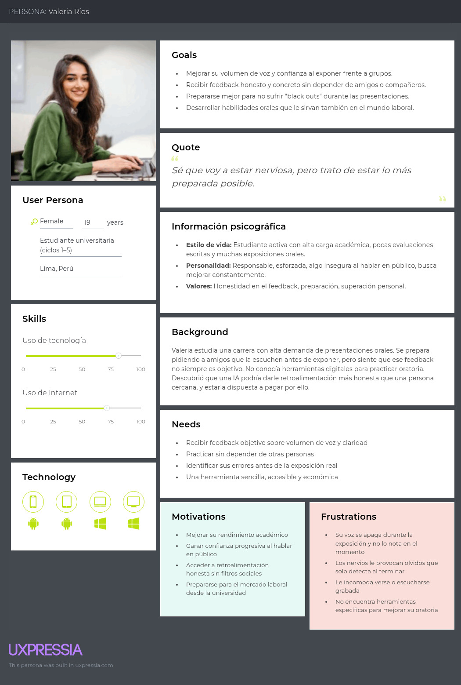

**Persona 2: Rodrigo Sánchez, el Estudiante Avanzado con Miras Profesionales**

Estudiante universitario de 23 años, residente en Lima, Perú, cursando los ciclos 6 al 10 de Ingeniería de Software con vida laboral activa. Rodrigo encarna a los estudiantes avanzados que, habiendo ganado experiencia académica y laboral, reconocen que la comunicación oral es un factor decisivo en su desarrollo profesional. Es analítico, proactivo y autodidacta; domina herramientas digitales como Speak y NotebookLM, pero ninguna cubre el feedback de oratoria que necesita (manejo de silencios, muletillas, claridad de ideas). Una mala entrevista en inglés con una empresa española le dejó claro que la comunicación oral es tan importante como el conocimiento técnico. Busca una solución específica que le brinde análisis detallado de su oratoria y le permita prepararse de forma autónoma para sustentaciones importantes y entrevistas de trabajo reales, con la opción de complementar la práctica autónoma con orientación periódica de un tutor.

> *"A medida que sube la complejidad, te das cuenta de que la preparación es algo fundamental."*

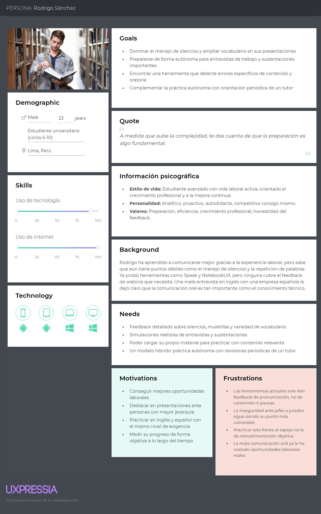

### 2.3.2. User Task Matrix

La matriz describe actividades de preparación oral que los estudiantes pueden realizar con o sin Talki. Las personas sintetizan las entrevistas de 2.2; la frecuencia se expresa según las situaciones relatadas y la importancia es una interpretación cualitativa de sus necesidades. No representa una medición estadística del segmento.

| Tarea del estudiante | Valeria: frecuencia relatada | Valeria: importancia interpretada | Rodrigo: frecuencia relatada | Rodrigo: importancia interpretada | Sustento en las entrevistas |
| --- | --- | --- | --- | --- | --- |
| Organizar ideas y escribir un guion o notas de apoyo. | Antes de exposiciones. | Alta. | Antes de sustentaciones y entrevistas. | Muy alta. | Juan Alejandro escribe su guion; Isabel utiliza una bitácora; Gian Guerra y Jorge preparan notas. |
| Ensayar en voz alta frente al espejo o las diapositivas. | Frecuencia no cuantificada. | Alta. | Antes de presentaciones exigentes. | Muy alta. | Jennifer Bazan y Jorge describen el ensayo frente al espejo o la presentación. |
| Pedir a un compañero que escuche el ensayo y opine. | Antes de algunas exposiciones. | Muy alta. | Frecuencia no cuantificada. | Alta. | Belén pide a amigos que la escuchen; Jennifer Bazan valora la orientación de un tutor. |
| Grabarse y escuchar el ensayo para identificar dificultades. | Sin hábito confirmado; disposición a probarlo. | Alta. | Como preparación autónoma. | Alta. | Juan Alejandro expresa disposición a grabarse; Gian Guerra y Jennifer Bazan utilizan grabaciones. |
| Detectar repeticiones, silencios o dificultades de fluidez al repasar el discurso. | Frecuencia no cuantificada. | Alta. | Durante la preparación de presentaciones. | Muy alta. | Isabel identifica vocabulario repetido; Juan Alejandro señala fluidez; Gian Guerra quiere mejorar silencios. |
| Revisar el material y comprobar que explica las ideas principales. | Antes de exposiciones del curso. | Alta. | Antes de sustentaciones y presentaciones. | Muy alta. | Isabel revisa diapositivas; Jorge señala el dominio del contenido y la claridad de ideas. |
| Anticipar preguntas y preparar respuestas para entrevistas o jurados. | Sin experiencia laboral confirmada en el perfil. | Media. | Antes de entrevistas y sustentaciones. | Muy alta. | Jennifer Bazan anticipa preguntas; Jorge genera preguntas con NotebookLM; Gian Guerra relata entrevistas laborales. |
| Buscar consejos de oratoria y aplicarlos en un ensayo. | Frecuencia no cuantificada. | Alta. | Cuando identifica una dificultad. | Alta. | Gian Guerra consulta guías; los demás describen métodos propios y búsqueda de herramientas. |

Ambos perfiles necesitan ordenar sus ideas, ensayar y reconocer qué deben mejorar antes de una evaluación. En los ciclos iniciales predomina la seguridad para exponer y mantener fluidez; en los avanzados se añade la preparación de respuestas ante jurados o empleadores. Estas tareas justifican los escenarios de práctica y feedback del capítulo III y los recorridos de preparación, ensayo y revisión del capítulo VI.

### 2.3.3. Empathy Mapping

A continuación se presentan los mapas de empatía para los dos perfiles principales de usuarios de Talki: Valeria Ríos, estudiante universitaria de ciclos iniciales, y Rodrigo Sánchez, estudiante avanzado con experiencia laboral. Estos mapas permiten comprender en profundidad sus necesidades, pensamientos, sentimientos y comportamientos, facilitando un diseño centrado en el usuario.

**Segmento 1:**

El mapa de empatía de Valeria muestra que es una estudiante que enfrenta con frecuencia exposiciones orales como principal forma de evaluación, pero carece de métodos objetivos para practicar. Se siente frustrada porque los nervios le provocan olvidos y su voz se apaga durante las presentaciones, y no encuentra herramientas digitales específicas que la ayuden a mejorar de forma autónoma y accesible.

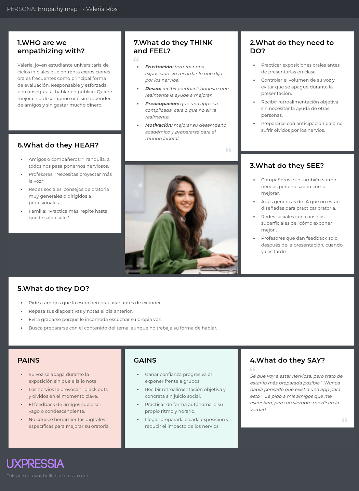

**Segmento 2:**

El mapa de empatía de Rodrigo refleja a un estudiante avanzado con clara conciencia de que la comunicación oral es decisiva para su desarrollo profesional. Busca una solución específica que vaya más allá de la pronunciación y le ofrezca análisis profundo de su oratoria, permitiéndole prepararse de forma autónoma para entrevistas de trabajo y sustentaciones importantes con feedback real y medible.

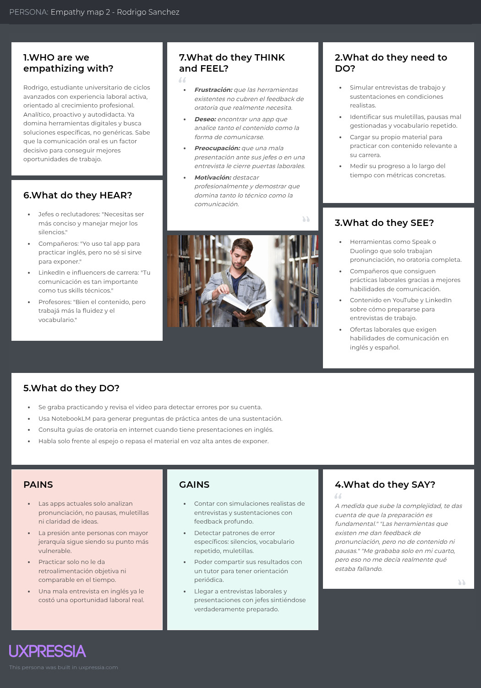

### 2.3.4. As-is Scenario Mapping

**Segmento 1**

Mediante este artefacto, se ha llevado a cabo la elaboración del As-is Scenario Mapping para el primer segmento. Este escenario refleja cómo los estudiantes universitarios que enfrentan exposiciones orales frecuentes se preparan actualmente para ellas, las dificultades que experimentan al no contar con herramientas objetivas de práctica, así como las emociones de ansiedad, frustración y resignación que acompañan cada etapa de su proceso expositivo.

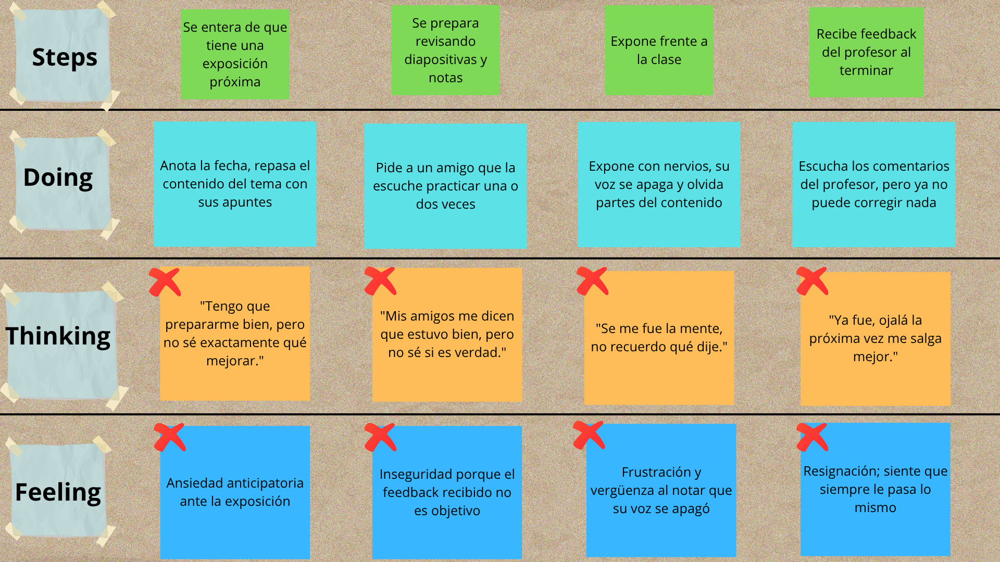

**Segmento 2**

Mediante este artefacto, se ha llevado a cabo la elaboración del As-is Scenario Mapping para el segundo segmento. Este escenario describe cómo los estudiantes de ciclos superiores con experiencia laboral se preparan hoy en día para sustentaciones importantes y entrevistas de trabajo, evidenciando las limitaciones de las herramientas digitales actuales, los métodos de práctica poco objetivos a los que recurren y la incertidumbre que sienten al no poder medir su progreso de forma concreta.

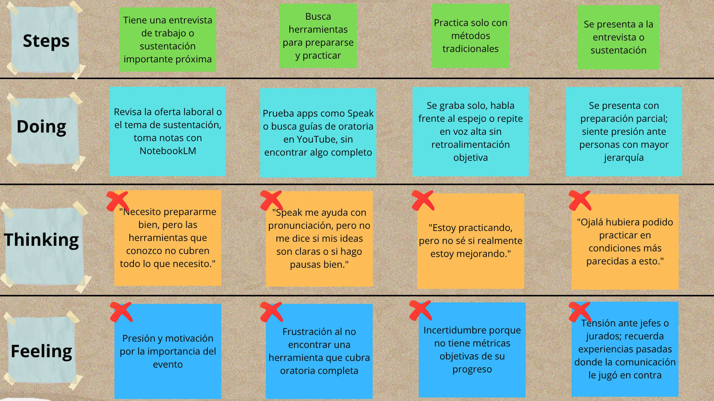

## 2.4. Ubiquitous Language

El lenguaje ubicuo (Ubiquitous Language) establece un vocabulario común y compartido entre el equipo de desarrollo, los stakeholders y los usuarios de Talki. Este glosario garantiza que todos los términos del dominio de la comunicación oral y del análisis de oratoria se comprendan e interpreten de forma consistente a lo largo de todo el informe, el modelo de dominio y la implementación de la solución.

| Término (EN / ES) | Descripción |
|---|---|
| **Speaker / Orador** | Estudiante universitario que utiliza Talki para practicar y mejorar su comunicación oral mediante exposiciones, sustentaciones o simulaciones de entrevistas. |
| **Practice Session / Sesión de Práctica** | Actividad en la que el orador se graba practicando una exposición, sustentación o entrevista, y sobre la cual Talki ejecuta el análisis de su oratoria. |
| **Live Coach / Coach en Vivo** | Componente de IA que acompaña al orador durante la sesión de práctica en tiempo real, entregando retroalimentación inmediata sobre su desempeño oral. |
| **Voice Coach Score / Puntuación del Coach de Voz** | Métrica integral, generada por Talki al finalizar una sesión, que resume el desempeño del orador en cinco dimensiones: fluidez, claridad, volumen, vocabulario y confianza. |
| **Fluency / Fluidez** | Dimensión que mide la continuidad y el ritmo del discurso del orador, penalizando las interrupciones, titubeos y pausas involuntarias. |
| **Clarity / Claridad** | Dimensión que evalúa qué tan comprensible y bien organizada es la exposición de las ideas del orador. |
| **Volume / Volumen** | Dimensión que analiza la intensidad y estabilidad de la voz del orador durante la sesión, detectando por ejemplo la pérdida de volumen hacia el final de la presentación. |
| **Vocabulary / Vocabulario** | Dimensión que mide la riqueza y variedad léxica del discurso, identificando la repetición excesiva de palabras. |
| **Confidence / Confianza** | Dimensión que estima la seguridad percibida del orador a partir de indicadores acústicos y de fluidez. |
| **Filler Word / Muletilla** | Palabra o sonido de relleno (por ejemplo, "eh", "este", "o sea") que el orador utiliza de forma involuntaria y que Talki detecta y contabiliza como oportunidad de mejora. |
| **Silence Management / Manejo de Silencios** | Habilidad del orador para gestionar las pausas y silencios de su discurso; Talki mide la proporción de silencios para identificar pausas excesivas o incómodas. |
| **Feedback / Retroalimentación** | Conjunto de observaciones y recomendaciones específicas y accionables que Talki entrega al orador tras analizar su sesión de práctica. |
| **Interview Simulation / Simulación de Entrevista** | Modo de práctica en el que Talki recrea una entrevista de trabajo o de prácticas preprofesionales para que el orador ensaye sus respuestas y reciba análisis de su oratoria. |
| **Thesis Defense / Sustentación** | Modo de práctica orientado a exposiciones y sustentaciones académicas de alta importancia frente a un jurado o profesor. |
| **Progress Dashboard / Panel de Progreso** | Vista que consolida el historial de sesiones del orador y la evolución de cada dimensión del Voice Coach Score a lo largo del tiempo. |
| **Gamification / Gamificación** | Conjunto de mecánicas (logros, streaks y niveles) que incentivan la práctica constante del orador, adaptadas al calendario académico universitario. |
| **Freemium** | Modelo de negocio de Talki que ofrece funcionalidades básicas de forma gratuita y funcionalidades avanzadas mediante un plan premium de pago (S/. 15-25 mensuales). |

# Capítulo III: Requirements Specification

## 3.1. To-Be Scenario Mapping

El *To-Be Scenario Mapping* representa la experiencia futura de los dos segmentos objetivo cuando incorporan Talki a su preparación académica y profesional. Los escenarios se construyen a partir de los hallazgos de las entrevistas: necesidad de practicar de manera autónoma, recibir retroalimentación objetiva, detectar muletillas, controlar volumen y silencios, cargar material propio y observar un progreso medible.

### Segmento 1: Valeria Ríos (estudiantes de ciclos 1 al 5)

Valeria debe preparar una exposición académica, pero no dispone de un profesor o compañero que pueda escuchar todos sus ensayos. Con Talki puede configurar una práctica guiada, ensayar en un espacio privado y obtener recomendaciones concretas antes de exponer.

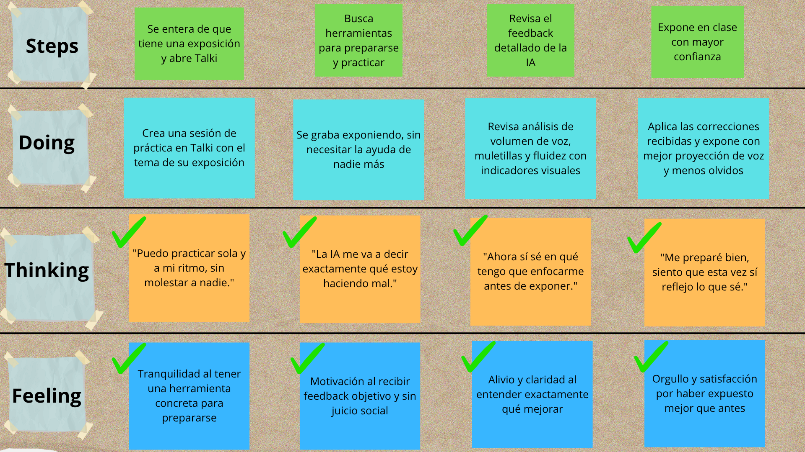

| Fase | Acciones del usuario | Respuesta de Talki | Pensamiento o emoción esperada | Oportunidad de diseño |
|---|---|---|---|---|
| Preparación | Registra la exposición, define duración y carga material de apoyo. | Recomienda un modo de práctica y criterios de evaluación adecuados al contexto académico. | “Sé exactamente qué voy a practicar.” | Configuración breve, lenguaje no técnico y plantillas por tipo de exposición. |
| Verificación | Prueba el micrófono, confirma el consentimiento y revisa que el entorno sea adecuado. | Ejecuta una prueba de audio y explica qué datos serán procesados. | Seguridad y control sobre su información. | Privacidad visible y prevención de sesiones inválidas por mala captura. |
| Práctica | Ensaya sin depender de otra persona. | Transcribe y analiza en tiempo cercano al real; ofrece señales discretas de ritmo, volumen y pausas. | Menor vergüenza y mayor concentración. | Retroalimentación útil sin interrumpir el discurso. |
| Reporte | Revisa los resultados al terminar. | Entrega un *Voice Coach Score*, hallazgos concretos, ejemplos del discurso y acciones prioritarias. | “Ahora sé qué hice mal y cómo corregirlo.” | Convertir métricas en recomendaciones accionables. |
| Iteración | Repite la sesión enfocándose en un punto débil. | Compara la nueva sesión con la anterior y muestra evolución. | Motivación por progreso visible. | Ciclo corto de práctica, feedback y repetición. |

### Segmento 2: Rodrigo Sánchez (estudiantes de ciclos 6 al 10)

Rodrigo se prepara para una entrevista de prácticas o una sustentación ante jurado. Necesita un entorno más exigente, preguntas contextualizadas y un análisis que vaya más allá de la pronunciación. Talki le permite cargar material, simular el escenario y evaluar tanto la forma como la claridad de sus respuestas.

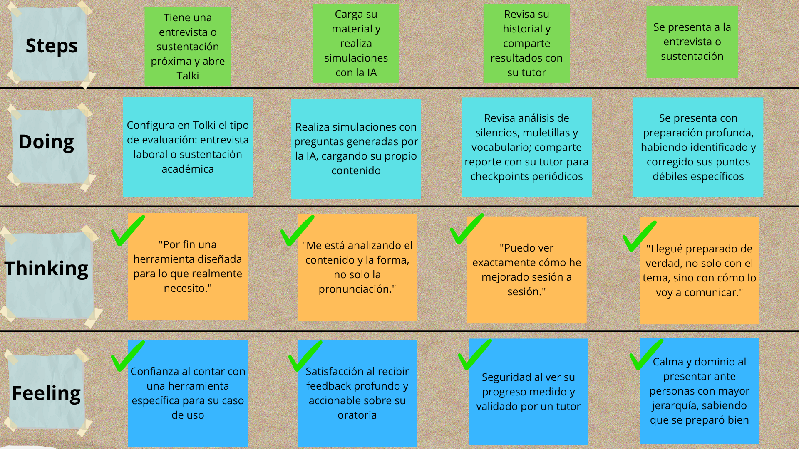

| Fase | Acciones del usuario | Respuesta de Talki | Pensamiento o emoción esperada | Oportunidad de diseño |
|---|---|---|---|---|
| Contextualización | Carga CV, oferta laboral, rúbrica o diapositivas. | Extrae el contexto relevante y propone objetivos de práctica. | “La simulación se parece a mi situación real.” | Personalización sin exigir una configuración extensa. |
| Simulación | Responde preguntas y repreguntas. | Mantiene una conversación por voz, adapta dificultad y registra métricas. | Presión controlada, semejante al escenario real. | IA conversacional con límites de tiempo y turnos claros. |
| Evaluación | Consulta resultados por competencia. | Explica claridad, manejo de silencios, muletillas, vocabulario, estructura y confianza. | Comprensión precisa de fortalezas y brechas. | Evidencia trazable a fragmentos del discurso. |
| Plan de mejora | Selecciona prioridades para la siguiente práctica. | Genera ejercicios y recomendaciones según errores recurrentes. | Sensación de progreso dirigido. | Ruta adaptativa basada en historial, no en consejos genéricos. |
| Colaboración opcional | Decide compartir resultados. | Genera un acceso temporal y revocable al reporte. | Control sobre quién accede a su desempeño. | Privacidad por defecto y consentimiento explícito. |

Los dos escenarios convergen en el flujo **configurar → verificar → practicar → analizar → recomendar → repetir**. La diferencia está en la profundidad: Valeria necesita orientación simple y confianza progresiva; Rodrigo requiere simulación contextual, repreguntas, evidencia detallada y seguimiento profesional.

## 3.2. User Stories

Para conservar la trazabilidad con el proyecto desarrollado en el ciclo anterior, se mantienen los identificadores **US01–US28** y se actualiza su redacción cuando corresponde. Las historias **US29–US38** amplían el backlog con privacidad, material contextual, simulación, continuidad, procesamiento asíncrono, aprendizaje adaptativo y coaching en vivo, capacidades necesarias para la versión actual de Talki.

Los criterios de aceptación se especifican como escenarios **Dado–Cuando–Entonces**, de modo que cada historia pueda verificarse durante el sprint.

| Epic / Story ID | Título | User Story | Criterios de aceptación principales |
|---|---|---|---|
| EP01 | Página de aterrizaje | Como visitante, quiero comprender el valor y condiciones de Talki antes de registrarme. | No corresponde. |
| US01 | Visualizar beneficios | Como visitante, quiero conocer los beneficios de Talki para evaluar si responde a mis necesidades. | La página muestra beneficios diferenciados para ciclos iniciales y avanzados; el contenido es accesible en dispositivos web compatibles. |
| US02 | Ver planes y precios | Como visitante, quiero consultar los planes para evaluar su conveniencia. | Los planes muestran precio, límites y funcionalidades; no se presenta una funcionalidad como incluida si no está disponible. |
| US03 | Ver testimonios | Como visitante, quiero revisar experiencias de estudiantes para generar confianza. | Solo se publican testimonios autorizados; se identifica el segmento sin exponer información innecesaria. |
| US04 | Enviar una consulta | Como visitante, quiero contactar al equipo para resolver dudas. | Los campos se validan; el envío se confirma; los datos se usan únicamente para responder la consulta. |
| EP02 | Identidad y perfil | Como estudiante, quiero gestionar mi cuenta y perfil para utilizar Talki de forma segura y personalizada. | No corresponde. |
| US05 | Registrar una cuenta | Como estudiante, quiero registrarme para conservar mis sesiones y progreso. | Un correo no registrado crea la cuenta y solicita verificación; un correo existente no genera duplicados. |
| US06 | Iniciar sesión | Como estudiante registrado, quiero autenticarme para acceder a mis recursos. | Credenciales válidas generan una sesión; los errores no revelan qué credencial falló; se aplican límites a intentos anómalos. |
| US07 | Recuperar contraseña | Como estudiante, quiero restablecer mi contraseña para recuperar el acceso. | El enlace es temporal y de un solo uso; la respuesta no confirma si un correo ajeno existe. |
| US08 | Editar perfil | Como estudiante, quiero actualizar universidad, carrera, ciclo y objetivos para personalizar mi experiencia. | Los campos se validan; los cambios se reflejan en recomendaciones futuras; el usuario conserva control sobre datos opcionales. |
| US28 | Cerrar sesión | Como estudiante, quiero cerrar sesión de manera segura para proteger mi cuenta. | El refresh token se revoca y las credenciales locales se eliminan; el access token conserva una vigencia corta y no renovable. Si existe una práctica en curso, se advierte antes de cerrar. |
| EP03 | Preparación de la práctica | Como estudiante, quiero configurar el escenario, objetivos y material antes de practicar. | No corresponde. |
| US09 | Crear una sesión | Como estudiante, quiero crear una sesión para organizar un nuevo ensayo. | La sesión se crea en estado borrador; título y objetivo se validan; el usuario puede cancelar antes de iniciar. |
| US10 | Seleccionar tipo de sesión | Como estudiante, quiero elegir pitch, exposición, entrevista o sustentación para utilizar una rúbrica adecuada. | Cada modo explica propósito y criterios; la selección configura el comportamiento del coach y del reporte. |
| US11 | Configurar duración objetivo | Como estudiante, quiero definir una duración para practicar el manejo del tiempo. | La duración se valida; el cronómetro muestra avance; alcanzar el límite genera una señal no bloqueante. |
| US23 | Seleccionar segmento académico | Como estudiante, quiero indicar si pertenezco a ciclos 1–5 o 6–10 para adaptar profundidad y lenguaje. | El segmento puede actualizarse; no restringe arbitrariamente funciones; cambia recomendaciones posteriores. |
| US24 | Establecer metas | Como estudiante, quiero definir metas de mejora para enfocar mis prácticas. | Las metas son medibles y editables; el reporte relaciona recomendaciones con metas vigentes. |
| US25 | Seleccionar áreas de enfoque | Como estudiante, quiero elegir fluidez, claridad, volumen, vocabulario u otra área para priorizar el análisis. | La selección no oculta alertas críticas; el reporte distingue métricas priorizadas y complementarias. |
| US29 | Verificar micrófono y consentimiento | Como estudiante, quiero probar el audio y conocer qué datos se procesarán para evitar una sesión inválida y controlar mi privacidad. | No se inicia sin permiso y consentimiento; la prueba valida nivel de entrada; se informa retención y eliminación. |
| US30 | Cargar material de contexto | Como estudiante, quiero adjuntar CV, oferta laboral, rúbrica, texto o diapositivas para obtener una práctica contextualizada. | Se validan formato y tamaño; el usuario puede eliminar el material; la IA utiliza solo archivos autorizados. |
| EP04 | Práctica oral asistida | Como estudiante, quiero controlar la práctica y recibir asistencia mientras hablo. | No corresponde. |
| US12 | Iniciar grabación y transcripción | Como estudiante, quiero iniciar la práctica y visualizar la transcripción para monitorear lo que digo. | Con permisos válidos comienza la captura; la transcripción incremental se muestra; un fallo de permisos ofrece instrucciones. |
| US13 | Pausar y reanudar | Como estudiante, quiero pausar y reanudar sin perder el progreso confirmado. | El estado y cronómetro se actualizan consistentemente; al reanudar no se duplica la transcripción. |
| US14 | Finalizar y guardar | Como estudiante, quiero finalizar la sesión y conservar la transcripción para obtener feedback. | Se solicita confirmación; finalizar ocurre una sola vez; se guarda el estado y comienza el análisis. |
| US31 | Simular entrevista o sustentación | Como estudiante avanzado, quiero responder preguntas y repreguntas contextualizadas para prepararme para escenarios exigentes. | La IA utiliza material autorizado; respeta turnos y tiempo; las repreguntas son pertinentes; el usuario puede terminar. |
| US34 | Recuperar una sesión interrumpida | Como estudiante, quiero reanudar o cerrar correctamente una práctica tras una desconexión para no perder todo el esfuerzo. | Se detecta la desconexión; se conserva el último estado válido; se ofrece reanudar o generar resultado parcial identificado. |
| US38 | Recibir coaching en tiempo cercano al real | Como estudiante, quiero recibir señales discretas sobre ritmo, volumen y pausas para corregirme sin perder el hilo. | Las señales se entregan dentro del umbral de latencia; pueden silenciarse; no bloquean la captura ni interrumpen la voz. |
| EP05 | Feedback y análisis con IA | Como estudiante, quiero recibir resultados comprensibles y accionables para saber qué mejorar. | No corresponde. |
| US15 | Recibir feedback general | Como estudiante, quiero obtener un resumen global para comprender mi desempeño. | Incluye puntuación, fortalezas y oportunidades; una sesión insuficiente se identifica sin fabricar conclusiones. |
| US16 | Analizar muletillas | Como estudiante, quiero identificar muletillas y su frecuencia para reducirlas. | Se muestran tipo, conteo y evidencia; un resultado sin muletillas se comunica sin afirmar perfección absoluta. |
| US17 | Analizar palabras clave | Como estudiante, quiero revisar conceptos principales para validar cobertura temática. | Las palabras provienen de la transcripción y contexto autorizado; se distinguen términos usados y sugeridos. |
| US18 | Mejorar el léxico | Como estudiante, quiero recibir alternativas de vocabulario para enriquecer mi expresión. | Las sugerencias consideran contexto y segmento; no reemplazan palabras técnicas correctas por sinónimos imprecisos. |
| US19 | Recibir sugerencias por sección | Como estudiante, quiero recomendaciones relacionadas con fragmentos concretos para saber dónde actuar. | Cada sugerencia referencia evidencia; se priorizan pocas acciones; se evita feedback genérico no trazable. |
| US26 | Recibir recomendaciones por segmento | Como estudiante, quiero feedback con profundidad apropiada a mi etapa académica. | La misma evidencia puede explicarse con distinto nivel; las métricas base mantienen definiciones consistentes. |
| US37 | Consultar estado y reintentar análisis | Como estudiante, quiero saber si el reporte está procesándose, listo o falló para no quedar sin respuesta. | El estado es visible; un fallo recuperable habilita reintento; no se generan reportes duplicados. |
| EP06 | Historial, progreso y adaptación | Como estudiante, quiero observar mi evolución y mantener el hábito de práctica. | No corresponde. |
| US20 | Consultar historial | Como estudiante, quiero revisar mis sesiones anteriores para recuperar reportes. | Solo se muestran recursos del propietario; se ordenan y filtran; cada elemento abre el reporte correcto. |
| US21 | Ver progreso | Como estudiante, quiero visualizar tendencias para reconocer evolución por habilidad. | Las métricas indican versión y periodo; no se mezclan datos incompatibles; se explican cambios relevantes. |
| US22 | Comparar sesiones | Como estudiante, quiero comparar dos prácticas para identificar mejoras y retrocesos. | Solo se comparan sesiones compatibles; se muestran variaciones y evidencia; un cambio pequeño no se sobredimensiona. |
| US35 | Mantener rachas y logros | Como estudiante, quiero recibir refuerzos positivos por práctica consistente y hitos reales. | Las reglas son transparentes; sesiones inválidas no cuentan; cada logro se concede una sola vez y compartirlo es opcional. |
| US36 | Recibir un plan adaptativo | Como estudiante, quiero ejercicios basados en errores recurrentes para enfocar mejor mi tiempo. | El plan utiliza historial suficiente; explica la razón de cada recomendación; se recalcula con nueva evidencia. |
| EP07 | Reportes, colaboración y privacidad | Como estudiante, quiero exportar o compartir resultados únicamente bajo mi control. | No corresponde. |
| US27 | Exportar transcripción y feedback | Como estudiante, quiero exportar un reporte para revisarlo sin conexión o presentarlo a un tutor. | El archivo identifica fecha y versiones; respeta la privacidad; no incluye material no autorizado. |
| US32 | Compartir temporalmente un reporte | Como estudiante, quiero dar acceso limitado a un tutor para recibir orientación adicional. | El enlace tiene expiración y revocación; no expone otras sesiones; el tutor no puede modificar datos. |
| US33 | Revocar consentimiento y eliminar datos | Como estudiante, quiero retirar permisos o eliminar sesiones para conservar control de mi información. | La revocación impide nuevos accesos; el borrado cambia el estado inmediatamente y activa la purga; queda evidencia de auditoría. |

Las **Technical Stories** definen servicios y contratos que consumen clientes u otros servicios. Su actor es Developer y sus criterios especifican peticiones, respuestas o confirmaciones de mensajes. Las restricciones de privacidad, plataforma, presupuesto y versionado permanecen identificadas como C-02 a C-09 en ADD.

Las rutas existentes se toman de las interfaces descritas en el capítulo V. Los códigos de respuesta, controles de autorización, idempotencia y contratos ampliados son requisitos del diseño que deberán verificarse durante la implementación; esta tabla no acredita pruebas ejecutadas ni endpoints nuevos desplegados.

| ID | Título | Technical Story | Contrato y alcance |
| --- | --- | --- | --- |
| TS01 | API de sesiones | Como Developer, quiero exponer creación y consulta de sesiones para que el cliente gestione ensayos mediante un contrato estable. | API de sesiones: POST y GET /v1/sessions; GET /v1/sessions/{id}. |
| TS02 | Contrato de coaching en vivo | Como Developer, quiero obtener credenciales efímeras y confirmar el cierre para integrar la conversación de voz sin exponer credenciales permanentes. | POST /v1/coach/live-token y POST /v1/coach/{sessionId}/finalize; cliente a Gemini Live por WSS. |
| TS03 | Pipeline de análisis idempotente | Como Developer, quiero procesar eventos de cierre y publicar resultados versionados para obtener feedback sin duplicar evaluaciones. | RabbitMQ: session.live.finalized, fillers.analyzed y scoring.completed; ACK, reintentos y cola de fallos. |
| TS04 | Consulta de reportes versionados | Como Developer, quiero un contrato de consulta de feedback para que el cliente distinga resultados completos, parciales y pendientes. | `GET /v1/reports/{sessionId}`; 200 con versiones/métricas/limitaciones, 202 con analysisState y 404 para recursos no disponibles al solicitante. |
| TS05 | API de progreso | Como Developer, quiero consultar el resumen de progreso para que el cliente presente evolución a partir de sesiones válidas. | GET /v1/progress/dashboard; GET /v1/progress/comparisons?left={id}&right={id}; contratos de 5.5. |
| TS06 | API de compartición y eliminación | Como Developer, quiero contratos de permisos temporales y purga para controlar acceso y eliminación entre contextos. | APIs propuestas de Sharing & Retention en 5.6; eventos de revocación, purga y confirmación. |

| Historia | Escenario | Given | When | Then |
| --- | --- | --- | --- | --- |
| TS01 | Principal | una solicitud autenticada con título y modo válidos | se envía POST /v1/sessions | responde 201 con identificador y estado de la sesión. |
| TS01 | Alternativo / error | el solicitante no es propietario del recurso | se envía GET /v1/sessions/{id} | responde 403 sin entregar datos de otro estudiante. |
| TS02 | Principal | el modo es válido y hay consentimiento | se solicita una credencial mediante POST /v1/coach/live-token | responde 200 con token temporal, modelo, vigencia y duración máxima. |
| TS02 | Alternativo / error | la credencial efímera venció | el cliente intenta abrir el canal WSS de voz | la conexión es rechazada y se requiere una nueva credencial autorizada. |
| TS03 | Principal | llega un evento de cierre válido no procesado | el worker analiza y registra el resultado | publica el evento de salida y confirma el mensaje después de completar la operación. |
| TS03 | Alternativo / error | el mismo identificador de evento vuelve a recibirse | el worker lo procesa | reconoce el duplicado sin crear otro reporte; un fallo transitorio reintenta y un fallo persistente queda en la cola de fallos. |
| TS04 | Principal | el propietario consulta una evaluación disponible | envía GET /v1/reports/{sessionId} | responde 200 con sesión, versiones de rúbrica y análisis, métricas y limitaciones. |
| TS04 | Alternativo / error | el trabajo aún no termina | consulta el mismo reporte | responde 202 con el estado de procesamiento y no fabrica una puntuación. |
| TS05 | Principal | el solicitante está autorizado y tiene sesiones válidas | envía GET /v1/progress/dashboard con modo y versiones compatibles | responde 200 con totales y puntuaciones comparables; la identidad proviene del acceso autenticado. |
| TS05 | Alternativo / error | se solicita progreso de un usuario ajeno sin permiso | se envía la consulta | responde 403 sin exponer su historial. |
| TS06 | Principal | el propietario solicita eliminación | se recibe la petición autorizada de borrado | confirma el bloqueo en Sessions y responde 202 con requestId y ACCESS_BLOCKED; completa la purga al recibir las confirmaciones esperadas. |
| TS06 | Alternativo / error | un enlace fue revocado o venció | se solicita el reporte compartido | responde 403 sin entregar contenido ni habilitar acceso a otras sesiones. |

### Escenarios de aceptación

Cada historia tiene un escenario principal y dos escenarios alternativos o de error. Dado, Cuando y Entonces corresponden a Given, When y Then de Gherkin. Son condiciones de aceptación del diseño; la ejecución de pruebas se documentará en el capítulo VII.

| Historia | Escenario | Dado | Cuando | Entonces |
| --- | --- | --- | --- | --- |
| US01 | Principal | el visitante abre la landing page | consulta beneficios | ve beneficios diferenciados y accesibles por segmento. |
| US01 | Alternativo | el visitante accede desde un móvil | consulta los beneficios | el contenido se adapta sin ocultar información de ningún segmento. |
| US01 | Excepción | el contenido de beneficios no carga | intenta consultarlo | se informa el problema y se ofrece volver a cargar. |
| US02 | Principal | el visitante consulta planes | selecciona un plan | ve precio, límites y funcionalidades reales. |
| US02 | Alternativo | el visitante cambia de plan | consulta otra alternativa | ve el precio y límites de esa alternativa sin contratar automáticamente. |
| US02 | Excepción | un plan no tiene precio confirmado | consulta sus condiciones | se indica que requiere consulta y no se inventa un importe. |
| US03 | Principal | existe un testimonio autorizado | el visitante lo consulta | ve segmento sin datos personales innecesarios. |
| US03 | Alternativo | no hay testimonios autorizados | consulta la sección | ve una explicación sin testimonios ficticios. |
| US03 | Excepción | se retira la autorización de un testimonio | se actualiza la landing | el testimonio deja de publicarse. |
| US04 | Principal | el visitante completa el formulario | envía una consulta válida | recibe confirmación y los datos se usan solo para responder. |
| US04 | Alternativo | faltan campos obligatorios o el correo es inválido | envía la consulta | se indican los campos por corregir y se conserva el texto. |
| US04 | Excepción | el servicio de contacto falla | envía una consulta válida | se informa que no fue enviada y permite reintentar. |
| US05 | Principal | el correo no está registrado | completa registro válido | se crea una cuenta única y se solicita verificación. |
| US05 | Alternativo | el correo ya está registrado | envía el registro | no se crea una cuenta duplicada y se ofrece acceso o recuperación. |
| US05 | Excepción | la contraseña no cumple las reglas | envía el formulario | se explica la regla incumplida sin crear la cuenta. |
| US06 | Principal | el estudiante ingresa credenciales | intenta iniciar sesión | accede con datos válidos sin revelar qué credencial falló. |
| US06 | Alternativo | las credenciales son incorrectas | intenta acceder | recibe un mensaje general sin revelar qué dato falló. |
| US06 | Excepción | se excede el límite de intentos configurado | intenta autenticarse nuevamente | el acceso se limita temporalmente y se informa cómo continuar. |
| US07 | Principal | el estudiante solicita recuperación | usa el enlace recibido | restablece una vez dentro de su vigencia. |
| US07 | Alternativo | el enlace de recuperación venció o ya fue utilizado | intenta restablecer la contraseña | se rechaza el enlace y se permite solicitar otro. |
| US07 | Excepción | el correo solicitado no está registrado | solicita recuperación | recibe la misma confirmación general sin revelar cuentas existentes. |
| US08 | Principal | el estudiante edita su perfil | guarda cambios válidos | se actualizan futuras recomendaciones. |
| US08 | Alternativo | el perfil contiene un ciclo fuera del rango admitido | guarda los cambios | se explica el error y se conserva el perfil anterior. |
| US08 | Excepción | el guardado falla por desconexión | edita su perfil | se informa que los cambios no se confirmaron y se conservan para reintentar. |
| US09 | Principal | el estudiante autenticado inicia una práctica | registra título y objetivo | se crea un borrador cancelable. |
| US09 | Alternativo | el título está vacío o excede el límite definido | crea un ensayo | se solicita corregirlo sin generar un borrador inválido. |
| US09 | Excepción | la creación falla por desconexión | reintenta la misma solicitud | se recupera la sesión confirmada o se crea una sola sesión. |
| US10 | Principal | existe un borrador | el estudiante elige un modo | Talki explica criterios y configura el reporte. |
| US10 | Alternativo | el estudiante cambia de modo antes del inicio | confirma la selección | se actualizan los criterios y el contexto del ensayo. |
| US10 | Excepción | el modo solicitado no está disponible | intenta seleccionarlo | se explica la limitación y se ofrecen modos disponibles. |
| US11 | Principal | existe un borrador | define una duración válida | el cronómetro la muestra y avisa sin bloquear. |
| US11 | Alternativo | la duración es menor o mayor que los límites informados | guarda la configuración | se indica el rango permitido sin iniciar una práctica inválida. |
| US11 | Excepción | la práctica alcanza la duración objetivo | continúa hablando | se muestra un aviso y conserva el control del cierre. |
| US12 | Principal | hay permisos de micrófono | inicia la práctica | se captura audio y aparece transcripción incremental. |
| US12 | Alternativo | el navegador deniega el micrófono | intenta iniciar | se bloquea la captura y se explica cómo conceder permiso. |
| US12 | Excepción | la conexión se pierde durante la captura | continúa la práctica | se informa la interrupción y se conserva el último estado confirmado. |
| US13 | Principal | la práctica está activa o pausada | pausa o reanuda | conserva estado, cronómetro y transcripción sin duplicados. |
| US13 | Alternativo | la práctica ya está pausada | solicita pausar otra vez | permanece pausada sin duplicar acciones ni tiempo. |
| US13 | Excepción | la reanudación falla por desconexión | solicita continuar | permanece en el último estado confirmado y se ofrece recuperación. |
| US14 | Principal | la práctica está activa | confirma finalización | guarda un estado único e inicia análisis. |
| US14 | Alternativo | el estudiante cancela la confirmación de cierre | vuelve al ensayo | la práctica conserva su estado y no inicia el análisis. |
| US14 | Excepción | la misma finalización se solicita dos veces | se procesa el cierre | se mantiene una única finalización y un único trabajo de análisis. |
| US15 | Principal | el análisis tiene evidencia suficiente | finaliza procesamiento | entrega puntuación, fortalezas y oportunidades. |
| US15 | Alternativo | la muestra no tiene evidencia suficiente | solicita el reporte | se identifica el resultado parcial y las dimensiones sin evidencia. |
| US15 | Excepción | el análisis falla | consulta su reporte | ve el estado fallido y la opción de reintentar cuando sea recuperable. |
| US16 | Principal | existe una transcripción | consulta muletillas | ve tipo, conteo y evidencia. |
| US16 | Alternativo | no se detectan muletillas en la transcripción | consulta el resultado | ve conteo cero sin afirmar que su oratoria sea perfecta. |
| US16 | Excepción | la transcripción está incompleta | consulta muletillas | el reporte señala el alcance parcial y no extrapola conteos. |
| US17 | Principal | existe transcripción y contexto autorizado | consulta palabras clave | distingue términos usados y sugeridos. |
| US17 | Alternativo | una palabra sugerida no aparece en el discurso | consulta palabras clave | se identifica como sugerencia y no como término pronunciado. |
| US17 | Excepción | el material adjunto no fue autorizado | solicita el análisis temático | no se utiliza ese material y se explica la limitación. |
| US18 | Principal | existe una recomendación léxica | el estudiante la consulta | recibe alternativas apropiadas al contexto. |
| US18 | Alternativo | el discurso contiene terminología especializada correcta | consulta alternativas | se conserva su significado y se diferencia una sugerencia de un error. |
| US18 | Excepción | no hay evidencia suficiente para recomendar un cambio | solicita alternativas | se explica la limitación sin inventar ejemplos del discurso. |
| US19 | Principal | el análisis está listo | consulta una sugerencia | ve evidencia y una acción priorizada. |
| US19 | Alternativo | varias sugerencias corresponden al mismo fragmento | consulta recomendaciones | se agrupan y priorizan acciones sin duplicarlas. |
| US19 | Excepción | no existe evidencia que respalde una sugerencia | se prepara el reporte | la sugerencia se omite y no se atribuye al estudiante. |
| US20 | Principal | el estudiante tiene sesiones | abre historial | ve solo recursos propios, ordenados correctamente. |
| US20 | Alternativo | el estudiante no tiene sesiones | abre el historial | ve un estado vacío y una opción para crear su primer ensayo. |
| US20 | Excepción | intenta abrir una sesión de otro propietario | solicita el recurso | se deniega el acceso sin exponer contenido. |
| US21 | Principal | existen sesiones compatibles | consulta progreso | ve métricas con versión y período. |
| US21 | Alternativo | solo hay una sesión compatible | consulta progreso | ve la medición disponible sin afirmar una tendencia. |
| US21 | Excepción | las métricas pertenecen a rúbricas distintas | consulta evolución | se separan por versión y se informa la incompatibilidad. |
| US22 | Principal | selecciona dos sesiones compatibles | las compara | ve cambios y evidencia sin sobredimensionarlos. |
| US22 | Alternativo | las sesiones tienen modos o rúbricas incompatibles | intenta compararlas | se explica la incompatibilidad sin calcular variaciones engañosas. |
| US22 | Excepción | una sesión carece de una dimensión evaluada | compara resultados | esa dimensión aparece sin evidencia y no se sustituye por cero. |
| US23 | Principal | el estudiante selecciona su ciclo | guarda el segmento | cambian recomendaciones sin bloquear funciones. |
| US23 | Alternativo | el estudiante cambia de ciclo | actualiza su segmento | se adaptan futuras recomendaciones sin cambiar reportes históricos. |
| US23 | Excepción | el ciclo no pertenece al rango admitido | guarda la selección | se solicita corregirlo sin bloquear otras funciones. |
| US24 | Principal | el estudiante define una meta | la guarda | el reporte relaciona recomendaciones con ella. |
| US24 | Alternativo | el estudiante modifica una meta | guarda el cambio | los siguientes reportes utilizan la meta actual y conservan el historial. |
| US24 | Excepción | la meta está vacía o no es verificable | intenta guardarla | se orienta a redactar una meta concreta sin registrar una inválida. |
| US25 | Principal | el estudiante selecciona un área | inicia análisis | prioriza esa métrica sin ocultar alertas críticas. |
| US25 | Alternativo | el estudiante elige más de un enfoque permitido | confirma la preparación | el reporte identifica las áreas seleccionadas. |
| US25 | Excepción | aparece una alerta crítica fuera del enfoque | consulta el resultado | la alerta permanece visible junto a las métricas priorizadas. |
| US26 | Principal | existe evidencia de práctica | recibe feedback | la explicación se adapta a su segmento. |
| US26 | Alternativo | el estudiante actualiza su segmento | realiza una nueva práctica | recibe una explicación apropiada al segmento vigente. |
| US26 | Excepción | el segmento no está definido | consulta feedback | recibe una explicación general sin inferir su ciclo. |
| US27 | Principal | el estudiante es propietario | exporta un reporte | recibe fecha, versiones y solo datos autorizados. |
| US27 | Alternativo | el reporte contiene una dimensión sin evidencia | exporta el archivo | la limitación se conserva en el documento. |
| US27 | Excepción | la generación del archivo falla | solicita exportación | se informa el fallo sin entregar un archivo incompleto como válido. |
| US28 | Principal | existe una sesión autenticada | el estudiante cierra sesión | se revoca refresh token y se eliminan credenciales locales. |
| US28 | Alternativo | existe una práctica en curso | solicita cerrar sesión | se advierte antes de perder acceso al ensayo. |
| US28 | Excepción | se intenta renovar con un refresh token revocado | solicita otra credencial | la renovación se rechaza y requiere nuevo acceso. |
| US29 | Principal | aún no hay consentimiento | prueba audio o inicia | Talki bloquea captura hasta consentimiento y validación. |
| US29 | Alternativo | hay permiso de micrófono pero no consentimiento | intenta iniciar | se bloquea el procesamiento de voz hasta aceptar las condiciones. |
| US29 | Excepción | la prueba no detecta señal de entrada | verifica el micrófono | se ofrecen instrucciones y no se marca la prueba como exitosa. |
| US30 | Principal | el estudiante selecciona un archivo | lo adjunta | valida formato y tamaño, y permite eliminarlo. |
| US30 | Alternativo | el archivo excede el tamaño o usa un formato no permitido | intenta adjuntarlo | se informa el motivo y no se incorpora al contexto. |
| US30 | Excepción | el estudiante retira un material antes de la práctica | confirma eliminarlo | el material deja de estar autorizado para esa práctica. |
| US31 | Principal | el estudiante avanzado inicia simulación | responde preguntas | la IA respeta turnos, tiempo y material autorizado. |
| US31 | Alternativo | el estudiante decide terminar la simulación | confirma el cierre | la IA deja de preguntar y se conserva la evidencia autorizada. |
| US31 | Excepción | la IA pierde conexión o recibe material insuficiente | solicita una nueva pregunta | se informa la limitación sin inventar datos del CV o proyecto. |
| US32 | Principal | el propietario comparte un reporte | crea o revoca enlace | el acceso es temporal, limitado y revocable. |
| US32 | Alternativo | el enlace compartido venció | el tutor abre el reporte | se deniega el acceso y no se muestran otras sesiones. |
| US32 | Excepción | el propietario revoca un enlace activo | el tutor vuelve a solicitar el recurso | la autorización se rechaza de inmediato. |
| US33 | Principal | el propietario solicita revocación o borrado | confirma la acción | se bloquean accesos y se activa purga auditable. |
| US33 | Alternativo | el propietario retira consentimiento | se intenta iniciar nuevo procesamiento | la solicitud se bloquea aunque una purga previa siga pendiente. |
| US33 | Excepción | un contexto no confirma la purga física | consulta el estado de eliminación | el acceso sigue bloqueado y el estado figura pendiente. |
| US34 | Principal | ocurre una desconexión | vuelve a la práctica | conserva estado válido y ofrece reanudar o cierre parcial. |
| US34 | Alternativo | el estado confirmado permite reanudar | se restablece la conexión | la práctica continúa desde ese estado sin duplicar transcripción. |
| US34 | Excepción | la recuperación no es posible | vuelve al ensayo | se ofrece cierre parcial y se indica qué evidencia quedó disponible. |
| US35 | Principal | existe una sesión válida | alcanza un hito | concede el logro una sola vez. |
| US35 | Alternativo | el evento de una sesión ya fue contabilizado | se vuelve a recibir | no se incrementa otra vez la racha ni se duplica el logro. |
| US35 | Excepción | la sesión es inválida o insuficiente según las reglas | se evalúa el hito | no concede progreso y explica el criterio aplicable. |
| US36 | Principal | existe historial suficiente | solicita un plan | recibe ejercicios justificados por errores recurrentes. |
| US36 | Alternativo | el historial no es suficiente | solicita un plan adaptativo | recibe un punto de partida general identificado como tal. |
| US36 | Excepción | el historial contiene versiones incompatibles | se recalcula el plan | solo se utilizan mediciones compatibles y se explica la selección. |
| US37 | Principal | el análisis falla recuperablemente | consulta estado o reintenta | ve estado y evita reportes duplicados. |
| US37 | Alternativo | el análisis permanece en cola | consulta el estado | ve que está pendiente sin presentarlo como un reporte listo. |
| US37 | Excepción | el mismo trabajo se reintenta más de una vez | se completa el procesamiento | se conserva un único resultado por sesión y versión. |
| US38 | Principal | el estudiante habla durante práctica | recibe una señal | obtiene coaching silenciable sin interrumpir captura. |
| US38 | Alternativo | el estudiante silencia las señales | continúa hablando | la captura continúa sin avisos del coach. |
| US38 | Excepción | no hay evidencia acústica o la latencia supera el umbral | se intenta generar una señal | se omite la señal no sustentada y se informa la limitación sin bloquear el ensayo. |

## 3.3. Impact Mapping

El Impact Map conecta los objetivos de negocio con los actores, los cambios de comportamiento esperados y los entregables que los hacen posibles. El objetivo no es implementar todas las ideas, sino priorizar aquellas que aportan evidencia sobre adopción, práctica sostenida y mejora percibida.

### Objetivo del piloto

**Validar que Talki fomenta una práctica oral constante y accionable**, buscando que al menos el 40 % de usuarios activos mantenga tres sesiones semanales durante cuatro semanas y pueda identificar una mejora concreta mediante la comparación de sus reportes.

### Business Goals SMART

| ID | Objetivo de negocio | Indicador y horizonte |
|---|---|---|
| BG-01 | Validar práctica sostenida en el piloto. | Al cierre de 4 semanas, al menos 40 % de usuarios activos completa 3 sesiones por semana. |
| BG-02 | Validar que el feedback permite una mejora accionable. | Al cierre de 4 semanas, al menos 60 % de quienes completan 2 sesiones marca una recomendación como aplicada o registra una mejora en la métrica asociada. |
| BG-03 | Reducir la fricción de la primera práctica. | Durante la prueba de usabilidad del piloto, al menos 90 % de participantes inicia una sesión válida en 3 minutos o menos, sin ayuda. |
| BG-04 | Validar utilidad para escenarios avanzados. | Al cierre del piloto, al menos 70 % de estudiantes de ciclos 6–10 que prueban una simulación contextualizada la califica útil para entrevista o sustentación. |
| BG-05 | Sostener confianza en el tratamiento de datos. | Durante el piloto, 100 % de sesiones registra consentimiento antes de capturar audio y 100 % de enlaces revocados deja de otorgar acceso de inmediato. |

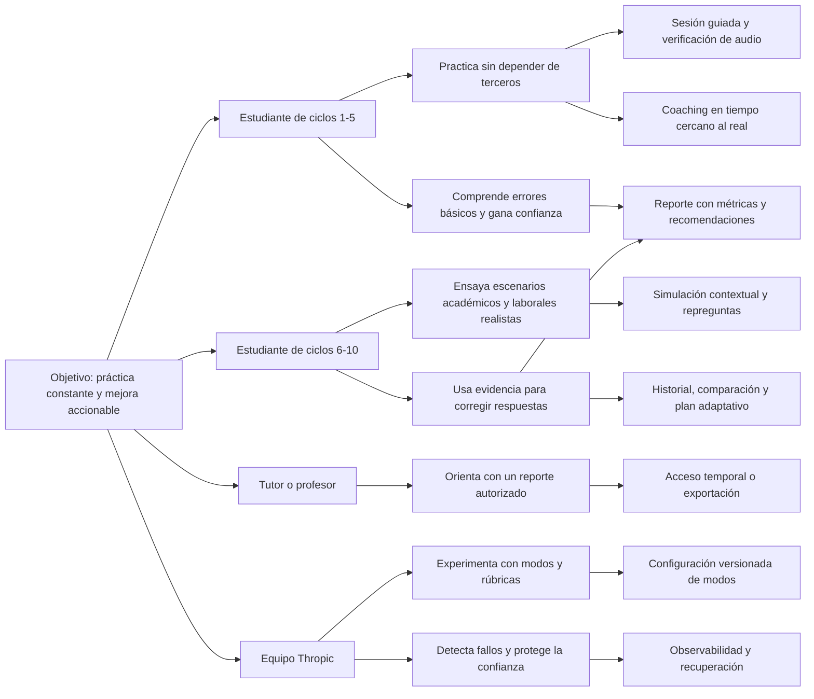
```mermaid
flowchart LR
    G[Objetivo: práctica constante y mejora accionable]
    A1[Estudiante de ciclos 1-5]
    A2[Estudiante de ciclos 6-10]
    A3[Tutor o profesor]
    A4[Equipo Thropic]
    I11[Practica sin depender de terceros]
    I12[Comprende errores básicos y gana confianza]
    I21[Ensaya escenarios académicos y laborales realistas]
    I22[Usa evidencia para corregir respuestas]
    I31[Orienta con un reporte autorizado]
    I41[Experimenta con modos y rúbricas]
    I42[Detecta fallos y protege la confianza]
    D1[Sesión guiada y verificación de audio]
    D2[Coaching en tiempo cercano al real]
    D3[Reporte con métricas y recomendaciones]
    D4[Simulación contextual y repreguntas]
    D5[Historial, comparación y plan adaptativo]
    D6[Acceso temporal o exportación]
    D7[Configuración versionada de modos]
    D8[Observabilidad y recuperación]
    G --> A1
    G --> A2
    G --> A3
    G --> A4
    A1 --> I11 --> D1
    I11 --> D2
    A1 --> I12 --> D3
    A2 --> I21 --> D4
    A2 --> I22 --> D3
    I22 --> D5
    A3 --> I31 --> D6
    A4 --> I41 --> D7
    A4 --> I42 --> D8
```

| Actor | Impacto esperado | Entregables relacionados | Historias |
|---|---|---|---|
| Estudiante de ciclos 1 al 5 | Practica con menor fricción, reconoce problemas de volumen, fluidez y muletillas, y repite el ensayo con un objetivo claro. | Configuración guiada, prueba de audio, coaching discreto, feedback accionable. | US09, US10, US23, US25, US29, US12–US16, US19, US26, US38. |
| Estudiante de ciclos 6 al 10 | Se prepara para entrevistas, jurados y sustentaciones mediante escenarios contextualizados y compara su desempeño. | Material contextual, simulación, repreguntas, historial, comparación y plan adaptativo. | US24, US30, US31, US17–US22, US36. |
| Tutor o profesor | Brinda orientación sin requerir acceso permanente a la cuenta o a todas las sesiones. | Exportación y acceso temporal revocable. | US27, US32. |
| Equipo Thropic | Valida hipótesis, incorpora nuevos modos y mantiene el servicio confiable sin exponer datos privados. | Versionado, recuperación, estado de análisis, eliminación y observabilidad. | US33, US34, US37; decisiones ADD del capítulo IV. |

La siguiente trazabilidad complementa el diagrama y asegura que cada meta SMART se conecte con una persona, cambio de comportamiento, entregable y User Stories concretas.

| Business Goal | Persona | Impacto esperado | Deliverable | User Stories |
|---|---|---|---|---|
| BG-01: práctica sostenida | Valeria y Rodrigo | Incorporan tres prácticas semanales a su rutina. | Configuración guiada, sesión, coaching y feedback. | US09, US12, US14, US15, US26, US38. |
| BG-02: mejora accionable | Valeria y Rodrigo | Identifican y aplican una recomendación basada en evidencia. | Reporte con métricas, sugerencias y comparación. | US16–US22, US36. |
| BG-03: menor fricción inicial | Valeria | Inicia una primera práctica sin asistencia. | Onboarding, prueba de micrófono y consentimiento. | US05, US09, US10, US29. |
| BG-04: utilidad avanzada | Rodrigo | Usa una simulación contextual para prepararse para entrevista o sustentación. | Carga de material, simulación y repreguntas. | US30, US31. |
| BG-05: confianza en datos | Valeria, Rodrigo y tutor | Comparte o elimina información manteniendo control. | Enlaces temporales, revocación y borrado. | US27, US32, US33. |

### Hipótesis de impacto

1. Si el inicio de una sesión requiere pocos pasos y verifica previamente el audio, aumentará la cantidad de prácticas válidas completadas.
2. Si la retroalimentación identifica errores concretos y los relaciona con evidencia, el estudiante podrá elegir una acción de mejora en lugar de recibir consejos genéricos.
3. Si los escenarios utilizan material real del usuario, los estudiantes avanzados percibirán mayor utilidad para entrevistas y sustentaciones.
4. Si el progreso se expresa mediante comparaciones válidas y recomendaciones adaptativas, aumentará la repetición de sesiones.
5. Si la privacidad es visible y controlable, disminuirá la resistencia a grabarse y cargar material personal.

## 3.4. Product Backlog

El orden expresa el valor para validar Talki: completar un ensayo, obtener feedback útil y comunicar la propuesta del producto. No es una secuencia de implementación. Las dependencias se resuelven en Sprint Planning junto con los contratos técnicos y las salvaguardas de acceso y privacidad.

Las estimaciones preliminares utilizan únicamente **1, 2, 3, 5 y 8 story points**. El equipo deberá refinarlas antes de comprometer un sprint. El primer sprint contempla US01–US04 de la landing; los testimonios solo se publicarán con autorización y, si no existen, se presentará el estado vacío previsto en US03.

| Orden | ID | Título | Prioridad | SP | Dependencias | Entrega objetivo |
| ---: | --- | --- | :---: | ---: | --- | --- |
| 1 | US09 | Crear una sesión | Must | 3 | US06 | MVP |
| 2 | US12 | Iniciar grabación y transcripción | Must | 8 | US09, US29 | MVP |
| 3 | US14 | Finalizar y guardar | Must | 3 | US12 | MVP |
| 4 | US15 | Recibir feedback general | Must | 8 | US14 | MVP |
| 5 | US01 | Visualizar beneficios | Must | 2 | No aplica | MVP / Sprint 1 |
| 6 | US02 | Ver planes y precios | Must | 2 | No aplica | MVP / Sprint 1 |
| 7 | US03 | Ver testimonios | Must | 1 | No aplica | MVP / Sprint 1 |
| 8 | US04 | Enviar una consulta | Must | 2 | No aplica | MVP / Sprint 1 |
| 9 | US38 | Recibir coaching en tiempo cercano al real | Must | 8 | US12 | MVP |
| 10 | US16 | Analizar muletillas | Should | 5 | US14 | MVP |
| 11 | US19 | Recibir sugerencias por sección | Should | 5 | US15 | MVP |
| 12 | US26 | Recibir recomendaciones por segmento | Must | 5 | US15, US23 | MVP |
| 13 | US37 | Consultar estado y reintentar análisis | Must | 5 | US14, US15 | MVP |
| 14 | US20 | Consultar historial | Should | 3 | US06, US15 | MVP |
| 15 | US29 | Verificar micrófono y consentimiento | Must | 5 | US09 | MVP |
| 16 | US34 | Recuperar una sesión interrumpida | Must | 8 | US12, US14 | MVP |
| 17 | US33 | Revocar consentimiento y eliminar datos | Must | 8 | US06, US20 | MVP |
| 18 | US10 | Seleccionar tipo de sesión | Must | 3 | US09 | MVP |
| 19 | US23 | Seleccionar segmento académico | Must | 2 | US05 | MVP |
| 20 | US05 | Registrar una cuenta | Must | 5 | No aplica | MVP |
| 21 | US06 | Iniciar sesión | Must | 5 | US05 | MVP |
| 22 | US28 | Cerrar sesión | Must | 1 | US06 | MVP |
| 23 | US13 | Pausar y reanudar | Should | 3 | US12 | MVP |
| 24 | US08 | Editar perfil | Must | 3 | US06 | Incremento 2 |
| 25 | US11 | Configurar duración objetivo | Should | 2 | US09 | Incremento 2 |
| 26 | US24 | Establecer metas | Could | 3 | US08 | Incremento 2 |
| 27 | US25 | Seleccionar áreas de enfoque | Could | 3 | US09 | Incremento 2 |
| 28 | US30 | Cargar material de contexto | Should | 8 | US09 | Incremento 2 |
| 29 | US31 | Simular entrevista o sustentación | Should | 8 | US10, US30, US38 | Incremento 2 |
| 30 | US17 | Analizar palabras clave | Should | 5 | US14, US30 | Incremento 2 |
| 31 | US18 | Mejorar el léxico | Could | 5 | US17 | Incremento 2 |
| 32 | US21 | Ver progreso | Should | 5 | US20 | Incremento 2 |
| 33 | US22 | Comparar sesiones | Could | 5 | US20, US21 | Incremento 2 |
| 34 | US36 | Recibir un plan adaptativo | Should | 8 | US19, US21, US22 | Incremento 2 |
| 35 | US27 | Exportar transcripción y feedback | Could | 3 | US15 | Incremento 2 |
| 36 | US32 | Compartir temporalmente un reporte | Should | 5 | US15, US33 | Incremento 2 |
| 37 | US35 | Mantener rachas y logros | Could | 5 | US20 | Incremento 3 |
| 38 | US07 | Recuperar contraseña | Should | 3 | US05 | Incremento 3 |

Los contratos técnicos se planifican con las historias que habilitan. Su orden en la tabla permite identificarlos sin sustituir la prioridad de negocio.

| Orden | ID | Título | Prioridad | SP | Dependencias | Entrega objetivo |
| ---: | --- | --- | :---: | ---: | --- | --- |
| 39 | TS01 | API de sesiones | Must | 3 | US09, US20 | MVP / Sprint 1 |
| 40 | TS02 | Contrato de coaching en vivo | Must | 8 | US12, US14, US29, US38 | MVP / Sprint 1 |
| 41 | TS03 | Pipeline de análisis idempotente | Must | 8 | TS02, US15, US37 | MVP / Sprint 1 |
| 42 | TS04 | Consulta de reportes versionados | Must | 5 | TS03, US15, US20, US37 | MVP / Sprint 1 |
| 43 | TS05 | API de progreso | Must | 5 | TS03, US21, US22 | Incremento 2 |
| 44 | TS06 | API de compartición y eliminación | Must | 8 | US32, US33 | MVP (eliminación) / Incremento 2 (compartición) |

US31 y US38 se reestiman a 8 puntos considerando las interfaces de voz y los contratos de análisis como habilitadores separados (TS02 y TS03). La estimación deberá revisarse con el equipo: si supera la capacidad de un sprint, se dividirá por comportamiento verificable antes de comprometerla. No implica que esas capacidades estén implementadas.

### Criterio de priorización

- El orden se determina primero por el **valor de negocio para validar el piloto** (practicar, obtener retroalimentación accionable y repetir con confianza), no por el orden técnico de implementación. Por ello, el ensayo y su feedback encabezan el backlog; autenticación y seguridad se calendarizan como dependencias y salvaguardas de ese flujo.
- **Must:** conforma el circuito mínimo de valor y las salvaguardas necesarias para operar: acceso → preparación → práctica → análisis → feedback → historial, privacidad y recuperación.
- **Should:** incrementa contextualización, profundidad del entrenamiento, adaptación y colaboración.
- **Could:** fortalece engagement, adquisición y conveniencia, pero no bloquea la validación inicial.

La tabla constituye el Product Backlog versionado del equipo para TB1. Las User Stories y sus criterios quedan redactados en este informe, de acuerdo con el enunciado; su evolución queda trazada mediante los commits y Pull Requests de esta rama.

### Definición de Ready

Una historia puede ingresar a un sprint cuando posee actor, beneficio, criterios de aceptación verificables, dependencias identificadas, datos o contratos necesarios y una estimación acordada por el equipo.

### Definición de Done

Una historia se considera terminada cuando está integrada, cumple los criterios de aceptación, cuenta con pruebas pertinentes, no introduce defectos críticos, actualiza contratos o documentación afectados y dispone de evidencia para el Sprint Review.

# Capítulo IV: Strategic-Level Software Design

## 4.1. Strategic-Level Attribute-Driven Design

El diseño estratégico de Talki utiliza Attribute-Driven Design (ADD) para transformar la funcionalidad primaria, los atributos de calidad y las restricciones en decisiones arquitectónicas justificadas. En esta etapa se diseña el sistema como un todo; la descomposición táctica de cada contexto se desarrolla en el capítulo V de esta revisión.

### 4.1.1. Design Purpose

El propósito del diseño es definir una arquitectura capaz de soportar una experiencia web de práctica oral asistida por inteligencia artificial, con interacción por voz en tiempo cercano al real y análisis posterior confiable. La arquitectura debe permitir que Talki evolucione desde un piloto universitario hacia una solución extensible, sin comprometer privacidad, trazabilidad ni capacidad de sustituir proveedores externos.

**Elemento a diseñar:** sistema Talki completo, incluyendo cliente web, punto de entrada, gestión de identidad, ciclo de sesiones, interacción con IA, análisis, puntuación, progreso, engagement, notificaciones e infraestructura transversal.

**Objetivos de diseño:**

1. Mantener una interacción suficientemente fluida para coaching y simulaciones por voz.
2. Entregar un único reporte coherente aunque existan reintentos, duplicados o fallos parciales.
3. Proteger audio, transcripciones, material cargado y resultados mediante privacidad por defecto.
4. Permitir nuevos modos, rúbricas y proveedores de IA con cambios localizados.
5. Escalar los componentes de procesamiento de forma independiente conforme aumenten las sesiones.
6. Diagnosticar el recorrido de una sesión sin registrar contenido sensible innecesario.

| Stakeholder | Preocupaciones principales |
|---|---|
| Estudiante | Latencia, claridad del feedback, control de datos, continuidad de la sesión, facilidad de uso. |
| Tutor o profesor | Acceso autorizado y limitado a resultados comprensibles. |
| Equipo de producto | Velocidad para experimentar con modos, rúbricas y prompts; medición de uso. |
| Equipo de desarrollo | Separación de responsabilidades, contratos estables, pruebas y despliegues independientes. |
| Soporte y operaciones | Recuperación ante fallos, trazabilidad, alertas y diagnóstico sin exponer datos privados. |
| Universidad o aliado institucional | Seguridad, gobernanza, disponibilidad y posibilidad de integración futura. |

**Fuera del alcance de la primera iteración (capítulo IV):** definición táctica completa de agregados, clases, repositorios y esquemas de cada Bounded Context; implementación de una aplicación móvil nativa; evaluación clínica de ansiedad; y decisiones comerciales definitivas de facturación institucional.

### 4.1.2. Attribute-Driven Design Inputs

Los inputs se clasifican en funcionalidad primaria, escenarios de atributos de calidad y restricciones. Esta separación evita tratar decisiones tecnológicas como requisitos y permite justificar cada decisión posterior.

#### 4.1.2.1. Primary Functionality (Primary User Stories)

Las historias primarias se seleccionan por su relevancia para el valor del negocio, complejidad técnica e influencia sobre la forma de la arquitectura. Los identificadores mantienen continuidad con el backlog histórico.

| PF ID | Historias | Funcionalidad primaria | Razón de influencia arquitectónica |
|---|---|---|---|
| PF-01 | US05, US06, US28 | Autenticar usuarios y proteger el acceso a sus recursos. | Define identidad, tokens, autorización por propiedad y límites de seguridad. |
| PF-02 | US09, US10, US23, US24, US25, US29, US30 | Configurar y validar una sesión antes de iniciarla. | Introduce ciclo de estados, dispositivos, consentimiento, material contextual y rúbricas. |
| PF-03 | US12, US13, US14, US34 | Orquestar captura, pausa, reanudación, finalización y recuperación. | Requiere consistencia de estado y manejo de desconexiones. |
| PF-04 | US38 | Proporcionar coaching en tiempo cercano al real. | Impulsa comunicación bidireccional, baja latencia, control de carga y escalamiento. |
| PF-05 | US30, US31 | Ejecutar simulaciones contextualizadas con preguntas y repreguntas. | Requiere integración con IA, aislamiento del proveedor, contexto autorizado y límites de sesión. |
| PF-06 | US15, US16, US17, US18, US19, US26, US37 | Procesar métricas, puntuación, recomendaciones y estado del análisis. | Favorece pipeline asíncrono, idempotencia, trazabilidad y consistencia eventual. |
| PF-07 | US20, US21, US22, US35, US36 | Mantener historial, comparación, engagement y recomendaciones adaptativas. | Requiere modelos de lectura, versionado de métricas y procesamiento de evolución. |
| PF-08 | US27, US32, US33 | Exportar, compartir y eliminar información bajo control del usuario. | Define permisos temporales, revocación, retención y propagación de borrado. |

#### 4.1.2.2. Quality Attribute Scenarios

Cada escenario incluye fuente, estímulo, entorno, artefacto, respuesta y medida de respuesta, de modo que el atributo sea verificable. Las cifras indicadas son objetivos iniciales de diseño para el piloto, no resultados ya demostrados; deberán ratificarse o ajustarse con pruebas de rendimiento, resiliencia y usabilidad.

| ID | Atributo | Fuente y estímulo | Entorno | Artefacto | Respuesta | Medida de respuesta | Prioridad |
|---|---|---|---|---|---|---|:---:|
| QAS-PER-01 | Rendimiento / escalabilidad | Un estudiante habla y el sistema recibe un nuevo fragmento de audio. | Operación normal bajo la concurrencia objetivo definida para el piloto. | Canal en vivo, orquestador y adaptador de IA. | Procesa el fragmento y entrega una señal de coaching sin bloquear la captura. | Objetivo inicial: latencia extremo a extremo p95 ≤ 2 s y tasa de error < 1 %; ambos valores deben validarse mediante pruebas de carga. | H/H |
| QAS-PER-02 | Rendimiento | Un estudiante finaliza una práctica de hasta 20 minutos. | Carga normal. | Pipeline de análisis y reporte. | Completa transcripción, métricas, puntuación y recomendaciones. | Objetivo inicial: 95 % de reportes disponibles en ≤ 60 s desde la finalización; el umbral final se ajustará con mediciones del piloto. | H/H |
| QAS-SEC-01 | Seguridad | Un usuario intenta consultar o modificar una sesión ajena. | Operación normal o intento malicioso. | Gateway, servicio de identidad y recurso de sesión/reporte. | Deniega la operación sin revelar datos y registra el intento. | 100 % de solicitudes no autorizadas rechazadas; evento de auditoría emitido en ≤ 5 s. | H/H |
| QAS-PRI-01 | Privacidad | El propietario revoca un enlace o solicita eliminar una sesión. | Operación normal. | Compartición, sesión, transcripción, métricas y almacenamiento asociado. | Revoca acceso, marca el recurso para eliminación y propaga la orden. | Enlace inutilizable inmediatamente; borrado lógico objetivo ≤ 1 min; purga física dentro del plazo establecido por la política de retención, con meta inicial ≤ 24 h cuando no exista obligación de conservación. | H/H |
| QAS-REL-01 | Confiabilidad | El bus entrega el mismo evento de finalización hasta diez veces. | Reintentos posteriores a una falla. | Consumidores de análisis, scoring y progreso. | Reconoce duplicados y conserva un único resultado válido. | Un solo resultado por `session_id + analysis_version`; ninguna actualización de progreso duplicada. | H/H |
| QAS-AVA-01 | Disponibilidad / resiliencia | El proveedor de IA deja de responder durante una sesión. | Sesión activa. | Adaptador de IA, orquestador y sesión. | Detecta la falla, evita cascada, conserva estado válido e informa opciones de reintento o cierre parcial. | Detección ≤ 10 s; sin pérdida de metadatos confirmados; recuperación o degradación explícita. | H/H |
| QAS-MOD-01 | Modificabilidad | Producto solicita añadir el modo “debate” con una nueva rúbrica. | Desarrollo normal. | Catálogo de modos, prompts, rúbricas y orquestación. | Se añade una estrategia/configuración sin modificar el ciclo central de sesión. | Objetivo inicial: cambio realizado en ≤ 2 persona-días y pruebas del flujo central sin regresiones; debe validarse durante una iteración real. | H/H |
| QAS-INT-01 | Interoperabilidad | Se requiere sustituir Gemini o añadir un proveedor alternativo. | Evolución planificada. | Capa de integración de IA. | Implementa un adaptador que respeta el contrato interno y sus capacidades declaradas. | Cambios confinados a integración/configuración y suite contractual aprobada; como referencia inicial, ≤ 5 persona-días para un proveedor con capacidades equivalentes. | H/H |
| QAS-OBS-01 | Observabilidad | Soporte recibe el identificador de una sesión con reporte fallido. | Producción o entorno de prueba integrado. | Gateway, servicios y bus de eventos. | Correlaciona logs, métricas y trazas sin consultar el contenido privado. | Componente y etapa causante identificados en ≤ 15 min. | M/H |
| QAS-USA-01 | Usabilidad | Un estudiante nuevo intenta iniciar su primera práctica. | Primera visita con permisos de micrófono disponibles. | Cliente web y flujo de preparación. | Explica pasos, valida audio y conduce al inicio. | Al menos 90 % de participantes de prueba inicia una sesión válida en ≤ 3 min sin asistencia. | H/M |

#### 4.1.2.3. Constraints

| ID | Restricción | Justificación e implicación |
|---|---|---|
| C-01 | La primera integración de conversación por voz utilizará Gemini Live API. | Es el proveedor disponible para el piloto; debe quedar aislado para evitar dependencia irreversible. |
| C-02 | El audio crudo no se persistirá por defecto. | Reduce riesgo de privacidad y costo; solo podrá conservarse mediante consentimiento y una política explícita futura. |
| C-03 | La experiencia inicial será web, con interfaz en_US por defecto y es_419 como alternativa. | El cliente deberá funcionar en navegadores modernos con permiso de micrófono. El idioma de conversación se configura por separado; la propuesta inicial de práctica y sus rúbricas parten del contexto hispanohablante. |
| C-04 | Se reutilizará la base técnica existente de Talki: servicios Spring Boot, PostgreSQL y RabbitMQ. | La arquitectura debe evolucionar los activos previos y mantener compatibilidad razonable con sus contratos. |
| C-05 | El equipo está formado por cinco estudiantes y trabaja bajo el calendario académico del curso. | Las decisiones deben ser implementables, observables y documentables dentro del semestre; se evitará fragmentación innecesaria. |
| C-06 | El piloto opera con presupuesto limitado y servicios cloud administrados. | Se prioriza escalamiento gradual, límites de consumo y componentes open-source cuando no incrementen la carga operativa. |
| C-07 | El código y la documentación se gestionan mediante GitHub, ramas y Pull Requests. | Las decisiones, contratos y evidencias deben quedar versionados y revisables. |
| C-08 | El usuario debe consentir el procesamiento de voz y material cargado. | Ninguna sesión puede comenzar sin permisos; la revocación y eliminación deben formar parte del diseño. |
| C-09 | Los reportes históricos deben indicar la versión de la rúbrica y del análisis. | Evita comparar resultados producidos con criterios incompatibles y permite reproducibilidad. |

**Precisión de ADD:** la disponibilidad inicial de Gemini Live (C-01) se trata como una condición del piloto, no como una razón para acoplar el dominio al proveedor. La decisión de integración se compara explícitamente en 4.1.4; las restricciones C-02 a C-09 se implementan mediante los contratos técnicos de 3.2 y las historias de consentimiento, borrado y trazabilidad.

### 4.1.3. Architectural Drivers Backlog

Los candidatos se priorizan con dos dimensiones: importancia para stakeholders e impacto sobre la arquitectura. Los elementos H/H son los drivers principales; todas las restricciones se consideran drivers por tener cero grados de libertad.

| Orden | Driver ID | Tipo | Descripción | Importancia / impacto | Evidencia o QAS relacionado |
|---:|---|---|---|:---:|---|
| 1 | AD-Q02 | Calidad | Proteger voz, material, transcripciones y reportes mediante autorización y privacidad por defecto. | H/H | QAS-SEC-01, QAS-PRI-01. |
| 2 | AD-F03 | Funcional | Mantener el ciclo consistente de una sesión y soportar recuperación. | H/H | PF-03, QAS-AVA-01. |
| 3 | AD-F04 | Funcional | Proporcionar coaching bidireccional en tiempo cercano al real. | H/H | PF-04, QAS-PER-01. |
| 4 | AD-F06 | Funcional | Generar transcripción, métricas, puntuación y recomendaciones después de finalizar. | H/H | PF-06, QAS-PER-02, QAS-REL-01. |
| 5 | AD-Q03 | Calidad | Garantizar procesamiento idempotente frente a duplicados y reintentos. | H/H | QAS-REL-01. |
| 6 | AD-Q05 | Calidad | Degradar y recuperarse ante fallas del proveedor o de componentes internos. | H/H | QAS-AVA-01. |
| 7 | AD-F05 | Funcional | Ejecutar simulaciones contextualizadas con material autorizado. | H/H | PF-05. |
| 8 | AD-Q04 | Calidad | Incorporar modos, rúbricas y proveedores con cambios localizados. | H/M | QAS-MOD-01, QAS-INT-01. |
| 9 | AD-F01 | Funcional | Autenticar usuarios y asegurar propiedad de sesiones y reportes. | H/M | PF-01, QAS-SEC-01. |
| 10 | AD-Q01 | Calidad | Sostener latencia y capacidad del flujo en vivo durante el piloto. | H/M | QAS-PER-01, QAS-PER-02. |
| 11 | AD-F08 | Funcional | Revocar compartición y eliminar datos de una sesión. | H/M | PF-08, QAS-PRI-01. |
| 12 | AD-Q06 | Calidad | Trazar una sesión entre componentes sin registrar contenido privado. | M/H | QAS-OBS-01. |
| 13 | AD-F07 | Funcional | Mantener historial, comparación y recomendaciones adaptativas. | H/M | PF-07. |
| 14 | AD-Q07 | Calidad | Reducir fricción para iniciar una primera sesión válida. | H/M | QAS-USA-01. |
| 15 | AD-C01 | Restricción | Usar la integración de voz disponible para el piloto, encapsulada tras una interfaz interna. | Restricción | C-01. |
| 16 | AD-C02 | Restricción | No persistir audio crudo por defecto. | Restricción | C-02. |
| 17 | AD-C03 | Restricción | Entregar una experiencia web con interfaz en_US/es_419 y práctica inicial en español. | Restricción | C-03. |
| 18 | AD-C04 | Restricción | Reutilizar Spring Boot, PostgreSQL y RabbitMQ. | Restricción | C-04. |
| 19 | AD-C05 | Restricción | Mantener una solución realizable por cinco estudiantes durante el semestre. | Restricción | C-05, C-06. |
| 20 | AD-C06 | Restricción | Operar con presupuesto limitado y servicios cloud administrados. | Restricción | C-05, C-06. |
| 21 | AD-C07 | Restricción | Versionar código y documentación mediante GitHub y Pull Requests. | Restricción | C-07, C-09. |
| 22 | AD-C08 | Restricción | Obtener consentimiento antes de procesar voz o material cargado. | Restricción | C-08. |
| 23 | AD-C09 | Restricción | Versionar rúbricas y análisis en los reportes históricos. | Restricción | C-07, C-09. |

### 4.1.4. Architectural Design Decisions

Las decisiones se presentan como propuestas estratégicas para TB1. Su implementación y refinamiento táctico deberán validarse en los capítulos posteriores y durante los sprints.

#### Proceso de decisión por iteración ADD

En cada iteración se toma el siguiente driver de mayor prioridad, se revisan las restricciones aplicables, se seleccionan tácticas candidatas y se comparan patrones o alternativas por su capacidad de satisfacer el escenario medible. Se elige la alternativa que cubre el driver sin violar restricciones de privacidad, plazo, presupuesto o base técnica; el *trade-off* queda registrado y se vuelve a iterar con el siguiente driver. Así, las decisiones no parten de una tecnología preferida: parten de PF, QAS y constraints trazables.

#### Candidate Pattern Evaluation Matrix

Los tres patrones se evalúan contra los mismos siete drivers H/H. Cada celda resume el principal pro o contra para ese driver.

| Driver H/H | Monolito modular | Microservicios + REST síncrono | Microservicios + Event-Driven |
|---|---|---|---|
| AD-Q02: privacidad y autorización | **Pro:** una política central. **Contra:** mayor radio de exposición. | **Pro:** separación de datos. **Contra:** propaga autorización en cada llamada. | **Pro:** ownership y minimización por servicio. **Contra:** auditar eventos exige gobierno. |
| AD-F03: ciclo de sesión y recuperación | **Pro:** transacción simple. **Contra:** una falla afecta todo el ciclo. | **Pro:** separa sesión y captura. **Contra:** acoplamiento temporal al recuperar. | **Pro:** checkpoints y recuperación desacoplada. **Contra:** consistencia eventual. |
| AD-F04: coaching en vivo | **Pro:** camino corto. **Contra:** escala todo el sistema. | **Pro:** WebSocket especializado. **Contra:** dependencia del servicio en vivo. | **Pro:** aísla eventos secundarios. **Contra:** no reemplaza WebSocket para el audio en vivo. |
| AD-F06: análisis y reporte | **Pro:** respuesta directa. **Contra:** bloquea al usuario durante el análisis. | **Pro:** servicios especializados. **Contra:** cadena síncrona vulnerable a fallas. | **Pro:** colas, reintentos e idempotencia. **Contra:** reporte con consistencia eventual. |
| AD-Q03: idempotencia | **Pro:** transacción única. **Contra:** difícil escalar procesos pesados. | **Pro:** contratos claros. **Contra:** reintentos entre servicios duplican trabajo. | **Pro:** Outbox/Inbox y consumidores idempotentes. **Contra:** requiere gobierno de eventos. |
| AD-Q05: degradación ante fallas | **Pro:** menor operación. **Contra:** punto único de falla. | **Pro:** aislamiento parcial. **Contra:** una dependencia lenta bloquea la cadena. | **Pro:** circuit breaker, DLQ y degradación. **Contra:** mayor complejidad operativa. |
| AD-F05: simulación contextual | **Pro:** integración IA rápida. **Contra:** acopla proveedor y dominio. | **Pro:** adaptador por servicio. **Contra:** llamadas bloqueantes. | **Pro:** adaptador IA aislado y eventos para resultados. **Contra:** más contratos que mantener. |

**Conclusión:** se selecciona **Microservicios + Event-Driven** para el pipeline de sesión y análisis porque satisface mejor los drivers de confiabilidad, recuperación e idempotencia. Se complementa con REST para comandos/consultas y WebSocket para coaching en vivo; el patrón no se aplica como sustituto del canal de baja latencia.

| ID | Categoría ADD | Decisión | Drivers | Alternativas consideradas | Trade-off principal |
|---|---|---|---|---|---|
| ADD-01 | Asignación de responsabilidades | Separar capacidades en servicios de identidad, sesiones, coach en vivo, análisis, scoring, progreso, engagement y notificaciones, evitando un servicio por entidad. | AD-F03, AD-F04, AD-F06, AD-Q04. | Monolito único; microservicio por tabla. | Permite evolución y escalamiento independiente, pero incrementa coordinación y operación; se controla agrupando por capacidad. |
| ADD-02 | Mapeo y asignación | Exponer un API Gateway/BFF como punto de entrada del cliente web. | AD-F01, AD-Q01, AD-Q02, AD-Q06. | Cliente invocando cada servicio directamente. | Centraliza autenticación, límites y composición; debe mantenerse stateless para no convertirse en punto único de falla. |
| ADD-03 | Modelo de coordinación | Utilizar REST para comandos/consultas inmediatas y WebSocket para la interacción de voz en vivo. | AD-F03, AD-F04, AD-Q01. | Solo REST; comunicación en vivo basada únicamente en polling. | WebSocket reduce sobrecarga y habilita bidireccionalidad, pero exige heartbeats, reconexión y backpressure. |
| ADD-04 | Modelo de coordinación | Procesar la finalización y análisis mediante eventos RabbitMQ. | AD-F06, AD-Q03, AD-Q05. | Cadena síncrona entre servicios; tareas periódicas sobre base de datos. | Desacopla y permite reintentos, a cambio de consistencia eventual y gobierno de contratos. |
| ADD-05 | Modelo de coordinación / confiabilidad | Diseñar consumidores idempotentes usando `session_id + analysis_version` y aplicar Inbox/Outbox cuando una operación combine persistencia y publicación. | AD-Q03, AD-C04. | Confiar en entrega única; deduplicación manual ocasional. | Evita dobles reportes y progreso duplicado; añade índices, registros de procesamiento y limpieza. |
| ADD-06 | Elección de tecnología / interoperabilidad | Encapsular Gemini Live y proveedores futuros detrás de un AI Provider Adapter y una Anti-Corruption Layer. | AD-F05, AD-Q04, AD-C01. | Invocar directamente el SDK desde la lógica de dominio. | Reduce acoplamiento; el contrato común puede no exponer todas las funciones exclusivas del proveedor. |
| ADD-07 | Modelo de datos | Aplicar Database per Service con PostgreSQL; utilizar JSONB para resultados semiestructurados versionados. | AD-F06, AD-F07, AD-Q03, AD-C03. | Base de datos compartida; almacenamiento documental para todo. | Preserva ownership y transacciones locales; las vistas cruzadas requieren eventos o modelos de lectura. |
| ADD-08 | Gestión de recursos / privacidad | Procesar audio en memoria o almacenamiento temporal con TTL y no conservarlo por defecto. | AD-Q02, AD-C02. | Guardar todas las grabaciones. | Reduce riesgo y costo, pero limita reprocesamiento; se conservan transcript autorizado, métricas y versiones. |
| ADD-09 | Seguridad | Utilizar tokens de corta duración, refresh rotativo, RBAC y autorización por propiedad del recurso. | AD-F01, AD-Q02. | Sesión central de servidor; API keys por usuario. | Escala y desacopla, pero requiere revocación, rotación segura y validación coherente en gateway y servicios. |
| ADD-10 | Resiliencia | Aplicar timeouts, circuit breaker, reintentos limitados con *exponential backoff*, DLQ y respuesta degradada. | AD-Q05, AD-Q01. | Reintentos indefinidos; fallo inmediato sin recuperación. | Evita cascadas y mejora continuidad; algunos resultados podrán ser parciales y deberán etiquetarse claramente. |
| ADD-11 | Tiempo de enlace / modificabilidad | Externalizar modos, prompts y rúbricas como configuración versionada y seleccionar comportamientos mediante Strategy/Factory. | AD-Q04, AD-C04. | Condicionales embebidos en el orquestador. | Facilita experimentación y reproducción histórica, pero requiere gobierno de versiones y compatibilidad. |
| ADD-12 | Gestión de recursos | Mantener servicios de procesamiento stateless cuando sea posible, usar colas acotadas, backpressure y escalamiento horizontal. | AD-Q01, AD-Q05. | Estado local permanente en una sola instancia. | Facilita capacidad y recuperación; obliga a externalizar el estado durable y manejar saturación explícitamente. |
| ADD-13 | Operación | Incorporar logs estructurados, métricas, health checks y trazas con `correlation_id`, `session_id` y `event_id`, excluyendo contenido sensible. | AD-Q06, AD-Q03, AD-Q05. | Logs de texto aislados por servicio. | Reduce el tiempo de diagnóstico; incrementa volumen de telemetría y exige reglas de privacidad. |
| ADD-14 | Interfaces | Versionar contratos REST y eventos, mantener compatibilidad hacia atrás y ejecutar pruebas contractuales. | AD-Q04, AD-Q03, AD-C04. | Cambios coordinados manualmente entre todos los componentes. | Habilita despliegues independientes, pero añade mantenimiento de esquemas y versiones. |

La combinación resultante separa dos necesidades diferentes: el **flujo en vivo**, que prioriza baja latencia y continuidad, y el **pipeline posterior**, que prioriza confiabilidad, idempotencia y trazabilidad. Las integraciones de IA permanecen aisladas para que su evolución no contamine el dominio central.

### 4.1.5. Quality Attribute Scenario Refinements

Los escenarios de mayor prioridad se refinan con tácticas, decisiones asociadas, elementos afectados, prueba verificable y riesgos residuales.

La siguiente matriz conserva la estructura de refinamiento ADD: cada fila conecta escenario, objetivo de negocio, atributo relevante, estímulo, fuente, entorno, artefacto, respuesta, medida, preguntas y riesgos pendientes.

| Scenario(s) | Business Goals | Relevant Quality Attributes | Stimulus | Stimulus Source | Environment | Artifact | Response | Response Measure | Questions | Issues |
|---|---|---|---|---|---|---|---|---|---|---|
| QAS-PER-01: coaching en vivo | BG-01, BG-03 | Rendimiento, escalabilidad | Llega un nuevo fragmento de audio. | Estudiante que practica. | Carga normal del piloto. | Cliente, WebSocket, Live Coach y adaptador IA. | Procesa y entrega una señal sin bloquear captura. | p95 ≤ 2 s; error < 1 %, validados por prueba de carga. | ¿Cuál es la concurrencia aprobada y el presupuesto de latencia externo? | Variabilidad del proveedor; degradar señales secundarias antes de la captura. |
| QAS-PER-02 y QAS-REL-01: reporte único | BG-01, BG-02 | Rendimiento, confiabilidad | Finalización o reentrega de un mismo evento hasta diez veces. | Estudiante y RabbitMQ. | Carga normal y reintentos tras falla. | Pipeline de análisis, scoring y progreso. | Genera un reporte único y consistente. | 95 % ≤ 60 s; un resultado por `session_id + analysis_version`. | ¿Qué capacidad de cola se requiere en el piloto? | Eventos fuera de orden; usar versión, máquina de estados e Inbox/Outbox. |
| QAS-SEC-01 y QAS-PRI-01: acceso y borrado | BG-05 | Seguridad, privacidad | Acceso ajeno, revocación de enlace o solicitud de borrado. | Usuario no autorizado o propietario. | Operación normal o intento malicioso. | Gateway, identidad, sesión, reporte y almacenamiento. | Deniega acceso, revoca enlace y propaga borrado. | 100 % de accesos ajenos rechazados; enlace inválido inmediato; borrado lógico ≤ 1 min. | ¿Cuál es el plazo contractual de purga física? | Procesamiento temporal por tercero; minimizar datos y registrar consentimiento. |
| QAS-AVA-01 y QAS-OBS-01: caída y diagnóstico | BG-01, BG-05 | Disponibilidad, resiliencia, observabilidad | El proveedor no responde o soporte recibe una sesión fallida. | Proveedor IA o agente de soporte. | Sesión activa o producción. | Adaptador IA, orquestador, sesión, logs y trazas. | Evita cascada, conserva estado y correlaciona la causa. | Detección ≤ 10 s; componente identificado ≤ 15 min. | ¿Qué nivel de servicio ofrece el proveedor? | Desconexión prolongada; permitir cierre seguro o resultado parcial etiquetado. |
| QAS-MOD-01 y QAS-INT-01: evolución | BG-04 | Modificabilidad, interoperabilidad | Se solicita el modo debate o un proveedor alterno. | Equipo de producto. | Evolución planificada. | Catálogo de modos, rúbricas, orquestador y adaptador IA. | Incorpora configuración/adaptador sin cambiar el ciclo central. | Modo ≤ 2 persona-días; proveedor equivalente ≤ 5 persona-días y suite contractual aprobada. | ¿Qué capacidades son realmente comunes entre proveedores? | Capacidades exclusivas; declararlas opcionales y aislar extensiones. |

#### Refinamiento QAS-PER-01: Latencia del coaching en vivo

| Elemento | Refinamiento |
|---|---|
| Objetivo de negocio | Mantener una conversación natural y permitir correcciones sin interrumpir al estudiante. |
| Tácticas | Procesamiento incremental, conexión persistente, colas acotadas, backpressure, servicios stateless, escalamiento horizontal y degradación de señales secundarias antes de afectar la captura. |
| Decisiones relacionadas | ADD-02, ADD-03, ADD-06, ADD-12. |
| Elementos involucrados | Cliente web, API Gateway/WebSocket, Live Coach y AI Provider Adapter. |
| Verificación | Prueba de carga con la concurrencia objetivo aprobada para el piloto, audio simulado y medición p50/p95/p99; contrastar el objetivo inicial p95 ≤ 2 s y tasa de error < 1 %. |
| Riesgo residual | Latencia variable del proveedor. Mitigación: timeout, circuit breaker, aviso de degradación y métricas separadas entre latencia interna y externa. |

#### Refinamiento QAS-REL-01: Idempotencia del pipeline

| Elemento | Refinamiento |
|---|---|
| Objetivo de negocio | Entregar un solo reporte coherente y evitar procesamiento o progreso duplicado. |
| Tácticas | Idempotent Consumer, claves únicas, Inbox/Outbox, acknowledgements después de persistir, reintentos limitados y Dead-Letter Queue. |
| Decisiones relacionadas | ADD-04, ADD-05, ADD-07, ADD-14. |
| Elementos involucrados | RabbitMQ, análisis, scoring, progreso y bases de datos propias. |
| Verificación | Publicar el mismo evento diez veces, reiniciar consumidores durante el procesamiento y comprobar un único resultado por `session_id + analysis_version`. |
| Riesgo residual | Eventos fuera de orden. Mitigación: versión, timestamp, máquina de estados y rechazo o espera de transiciones inválidas. |

#### Refinamiento QAS-SEC-01 y QAS-PRI-01: Seguridad y privacidad

| Elemento | Refinamiento |
|---|---|
| Objetivo de negocio | Lograr confianza para que el estudiante practique y cargue material sensible. |
| Tácticas | Autenticación robusta, autorización por rol y ownership, mínimo privilegio, TLS, secretos externos, acceso temporal, consentimiento explícito, minimización y retención con TTL, auditoría sin contenido privado. |
| Decisiones relacionadas | ADD-02, ADD-08, ADD-09, ADD-13. |
| Elementos involucrados | Identity, Gateway, Session, almacenamiento temporal, reportes compartibles y auditoría. |
| Verificación | Pruebas de autorización horizontal, acceso con otro usuario, revocación de enlace, eliminación propagada y revisión automatizada de PII/secretos en logs. |
| Riesgo residual | El proveedor externo procesa voz durante la sesión. Mitigación: consentimiento informado, configuración contractual de no retención cuando exista y envío exclusivo de datos necesarios. |

#### Refinamiento QAS-MOD-01 y QAS-INT-01: Nuevos modos y proveedores

| Elemento | Refinamiento |
|---|---|
| Objetivo de negocio | Probar rápidamente escenarios académicos/profesionales y evitar dependencia irreversible de un proveedor. |
| Tácticas | Strategy/Factory, configuración versionada, puertos y adaptadores, contrato canónico, feature flags y pruebas contractuales. |
| Decisiones relacionadas | ADD-06, ADD-11, ADD-14. |
| Elementos involucrados | Catálogo de modos, Live Coach, Scoring, AI Provider Adapter y configuración. |
| Verificación | Implementar un modo “debate” sin modificar el ciclo de sesión; sustituir el adaptador por un fake o segundo proveedor y ejecutar la misma suite contractual. |
| Riesgo residual | Funciones exclusivas del proveedor no encajan en el contrato común. Mitigación: capacidades opcionales declaradas y extensiones aisladas. |

#### Refinamiento QAS-AVA-01 y QAS-OBS-01: Recuperación y diagnóstico

| Elemento | Refinamiento |
|---|---|
| Objetivo de negocio | Evitar que una falla externa haga perder toda la práctica y reducir el tiempo de soporte. |
| Tácticas | Heartbeats, checkpoint de estado, timeout, circuit breaker, retry limitado, health checks, correlation IDs, métricas RED, alertas y trazas distribuidas. |
| Decisiones relacionadas | ADD-03, ADD-10, ADD-12, ADD-13. |
| Elementos involucrados | Cliente, Gateway, Live Coach, Session, proveedor de IA y plataforma de observabilidad. |
| Verificación | Inyectar caída del proveedor y reinicio de una instancia durante una sesión; comprobar detección ≤ 10 s, conservación del estado confirmado y diagnóstico del componente en ≤ 15 min. |
| Riesgo residual | Una desconexión extensa puede impedir continuar en vivo. Mitigación: permitir cierre seguro, conservar metadatos válidos y ofrecer una nueva sesión o un análisis parcial claramente etiquetado. |

#### Matriz final de trazabilidad

| Driver | QAS | Decisiones principales | Historias relacionadas |
|---|---|---|---|
| AD-F01 / AD-Q02 | QAS-SEC-01, QAS-PRI-01 | ADD-02, ADD-08, ADD-09, ADD-13 | US05, US06, US28, US29, US32, US33. |
| AD-F03 / AD-Q05 | QAS-AVA-01 | ADD-03, ADD-10, ADD-12, ADD-13 | US12, US13, US14, US34, US37. |
| AD-F04 / AD-Q01 | QAS-PER-01 | ADD-02, ADD-03, ADD-06, ADD-12 | US38. |
| AD-F06 / AD-Q03 | QAS-PER-02, QAS-REL-01 | ADD-04, ADD-05, ADD-07, ADD-14 | US15–US19, US26, US37. |
| AD-Q04 / AD-C01 | QAS-MOD-01, QAS-INT-01 | ADD-06, ADD-11, ADD-14 | US10, US23–US25, US30, US31, US36. |
| AD-Q06 | QAS-OBS-01 | ADD-02, ADD-13 | US34, US37. |
| AD-Q07 | QAS-USA-01 | ADD-02, ADD-03, ADD-11 | US09, US10, US23, US29. |

## 4.2. Strategic-Level Domain-Driven Design

La sección 4.1 respondió a la pregunta de *cómo* debe comportarse la arquitectura de Talki frente a sus drivers; el diseño estratégico guiado por Domain-Driven Design responde a *dónde* deben vivir las responsabilidades del dominio. Para ello, el equipo modeló el dominio del problema mediante una sesión de EventStorming, derivó de ella los bounded contexts candidatos, visualizó la colaboración entre ellos con Domain Storytelling, formalizó cada contexto en un Bounded Context Canvas y finalizó con un context map que define las relaciones estructurales entre contextos utilizando los patrones de DDD.

El resultado mantiene trazabilidad directa con los insumos previos: el lenguaje ubicuo de la sección 2.4 provee el vocabulario, los escenarios To-Be de la sección 3.1 describen el flujo de valor (configurar → verificar → practicar → analizar → recomendar → repetir), y las decisiones ADD-01 a ADD-14 de la sección 4.1 se materializan ahora como contextos concretos y contratos entre ellos.

### 4.2.1. EventStorming

#### Organización de la sesión

El equipo realizó una sesión de EventStorming de aproximadamente 90 minutos sobre un tablero de **Miro**, con la participación de los cinco integrantes de Thropic. Un integrante actuó como facilitador (guía el avance por fases y protege el timebox) y otro como timekeeper; los roles se alternaron entre bloques. La sesión partió de los insumos ya validados en capítulos anteriores: el glosario de la sección 2.4, los escenarios As-is y To-Be, y las historias US05–US38 con sus escenarios de aceptación.

La duración acotada respondió a la recomendación de concentrar el esfuerzo: en lugar de exhaustividad, se buscó una primera aproximación suficiente al dominio, cuyas zonas inciertas quedaran registradas como *hot spots* para resolverlas con posterioridad.

#### Convenciones del tablero

El tablero se organizó sobre una línea de tiempo infinita (unbounded timeline) con una leyenda de colores fija:

| Color | Elemento | Ejemplo en Talki |
|---|---|---|
| Naranja | Domain Event (hecho de negocio en pasado) | `Sesión Finalizada`, `Reporte Disponible`. |
| Azul | Command (intención que dispara un evento) | `IniciarGrabación`, `SolicitarEliminación`. |
| Amarillo | Actor / usuario | Estudiante, Tutor, Equipo Thropic. |
| Lila | Policy (regla automática "cuando X, entonces Y") | "Cuando `Métricas Calculadas`, entonces calcular puntuación". |
| Rosado | Hot Spot (zona incierta o en disputa) | "¿Quién valida la validez de una sesión?". |
| Verde | Read Model (vista de consulta) | Transcripción en vivo, Panel de Progreso. |
| Morado | Sistema externo | Gemini Live API. |

#### Fase 1: Inventario y ordenamiento de eventos de dominio

El equipo partió de los momentos de mayor valor, obtener feedback del ensayo y ver progreso, y en paralelo escribió eventos de dominio en notas naranjas, primero sin orden y luego sobre la línea de tiempo. Los eventos se redactaron en español, en pasado y en lenguaje de negocio, conservando la equivalencia con el glosario de la sección 2.4. La siguiente tabla resume los eventos representativos por tramo del flujo:

| Tramo del flujo | Eventos de dominio identificados |
|---|---|
| Identidad y acceso | `Cuenta Registrada`, `Perfil Actualizado`, `Sesión de Usuario Iniciada`, `Consentimiento Otorgado`, `Consentimiento Revocado`. |
| Preparación | `Borrador de Sesión Creado`, `Modo de Práctica Seleccionado`, `Duración Objetivo Definida`, `Material de Contexto Cargado`, `Metas Definidas`, `Sesión Preparada`. |
| Práctica en vivo | `Grabación Iniciada`, `Fragmento de Audio Capturado`, `Transcripción Incrementada`, `Señal de Coaching Emitida`, `Grabación Pausada`, `Grabación Reanudada`, `Simulación Iniciada`, `Pregunta Formulada`, `Respuesta Registrada`. |
| Cierre y análisis | `Sesión Finalizada`, `Sesión Recuperada`, `Análisis Iniciado`, `Métricas de Discurso Calculadas`, `Palabras Clave Identificadas`, `Puntuación Generada`, `Sugerencias Priorizadas Generadas`, `Reporte Disponible`, `Análisis Fallido`. |
| Progreso y engagement | `Progreso Actualizado`, `Sesiones Comparadas`, `Plan Adaptativo Generado`, `Racha Actualizada`, `Logro Concedido`. |
| Compartición y privacidad | `Reporte Exportado`, `Enlace Temporal Creado`, `Acceso Revocado`, `Eliminación Solicitada`, `Datos Purgados`. |

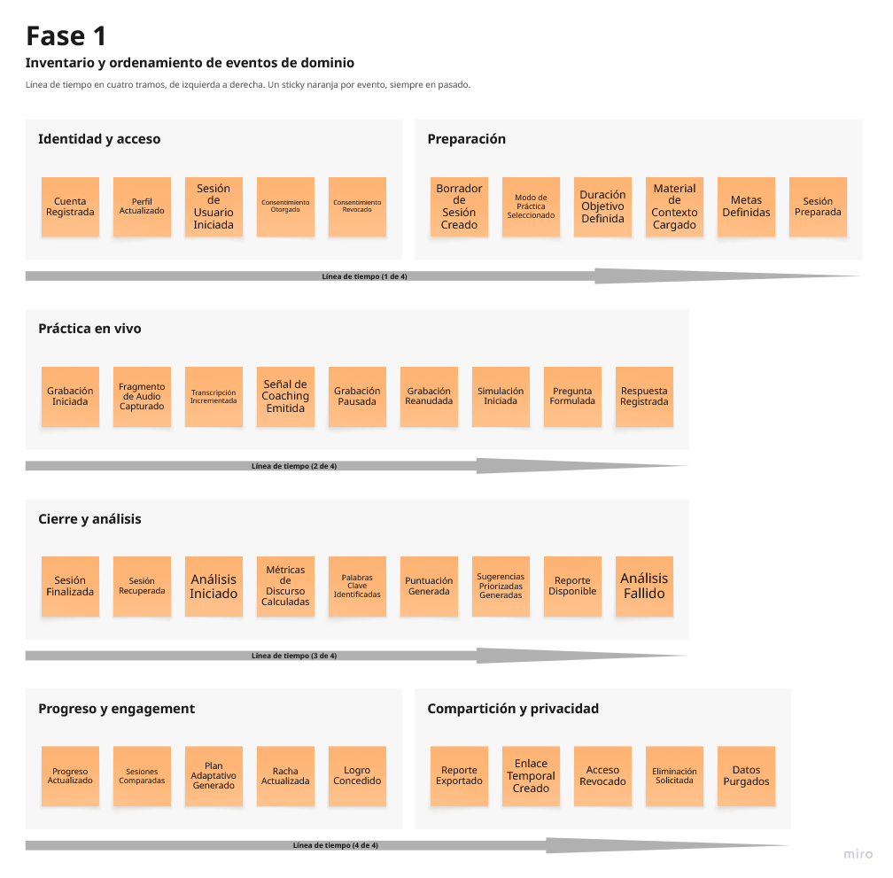

#### Fase 2: Comandos, actores, políticas y sistemas externos

Sobre los eventos, el equipo agregó los comandos que los originan, los actores que los emiten y las políticas que reaccionan en cadena. Esta fase hizo visible el contraste entre dos mundos que conviven en Talki: el **mundo síncrono en vivo** (comandos del estudiante que producen señales de coaching con restricción de latencia) y el **mundo asíncrono posterior** (cadena de políticas que transforma `Sesión Finalizada` en `Reporte Disponible`). También se marcaron los sistemas externos: Gemini Live API sostiene la conversación y la transcripción en vivo. El procesamiento posterior utiliza la evidencia autorizada reunida al cierre; una futura capacidad externa de análisis requerirá ampliar explícitamente el contrato de la pasarela.

#### Fase 3: Eventos pivote y hot spots

El equipo marcó como **eventos pivote** aquellos que implican un cambio de estado estructural en el proceso de negocio:

| Evento pivote | Por qué es pivotal |
|---|---|
| `Consentimiento Otorgado` | Antes de él no puede procesarse voz ni material; condiciona todo el pipeline y materializa C-08. |
| `Grabación Iniciada` | Abre el mundo en vivo: captura, transcripción incremental y señales de coaching con presupuesto de latencia. |
| `Sesión Finalizada` | Cierra el mundo en vivo y activa la cadena asíncrona de análisis; exige idempotencia (QAS-REL-01). |
| `Reporte Disponible` | Momento en que el sistema entrega el valor central; habilita progreso, comparación y compartición. |
| `Acceso Revocado` / `Datos Purgados` | Cambio de estado de privacidad: el acceso debe cesar de inmediato y la eliminación propagarse (QAS-PRI-01). |

Las zonas en disputa se registraron como *hot spots* rosados y se resolvieron o dejaron en backlog con esa etiqueta:

| Hot Spot | Resolución durante la sesión o acción posterior |
|---|---|
| ¿La transcripción en vivo y la transcripción final son el mismo objeto? | Sí: la versión incremental se consolida al finalizar; el análisis consume la versión consolidada y versionada. |
| ¿Quién decide si una sesión es válida para puntuar? | La política de validez pertenece al ciclo de sesión; el análisis y la gamificación solo consumen el veredicto. |
| ¿Dónde vive el consentimiento? | Se registra una vez con la identidad y se propaga como estado verificable; no se consulta en línea en cada captura. |
| ¿Qué pasa si Gemini Live no responde a mitad de la sesión? | Degradación explícita: conservar estado confirmado, ofrecer cierre seguro o resultado parcial etiquetado (QAS-AVA-01). |
| ¿Cómo evitamos reportes duplicados por reintentos del bus? | Cada consumidor registra eventId. Analysis usa sesión/versión de análisis; Scoring añade versión de rúbrica; progreso conserva versiones y gamificación cuenta una sola contribución por sesión (ADD-05). |

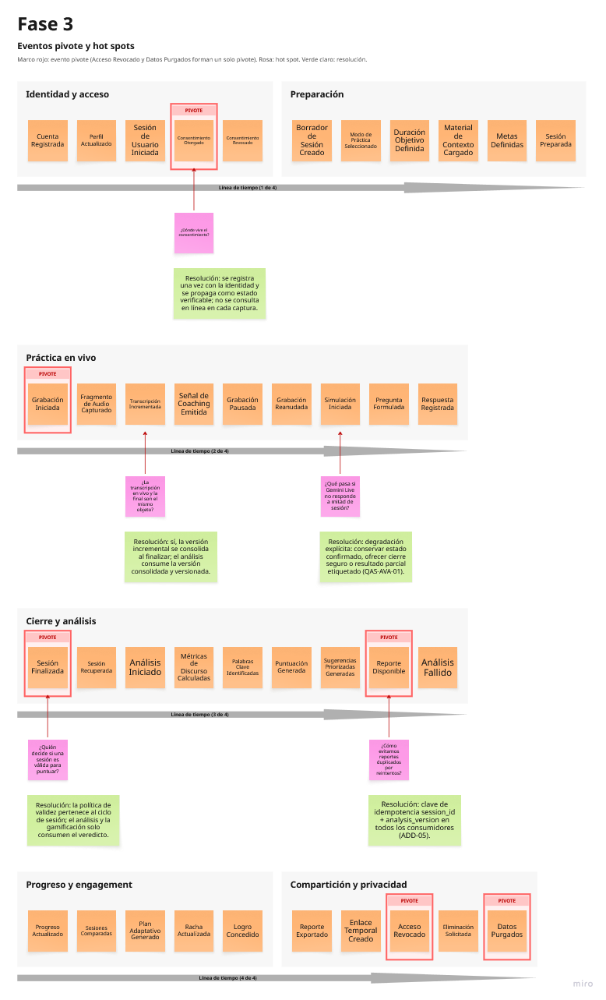

#### Resultado de la sesión

Al cierre quedaron ordenados los eventos del flujo completo, el puente entre el mundo en vivo y el pipeline asíncrono, y las primeras fronteras visibles: la gestión del ciclo de sesión, la conversación y señales en tiempo real, el análisis posterior, la puntuación, el progreso y el bloque de privacidad. Esta fotografia final del EventStorm es el insumo directo de la Candidate Context Discovery.

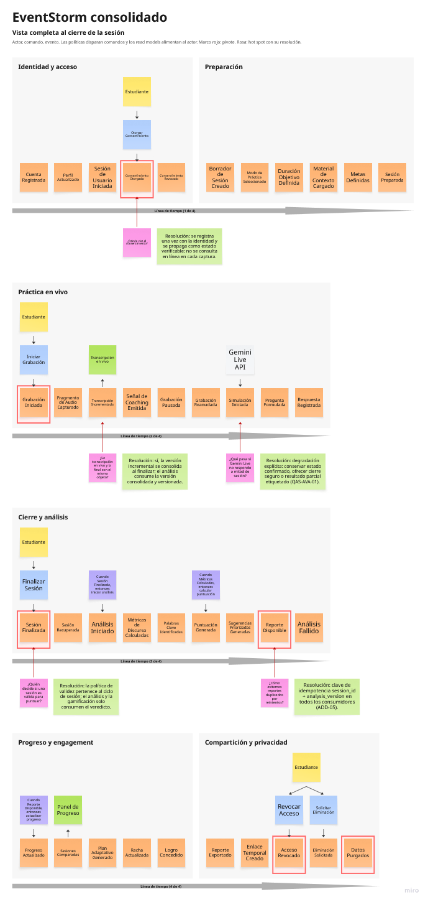

### 4.2.2. Candidate Context Discovery

#### Técnica aplicada

El equipo combinó dos de las técnicas propuestas: **look-for-pivotal-events** como método principal, porque los cinco eventos pivote delimitan con claridad los cambios de estado entre partes del proceso, y **start-with-value** como verificación, comprobando que las partes del dominio con mayor valor para el negocio (el coaching en vivo y el análisis del discurso con IA) quedaran dentro de fronteras propias y protegidas. La sesión de descubrimiento se realizó sobre el mismo tablero de Miro, duplicando el EventStorm consolidado para poder comparar los cambios progresivos; su duración fue menor a dos horas.

#### Proceso sobre el EventStorm

1. **Marcado de eventos pivote.** Se rodearon los cinco eventos pivote y se preguntó, para cada uno: ¿qué partes del sistema deben reaccionar y con qué lenguaje propio?
2. **Agrupación por políticas.** Cada política lila se adscribió al evento que la dispara, formando clusters naturales de eventos, comandos y reglas que cambian juntos.
3. **Verificación de lenguaje consistente.** Dentro de cada cluster se comprobó que los términos se usaran con un solo significado. Cuando un término (por ejemplo, "sesión") significaba cosas distintas a ambos lados de una frontera, la frontera se mantuvo.
4. **Verificación start-with-value.** Se confirmó que el núcleo de valor, analizar la oratoria y retroalimentarla, no quedara diluido en un contexto genérico de "IA".
5. **Trazado de fronteras candidatas.** Se dibujaron polígonos alrededor de cada cluster y se nombraron.
6. **Crítica.** Se cuestionó cada frontera: ¿es fragmentación innecesaria para un equipo de cinco personas? ¿los clusters cambian por razones distintas?

#### Cambios progresivos del EventStorm

La primera pasada produjo seis candidatos; la revisión de crítica separó la puntuación del análisis (rúbricas y explicaciones por segmento cambian por razones distintas que el procesamiento acústico y lingüístico) y elevó la pasarela de IA a contexto propio para impedir que el proveedor contamine el lenguaje del dominio (ADD-06). El conjunto final quedó así:

| Bounded context candidato | Eventos y políticas agrupados | Clasificación estratégica | Justificación |
|---|---|---|---|
| **Live Coaching** (Coaching en Vivo) | `Grabación Iniciada` → `Señal de Coaching Emitida`; conversación de simulación; gestión del canal en tiempo real. | **Core.** Diferenciador experiencial del producto. | La señal discreta dentro del umbral de latencia es la promesa central durante la práctica (QAS-PER-01). |
| **Speech Analysis** (Análisis del Discurso) | `Sesión Finalizada` → `Análisis Iniciado` → `Métricas de Discurso Calculadas`; detección de muletillas, silencios, volumen y vocabulario. | **Core.** Núcleo del valor de conocimiento. | Sin métricas confiables no hay feedback accionable (BG-02); reglas de procesamiento propias. |
| **Scoring & Feedback** (Puntuación y Retroalimentación) | `Métricas Calculadas` → `Puntuación Generada` → `Sugerencias Priorizadas Generadas`; explicación por segmento. | **Core.** Traduce métricas en mejora. | Rúbricas versionadas (C-09) y adaptación por segmento cambian por razones pedagógicas, no acústicas. |
| **Practice Session Management** (Gestión de Sesiones de Práctica) | Preparación completa, ciclo de estados, validez, material de contexto, recuperación (US09–US14, US23–US25, US30, US34). | **Supporting.** Habilita el core sin ser diferenciador. | Su máquina de estados y su política de validez son propias y estables. |
| **Progress & Adaptation** (Progreso y Adaptación) | `Progreso Actualizado`, comparación de sesiones, `Plan Adaptativo Generado` (US20–US22, US36). | **Supporting.** Sostiene el hábito. | Requiere modelo de lectura y versionado de métricas propio. |
| **Gamification** (Gamificación) | `Racha Actualizada`, `Logro Concedido`; reglas de validez para contar sesiones. | **Supporting.** Engagement. | Mecánicas de juego con lenguaje propio (streaks, logros) y alta tasa de experimentación. |
| **Identity & Access** (Identidad y Acceso) | `Cuenta Registrada`, autenticación, perfil, registro verificable de consentimiento (US05–US08, US28, C-08). | **Generic.** Resuelto con patrones conocidos. | No diferencia al producto; se requiere alta confiabilidad y un contrato de identidad estable. |
| **Sharing & Retention** (Compartición y Retención) | `Reporte Exportado`, `Enlace Temporal Creado`, `Acceso Revocado`, `Eliminación Solicitada` (US27, US32, US33). | **Supporting.** Confianza y colaboración. | PF-08 y QAS-PRI-01 exigen un único dueño de compartición, revocación y retención. |
| **AI Provider Gateway** (Pasarela de Proveedores de IA) | Contrato canónico hacia Gemini Live; aislamiento de proveedor y de sus capacidades exclusivas. | **Generic.** Capacidad técnica externa. | C-01 y QAS-INT-01: sustituir o agregar proveedores con cambios localizados. |
| **Notifications** (Notificaciones) | Consumo de evaluación y logros; avisos en la aplicación y ampliación por correo para cuenta y privacidad. | **Generic.** Utilitario. | Solo reacciona a hechos ya publicados por otros contextos. |

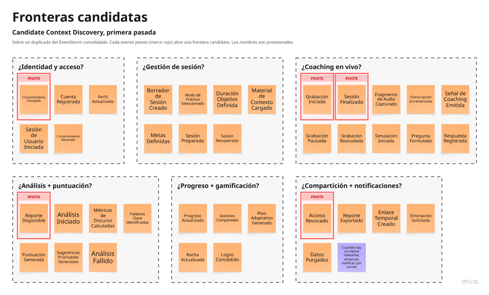

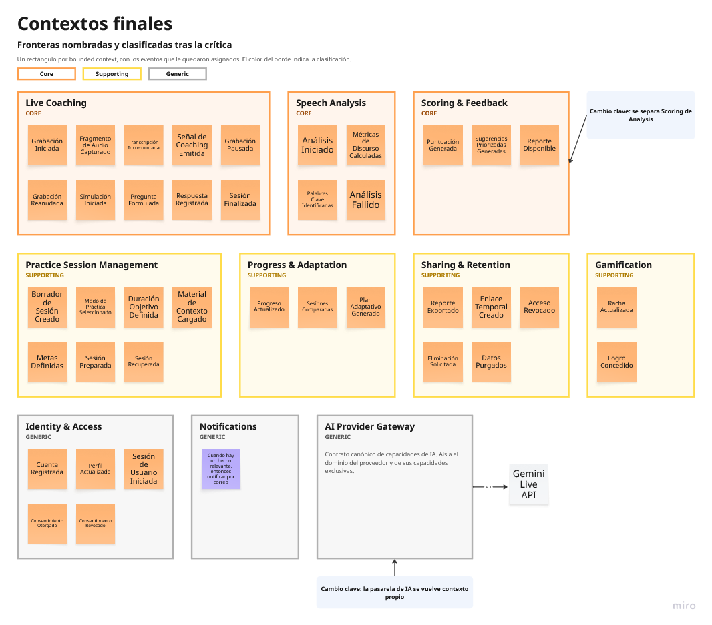

La decisión deliberada fue **no** crear un contexto por cada tabla o entidad, y **no** fragmentar más el core: Live Coaching, Speech Analysis y Scoring & Feedback permanecen separados porque sus razones de cambio difieren (latencia y conversación, procesamiento lingüístico, pedagogía y rúbricas), pero dentro de cada uno las capacidades comparten lenguaje y datos.

### 4.2.3. Domain Message Flows Modeling

Para visualizar cómo deben colaborar los bounded contexts, el equipo aplicó **Domain Storytelling**: cada escenario se narra como una secuencia numerada de frases con la estructura *actor → actividad → objeto de trabajo*, y cada actividad se asigna al bounded context que la ejecuta. Las sesiones se realizaron sobre el tablero de Miro con la plantilla de Domain Storytelling (actores como figuras, actividades como flechas numeradas y objetos de trabajo como documentos); como alternativa de detalle, el equipo dispone del Domain Storytelling Tool (domainstorytelling.org), que exporta los mismos diagramas en formato intercambiable. Se modelaron tres casos que cubren los dos segmentos objetivo y el bloque de privacidad.

#### DS-01: Primera práctica guiada (segmento 1: Valeria)

| # | Actor | Actividad | Objeto de trabajo | Bounded context ejecutor |
|---:|---|---|---|---|
| 1 | Estudiante | Se registra y otorga consentimiento | Cuenta, registro de consentimiento | Identity & Access |
| 2 | Estudiante | Crea y configura el ensayo (modo, duración, áreas de enfoque) | Borrador de sesión | Practice Session Management |
| 3 | Estudiante | Prueba el micrófono y autoriza la captura | Verificación de audio, permiso | Practice Session Management → Identity & Access (valida consentimiento) |
| 4 | Estudiante | Inicia la práctica | Sesión activa | Practice Session Management → Live Coaching |
| 5 | Live Coaching | Transcribe en vivo y emite señales de ritmo, volumen y pausas | Transcripción incremental, señales | Live Coaching (con AI Provider Gateway) |
| 6 | Estudiante | Finaliza y confirma | Sesión finalizada | Practice Session Management |
| 7 | Practice Session Management | Confirma la evidencia recibida de Live Coaching y publica `Sesión Finalizada` | Evento de cierre y veredicto de validez | Practice Session Management → Speech Analysis |
| 8 | Speech Analysis | Calcula métricas (muletillas, silencios, volumen, vocabulario) | Métricas de discurso | Speech Analysis |
| 9 | Scoring & Feedback | Genera puntuación, sugerencias priorizadas y explicación por segmento | Reporte | Scoring & Feedback |
| 10 | Progress & Adaptation | Actualiza progreso y compara con sesiones previas | Panel de progreso | Progress & Adaptation |
| 11 | Estudiante | Consulta el reporte y elige una acción de mejora | Reporte, plan de acción | Scoring & Feedback (reporte publicado) |

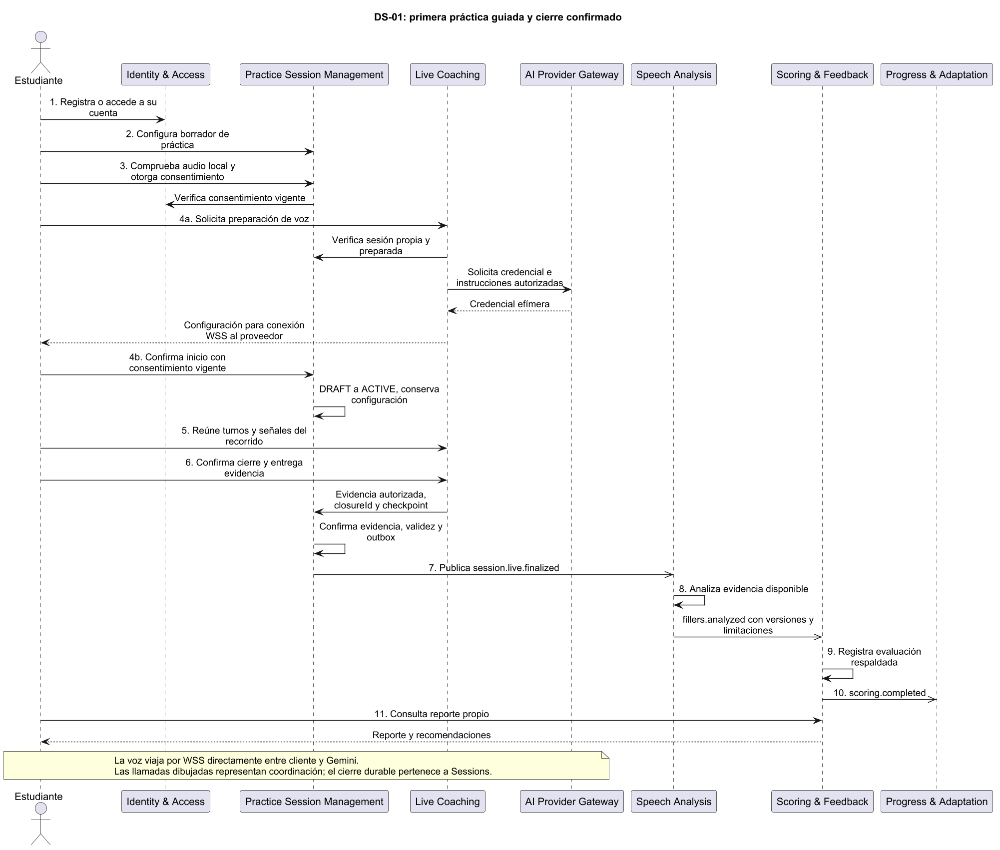

#### DS-02: Simulación contextualizada (segmento 2: Rodrigo)

| # | Actor | Actividad | Objeto de trabajo | Bounded context ejecutor |
|---:|---|---|---|---|
| 1 | Estudiante | Carga CV, oferta laboral o rúbrica | Material de contexto | Practice Session Management |
| 2 | Practice Session Management | Valida formato y registra el material autorizado | Material autorizado | Practice Session Management |
| 3 | Live Coaching | Solicita la contextualización del simulador | Configuración de simulación | Live Coaching → AI Provider Gateway |
| 4 | AI Provider Gateway | Traduce el contrato canónico al proveedor y contextualiza con material autorizado | Sesión de simulación con Gemini Live | AI Provider Gateway (ACL hacia Gemini) |
| 5 | Estudiante | Responde preguntas y repreguntas por voz | Turnos de conversación | Live Coaching |
| 6 | Live Coaching | Reúne la evidencia autorizada y solicita a Sessions confirmar el cierre | Transcripción consolidada, cierre y veredicto de validez | Live Coaching → Practice Session Management |
| 7 | Speech Analysis | Evalúa claridad de respuestas con el contexto autorizado | Métricas y cobertura temática | Speech Analysis |
| 8 | Scoring & Feedback | Genera reporte por competencia con evidencia trazable | Reporte avanzado | Scoring & Feedback |
| 9 | Notifications | Notifica que el reporte está disponible | Notificación | Notifications |

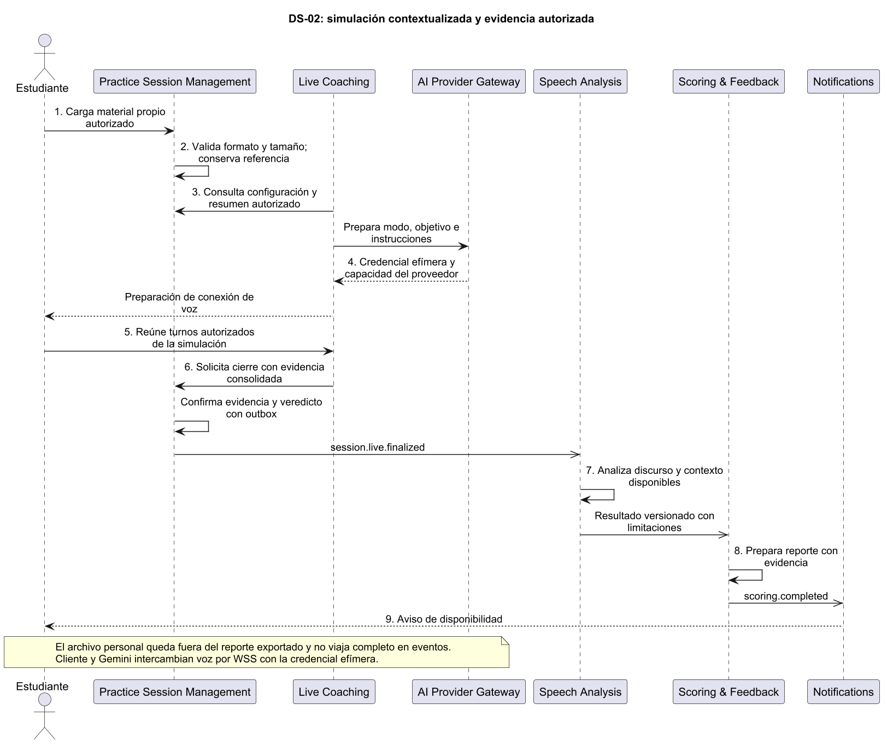

#### DS-03: Compartir y revocar un reporte (colaboración con tutor)

| # | Actor | Actividad | Objeto de trabajo | Bounded context ejecutor |
|---:|---|---|---|---|
| 1 | Estudiante | Solicita compartir el reporte con su tutor | Solicitud de enlace | Sharing & Retention |
| 2 | Sharing & Retention | Crea un enlace temporal con expiración | Enlace de acceso temporal | Sharing & Retention |
| 3 | Tutor | Abre el enlace y consulta el reporte | Vista de solo lectura | Sharing & Retention (consulta el reporte publicado) |
| 4 | Estudiante | Revoca el acceso | Orden de revocación | Sharing & Retention |
| 5 | Sharing & Retention | Invalida el enlace de inmediato y publica `Acceso Revocado` | Evento de revocación | Sharing & Retention → Notifications |
| 6 | Estudiante | Solicita eliminar una sesión | Orden de eliminación | Sharing & Retention |
| 7 | Sharing & Retention | Confirma el bloqueo en Sessions y después solicita la purga de los datos | Bloqueo de acceso, órdenes y confirmaciones de purga | Sessions, Speech Analysis, Scoring, Progress, Gamification y Notifications |
| 8 | Notifications | Informa al usuario el resultado de la acción | Notificación | Notifications |

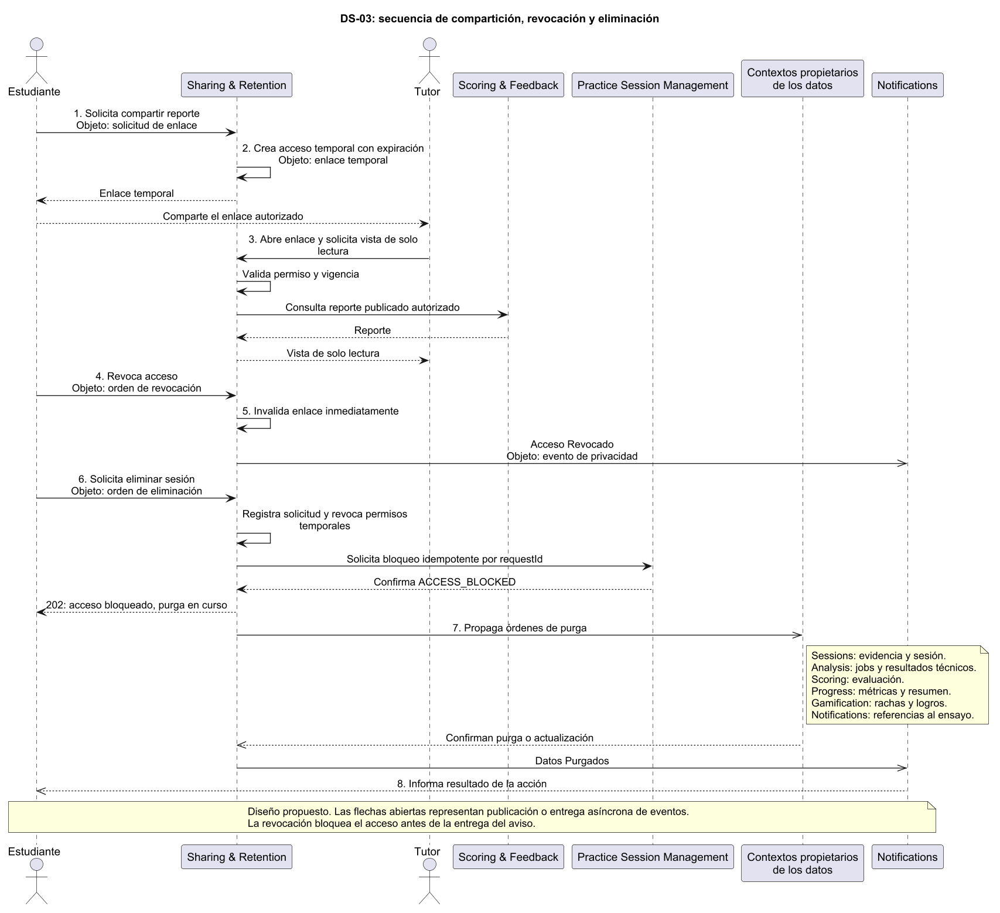

Los tres flujos confirmaron las fronteras: Sessions entrega a Live Coaching un resumen del material autorizado; Live incorpora ese resumen en las instrucciones de preparación enviadas a la pasarela y el consentimiento actúa como compuerta previa a la captura. Sharing & Retention invalida el permiso antes de responder a la revocación; después comunica el cambio por eventos a los demás contextos, manteniendo el bloqueo de nuevas consultas independiente de la entrega de avisos.

### 4.2.4. Bounded Context Canvases

Cada canvas se elaboró siguiendo un proceso iterativo con seis pasos: (1) **Context Overview Definition**: propósito y clasificación estratégica; (2) **Business Rules Distillation & Ubiquitous Language Capture**: reglas de negocio esenciales y glosario propio; (3) **Capability Analysis**: capacidades que el contexto ofrece; (4) **Capability Layering**, cuando aplica: organización de capacidades en capas (núcleo, soporte, adaptación); (5) **Dependencies Capture**: de qué contextos depende y quiénes dependen de él; y (6) **Design Critique**: revisión crítica que validó o ajustó la frontera. Los canvas se presentan en orden de importancia para el negocio, empezando por el core.

#### 1. Live Coaching (Coaching en Vivo)

| Sección | Contenido |
|---|---|
| Clasificación estratégica | Core domain. Diferenciador experiencial: acompañamiento discreto mientras el estudiante habla. |
| Propósito | Sostener la interacción por voz en tiempo cercano al real: capturar audio, transcribir incrementalmente, conducir simulaciones y emitir señales de coaching sin interrumpir el discurso. |
| Lenguaje ubicuo | Señal de coaching, transcripción incremental, turno de conversación, repregunta, fragmento de audio, canal en vivo. |
| Capacidades clave | Gestionar el canal en vivo (WebSocket); transcribir incrementalmente; generar señales de ritmo/volumen/pausas; conducir la simulación con turnos y tiempos; consolidar la transcripción al cierre. |
| Hechos producidos | `Grabación Iniciada`, `Transcripción Incrementada` y `Señal de Coaching Emitida` durante el recorrido. Live entrega la evidencia de cierre a Sessions; Sessions publica `Sesión Finalizada` después de confirmarla. |
| Eventos consumidos | `Sesión Preparada` (Practice Session Management), `Consentimiento Otorgado` (Identity & Access). |
| Reglas de negocio | Ninguna captura sin consentimiento válido y prueba de audio; las señales pueden silenciarse pero nunca bloquean la captura; la finalización ocurre una sola vez por sesión. |
| Dependencias | Aguas arriba: Practice Session Management (Customer/Supplier), Identity & Access (Conformist). Entrega evidencia a Practice Session Management para el cierre durable. Hacia AI Provider Gateway: Customer/Supplier para preparar la credencial. |
| Capas de capacidades | Núcleo de tiempo real (canal, señales); soporte de conversación (simulación); adaptación (pasarela de IA). |
| Crítica de diseño | Se evaluó separar "captura" y "conversación de simulación"; se rechazó para el piloto por compartir restricciones de latencia y equipo; se documenta como posible partición futura si escala la concurrencia. |

#### 2. Speech Analysis (Análisis del Discurso)

| Sección | Contenido |
|---|---|
| Clasificación estratégica | Core domain. Núcleo del valor de conocimiento: convertir el discurso en métricas confiables. |
| Propósito | Procesar la transcripción consolidada y la evidencia acústica/contextual disponible. Producir métricas y hallazgos de fluidez, claridad, volumen y vocabulario; no inferir volumen o confianza solo del texto ni generar dimensiones sin soporte. |
| Lenguaje ubicuo | Métrica de discurso, muletilla, proporción de silencios, estabilidad de volumen, riqueza léxica, versión de análisis, evidencia. |
| Capacidades clave | Iniciar y procesar el análisis; calcular métricas dimensionales; identificar muletillas y palabras clave; consultar estado y reintentar (US37); versionar cada ejecución de análisis. |
| Eventos publicados | `Análisis Iniciado`, `Métricas de Discurso Calculadas`, `Análisis Fallido`. |
| Eventos consumidos | `Sesión Finalizada` (Practice Session Management), con evidencia y contexto autorizados. |
| Reglas de negocio | Un único resultado por `session_id + analysis_version` (idempotencia, ADD-05); una sesión sin evidencia suficiente se marca como tal sin fabricar conclusiones; el procesamiento usa solo material autorizado. |
| Dependencias | Aguas arriba: Practice Session Management (Customer/Supplier vía lenguaje publicado). Aguas abajo: Scoring & Feedback (recibe las métricas y conserva el reporte). Speech Analysis no conserva una copia de negocio del reporte. |
| Capas de capacidades | Ingesta y consolidación; enriquecimiento lingüístico y acústico; cómputo de métricas versionadas. |
| Crítica de diseño | Se evaluó un Shared Kernel de definiciones de métricas con Scoring & Feedback; se rechazó en favor de un lenguaje publicado versionado (C-09) para preservar autonomía de despliegue. |

#### 3. Scoring & Feedback (Puntuación y Retroalimentación)

| Sección | Contenido |
|---|---|
| Clasificación estratégica | Core domain. Traduce métricas en mejora concreta: el Voice Coach Score y las acciones priorizadas. |
| Propósito | Generar la puntuación integral, fortalezas y oportunidades, sugerencias con evidencia y explicaciones adaptadas al segmento académico. |
| Lenguaje ubicuo | Voice Coach Score, sugerencia priorizada, rúbrica versionada, evidencia, recomendación por segmento. |
| Capacidades clave | Calcular el Voice Coach Score por rúbrica; priorizar sugerencias y asociarlas a evidencia; adaptar la explicación al segmento (US26); versionar rúbricas y resultados. |
| Eventos publicados | `Puntuación Generada`, `Sugerencias Priorizadas Generadas`, `Reporte Disponible`. |
| Eventos consumidos | `Métricas de Discurso Calculadas` (Speech Analysis), `Análisis Fallido`. |
| Reglas de negocio | Todo resultado indica versión de rúbrica y de análisis (C-09); las sugerencias referencian evidencia del discurso; la validez de la sesión la declara Practice Session Management, no este contexto. |
| Dependencias | Aguas arriba: Speech Analysis (Customer/Supplier). Aguas abajo: Progress & Adaptation y Gamification (consumen la evaluación), Sharing & Retention (consulta el reporte publicado) y Notifications (recibe el aviso de disponibilidad). |
| Crítica de diseño | La separación respecto de Speech Analysis fue la principal decisión de la crítica: rúbricas y pedagogía cambian por razones distintas que el procesamiento acústico-lingüístico. |

#### 4. Practice Session Management (Gestión de Sesiones de Práctica)

| Sección | Contenido |
|---|---|
| Clasificación estratégica | Supporting subdomain. Orquesta el ciclo de vida del ensayo; habilita al core sin ser diferenciador. |
| Propósito | Crear, configurar, validar y cerrar sesiones de práctica; administrar el material de contexto y declarar la validez de cada sesión. |
| Lenguaje ubicuo | Borrador de sesión, modo de práctica (pitch, exposición, entrevista, sustentación), duración objetivo, área de enfoque, material autorizado, sesión válida. |
| Capacidades clave | Crear borrador y configurar sesión; validar micrófono y consentimiento previos (US29); recibir y autorizar material (US30); gestionar estados (pausa, reanudación, recuperación US34); declarar validez para puntuación. |
| Eventos publicados | `Borrador de Sesión Creado`, `Material de Contexto Cargado`, `Sesión Preparada`, `Sesión Recuperada`, `Sesión Finalizada` y veredicto de validez. |
| Eventos consumidos | `Cuenta Registrada` / `Consentimiento Otorgado` (Identity & Access). |
| Reglas de negocio | No se inicia sin consentimiento y prueba de audio; el borrador es cancelable; la validez se declara una vez y los consumidores la respetan (hot spot resuelto en 4.2.1). |
| Dependencias | Aguas arriba: Identity & Access (Conformist). Aguas abajo: Live Coaching, Speech Analysis y Gamification (Customer/Supplier: consumen sus eventos). |
| Crítica de diseño | La política de validez se mantiene aquí y se publica como hecho, evitando que análisis o gamificación reimplementen criterios divergentes. |

#### 5. Progress & Adaptation (Progreso y Adaptación)

| Sección | Contenido |
|---|---|
| Clasificación estratégica | Supporting subdomain. Sostiene el hábito mediante evidencia de evolución. |
| Propósito | Consolidar el historial, mostrar tendencias por habilidad, comparar sesiones compatibles y generar el plan adaptativo de ejercicios. |
| Lenguaje ubicuo | Panel de progreso, tendencia, sesión compatible, plan adaptativo, meta de mejora. |
| Capacidades clave | Consultar historial propio (US20); calcular tendencias con versiones de métricas (US21); comparar sesiones (US22); generar plan adaptativo justificado (US36). |
| Eventos publicados | `Progreso Actualizado`, `Plan Adaptativo Generado`. |
| Eventos consumidos | `Reporte Disponible`, `Puntuación Generada` (Scoring & Feedback), `Sesión Finalizada` (para comparabilidad). |
| Reglas de negocio | Solo se comparan sesiones compatibles por versión de rúbrica y análisis; los cambios pequeños no se sobredimensionan; el plan explica por qué recomienda cada ejercicio. |
| Dependencias | Aguas arriba: Scoring & Feedback (Customer/Supplier). La evaluación recibida permite consolidar el progreso. Gamification recibe la misma evaluación desde Scoring & Feedback y aplica sus propias reglas de racha. |
| Crítica de diseño | Se evaluó mover el plan adaptativo a Scoring & Feedback; se rechazó porque depende del historial longitudinal que este contexto posee. |

#### 6. Sharing & Retention (Compartición y Retención)

| Sección | Contenido |
|---|---|
| Clasificación estratégica | Supporting subdomain. Dueño de la confianza: compartición controlada y cumplimiento de retención. |
| Propósito | Exportar reportes, crear accesos temporales revocables y propagar la eliminación de datos bajo control exclusivo del propietario. |
| Lenguaje ubicuo | Enlace temporal, expiración, revocación, eliminación lógica, purga, política de retención. |
| Capacidades clave | Exportar transcripción y feedback (US27); crear y revocar enlaces (US32); iniciar eliminación y purga auditable (US33); administrar la política de retención (C-02). |
| Eventos publicados | `Reporte Exportado`, `Enlace Temporal Creado`, `Acceso Revocado`, `Eliminación Solicitada`, `Datos Purgados`. |
| Eventos consumidos | `Reporte Disponible` (para saber qué es compartible), veredicto de validez. |
| Reglas de negocio | Un enlace revocado deja de otorgar acceso de inmediato (QAS-PRI-01); el borrado lógico se completa en minutos y la purga física según política; la auditoría no registra contenido privado. |
| Dependencias | Aguas arriba: Scoring & Feedback (Customer/Supplier para consultar el reporte publicado). Aguas abajo: los contextos propietarios de datos reciben órdenes de purga; Notifications recibe los hechos de privacidad. |
| Crítica de diseño | Concentrar compartición, revocación y retención en un solo contexto evita criterios de privacidad dispersos; se descartó repartir estas capacidades entre los contextos dueños de los datos. |

#### 7. Gamification (Gamificación)

| Sección | Contenido |
|---|---|
| Clasificación estratégica | Supporting subdomain. Engagement con lenguaje y ritmo de cambio propios. |
| Propósito | Incentivar la práctica constante con rachas, niveles y logros alineados al calendario académico. |
| Lenguaje ubicuo | Racha, logro, nivel, hito, práctica válida. |
| Capacidades clave | Actualizar rachas; conceder logros una sola vez (US35); exponer el estado de engagement. |
| Eventos publicados | `Racha Actualizada`, `Logro Concedido`. |
| Eventos consumidos | Evaluación completada (Scoring & Feedback), junto con la validez declarada por Practice Session Management. |
| Reglas de negocio | Las sesiones inválidas no cuentan; cada logro se concede una sola vez; compartir un logro es opcional. |
| Dependencias | Aguas arriba: Scoring & Feedback y Practice Session Management (Conformist a la evaluación y al veredicto de validez publicados). Aguas abajo: Notifications recibe los logros. |
| Crítica de diseño | Se evaluó fusionar con Progress & Adaptation; se rechazó: la gamificación experimenta mecánicas con alta frecuencia, mientras el progreso exige estabilidad histórica. |

#### 8. Identity & Access (Identidad y Acceso)

| Sección | Contenido |
|---|---|
| Clasificación estratégica | Generic subdomain. Resuelto con patrones estándar, alta exigencia de confiabilidad. |
| Propósito | Autenticar usuarios, gestionar cuentas y perfil, y emitir tokens de corta duración y consentimientos verificables. |
| Lenguaje ubicuo | Cuenta, token de acceso, refresh rotativo, consentimiento verificable, propiedad del recurso. |
| Capacidades clave | Registrar y verificar cuentas (US05); autenticar y revocar sesiones (US06, US28); gestionar perfil (US08); registrar consentimiento con versión aceptada (C-08); validar identidad y propiedad. |
| Eventos publicados | `Cuenta Registrada`, `Consentimiento Otorgado`, `Consentimiento Revocado`. |
| Eventos consumidos | Ninguno; es el origen de la cadena de confianza. |
| Reglas de negocio | Los errores de autenticación no revelan qué credencial falló; el consentimiento registra la versión aceptada y condiciona todo procesamiento posterior. |
| Dependencias | Aguas arriba de todos: expone un Open Host Service de validación de identidad; los demás contextos son Conformist a su modelo de claims. |
| Crítica de diseño | El consentimiento vive aquí como registro verificable (quién, qué, cuándo, versión); la ejecución de la privacidad (compartir, revocar, borrar) pertenece a Sharing & Retention. |

#### 9. AI Provider Gateway (Pasarela de Proveedores de IA)

| Sección | Contenido |
|---|---|
| Clasificación estratégica | Generic subdomain. Capacidad técnica que aísla al dominio del proveedor externo (C-01). |
| Propósito | Preparar credenciales efímeras e instrucciones autorizadas mediante un contrato independiente del proveedor, iniciando por Gemini Live. La voz viaja directamente entre cliente y proveedor; la pasarela no transporta audio ni ejecuta el análisis posterior. |
| Lenguaje ubicuo | Contrato canónico, capacidad declarada, adaptador de proveedor, Anti-Corruption Layer. |
| Capacidades clave | Negociar capacidades del proveedor; traducir contratos; medir latencia y disponibilidad por proveedor; conmutar proveedor por configuración. |
| Eventos publicados | Hechos de operación (proveedor degradado, disponible) para observabilidad. |
| Peticiones recibidas | Preparación interna de credenciales desde Live Coaching. |
| Reglas de negocio | Solo el material autorizado sale hacia el proveedor; las capacidades exclusivas de un proveedor se declaran opcionales y no contaminan el contrato común (QAS-INT-01). |
| Dependencias | Colabora con Live Coaching mediante un contrato interno de preparación. Aguas abajo: Gemini Live API mediante Anti-Corruption Layer. |
| Crítica de diseño | Se evaluó que cada contexto integre al proveedor por su cuenta; se rechazó porque duplicaría traducción, límites de consumo y controles de privacidad. |

#### 10. Notifications (Notificaciones)

| Sección | Contenido |
|---|---|
| Clasificación estratégica | Generic subdomain. Utilitario puro, reacciona a hechos publicados. |
| Propósito | Informar a los usuarios los hechos relevantes (reporte disponible, revocaciones, eventos de cuenta) mediante avisos en la aplicación y correo electrónico propuesto. |
| Lenguaje ubicuo | Notificación, plantilla, destinatario, preferencia de contacto. |
| Capacidades clave | Entregar avisos autenticados en la aplicación; ampliar la entrega por correo con plantillas versionadas y preferencias de contacto. |
| Eventos publicados | Hechos de entrega para observabilidad. |
| Eventos consumidos | `Reporte Disponible`, `Logro Concedido` y, como ampliación, `Acceso Revocado`, `Datos Purgados`, `Cuenta Registrada`. |
| Reglas de negocio | Ninguna notificación incluye contenido de reporte en el cuerpo del correo; los enlaces referencian accesos controlados por Sharing & Retention. |
| Dependencias | Aguas arriba: múltiples contextos mediante el lenguaje publicado de eventos (colaboración por eventos). |
| Crítica de diseño | Mantenerlo como contexto propio y consumidor pasivo evita que cada dominio incorpore envío de correos; se descartó un shared service embebido en otros contextos. |

### 4.2.5. Context Mapping

#### Proceso de elaboración

Con las dependencias capturadas en cada Bounded Context Canvas, el equipo realizó una sesión de revisión para producir el context map: la visualización de las relaciones estructurales entre los bounded contexts. Para cada relación candidata se discutió qué patrón de DDD la describe mejor, qué contrato la materializa (evento versionado, API REST, contrato canónico de IA) y qué equipo es customer y cuál supplier. El insumo fue la información recolectada en las secciones anteriores: hot spots resueltos, flujos de Domain Storytelling y las decisiones ADD-01 a ADD-14.

#### Alternativas exploradas

Siguiendo la recomendación de discutir alternativas antes de fijar el mapa, el equipo respondió explícitamente las preguntas de transformación:

| Pregunta | Alternativa analizada | Decisión y justificación |
|---|---|---|
| ¿Qué pasaría si movemos este capability a otro bounded context? | Mover la generación del plan adaptativo de Progress & Adaptation a Scoring & Feedback. | Rechazado: el plan depende del historial longitudinal que solo Progress posee; moverlo crearía una dependencia de lectura cruzada peor que la actual. |
| ¿Qué pasaría si descomponemos este capability y movemos un sub-capability a otro bounded context? | Dividir Speech Analysis en "cómputo de métricas" y "generación de recomendaciones". | Parcialmente adoptado: la separación efectiva se hizo entre Speech Analysis (métricas) y Scoring & Feedback (recomendaciones y puntuación); una división adicional no aporta porque ambas comparten el lenguaje del reporte. |
| ¿Qué pasaría si partimos el bounded context en múltiples bounded contexts? | Partir Live Coaching en "captura/transcripción" y "conversación de simulación". | Rechazado para el piloto: comparten canal, presupuesto de latencia y equipo; se documenta como partición futura si la concurrencia de simulaciones escala. |
| ¿Qué pasaría si tomamos capabilities de varios contexts para formar un nuevo context? | Formar un contexto "Consentimiento y Privacidad" con capacidades de Identity & Access y Sharing & Retention. | Rechazado: el registro del consentimiento es un hecho de identidad (quién aceptó qué versión), mientras que la ejecución de la privacidad es operativa; unificarlas acoplaría disponibilidad de inicio de sesión con operación de borrado. |
| ¿Qué pasaría si duplicamos una funcionalidad para romper la dependencia? | Duplicar la verificación de consentimiento en Live Coaching y Practice Session Management. | Adoptado con matices: el estado de consentimiento se propaga como claim firmado y los contextos lo verifican localmente al iniciar la captura, rompiendo la dependencia en línea con Identity & Access en el camino caliente (QAS-PER-01). |
| ¿Qué pasaría si creamos un shared service para reducir la duplicación? | Convertir Notifications en un shared service invocado por cada contexto; o un "servicio de métricas" compartido entre análisis y scoring. | Notificaciones se mantiene como contexto genérico que consume eventos publicados (no compartido, desacoplado); el servicio de métricas compartido se rechazó por reatar la autonomía de despliegue del core. |
| ¿Qué pasaría si aislamos los core capabilities y movemos los otros a un context aparte? | Aislar las capacidades core de Live Coaching, Speech Analysis y Scoring & Feedback del resto. | Ya materializado: la clasificación core/supporting/generic del mapa protege al core, y las capacidades genéricas (identidad, IA, notificaciones) viven en contextos aparte. |

#### Discusión del Shared Kernel

El equipo evaluó explícitamente un **Shared Kernel** de definiciones de métricas entre Speech Analysis y Scoring & Feedback, pues ambos hablan de fluidez, claridad, volumen, vocabulario y confianza. Se rechazó por tres razones: (1) obligaría a coordinar despliegues de dos contextos core para cualquier ajuste, justo donde se espera más experimentación; (2) la restricción C-09 ya exige versionar rúbricas y análisis, por lo que un **lenguaje publicado versionado** (Published Language) alcanza la consistencia sin acoplamiento; y (3) el equipo de cinco estudiantes no puede sostener la gobernanza continua que exige un kernel compartido. Las definiciones canónicas viajan como contratos de eventos versionados y cualquier cambio incompatible crea una nueva versión, no una edición.

#### Mapa de relaciones entre bounded contexts

| Upstream | Downstream | Patrón DDD | Contrato que lo materializa | Justificación |
|---|---|---|---|---|
| Identity & Access | Todos los contextos | Open Host Service + Published Language; downstream **Conformist** | Tokens firmados y claims de consentimiento; API de validación estable | Ningún contexto reinventa identidad ni consentimiento; adoptan el modelo de claims tal cual. |
| Practice Session Management | Live Coaching, Speech Analysis, Gamification | Customer/Supplier + Published Language | Eventos de ciclo de vida y veredicto de validez versionados | El ciclo de sesión alimenta al resto; los consumidores se adaptan al contrato publicado. |
| Live Coaching | Practice Session Management | Customer/Supplier | Evidencia autorizada y petición idempotente de cierre | Sessions confirma el cambio y su outbox antes de entregar el evento al análisis. |
| Speech Analysis | Scoring & Feedback | Customer/Supplier + Published Language | Esquema versionado de métricas de discurso | Consistencia entre versiones sin Shared Kernel (C-09). |
| Scoring & Feedback | Progress & Adaptation, Gamification, Sharing & Retention | Customer/Supplier + Published Language | Evaluación completada (`scoring.completed`) y consulta del reporte publicado | Progreso y gamificación reciben la evaluación; compartición referencia el reporte conservado por Scoring. |
| AI Provider Gateway | Live Coaching | Open Host Service + Published Language, relación Customer/Supplier | Preparación de credencial, capacidad del modo y vigencia | La pasarela ofrece el contrato estable; Live es su consumidor y mantiene separada la voz WSS del cierre de Sessions. |
| AI Provider Gateway | Gemini Live API (externo) | **Anti-Corruption Layer** | Adaptador de proveedor + negociación de capacidades | Impide que el modelo del proveedor contamine el lenguaje del dominio (ADD-06, QAS-INT-01). |
| Practice Session Management, Scoring & Feedback | Gamification | **Conformist** | Veredicto de validez y evaluación completada | La gamificación respeta la validez de la sesión y calcula rachas/logros a partir de la evaluación recibida. |
| Scoring & Feedback | Sharing & Retention | Customer/Supplier | Consulta de reportes publicados | La compartición no duplica reportes; referencia los existentes. |
| Sharing & Retention | Practice Session Management, Speech Analysis, Scoring & Feedback, Progress & Adaptation, Gamification, Notifications | Customer/Supplier + Published Language | Órdenes de purga y confirmaciones | La eliminación de evidencia, evaluaciones, progreso y rachas respeta la propiedad de datos de cada contexto. |
| Múltiples contextos | Notifications | Colaboración por eventos (Published Language) | Eventos de dominio versionados en el bus | Notifications no aparece como dependencia síncrona de nadie. |

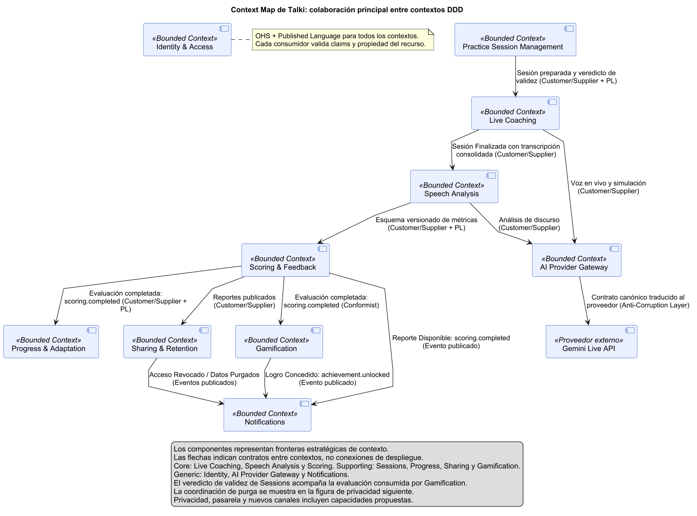

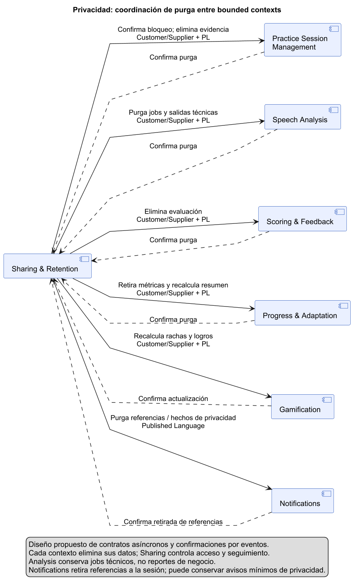

Los nombres de negocio de los canvases se concretan en los contratos técnicos: `Sesión Finalizada` corresponde a `session.live.finalized`, las métricas iniciales a `fillers.analyzed`, la evaluación disponible a `scoring.completed` y el logro a `achievement.unlocked`. Los eventos de consentimiento, privacidad y ampliación de canales siguen siendo requisitos del diseño.

#### Conclusión del context mapping

El mapa resultante protege tres propiedades: (1) el **core** (Live Coaching, Speech Analysis, Scoring & Feedback) solo depende de contratos publicados y de una pasarela con Anti-Corruption Layer, nunca de detalles de proveedores ni de contextos genéricos; (2) la **privacidad** revoca permisos localmente y exige confirmar el bloqueo en Sessions antes de aceptar una eliminación; la purga posterior se coordina por eventos y confirmaciones; y (3) la **evolución**, que comprende nuevos modos, rúbricas o proveedores, queda confinada a un contexto por tipo de cambio. Este mapa es el insumo directo de los diagramas C4 de la sección 4.3 y de la descomposición táctica del capítulo V.

## 4.3. Software Architecture

Las vistas C4 describen la arquitectura objetivo de Talki y mantienen los diez bounded contexts definidos en DDD. El diseño distingue los límites del sistema, los procesos que pueden desplegarse y sus componentes internos. Cada relación identifica su propósito y, cuando comunica procesos distintos, el protocolo previsto. Las ampliaciones se rotulan como propuestas; los diagramas no constituyen evidencia de servicios desplegados.

### 4.3.1. System Landscape Diagram

El paisaje sitúa Talki en el ecosistema de preparación oral. Los estudiantes de ciclos iniciales utilizan el sistema para ensayar exposiciones; los de ciclos avanzados lo emplean para entrevistas y sustentaciones. El tutor o profesor consulta únicamente un reporte compartido con permiso vigente. Gemini Live participa en la conversación de voz y la transcripción; el proveedor de correo propuesto apoyará la recuperación de cuenta y los avisos de privacidad.

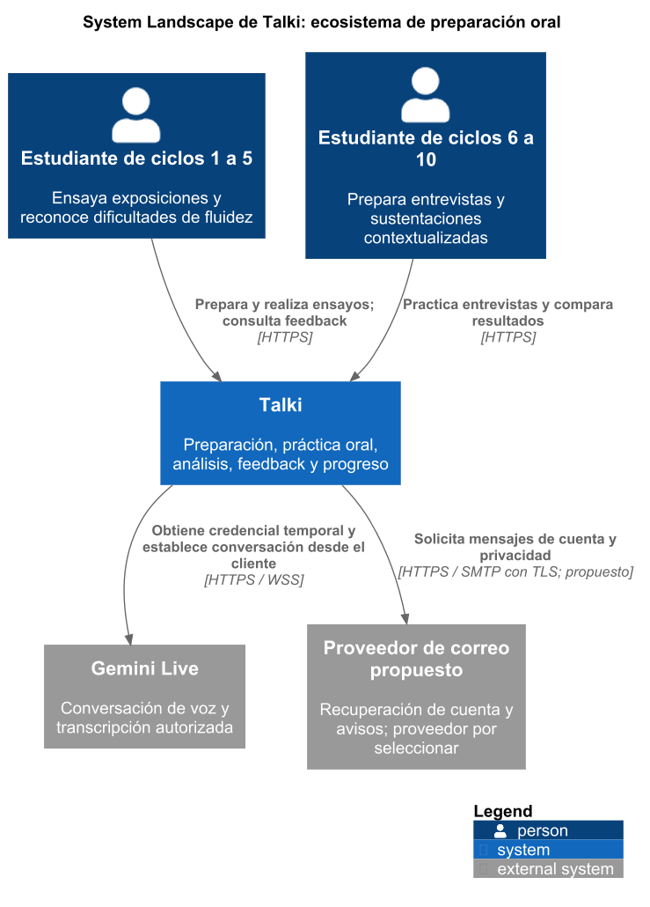

### 4.3.2. Context Level Diagrams

La frontera de Talki agrupa las capacidades de práctica, feedback, progreso y control de la información. Los usuarios interactúan por HTTPS. La integración de voz prepara una credencial efímera por HTTPS y establece el canal WSS desde el cliente hacia Gemini Live. El correo es una dependencia propuesta cuyo proveedor y mecanismo de entrega deberán configurarse. No se representan clases ni bases de datos internas en esta vista de contexto.

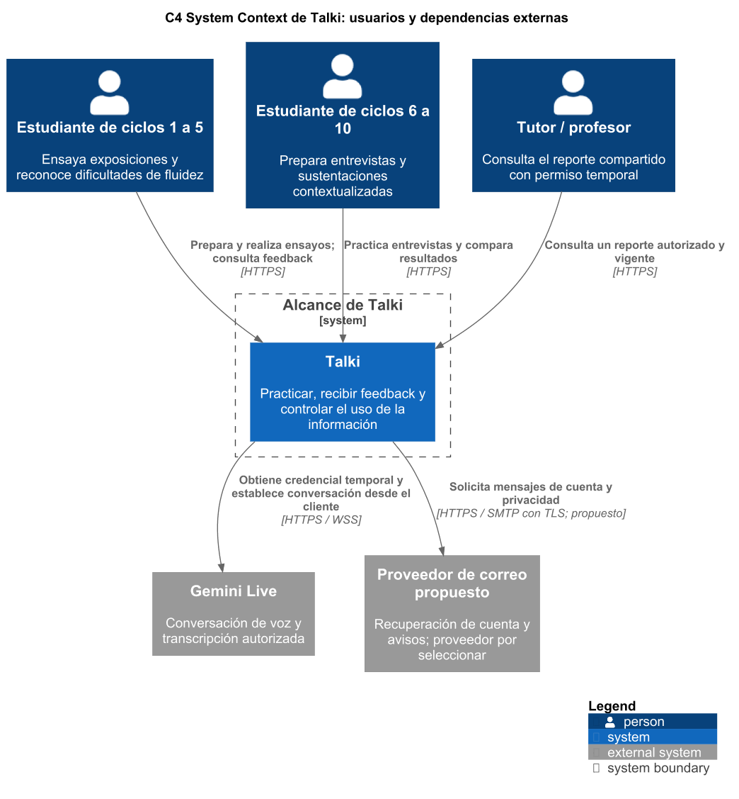

### 4.3.3. Container Level Diagrams

El cliente web ofrece el recorrido de preparación y revisión; el cliente Flutter es una ampliación móvil. Para la aplicación de este curso se seleccionan Angular, TypeScript y Angular Material, conforme al enunciado; la landing utiliza HTML5, CSS3 y JavaScript. Las pantallas de Talki conservan su identidad visual y son referencias UX, no evidencia de que la implementación Angular esté terminada. La adopción móvil cross-platform con Flutter es una propuesta que deberá justificar cobertura y distribución antes de implementar. La arquitectura objetivo propone un API Gateway/BFF para enrutar operaciones y aplicar políticas comunes. Los servicios se organizan por responsabilidad de contexto: Identity & Access, Practice Session Management, Live Coaching, Speech Analysis, Scoring & Feedback, Progress & Adaptation, Sharing & Retention, Gamification, AI Provider Gateway y Notifications.

RabbitMQ conecta el procesamiento asíncrono: Practice Session Management publica `session.live.finalized` después de confirmar el cierre recibido de Live Coaching, Speech Analysis produce `fillers.analyzed` y Scoring & Feedback publica `scoring.completed` después de conservar la evaluación. Progress y Gamification consumen ese resultado; Notifications recibe eventos de evaluación y logro. El broker incorpora confirmaciones, reintentos y una cola de fallos como requisitos del diseño. La voz sigue el canal cliente–Gemini Live por WSS, evitando presentar el broker como transporte de audio.

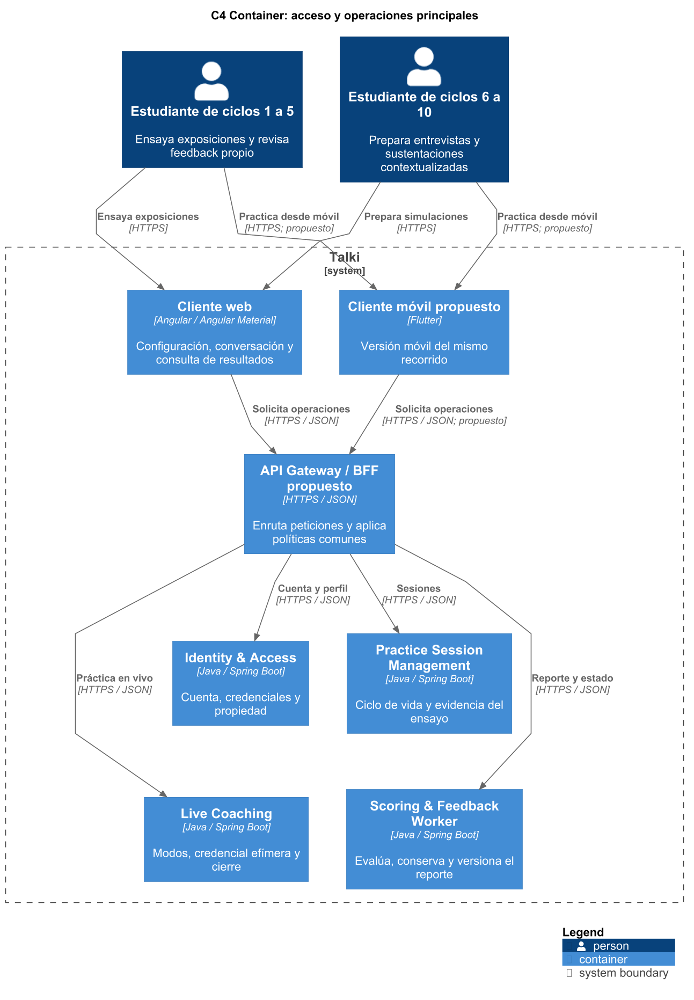

| Contenedor / contexto | Responsabilidad | Datos propios | Sección táctica |
| --- | --- | --- | --- |
| Live Coaching | Selección de modo, credencial temporal y cierre de conversación. | Sin base de negocio propia. | 5.1 |
| Speech Analysis Worker | Análisis de evidencia lingüística, acústica y contextual disponible; estado y reintento. | Jobs y salida durable; sin copia del reporte de negocio. | 5.2 |
| Scoring & Feedback Worker | Evaluación y consulta de resultados por el propietario o mediante acceso temporal autorizado. | Evaluaciones y versiones. | 5.3 |
| Practice Session Management | Preparación, ciclo de vida y evidencia de la práctica. | Sesiones, configuración, material autorizado, feedback y outbox de cierre. | 5.4 |
| Progress & Adaptation | Resumen, comparación y planes de mejora. | Progreso, métricas por sesión, planes y ejercicios. | 5.5 |
| Sharing & Retention, propuesto | Acceso temporal, exportación y eliminación coordinada. | Permisos, solicitudes de purga y confirmaciones. | 5.6 |
| Gamification | Rachas y logros por práctica válida. | Rachas, logros versionados y contribuciones únicas. | 5.7 |
| Identity & Access | Cuenta, credenciales, perfil y consentimiento. | Usuarios, tokens, recuperación y consentimiento versionado. | 5.8 |
| AI Provider Gateway, propuesto | Contrato de integración y aislamiento del proveedor. | Sin base de material de práctica. | 5.9 |
| Notifications | Consumo de eventos y entrega de avisos. | Avisos, intentos y preferencias. | 5.10 |

Los almacenes de la figura agrupan infraestructura PostgreSQL, no propiedad compartida de tablas. Cada contexto accede únicamente a su esquema y comunica cambios mediante contratos o eventos. Las implementaciones disponibles agrupan algunas responsabilidades en servicios existentes; la separación del diagrama es la arquitectura objetivo de ADD, que deberá concretarse y verificarse en implementación. La pasarela de IA, Sharing, la entrega de avisos y las ampliaciones de consulta siguen siendo propuestas.

### 4.3.4. Deployment Diagrams

El despliegue UML propone hosting del cliente web en Vercel, procesos Spring Boot y RabbitMQ en Railway, y PostgreSQL con TLS y almacenamiento privado de materiales en Supabase. Sessions administra los archivos autorizados mediante HTTPS; los demás contextos reciben únicamente la evidencia permitida. Tanto el navegador como la aplicación móvil ejecutan la conversación con Gemini Live mediante WSS. Las peticiones de negocio utilizan HTTPS/JSON y los eventos internos utilizan AMQP. El acceso a datos respeta los esquemas de cada contexto aunque compartan infraestructura administrada.

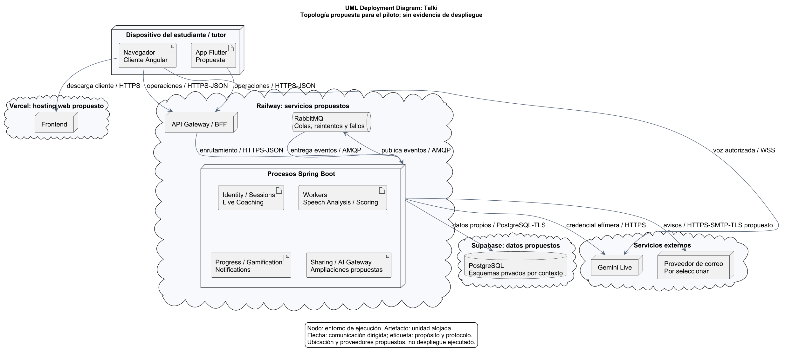

La vista identifica nodos de ejecución y artefactos alojados; no acredita una configuración productiva existente. Antes del despliegue se verificarán disponibilidad de servicios, credenciales, cifrado, límites de consumo y entrega de correo. El proveedor de correo permanece por seleccionar.

# Capítulo V: Tactical-Level Software Design

El diseño táctico describe los elementos que forman cada bounded context de Talki y la responsabilidad de sus capas. Este capítulo desarrolla los diez contextos identificados en el capítulo IV mediante sus modelos, operaciones, componentes y datos.

Los componentes descritos combinan la estructura de los servicios de Talki con el modelo previsto para consentimiento, recuperación, versionado, compartición y eliminación. Los elementos identificados como propuestos expresan decisiones de diseño que requieren implementación e integración. Los diagramas presentan el modelo de la solución y sus colaboraciones, no una transcripción literal de todos los archivos de código.

Cada contexto mantiene una responsabilidad de negocio. La arquitectura objetivo de 4.3.3 propone un proceso por contexto; cada vista de componentes descompone ese proceso. Una futura agrupación de despliegue requerirá actualizar ambas vistas, sin mezclar propiedad de datos.

## Organización por capas

Las vistas de componentes utilizan C4: cada figura descompone un único container de 4.3.3 e identifica sus componentes, responsabilidades, tecnología y conexiones externas. Los diagramas de clases UML se limitan al dominio de cada contexto; controladores, orquestadores, consumidores, repositorios y adaptadores se muestran en sus capas mediante la vista de componentes. Las vistas de datos utilizan entidades, claves y relaciones de persistencia; los contextos sin base propia explican dónde reside la información.

| Capa | Responsabilidad |
| --- | --- |
| Domain Layer | Representa los conceptos del negocio y sus reglas. |
| Interface Layer | Recibe solicitudes y eventos, y presenta las operaciones del contexto. |
| Application Layer | Coordina los casos de uso y las colaboraciones necesarias para ejecutarlos. |
| Infrastructure Layer | Implementa el almacenamiento y la comunicación con otros servicios y proveedores. |

Los datos permanecen bajo responsabilidad del contexto que los administra. Las relaciones internas se conservan en su propia base y los identificadores de otros contextos se utilizan como referencias. Los servicios que procesan información sin almacenarla permanentemente no requieren una base de negocio propia.

Los componentes agrupan clases que colaboran en una responsabilidad. La capa aparece en la descripción de cada componente; los contratos internos se ejecutan dentro del proceso y las relaciones externas identifican HTTPS, AMQP o SQL. El adaptador concreto de RabbitMQ pertenece a Infrastructure y delega en el handler de Application; Interface documenta el mensaje que cruza el límite.

## 5.1. Bounded Context: Live Coaching

Este contexto acompaña al estudiante durante el ensayo mediante transcripción, señales de apoyo y turnos de conversación. La sesión conserva su estado en Practice Session Management y su evaluación se obtiene en Scoring & Feedback.

**Servicio o componente asociado:** live-coach-service.

### 5.1.1. Domain Layer

La capa de dominio define las reglas de conversación que diferencian una práctica rápida, una entrevista, una sustentación y un escenario contextualizado. Su responsabilidad es decidir cómo se prepara el ensayo según el modo elegido.

**Domain Policies**

SessionModeStrategy define las reglas comunes para preparar una conversación. QuickPracticeStrategy, InterviewStrategy, ThesisDefenseStrategy y ScenarioStrategy aplican las condiciones del modo elegido, como la orientación del diálogo y su duración sugerida. La identidad y el estado de la práctica se administran en Practice Session Management.

**Domain Factories**

SessionModeStrategyFactory crea la estrategia correspondiente al modo solicitado. LiveCoachOrchestrator utiliza esta fábrica para preparar las instrucciones de la conversación.

**Elementos de Domain Layer**

| Nombre | Tipo | Descripción | Capa |
| --- | --- | --- | --- |
| SessionModeStrategy | Política de dominio | Define la preparación y los turnos de conversación de cada modo de práctica. | Domain |
| SessionModeStrategyFactory | Domain Factory | Crea la estrategia correspondiente al modo solicitado por el estudiante. | Domain |
| QuickPracticeStrategy, InterviewStrategy, ThesisDefenseStrategy y ScenarioStrategy | Estrategias | Aplican las reglas de práctica rápida, entrevista, sustentación y escenario contextualizado. | Domain |

**Reglas principales**

1. El modo elegido determina la estrategia de conversación.
2. La captura de voz requiere permiso del dispositivo y consentimiento vigente.
3. Al finalizar, la transcripción y las métricas se entregan al contexto responsable de la sesión.

**Atributos y operaciones del modelo de dominio**

Los atributos se encapsulan; las operaciones públicas expresan las reglas del contexto. Las interfaces y enumeraciones se distinguen en el UML. Este modelo especifica el diseño objetivo del TP.

| Elemento | Atributos o valores | Operaciones públicas |
| --- | --- | --- |
| SessionModeStrategyFactory | Sin estado propio. | create(String mode) SessionModeStrategy |
| SessionModeStrategy | Sin estado propio. | buildSystemPrompt(PracticeContext context) String maxDurationMinutes() int |
| PracticeContext | UUID sessionId String goal String scenario String authorizedMaterialSummary String conversationLocale | Consulta mediante el agregado o servicio responsable. |
| QuickPracticeStrategy | Sin estado propio. | buildSystemPrompt(PracticeContext context) String maxDurationMinutes() int |
| InterviewStrategy | Sin estado propio. | buildSystemPrompt(PracticeContext context) String maxDurationMinutes() int |
| ThesisDefenseStrategy | Sin estado propio. | buildSystemPrompt(PracticeContext context) String maxDurationMinutes() int |
| ScenarioStrategy | Sin estado propio. | buildSystemPrompt(PracticeContext context) String maxDurationMinutes() int |

### 5.1.2. Interface Layer

LiveCoachController recibe las solicitudes del cliente para consultar los modos, preparar el acceso a la conversación y finalizar el ensayo. Delega la preparación y el cierre a LiveCoachOrchestrator.

**Controller y operaciones**

| Operación | Responsabilidad |
| --- | --- |
| `GET /v1/coach/modes` | Presentar los modos de práctica disponibles. |
| `POST /v1/coach/live-token?mode={mode}` | Solicitar una credencial temporal para el modo elegido. |
| `POST /v1/coach/{sessionId}/finalize` | Recibir la evidencia del ensayo y solicitar su cierre. |

**Datos de entrada y respuesta.** La preparación recibe sessionId y el modo elegido, además del escenario cuando corresponde. Live comprueba que la sesión pertenece al solicitante, que su configuración coincide con el modo pedido y que existe consentimiento vigente antes de emitir una credencial. LiveTokenResponse devuelve la credencial temporal, el modelo, la fecha de vencimiento y la duración sugerida. El cierre recibe el identificador de sesión, la transcripción y las métricas disponibles. El token expira y no permite preparar otra sesión.

### 5.1.3. Application Layer

La capa de aplicación coordina la preparación y el cierre de la conversación. Selecciona las reglas del modo elegido y solicita los recursos de integración necesarios.

**Commands**

La preparación de la conversación solicita una credencial temporal para el modo y escenario elegidos. La finalización reúne la transcripción y las métricas para comunicar el cierre de la práctica.

**Queries**

La consulta de modos presenta las opciones que puede elegir el estudiante. LiveCoachController ofrece esta lectura; LiveCoachOrchestrator coordina la preparación y la finalización.

**Elementos de Application Layer**

| Nombre | Tipo | Descripción | Capa |
| --- | --- | --- | --- |
| LiveCoachOrchestrator | Servicio de aplicación | Prepara las instrucciones del ensayo, solicita la credencial temporal y comunica su finalización. | Application |

**Recorrido del caso de uso.** Al preparar una práctica, el orquestador obtiene la estrategia y solicita a AIProviderGatewayClient una credencial temporal. Al finalizar, reúne la transcripción y las métricas y solicita a Sessions la confirmación del cierre. El cierre se envía a Practice Session Management con closureId: ese contexto conserva la evidencia y el evento de salida en la misma transacción antes de activar el análisis.

**Contratos de coordinación**

| Clase o grupo de clases | Responsabilidad | Operaciones previstas |
| --- | --- | --- |
| LiveCoachOrchestrator | Comprueba sesión/consentimiento y coordina credencial/cierre. | prepare(sessionId, mode); finalize(sessionId, closureId, evidence) |

Los handlers validan la petición o el evento antes de ejecutar cambios. Los puertos de repositorio y de integración son contratos; los adaptadores de Infrastructure realizan esos contratos. Los nombres describen clases previstas para implementar el diseño, sin afirmar que estén desplegadas.

### 5.1.4. Infrastructure Layer

La capa de infraestructura gestiona la obtención de credenciales del proveedor y la publicación del cierre de la práctica.

**Elementos de Infrastructure Layer**

| Nombre | Tipo | Descripción | Capa |
| --- | --- | --- | --- |
| AIProviderGatewayClient | Adaptador HTTP | Solicita una credencial temporal a AI Provider Gateway; el proveedor queda aislado en esa pasarela. | Infrastructure |
| SessionClosureClient | Adaptador de cierre | Confirma el cierre con Sessions; ese contexto publica SessionLiveFinalizedEvent mediante su outbox. | Infrastructure |

El cliente utiliza la credencial temporal para el intercambio de voz. Live Coaching no necesita una base de negocio propia; la evidencia de cierre corresponde a Practice Session Management. La recuperación utiliza checkpointId; el cierre se confirma en Sessions antes de continuar con el análisis.

### 5.1.5. Bounded Context Software Architecture Component Level Diagrams

Esta vista C4 descompone el container de Live Coaching definido en 4.3.3. Los elementos externos se sitúan fuera de su frontera; las relaciones indican responsabilidad y protocolo. Las clases siguientes colaboran en los componentes del proceso y mantienen la separación de capas.

| Clases agrupadas en el componente | Capa | Responsabilidad |
| --- | --- | --- |
| LiveCoachController / LiveTokenResponse | Interface | Valida preparación y cierre del ensayo. |
| LiveCoachOrchestrator | Application | Comprueba sesión/consentimiento y coordina credencial/cierre. |
| SessionModeStrategyFactory / estrategias | Domain | Prepara instrucciones según modo y contexto. |
| AIProviderGatewayClient | Infrastructure | Solicita credencial por API interna. |
| SessionClosureClient / SessionAccessClient | Infrastructure | Comprueba sesión y confirma evidencia de cierre. |
| ConsentVerificationClient | Infrastructure | Consulta autorización vigente. |

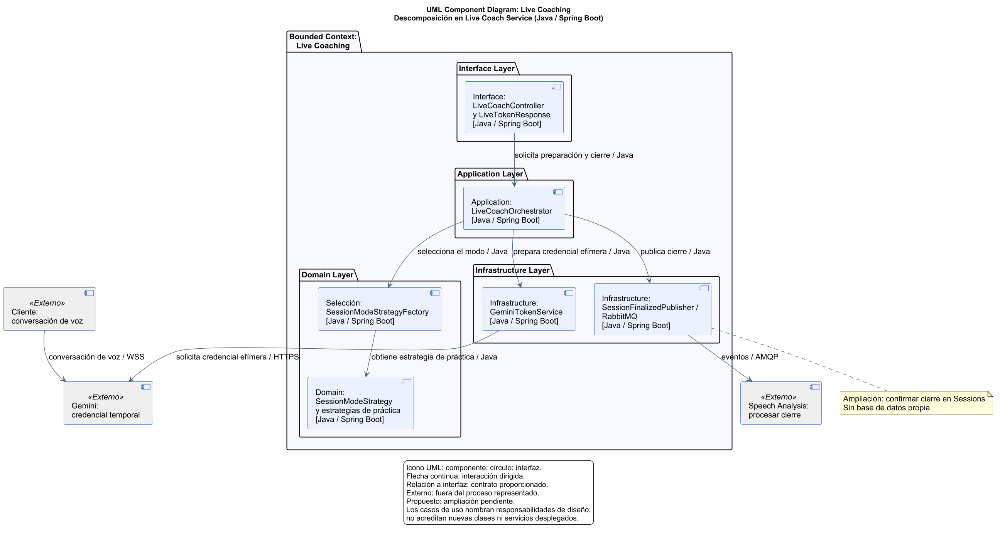

### 5.1.6. Bounded Context Software Architecture Code Level Diagrams

#### 5.1.6.1. Bounded Context Domain Layer Class Diagrams

El diagrama UML de dominio representa SessionModeStrategy, sus cuatro implementaciones y la fábrica que selecciona el modo. La realización de la interfaz se distingue de la dependencia de la fábrica. PracticeContext contiene solo el contexto autorizado para preparar instrucciones. El orquestador y los clientes de AI Gateway, Sessions e Identity pertenecen a otras capas y se representan en componentes.

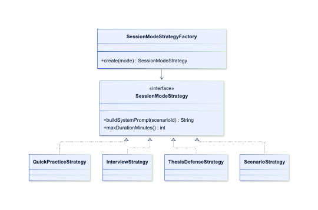

#### 5.1.6.2. Bounded Context Database Design Diagram

Este contexto no requiere una base de datos propia. La transcripción y el resultado del cierre se conservan en los contextos responsables de sesiones y evaluación.

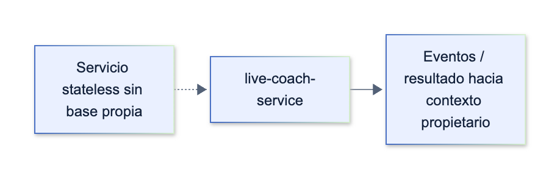

## 5.2. Bounded Context: Speech Analysis

Este contexto analiza la transcripción autorizada de una práctica y obtiene métricas del discurso, como el conteo y la proporción de muletillas. Estos resultados sirven como entrada para la evaluación posterior.

**Servicio o componente asociado:** filler-detection-service.

### 5.2.1. Domain Layer

La capa de dominio representa el análisis de muletillas sobre la transcripción de una práctica. Separa las reglas de detección del transporte de mensajes y de la evaluación global del desempeño.

**Domain Services**

FillerDetector identifica las expresiones consideradas muletillas y calcula sus apariciones en la transcripción. Esta responsabilidad permite modificar los criterios de detección sin cambiar el transporte de mensajes.

**Resultado del análisis**

FillerResult representa el resultado del diseño: cantidad de palabras, conteo de muletillas, distribución por expresión y proporción. La transcripción y las métricas acústicas recibidas forman parte de la evidencia de la sesión. AnalysisJob identifica el análisis y sus transiciones; FillerResult incluye totalWords para interpretar la proporción y reconocer la falta de evidencia.

**Elementos de Domain Layer**

| Nombre | Tipo | Descripción | Capa |
| --- | --- | --- | --- |
| FillerDetector | Domain Service | Aplica las reglas de detección de muletillas sobre la transcripción. | Domain |
| FillerResult | Resultado de análisis (diseño propuesto) | Reúne el total de muletillas, su distribución por tipo y su proporción. | Domain |

**Reglas principales**

1. El análisis utiliza únicamente la evidencia autorizada de la sesión.
2. Las métricas de muletillas se distinguen de la puntuación global.
3. El volumen y otras dimensiones acústicas requieren información de audio; una transcripción por sí sola no permite medirlas.

**Atributos y operaciones del modelo de dominio**

Los atributos se encapsulan; las operaciones públicas expresan las reglas del contexto. Las interfaces y enumeraciones se distinguen en el UML. Este modelo especifica el diseño objetivo del TP.

| Elemento | Atributos o valores | Operaciones públicas |
| --- | --- | --- |
| AnalysisJob | UUID id UUID sessionId Long userId String analysisVersion AnalysisState state int attempts Instant updatedAt | start() void complete(SpeechAnalysisResult result) void fail(String reason) void retry() void |
| AnalysisState | PENDING RUNNING COMPLETED FAILED CANCELLED | Consulta mediante el agregado o servicio responsable. |
| FillerDetector | Sin estado propio. | detect(String transcript) FillerResult |
| FillerResult | int totalWords int totalFillers Map~String,int~ byType double fillerRatio | hasEvidence() boolean |

**Evidencia acústica y contextual**

AuthorizedSpeechEvidence separa transcripción, señales acústicas disponibles, contexto autorizado, meta y duración confirmada. AcousticEvidenceAnalyzer calcula solo métricas respaldadas por señales de audio; si faltan, registra la limitación en lugar de estimar volumen desde texto. ContextualEvidenceAnalyzer compara términos del discurso y del contexto autorizado: cada ContextualFinding distingue palabra pronunciada, fragmento fuente, alternativa sugerida y motivo. Las reglas preservan terminología especializada y omiten recomendaciones sin soporte. SpeechAnalysisResult agrupa estos hallazgos y FillerResult, además de dimensiones disponibles y limitaciones.

| Elemento | Atributos | Operación o relación |
| --- | --- | --- |
| AuthorizedSpeechEvidence | transcript, acousticFeatures, authorizedContext, goal, confirmedDurationSeconds. | Entrada de los analizadores; solo incluye material autorizado. |
| AcousticEvidenceAnalyzer | Sin estado propio. | analyze(AuthorizedSpeechEvidence): SpeechAnalysisResult. |
| ContextualEvidenceAnalyzer | Sin estado propio. | analyze(AuthorizedSpeechEvidence): lista de ContextualFinding. |
| ContextualFinding | term, spoken, evidenceFragment, suggestedAlternative, reason. | Resultado inmutable; spoken=false identifica sugerencia, sin atribuirla al discurso. |
| SpeechAnalysisResult | acousticMetrics, availableDimensions, limitations. | Contiene un FillerResult y cero o más hallazgos contextuales. |

### 5.2.2. Interface Layer

Este contexto recibe la evidencia mediante eventos de integración. No necesita un controlador REST para ejecutar el análisis de muletillas.

**Contrato de entrada.** SessionLiveFinalizedEvent identifica la sesión y el estudiante, e incluye la transcripción, la duración y las métricas disponibles. SessionLiveFinalizedConsumer es el adaptador AMQP de Infrastructure y delega el mensaje `session.live.finalized` en AnalyzeSpeechHandler de Application.

**Contrato de salida.** FillerAnalyzedEvent conserva su nombre de integración, pero reúne SpeechAnalysisResult: conteo, distribución por expresión, cantidad de palabras, métricas disponibles, hallazgos contextuales, referencias de evidencia y limitaciones. El evento `fillers.analyzed` permite continuar con Scoring & Feedback. Los consumidores y publicadores concretos se describen en Infrastructure Layer.

### 5.2.3. Application Layer

La capa de aplicación coordina el análisis de la evidencia recibida. El caso de uso utiliza las reglas de FillerDetector y prepara el resultado que necesita el contexto de evaluación.

**Procesamiento de eventos**

La recepción de SessionLiveFinalizedEvent inicia el análisis de la transcripción. La coordinación entrega el texto a FillerDetector, reúne las métricas obtenidas y prepara FillerAnalyzedEvent. AnalyzeSpeechHandler registra AnalysisJob, aplica los tres analizadores y solicita la publicación de SpeechAnalysisResult; el consumidor concreto activa el flujo desde la infraestructura.

**Elementos de Application Layer**

| Nombre | Tipo | Descripción | Capa |
| --- | --- | --- | --- |
| AnalyzeSpeechHandler | Command Handler | Identifica muletillas y obtiene el conteo por expresión y la cantidad de palabras. | Application |
| PurgeAnalysisHandler | Event Handler | Retira el job y sus resultados y registra la confirmación local de eliminación. | Application |
| AnalysisResultPublisherPort | Puerto de salida | Relaciona las métricas con la sesión y solicita la publicación de FillerAnalyzedEvent. | Application |

**Contratos de coordinación**

| Clase o grupo de clases | Responsabilidad | Operaciones previstas |
| --- | --- | --- |
| AnalyzeSpeechHandler / PurgeAnalysisHandler | Coordina análisis, reintento y retirada de evidencia del contexto. | handle(SessionLiveFinalizedEvent); retry(jobId); handle(DeletionRequestedEvent) |

Los handlers validan la petición o el evento antes de ejecutar cambios. Los puertos de repositorio y de integración son contratos; los adaptadores de Infrastructure realizan esos contratos. Los nombres describen clases previstas para implementar el diseño, sin afirmar que estén desplegadas.

### 5.2.4. Infrastructure Layer

La capa de infraestructura conecta el análisis con los demás contextos mediante RabbitMQ. Los adaptadores de mensajería transportan la evidencia y el resultado.

**Elementos de Infrastructure Layer**

| Nombre | Tipo | Descripción | Capa |
| --- | --- | --- | --- |
| SessionLiveFinalizedConsumer | Consumidor de eventos | Recibe el cierre de práctica y activa el análisis. | Infrastructure |
| FillerAnalyzedPublisher | Publicador de eventos | Comunica el resultado a Scoring & Feedback. | Infrastructure |
| DeletionRequestedConsumer / PurgeReceiptPublisher | Adaptadores de privacidad | Reciben la solicitud de eliminación y confirman la purga local. | Infrastructure |

El análisis no conserva un reporte de negocio propio, pero mantiene AnalysisJob y su salida durable en un esquema privado. FillerDetector procesa la transcripción y el resultado conserva la referencia de sesión. AcousticEvidenceAnalyzer y ContextualEvidenceAnalyzer especifican el análisis acústico y contextual de 4.2 sobre AuthorizedSpeechEvidence. Los resultados se agrupan en SpeechAnalysisResult; no se utiliza material sin autorización. AnalysisJob registra versión, estado e intentos para los reintentos de US37. AnalysisJobRepository y AnalysisResultOutbox almacenan el estado y la salida de forma atómica; el dispatcher publica y confirma el resultado.

DeletionRequestedConsumer delega en PurgeAnalysisHandler, que retira el job y sus resultados autorizados. La operación confirma su estado local antes de que PurgeReceiptPublisher comunique purge.completed con requestId y el nombre del contexto. Se aplica el control de eventos tardíos definido en Contratos y garantías de integración.

### 5.2.5. Bounded Context Software Architecture Component Level Diagrams

Esta vista C4 descompone el container de Speech Analysis definido en 4.3.3. Los elementos externos se sitúan fuera de su frontera; las relaciones indican responsabilidad y protocolo. Las clases siguientes colaboran en los componentes del proceso y mantienen la separación de capas.

| Clases agrupadas en el componente | Capa | Responsabilidad |
| --- | --- | --- |
| SessionLiveFinalizedConsumer / DeletionRequestedConsumer | Infrastructure | Recibe el contrato AMQP y confirma tras commit. |
| AnalyzeSpeechHandler / PurgeAnalysisHandler | Application | Coordina análisis, reintento y purga. |
| AnalysisJob / FillerDetector / AcousticEvidenceAnalyzer / ContextualEvidenceAnalyzer | Domain | Controla estado, métricas y hallazgos respaldados por evidencia. |
| AnalysisJobController | Interface | Consulta estado y solicita reintento interno. |
| AnalysisJobRepository / AnalysisResultOutbox | Infrastructure | Conserva job y resultado durable. |
| FillerAnalyzedPublisher / PurgeReceiptPublisher | Infrastructure | Despacha métricas o confirmación de purga. |

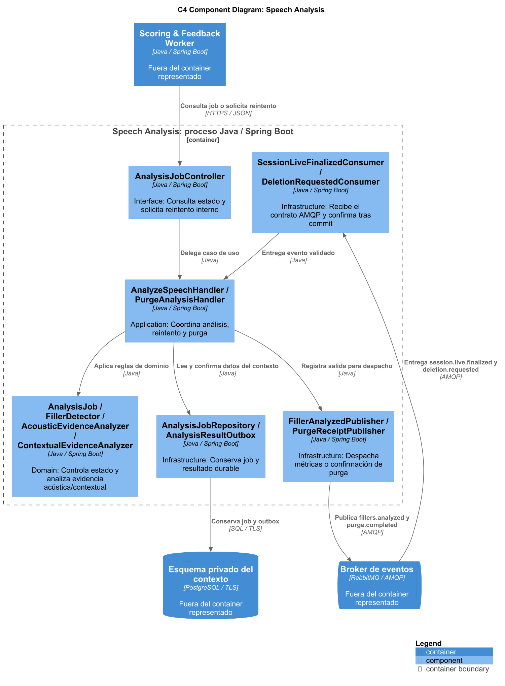

### 5.2.6. Bounded Context Software Architecture Code Level Diagrams

#### 5.2.6.1. Bounded Context Domain Layer Class Diagrams

El diagrama UML relaciona AnalysisJob con su estado y resultado; FillerDetector calcula FillerResult. El consumidor de RabbitMQ y el publicador quedan en Infrastructure y se representan en la vista de componentes.

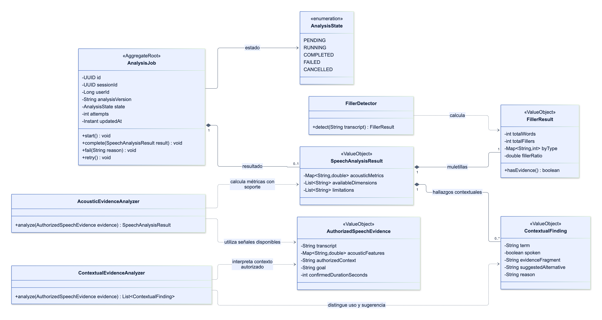

#### 5.2.6.2. Bounded Context Database Design Diagram

El contexto no conserva una copia del reporte. Sus métricas se comunican mediante fillers.analyzed y se almacenan con el resultado de evaluación. AnalysisJob y su outbox se conservan en un esquema técnico privado. La combinación sesión/versión evita trabajos duplicados y permite consultar estado y reintentar sin crear otra evaluación.

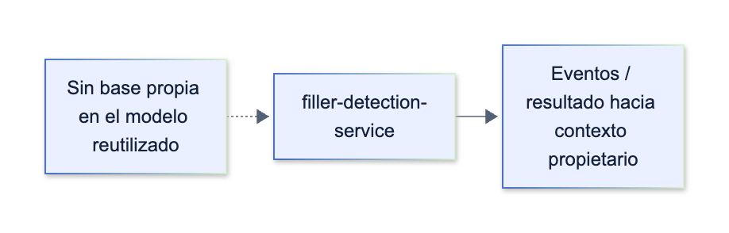

**Restricciones de persistencia**

| Objeto | Restricción y relación con las reglas |
| --- | --- |
| ANALYSIS_JOBS | UNIQUE(session_id, analysis_version); attempts ≥ 0. Estados PENDING, RUNNING, COMPLETED, FAILED y CANCELLED. El resultado nulo indica que aún no hay métricas confirmadas. |

La unicidad compuesta se documenta en esta tabla porque comprende varios campos; las marcas PK/FK/UK del diagrama identifican claves simples. Inbox y outbox son registros técnicos del esquema privado: eventId es único en inbox y el despacho confirma la salida después del commit local. No se crean FKs hacia otros contextos.

## 5.3. Bounded Context: Scoring & Feedback

Este contexto convierte las métricas del discurso en una evaluación y recomendaciones para el estudiante. La puntuación se interpreta según una rúbrica definida y la evidencia disponible.

**Servicio o componente asociado:** scoring-service.

### 5.3.1. Domain Layer

La capa de dominio reúne los conceptos que permiten convertir la evidencia de una práctica en una evaluación interpretable. El cálculo de la puntuación se mantiene separado de la recepción de eventos y del almacenamiento.

**Aggregate Root**

ScoreResult identifica la evaluación de una práctica y conserva su relación con la sesión y el estudiante. Reúne la puntuación, el momento del cálculo y una copia de la evidencia autorizada utilizada, con sus dimensiones disponibles y limitaciones. Las versiones de análisis y rúbrica permiten interpretar el resultado histórico.

**Value Objects**

VoiceScore agrupa las dimensiones de fluidez, claridad, volumen, vocabulario y confianza estimada. Sus valores describen el desempeño obtenido en la evaluación.

**Domain Services**

ScoreCalculator aplica los criterios de puntuación sobre las métricas disponibles. La ampliación del diseño permite identificar una dimensión sin evidencia y conservar la versión de la rúbrica utilizada.

**Elementos de Domain Layer**

| Nombre | Tipo | Descripción | Capa |
| --- | --- | --- | --- |
| ScoreResult | Aggregate Root | Identifica la evaluación de una sesión, su propietario y el momento de cálculo. | Domain |
| VoiceScore | Value Object | Agrupa las dimensiones de fluidez, claridad, volumen, vocabulario y confianza estimada. | Domain |
| EvaluationEvidence / ContextualFinding | Value Objects | Conservan las métricas, cobertura, limitaciones y fragmentos que sustentan la evaluación. | Domain |
| ScoreCalculator | Domain Service | Aplica los criterios de cálculo sobre las métricas recibidas. | Domain |

**Reglas principales**

1. Cada dimensión utiliza una escala de 0 a 100 cuando existe evidencia suficiente. La puntuación global es el promedio de las dimensiones evaluables, redondeado al entero más próximo, y devuelve ausencia de valor si no hay ninguna; el reporte identifica su cobertura y limitaciones.
2. La evaluación debe conservar la versión del análisis y la rúbrica utilizada.
3. Recibir nuevamente un mismo análisis debe conservar un único resultado para esa versión.

**Atributos y operaciones del modelo de dominio**

Los atributos se encapsulan; las operaciones públicas expresan las reglas del contexto. Las interfaces y enumeraciones se distinguen en el UML. Este modelo especifica el diseño objetivo del TP.

| Elemento | Atributos o valores | Operaciones públicas |
| --- | --- | --- |
| ScoreResult | UUID id UUID sessionId Long userId String analysisVersion String rubricVersion VoiceScore score EvaluationEvidence evidence List~String~ recommendations Instant computedAt | hasEvidence() boolean |
| VoiceScore | Integer fluency Integer clarity Integer volume Integer vocabulary Integer confidence | overall() Integer |
| EvaluationEvidence | UUID sessionId String analysisVersion Map~String,double~ metrics List~String~ availableDimensions List~String~ limitations List~ContextualFinding~ contextualFindings | Consulta mediante el agregado o servicio responsable. |
| ContextualFinding | String term boolean spoken String evidenceFragment String suggestedAlternative String reason | Consulta mediante el agregado o servicio responsable. |
| ScoreCalculator | Sin estado propio. | calculate(EvaluationEvidence evidence, String rubricVersion) VoiceScore |

### 5.3.2. Interface Layer

La evaluación se activa al recibir el evento `fillers.analyzed`. FillerAnalyzedEvent conserva la referencia de la sesión y las métricas necesarias para el cálculo.

**Entrada y salida del contexto.** FillerAnalyzedConsumer recibe el análisis y activa la evaluación. Al concluir, ScoringCompletedEvent comunica la puntuación por dimensión, el resumen global y los datos de la práctica mediante `scoring.completed`.

**Consulta del reporte.** ReportController expone `GET /v1/reports/{sessionId}`. ReportQueryHandler consulta Sessions para comprobar propiedad y ausencia de eliminación. Devuelve 200 con reportId, sessionId, analysisVersion, rubricVersion, dimensiones, evidencia y recomendaciones; 202 con analysisState si aún no existe resultado; 404 si la práctica no está disponible para el solicitante. Un fallo de análisis devuelve un estado recuperable, sin puntuación fabricada. `POST /v1/reports/{sessionId}/analysis-retries` solicita un reintento sobre el mismo AnalysisJob y devuelve 202 con jobId y estado.

**Lectura interna para compartir.** `GET /internal/v1/reports/{reportId}` se limita al servicio Sharing & Retention autenticado. Recibe una autorización validada con ownerId, sessionId y scope; Scoring comprueba que coincida con el reporte y que la sesión siga disponible. Devuelve solo la proyección permitida; el material contextual queda excluido. El token del enlace se resuelve en Sharing y no sustituye estas comprobaciones.

### 5.3.3. Application Layer

La capa de aplicación coordina el cálculo, el registro y la comunicación de una evaluación. Utiliza el servicio de dominio para calcular la puntuación y conserva el resultado antes de comunicarlo.

**Procesamiento de eventos**

La evaluación comienza con FillerAnalyzedEvent. El flujo comprueba si existe un resultado para la sesión, solicita el cálculo, conserva ScoreResult y comunica ScoringCompletedEvent.

**Queries del diseño objetivo**

La lectura del reporte recuperará la evaluación para un estudiante autorizado. ReportQueryHandler aplica el contrato de 5.3.2 y presenta las versiones y dimensiones sin evidencia.

**Elementos de Application Layer**

| Nombre | Tipo | Descripción | Capa |
| --- | --- | --- | --- |
| EvaluatePracticeHandler | Event Handler | Solicita el cálculo a ScoreCalculator con las métricas del análisis. | Application |
| PurgeScoreResultsHandler | Event Handler | Retira los resultados de la sesión y registra la confirmación local de eliminación. | Application |
| ReportQueryHandler | Query Handler | Recupera la evaluación autorizada y su estado; EvaluatePracticeHandler conserva ScoreResult y solicita ScoringCompletedEvent. | Application |

**Contratos de coordinación**

| Clase o grupo de clases | Responsabilidad | Operaciones previstas |
| --- | --- | --- |
| EvaluatePracticeHandler / ReportQueryHandler / PurgeScoreResultsHandler | Evalúa, consulta y retira resultados autorizados. | handle(FillerAnalyzedEvent); query(sessionId, requester); handle(DeletionRequestedEvent) |

Los handlers validan la petición o el evento antes de ejecutar cambios. Los puertos de repositorio y de integración son contratos; los adaptadores de Infrastructure realizan esos contratos. Los nombres describen clases previstas para implementar el diseño, sin afirmar que estén desplegadas.

### 5.3.4. Infrastructure Layer

La capa de infraestructura recibe las métricas, conserva las evaluaciones y comunica los resultados a los contextos interesados.

**Elementos de Infrastructure Layer**

| Nombre | Tipo | Descripción | Capa |
| --- | --- | --- | --- |
| FillerAnalyzedConsumer | Consumidor de eventos | Recibe las métricas y activa el flujo de evaluación. | Infrastructure |
| ScoreResultRepository | Repositorio | Conserva y consulta evaluaciones en PostgreSQL. | Infrastructure |
| ScoringCompletedPublisher | Publicador de eventos | Comunica la evaluación completada mediante RabbitMQ. | Infrastructure |
| DeletionRequestedConsumer / PurgeReceiptPublisher | Adaptadores de privacidad | Reciben la solicitud de eliminación y confirman la purga de evaluaciones. | Infrastructure |

ScoreResultRepository conserva una evaluación por sesión, analysisVersion y rubricVersion, con una restricción única compuesta. Guarda también EvaluationEvidence como una copia versionada: métricas, dimensiones disponibles, limitaciones y hallazgos con fragmento, alternativa y razón. La consulta, la compartición y la exportación leen esa misma copia; no reconstruyen la evidencia a partir de un análisis posterior ni almacenan audio o el material completo en Scoring. La transacción registra el resultado y la salida en outbox antes de confirmar el evento recibido. SessionAccessClient comprueba autorización y eliminación para las consultas.

DeletionRequestedConsumer delega en PurgeScoreResultsHandler, que retira las evaluaciones y su evidencia conservada. La operación confirma su estado local antes de que PurgeReceiptPublisher comunique purge.completed con requestId y el nombre del contexto. Se aplica el control de eventos tardíos definido en Contratos y garantías de integración.

### 5.3.5. Bounded Context Software Architecture Component Level Diagrams

Esta vista C4 descompone el container de Scoring & Feedback definido en 4.3.3. Los elementos externos se sitúan fuera de su frontera; las relaciones indican responsabilidad y protocolo. Las clases siguientes colaboran en los componentes del proceso y mantienen la separación de capas.

| Clases agrupadas en el componente | Capa | Responsabilidad |
| --- | --- | --- |
| FillerAnalyzedConsumer / DeletionRequestedConsumer | Infrastructure | Adapta análisis y solicitudes de purga. |
| ReportController | Interface | Ofrece reporte, estado y solicitud de reintento. |
| EvaluatePracticeHandler / ReportQueryHandler / PurgeScoreResultsHandler | Application | Evalúa, consulta y retira resultados autorizados. |
| ScoreCalculator / ScoreResult / VoiceScore / EvaluationEvidence | Domain | Calcula dimensiones respaldadas por evidencia. |
| ScoreResultRepository / ScoringOutbox | Infrastructure | Mantiene unicidad por sesión y versiones. |
| ScoringCompletedPublisher / PurgeReceiptPublisher | Infrastructure | Despacha evaluación o confirmación de purga. |
| SessionAccessClient | Infrastructure | Comprueba acceso y eliminación. |
| AnalysisJobClient | Infrastructure | Consulta estado y solicita reintento. |

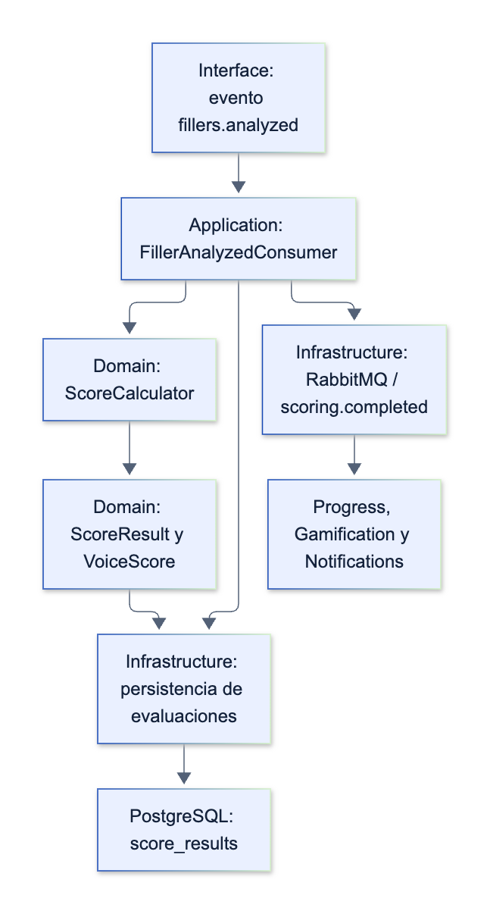

### 5.3.6. Bounded Context Software Architecture Code Level Diagrams

#### 5.3.6.1. Bounded Context Domain Layer Class Diagrams

ScoreResult contiene VoiceScore, EvaluationEvidence y las versiones de análisis y rúbrica. EvaluationEvidence contiene los hallazgos contextuales autorizados. ScoreCalculator aplica los criterios de puntuación. Las composiciones identifican la puntuación y la evidencia conservada como partes del resultado; el consumidor del evento pertenece a Infrastructure y aparece en componentes. Las dimensiones sin evidencia admiten un valor ausente en lugar de asignarles cero.

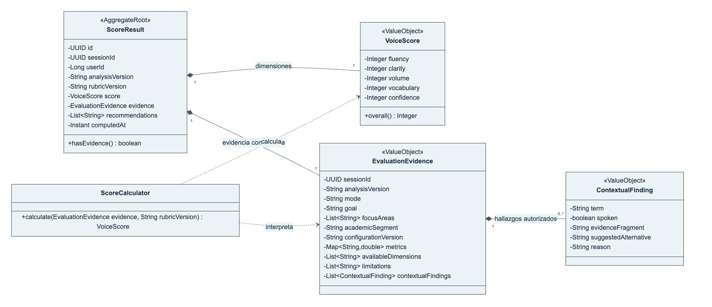

#### 5.3.6.2. Bounded Context Database Design Diagram

La tabla score_results contiene la referencia a la sesión, el usuario, las dimensiones evaluadas y la fecha de cálculo. El esquema ampliado incorpora las versiones de análisis y rúbrica. La combinación de sesión y ambas versiones debe ser única; las dimensiones sin evidencia admiten valores nulos y se presentan como “Sin evidencia”.

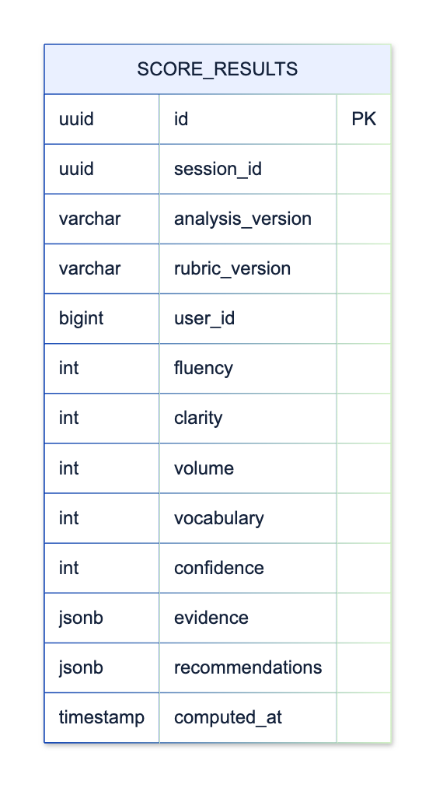

**Restricciones de persistencia**

| Objeto | Restricción y relación con las reglas |
| --- | --- |
| SCORE_RESULTS | UNIQUE(session_id, analysis_version, rubric_version). Dimensiones nulas cuando no existe evidencia; CHECK entre 0 y 100 para valores presentes. evidence conserva métricas, cobertura, limitaciones y hallazgos de esa evaluación en JSONB, con la misma analysisVersion del resultado. Las recomendaciones remiten a esa evidencia y no a un análisis más reciente. |

La unicidad compuesta se documenta en esta tabla porque comprende varios campos; las marcas PK/FK/UK del diagrama identifican claves simples. Inbox y outbox son registros técnicos del esquema privado: eventId es único en inbox y el despacho confirma la salida después del commit local. No se crean FKs hacia otros contextos.

## 5.4. Bounded Context: Practice Session Management

Este contexto administra la preparación y el ciclo de vida de cada práctica. Reúne la configuración del ensayo, sus estados y el feedback asociado, y determina si la práctica cumple las condiciones de validez.

**Servicio o componente asociado:** session-service.

### 5.4.1. Domain Layer

La capa de dominio describe la práctica del estudiante, sus estados y la retroalimentación asociada. Las reglas de este modelo determinan cuándo puede iniciarse, cerrarse y consultarse una sesión.

**Aggregate Root**

Session es el punto de entrada al agregado de práctica. Conserva su identidad, propietario y estado, y controla los cambios de su ciclo de vida.

**Entities**

Feedback representa una retroalimentación vinculada a la práctica. Cada registro conserva su identidad y el contenido que el estudiante podrá revisar.

**Value Objects**

SessionUserContext reúne el identificador, correo, nombre de usuario y segmento académico del estudiante. SessionContextFacade adapta estos datos al lenguaje de sesiones, sin incorporar el modelo completo de cuentas.

**Elementos de Domain Layer**

| Nombre | Tipo | Descripción | Capa |
| --- | --- | --- | --- |
| Session | Aggregate Root | Representa la práctica y controla sus cambios de estado. | Domain |
| Feedback | Entity | Conserva la retroalimentación asociada a una sesión. | Domain |
| SessionUserContext | Value Object | Representa la identidad del estudiante en el lenguaje de este contexto. | Domain |

**Reglas principales**

1. La sesión pertenece al estudiante autenticado y conserva esa relación durante todo el recorrido.
2. El feedback se vincula a la sesión que lo originó.
3. El inicio requiere las autorizaciones correspondientes y la finalización debe producir un único cierre.

**Atributos y operaciones del modelo de dominio**

Los atributos se encapsulan; las operaciones públicas expresan las reglas del contexto. Las interfaces y enumeraciones se distinguen en el UML. Este modelo especifica el diseño objetivo del TP.

| Elemento | Atributos o valores | Operaciones públicas |
| --- | --- | --- |
| Session | UUID id Long userId String title SessionMode mode SessionState state PracticeConfiguration configuration ConsentSnapshot consent UUID checkpointId PracticeEvidence evidence boolean valid String validityRuleVersion Instant startedAt Instant finalizedAt Instant deletedAt | start(ConsentSnapshot consent) void pause(UUID checkpointId) void resume(UUID checkpointId) void finalize(UUID closureId, PracticeEvidence evidence) void markAsCompleted() void markAsAnalysisPending() void markAsAnalysisFailed() void declareValidity(int confirmedDurationSeconds, boolean hasEvidence) boolean markAsDeleted() void |
| PracticeEvidence | String transcript Map~String,double~ acousticMetrics String authorizedMaterialSummary int confirmedDurationSeconds Instant observedAt | Se conserva al cierre; métricas y resumen son opcionales y requieren autorización. |
| SessionMode | QUICK_PRACTICE INTERVIEW THESIS_DEFENSE SCENARIO | Consulta mediante el agregado o servicio responsable. |
| SessionState | DRAFT ACTIVE PAUSED ANALYSIS_PENDING ANALYSIS_FAILED COMPLETED DELETED | Consulta mediante el agregado o servicio responsable. |
| PracticeConfiguration | String goal int durationSeconds String scenario String conversationLocale String version | Consulta mediante el agregado o servicio responsable. |
| ConsentSnapshot | UUID consentId String policyVersion String scope Instant checkedAt | Consulta mediante el agregado o servicio responsable. |
| PracticeMaterial | UUID id String mediaType long sizeBytes String storageKey boolean authorized | isAllowed() boolean |
| Feedback | UUID id String content String rubricVersion Instant createdAt | Consulta mediante el agregado o servicio responsable. |
| SessionUserContext | Long userId String academicSegment | Consulta mediante el agregado o servicio responsable. |

**Veredicto de práctica válida.** Session conserva valid y validityRuleVersion. Para la regla propuesta v1.0, la práctica debe pertenecer al estudiante, haber iniciado con consentimiento comprobado, tener duración confirmada positiva y evidencia autorizada no vacía. Una finalización sin evidencia no contribuye a XP ni rachas. Una dimensión no evaluable no invalida automáticamente una práctica que sí cumple esas condiciones. El veredicto se publica junto al cierre y acompaña los contratos de análisis/evaluación: los consumidores no lo recalculan con reglas propias.

**Correspondencia de modos.** QUICK_PRACTICE identifica el ensayo de una exposición; INTERVIEW, una entrevista; THESIS_DEFENSE, una sustentación; SCENARIO, un escenario configurable como pitch. El rótulo visible no cambia el identificador de modo utilizado para comparar resultados.

### 5.4.2. Interface Layer

SessionController expone las operaciones de preparación, consulta y cierre de la práctica. Las solicitudes que modifican datos se delegan a SessionCommandService y las consultas a SessionQueryService.

**Controller y operaciones**

| Operación | Responsabilidad |
| --- | --- |
| `POST /v1/sessions` | Crear una práctica con título, modo, meta, duración e idioma; userId se deriva del acceso autenticado. |
| `GET /v1/sessions` | Consultar las sesiones del estudiante autenticado, con filtros de fecha y modo. |
| `GET /v1/sessions/{id}` | Consultar el detalle de una práctica. |
| `POST /v1/sessions/{id}/finalize` | Confirmar el cierre autorizado con closureId y evidencia; responder 202 durante el análisis. |
| `PATCH /v1/sessions/{id}/configuration` | Modificar meta, escenario, duración o idioma mientras la sesión sea un borrador propio. |
| `POST /v1/sessions/{id}/materials` / `DELETE /v1/sessions/{id}/materials/{materialId}` | Asociar o retirar el archivo propio autorizado, después de comprobar formato y tamaño. |
| `POST /v1/sessions/{id}/pause` / `POST /v1/sessions/{id}/resume` | Confirmar o recuperar un checkpoint propio; rechazar transiciones incompatibles con 409. |
| `GET /internal/v1/sessions/{id}/access` | Proporcionar a servicios autenticados la pertenencia y el estado de acceso, sin devolver la evidencia privada. |
| `POST /internal/v1/sessions/{id}/access-blocks` | Confirmar el bloqueo idempotente por requestId solicitado por Sharing antes de la purga. |
| `POST /v1/sessions/{id}/feedbacks` | Registrar retroalimentación asociada a la sesión. |
| `GET /v1/sessions/{id}/feedbacks` | Consultar la retroalimentación de la práctica. |

**Datos de entrada y respuesta.** CreateSessionRequest reúne título, modo y PracticeConfiguration. Los controles de acceso toman la identidad de la autenticación, no de un userId arbitrario. Las respuestas presentan estado y configuración; la evidencia privada solo se entrega en el alcance autorizado. El cierre confirma un PracticeEvidence y publica sus versiones. Los códigos 403/404 impiden acceder a recursos ajenos o eliminados; 409 identifica una transición incompatible.

### 5.4.3. Application Layer

La capa de aplicación coordina las operaciones de escritura y lectura de una práctica. Mantiene separados los cambios del ciclo de vida de las consultas del estudiante.

**Commands**

Las operaciones de escritura crean una práctica, finalizan su ciclo y registran feedback. SessionCommandService define estas operaciones y SessionCommandServiceImpl las coordina con el dominio y los repositorios.

**Queries**

Las operaciones de lectura recuperan una sesión por identificador, las sesiones de un estudiante y las retroalimentaciones de una práctica. SessionQueryService y SessionQueryServiceImpl coordinan estas consultas. SessionContextFacade adapta la información de identidad a SessionUserContext.

**Elementos de Application Layer**

| Nombre | Tipo | Descripción | Capa |
| --- | --- | --- | --- |
| SessionCommandService y SessionCommandServiceImpl | Contrato e implementación de comandos | Coordinan creación, cierre y registro de feedback. | Application |
| SessionQueryService y SessionQueryServiceImpl | Contrato e implementación de consultas | Recuperan sesiones y retroalimentaciones. | Application |
| SessionContextFacade | Adaptador de contexto | Traduce la identidad externa a SessionUserContext. | Application |

**Ampliación del ciclo de práctica.** PracticeConfiguration registra meta, duración, escenario, idioma de conversación y versión. PracticeMaterial admite PDF, TXT o PPTX de hasta 10 MB, con autorización del estudiante y una clave de almacenamiento privado. ConsentSnapshot conserva la comprobación del consentimiento; Identity mantiene el registro autoritativo. Pausa/reanudación utiliza checkpointId y la eliminación marca deletedAt antes de solicitar purga.
**Contratos de coordinación**

| Clase o grupo de clases | Responsabilidad | Operaciones previstas |
| --- | --- | --- |
| SessionCommandService / SessionQueryService | Coordina escritura y consulta de prácticas. | create(configuration); finalize(closure); query(id, requester) |
| SessionContextFacade | Adapta identidad externa al lenguaje de sesión. | create(configuration); finalize(closure); query(id, requester) |

Los handlers validan la petición o el evento antes de ejecutar cambios. Los puertos de repositorio y de integración son contratos; los adaptadores de Infrastructure realizan esos contratos. Los nombres describen clases previstas para implementar el diseño, sin afirmar que estén desplegadas.

### 5.4.4. Infrastructure Layer

La capa de infraestructura implementa la persistencia de sesiones y feedback en PostgreSQL y recibe las actualizaciones de identidad necesarias para el contexto.

**Elementos de Infrastructure Layer**

| Nombre | Tipo | Descripción | Capa |
| --- | --- | --- | --- |
| SessionRepository | Repositorio JPA | Conserva prácticas y permite consultarlas por identificador o estudiante. | Infrastructure |
| FeedbackRepository | Repositorio JPA | Conserva las retroalimentaciones asociadas a una práctica. | Infrastructure |
| AppUserRepository | Repositorio de proyección local | Recupera la identidad local que utiliza SessionContextFacade. | Infrastructure |
| UserRegisteredConsumer | Consumidor de eventos | Recibe el registro de una cuenta para actualizar su representación local. | Infrastructure |

Las relaciones entre sesión y feedback permanecen dentro del contexto. La ampliación del ciclo de vida incorpora recuperación, material y eliminación con sus reglas de acceso. SessionController pertenece a Interface Layer y delega la persistencia mediante los servicios de aplicación.

### 5.4.5. Bounded Context Software Architecture Component Level Diagrams

Esta vista C4 descompone el container de Practice Session Management definido en 4.3.3. Los elementos externos se sitúan fuera de su frontera; las relaciones indican responsabilidad y protocolo. Las clases siguientes colaboran en los componentes del proceso y mantienen la separación de capas.

| Clases agrupadas en el componente | Capa | Responsabilidad |
| --- | --- | --- |
| SessionController | Interface | Recibe preparación, consultas, material y cierre. |
| SessionCommandService / SessionQueryService | Application | Coordina escritura y consulta de prácticas. |
| SessionContextFacade | Application | Adapta identidad externa al lenguaje de sesión. |
| Session / PracticeEvidence / Feedback / configuración / material | Domain | Controla estados, evidencia y límites del ensayo. |
| SessionRepository / FeedbackRepository / MaterialRepository | Infrastructure | Conserva evidencia y referencias de material privado. |
| PrivateMaterialStorageAdapter | Infrastructure | Almacena o purga el archivo autorizado. |
| UserRegisteredConsumer / SessionFinalizedPublisher | Infrastructure | Actualiza proyección y despacha cierre confirmado. |
| ConsentVerificationClient | Infrastructure | Verifica consentimiento de Identity. |

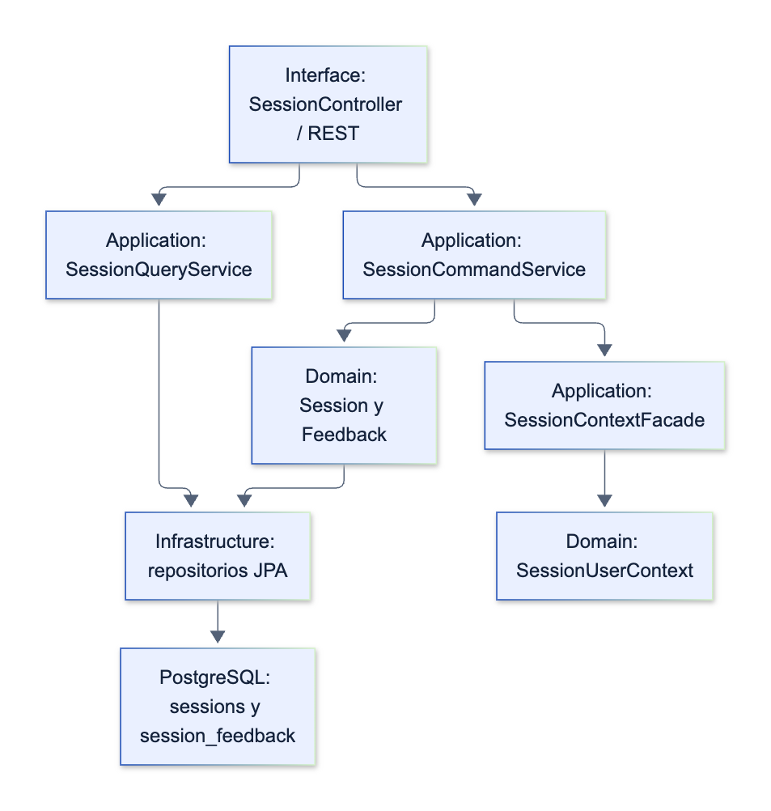

### 5.4.6. Bounded Context Software Architecture Code Level Diagrams

#### 5.4.6.1. Bounded Context Domain Layer Class Diagrams

Session contiene configuración, comprobación del consentimiento, material opcional y feedback. SessionMode y SessionState enumeran sus valores. SessionUserContext adapta la identidad externa; las operaciones controlan pausa, recuperación, cierre y eliminación.

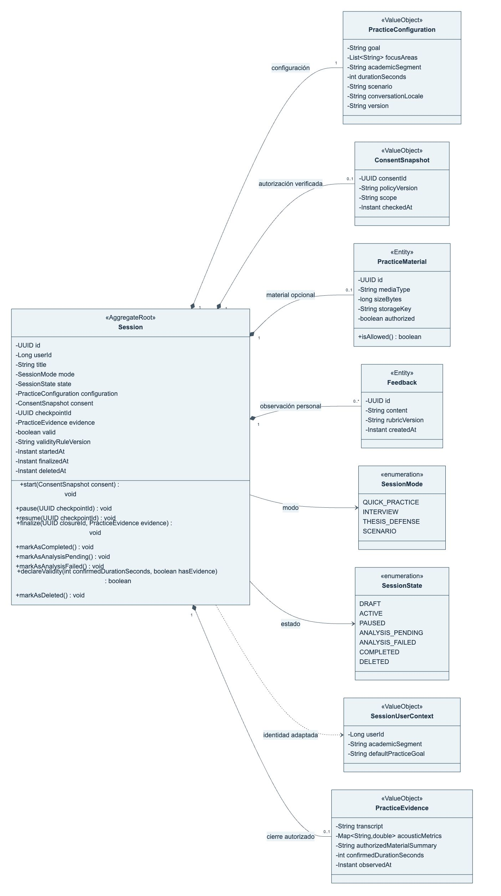

#### 5.4.6.2. Bounded Context Database Design Diagram

sessions y session_feedback se relacionan mediante el identificador de sesión. El usuario se conserva como referencia externa y structured_data permite almacenar feedback estructurado. La configuración, el consentimiento verificado, closureId, checkpointId y deletedAt forman parte del diseño de datos. El material se referencia mediante una clave privada; no se guarda su contenido en el registro de eventos.

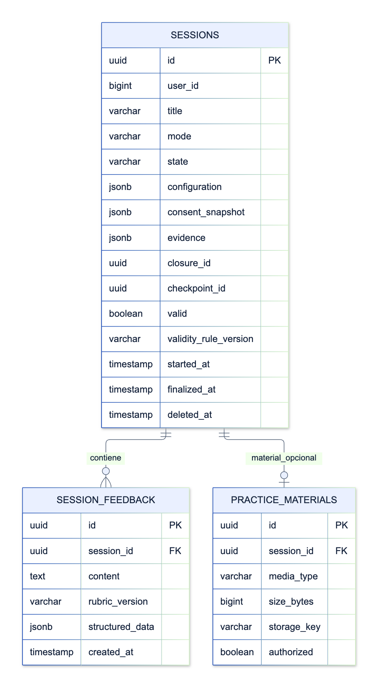

**Restricciones de persistencia**

| Objeto | Restricción y relación con las reglas |
| --- | --- |
| SESSIONS | closure_id único por sesión; un cierre confirmado no acepta otro cierre. valid y validity_rule_version conservan el veredicto publicado por Sessions. mode/state pertenecen a las enumeraciones UML. configuration conserva la versión y un tiempo positivo. evidence es nula antes del cierre y contiene únicamente transcripción/métricas/contexto autorizados después de confirmarlo. deleted_at bloquea consultas. |
| PRACTICE_MATERIALS | UNIQUE(session_id), para un archivo opcional por práctica. CHECK size_bytes entre 1 y 10 MB. Solo PDF/TXT/PPTX autorizados. La clave apunta a almacenamiento privado; la eliminación incluye ese objeto. |
| SESSION_FEEDBACK | FK session_id dentro del contexto; rubric_version identifica la interpretación del registro. |

La unicidad compuesta se documenta en esta tabla porque comprende varios campos; las marcas PK/FK/UK del diagrama identifican claves simples. Inbox y outbox son registros técnicos del esquema privado: eventId es único en inbox y el despacho confirma la salida después del commit local. No se crean FKs hacia otros contextos.

## 5.5. Bounded Context: Progress & Adaptation

Este contexto organiza el historial de desempeño del estudiante y permite revisar su evolución. La comparación de prácticas y el plan adaptativo se apoyan en resultados compatibles y evidencia disponible.

**Servicio o componente asociado:** progress-service.

### 5.5.1. Domain Layer

La capa de dominio representa la evolución del estudiante a partir de sus prácticas. Distingue el resumen de actividad de la evidencia individual utilizada para comparar resultados.

**Aggregate Root**

UserProgress conserva cantidades de sesiones y minutos. El promedio global y la mejor puntuación se derivan de SessionMetrics del mismo modo y versiones, con las cinco dimensiones evaluables. Los resultados parciales pueden consultarse por dimensión y aportan a los conteos de práctica válida; no se mezclan con resultados completos en el promedio global. La experiencia y las reglas de racha pertenecen a Gamification; el panel puede presentar la racha como información resumida, sin redefinir sus reglas.

**Entities**

SessionMetrics conserva las métricas y versiones de cada práctica. AdaptivePlan referencia esas evidencias y reúne PracticeExercise, con objetivo, instrucciones, duración y avance.

**Elementos de Domain Layer**

| Nombre | Tipo | Descripción | Capa |
| --- | --- | --- | --- |
| UserProgress | Aggregate Root | Reúne el resumen de actividad y desempeño de un estudiante. | Domain |
| SessionMetrics | Entity (diseño propuesto) | Conserva las métricas de cada sesión incorporada al historial. | Domain |

**Reglas principales**

1. Cada práctica válida aumenta los conteos una sola vez. Sus versiones de evaluación se conservan por separado para consultar evidencia compatible.
2. La comparación requiere sesiones del mismo estudiante con modos y versiones compatibles. Las diferencias por dimensión usan evidencia presente en ambas; una diferencia global requiere además la misma cobertura de dimensiones.
3. Si no existe suficiente historial, se propone una práctica inicial en lugar de atribuir dificultades recurrentes.

**Atributos y operaciones del modelo de dominio**

Los atributos se encapsulan; las operaciones públicas expresan las reglas del contexto. Las interfaces y enumeraciones se distinguen en el UML. Este modelo especifica el diseño objetivo del TP.

| Elemento | Atributos o valores | Operaciones públicas |
| --- | --- | --- |
| UserProgress | Long userId int totalSessions int totalMinutes | recordSession(SessionMetrics evidence) void removeSession(UUID sessionId) void average(String mode, String analysisVersion, String rubricVersion) Double best(String mode, String analysisVersion, String rubricVersion) Integer |
| SessionMetrics | UUID id UUID sessionId Long userId String mode int durationSeconds Map~String,Integer~ scores String analysisVersion String rubricVersion Instant occurredAt | isCompatibleWith(SessionMetrics other) boolean |
| AdaptivePlan | UUID id Long userId String ruleVersion List~UUID~ evidenceIds Instant createdAt | completeExercise(UUID exerciseId) void |
| PracticeExercise | UUID id String goal String instruction int durationSeconds boolean completed | complete() void |

### 5.5.2. Interface Layer

ProgressController ofrece la consulta del resumen de desempeño. La actualización del progreso se origina al recibir una evaluación completada y no mediante una modificación directa desde el cliente.

**Controller y operaciones**

| Operación o contrato | Responsabilidad |
| --- | --- |
| `GET /v1/progress/dashboard` | Consultar el resumen del estudiante autenticado, con modo y versiones como filtros de la vista. |
| `scoring.completed` | Recibir una evaluación para incorporar sus métricas al progreso. |
| `GET /v1/progress/comparisons?left={id}&right={id}` y `POST /v1/progress/plans` | Comparar evidencia propia compatible y generar un plan con referencias a las prácticas utilizadas. |

**Datos de respuesta.** El panel reúne cantidad de sesiones, minutos de práctica, promedio, mejor puntuación y racha. Las propuestas de comparación incorporan las sesiones elegidas y la compatibilidad de sus versiones. Las consultas deben limitarse al estudiante autorizado.

### 5.5.3. Application Layer

La capa de aplicación coordina la incorporación de evaluaciones y la consulta del progreso. Las operaciones de escritura actualizan el resumen y las de lectura presentan la evolución al estudiante.

**Actualización por eventos**

RecordProgressHandler incorpora la puntuación y la duración confirmada de ScoringCompletedEvent únicamente cuando valid=true, según el veredicto de Sessions. Una práctica no válida no aumenta los conteos ni participa en promedios. La evidencia se conserva por sesión y versiones para evitar contribuciones duplicadas.

**Queries**

La consulta del panel recupera los totales y el desempeño del estudiante. UserProgressQueryService se propone para organizar esta lectura y la comparación de prácticas compatibles. BuildAdaptivePlanHandler relaciona recomendaciones y evidencia con AdaptivePlan y PracticeExercise; `PATCH /v1/progress/plans/{planId}/exercises/{exerciseId}` registra el avance del ejercicio.

**Elementos de Application Layer**

| Nombre | Tipo | Descripción | Capa |
| --- | --- | --- | --- |
| RecordProgressHandler | Event Handler | Incorpora puntuación y duración al resumen de UserProgress. | Application |
| UserProgressQueryService | Servicio de consulta propuesto | Organiza la lectura del panel y la comparación de prácticas compatibles. | Application |
| BuildAdaptivePlanHandler | Command Handler | Relaciona ejercicios con recomendaciones y sesiones que aportan evidencia. | Application |

**Recorrido del caso de uso.** Una evaluación completada actualiza los totales y las métricas del estudiante. Las consultas obtienen el resumen y, en la ampliación, las evidencias por sesión. La comparación verifica el modo, las versiones y la cobertura antes de presentar variaciones de desempeño; no resta puntuaciones globales con distintas dimensiones evaluadas.

**Contratos de coordinación**

| Clase o grupo de clases | Responsabilidad | Operaciones previstas |
| --- | --- | --- |
| RecordProgressHandler / UserProgressQueryService / BuildAdaptivePlanHandler | Actualiza historial, compara evidencia y prepara ejercicios. | record(event); compare(left, right); buildPlan(evidenceIds) |

Los handlers validan la petición o el evento antes de ejecutar cambios. Los puertos de repositorio y de integración son contratos; los adaptadores de Infrastructure realizan esos contratos. Los nombres describen clases previstas para implementar el diseño, sin afirmar que estén desplegadas.

### 5.5.4. Infrastructure Layer

La capa de infraestructura conserva el resumen de desempeño y recibe las evaluaciones completadas.

**Elementos de Infrastructure Layer**

| Nombre | Tipo | Descripción | Capa |
| --- | --- | --- | --- |
| UserProgressRepository | Repositorio | Conserva UserProgress en PostgreSQL y lo consulta por estudiante. | Infrastructure |
| ScoringCompletedConsumer | Consumidor de eventos | Recibe la evaluación y activa la actualización del progreso. | Infrastructure |
| SessionMetricsRepository y AdaptivePlanRepository | Repositorios | Conserva evidencia por sesión y versión para comparar prácticas. | Infrastructure |

RabbitMQ comunica la evaluación y PostgreSQL almacena el resumen. La ampliación conserva resultados compatibles y retira la contribución de una práctica cuando se confirma su eliminación.

### 5.5.5. Bounded Context Software Architecture Component Level Diagrams

Esta vista C4 descompone el container de Progress & Adaptation definido en 4.3.3. Los elementos externos se sitúan fuera de su frontera; las relaciones indican responsabilidad y protocolo. Las clases siguientes colaboran en los componentes del proceso y mantienen la separación de capas.

| Clases agrupadas en el componente | Capa | Responsabilidad |
| --- | --- | --- |
| ProgressController | Interface | Expone dashboard, comparación y plan. |
| RecordProgressHandler / UserProgressQueryService / BuildAdaptivePlanHandler | Application | Actualiza historial, compara evidencia y prepara ejercicios. |
| UserProgress / SessionMetrics / AdaptivePlan | Domain | Preserva compatibilidad y referencias de evidencia. |
| UserProgressRepository / SessionMetricsRepository / AdaptivePlanRepository | Infrastructure | Conserva resultados, planes y ejercicios. |
| ScoringCompletedConsumer | Infrastructure | Recibe evaluación y delega actualización. |

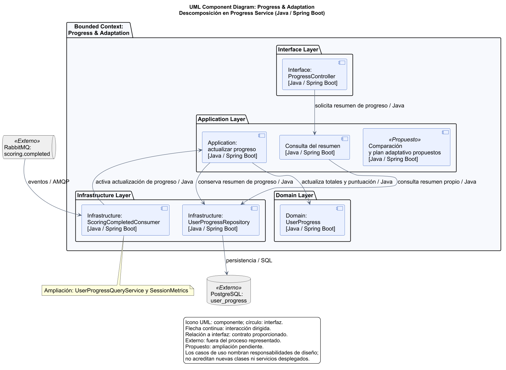

### 5.5.6. Bounded Context Software Architecture Code Level Diagrams

#### 5.5.6.1. Bounded Context Domain Layer Class Diagrams

UserProgress reúne los totales y deriva puntuaciones resumidas de evidencia compatible. SessionMetrics conserva evidencia por práctica compatible con el resumen del mismo usuario; AdaptivePlan contiene sus ejercicios. UserProgressQueryService pertenece a Application y se representa en componentes. El modo, las dimensiones y las versiones sostienen las tendencias y la comparación presentadas en 6.4.

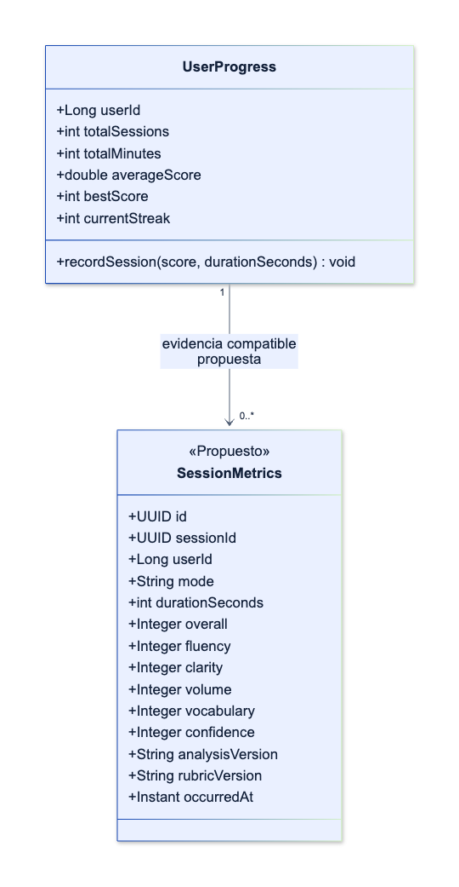

#### 5.5.6.2. Bounded Context Database Design Diagram

user_progress conserva los totales de prácticas y minutos; las puntuaciones resumidas se derivan por modo y versiones desde session_metrics. La tabla propuesta session_metrics registra la sesión, modo, duración, dimensiones y versiones de análisis y rúbrica. La combinación de sesión y versiones debe ser única. La eliminación retira sus métricas y recalcula el resumen, manteniendo los puntos de experiencia bajo responsabilidad de Gamification.


**Restricciones de persistencia**

| Objeto | Restricción y relación con las reglas |
| --- | --- |
| SESSION_METRICS | UNIQUE(session_id, analysis_version, rubric_version). Cada dimensión presente cumple 0–100. user_id referencia USER_PROGRESS en el mismo esquema; session_id es referencia externa. Se comparan mismo usuario, modo y versiones. |
| USER_PROGRESS | Los conteos se recalculan por session_id válido distinto. Promedio global y mejor resultado requieren mismo modo, versiones y cinco dimensiones evaluables; sin resultados completos se indica ausencia de valor. La evolución por dimensión utiliza solo los valores presentes. |
| ADAPTIVE_PLANS / PRACTICE_EXERCISES | evidence_ids referencia registros locales existentes; FK plan_id interna. Un plan sin historial suficiente propone práctica inicial y no atribuye debilidades recurrentes. |

La unicidad compuesta se documenta en esta tabla porque comprende varios campos; las marcas PK/FK/UK del diagrama identifican claves simples. Inbox y outbox son registros técnicos del esquema privado: eventId es único en inbox y el despacho confirma la salida después del commit local. No se crean FKs hacia otros contextos.

## 5.6. Bounded Context: Sharing & Retention

Este contexto permite compartir reportes por tiempo limitado, exportarlos y solicitar la eliminación de una sesión. Coordina el acceso y el retiro de los datos con los contextos responsables de conservarlos.

**Servicio o componente asociado:** Modelo propuesto.

### 5.6.1. Domain Layer

La capa de dominio propuesta define las condiciones de acceso temporal a un reporte y el seguimiento de la eliminación de una sesión. Cada permiso o solicitud conserva su propia identidad y estado.

**Aggregate Roots**

ShareGrant representa el permiso temporal de lectura de un reporte. Conserva el propietario, la vigencia y la revocación del acceso. DeletionRequest registra la solicitud de eliminación y controla su avance hasta recibir las confirmaciones necesarias. Ambos agregados pertenecen al diseño propuesto.

**Entities**

PurgeReceipt registra la confirmación de eliminación enviada por cada contexto responsable. Su relación con DeletionRequest permite identificar las confirmaciones recibidas y las que todavía faltan.

**Elementos de Domain Layer**

| Nombre | Tipo | Descripción | Capa |
| --- | --- | --- | --- |
| ShareGrant | Aggregate Root (diseño propuesto) | Representa un permiso temporal de lectura sobre un reporte. | Domain |
| DeletionRequest | Aggregate Root (diseño propuesto) | Registra una solicitud de eliminación y su estado. | Domain |
| PurgeReceipt | Entity (diseño propuesto) | Confirma la eliminación realizada por cada contexto responsable. | Domain |

**Reglas principales**

1. El acceso a un reporte comprueba la vigencia del permiso y su posible revocación.
2. Revocar un enlace impide nuevas consultas al reporte compartido.
3. Solicitar la eliminación bloquea el acceso al recurso; la eliminación física concluye cuando se reciben las confirmaciones requeridas.
4. La exportación incluye únicamente información autorizada del reporte.

**Atributos y operaciones del modelo de dominio**

Los atributos se encapsulan; las operaciones públicas expresan las reglas del contexto. Las interfaces y enumeraciones se distinguen en el UML. Este modelo especifica el diseño objetivo del TP.

| Elemento | Atributos o valores | Operaciones públicas |
| --- | --- | --- |
| ShareGrant | UUID id UUID reportId UUID sessionId Long ownerId String tokenHash String scope Instant expiresAt Instant revokedAt | isAccessible(Instant now, boolean deleted) boolean revoke(Instant now) void |
| DeletionRequest | UUID id UUID sessionId Long ownerId DeletionState state Set~String~ expectedContexts Instant deadline | registerReceipt(PurgeReceipt receipt) void isComplete() boolean requireRetry(Instant now) void |
| DeletionState | REQUESTED ACCESS_BLOCKED PURGING COMPLETED RETRY_REQUIRED | Consulta mediante el agregado o servicio responsable. |
| PurgeReceipt | UUID id String context Instant completedAt | Consulta mediante el agregado o servicio responsable. |

### 5.6.2. Interface Layer

Los controladores propuestos reciben las solicitudes de compartir, revocar, exportar y eliminar. Su responsabilidad es identificar al solicitante, validar la estructura de los datos y delegar el caso de uso correspondiente.

**Operaciones propuestas**

| Operación | Responsabilidad |
| --- | --- |
| `POST /api/v1/reports/{reportId}/shares` | Crear un permiso de lectura con fecha de vencimiento. |
| `DELETE /api/v1/shares/{grantId}` | Revocar un permiso creado por el propietario. |
| `GET /api/v1/shared-reports/{token}` | Consultar la vista autorizada de un reporte compartido. |
| `POST /api/v1/reports/{reportId}/exports` | Preparar la exportación del reporte. |
| `POST /api/v1/sessions/{sessionId}/deletions` | Registrar una solicitud de eliminación. |
| `GET /api/v1/deletions/{requestId}` | Consultar el estado de la eliminación. |

**Datos de entrada y respuesta.** La compartición identifica el reporte, su vigencia y el alcance permitido. La respuesta devuelve el enlace temporal y su vencimiento. La eliminación devuelve el identificador de la solicitud y su estado. La vista del tutor omite el material contextual y los datos que no formen parte del permiso.

### 5.6.3. Application Layer

La capa de aplicación propuesta coordina la creación de permisos, la consulta de reportes compartidos y la eliminación distribuida de datos.

**Commands propuestos**

La creación de un permiso, su revocación y la solicitud de eliminación modifican el estado de ShareGrant o DeletionRequest. La recepción de una confirmación actualiza el avance de la eliminación.

**Queries del diseño objetivo**

La lectura compartida comprueba la vigencia del permiso antes de recuperar la vista autorizada del reporte. La exportación prepara únicamente la información que puede consultar el solicitante.

**Command Handlers y Query Handlers**

Los manejadores propuestos separan cada operación y reúnen las comprobaciones necesarias antes de utilizar los repositorios o publicar mensajes.

**Elementos de Application Layer**

| Nombre | Tipo | Descripción | Capa |
| --- | --- | --- | --- |
| CreateShareGrantHandler | Command Handler | Comprueba el propietario y registra la vigencia del permiso. | Application |
| ResolveSharedReportHandler | Query Handler | Comprueba el permiso y recupera la vista autorizada del reporte. | Application |
| RevokeShareHandler | Command Handler | Retira el permiso de lectura. | Application |
| RequestDeletionHandler | Command Handler | Registra la solicitud y comunica la eliminación a los contextos responsables. | Application |
| CollectPurgeReceiptHandler | Manejador de confirmaciones | Reúne las confirmaciones y determina si la solicitud concluyó. | Application |
| ExportReportHandler | Manejador de exportación | Prepara la descarga con el alcance y las versiones autorizadas. | Application |

**Recorrido del caso de uso.** Compartir genera un permiso temporal; consultar verifica su vigencia y revocación. Eliminar bloquea nuevas consultas y solicita el retiro de los datos a cada contexto responsable. La solicitud se completa cuando se reúnen las confirmaciones esperadas. RequestDeletionHandler fija deadline a 24 horas desde la aceptación, como meta inicial de QAS-PRI-01. Al consultar o actualizar una solicitud, si vence ese plazo y falta alguna confirmación, DeletionRequest pasa a RETRY_REQUIRED y presenta los contextos pendientes; el acceso continúa bloqueado. Las confirmaciones posteriores permiten concluir la purga sin afirmar que se cumplió el plazo. La meta de diseño no acredita un acuerdo de servicio validado con los proveedores.

**Contratos de coordinación**

| Clase o grupo de clases | Responsabilidad | Operaciones previstas |
| --- | --- | --- |
| CreateShareGrantHandler / ResolveSharedReportHandler / RevokeShareHandler / RequestDeletionHandler / CollectPurgeReceiptHandler / ExportReportHandler | Autoriza consultas y coordina permisos, exportación y purga. | createGrant(reportId, expiry); revoke(id); resolve(token); delete(sessionId); collect(receipt); export(reportId) |

Los handlers validan la petición o el evento antes de ejecutar cambios. Los puertos de repositorio y de integración son contratos; los adaptadores de Infrastructure realizan esos contratos. Los nombres describen clases previstas para implementar el diseño, sin afirmar que estén desplegadas.

### 5.6.4. Infrastructure Layer

La capa de infraestructura propuesta conserva los permisos y solicitudes y comunica la eliminación a los contextos propietarios de los datos.

**Elementos de Infrastructure Layer**

| Nombre | Tipo | Descripción | Capa |
| --- | --- | --- | --- |
| Persistencia de permisos y solicitudes | Repositorios propuestos | Conserva ShareGrant, DeletionRequest y sus confirmaciones en PostgreSQL. | Infrastructure |
| Mensajería de eliminación | Adaptador de eventos propuesto | Comunica las solicitudes y confirmaciones mediante RabbitMQ. | Infrastructure |
| Exportación del reporte | Adaptador propuesto | Prepara un archivo con información autorizada y vigencia de descarga limitada. | Infrastructure |

Los enlaces se conservan mediante un hash. Si no puede comprobarse la vigencia del permiso, la consulta se bloquea. Revocar un enlace retira el acceso futuro, pero no recupera una copia que ya haya sido descargada.

### 5.6.5. Bounded Context Software Architecture Component Level Diagrams

Esta vista C4 descompone el container de Sharing & Retention definido en 4.3.3. Los elementos externos se sitúan fuera de su frontera; las relaciones indican responsabilidad y protocolo. Las clases siguientes colaboran en los componentes del proceso y mantienen la separación de capas.

| Clases agrupadas en el componente | Capa | Responsabilidad |
| --- | --- | --- |
| ShareController / DeletionController / ExportController | Interface | Recibe solicitudes de privacidad y lectura compartida. |
| CreateShareGrantHandler / ResolveSharedReportHandler / RevokeShareHandler / RequestDeletionHandler / CollectPurgeReceiptHandler / ExportReportHandler | Application | Autoriza consultas y coordina permisos, exportación y purga. |
| ShareGrant / DeletionRequest / PurgeReceipt | Domain | Controla vigencia, bloqueo y confirmaciones. |
| ShareGrantRepository / DeletionRequestRepository | Infrastructure | Conserva hashes, solicitudes y confirmaciones. |
| DeletionPublisher / PurgeReceiptConsumer | Infrastructure | Solicita purga y recibe confirmaciones. |
| SessionAccessClient / AuthorizedReportClient | Infrastructure | Bloquea sesión y recupera únicamente el reporte autorizado. |


### 5.6.6. Bounded Context Software Architecture Code Level Diagrams

#### 5.6.6.1. Bounded Context Domain Layer Class Diagrams

ShareGrant administra vigencia y alcance del acceso. DeletionRequest reúne PurgeReceipt, los contextos esperados y DeletionState. La solicitud avanza desde REQUESTED hasta COMPLETED; si falta una confirmación queda PURGING o RETRY_REQUIRED.


#### 5.6.6.2. Bounded Context Database Design Diagram

share_grants almacena el reporte, propietario, hash del enlace y fechas de vigencia y revocación. deletion_requests registra la solicitud de eliminación y purge_receipts sus confirmaciones. Los registros deben evitar permisos o confirmaciones duplicados. Este esquema corresponde al diseño propuesto.


**Restricciones de persistencia**

| Objeto | Restricción y relación con las reglas |
| --- | --- |
| SHARE_GRANTS | token_hash único; expires_at posterior a creación. Scope limitado al reporte. session_id permite bloquear todos los permisos al eliminar; no se guarda el token en claro. |
| DELETION_REQUESTS | UNIQUE(session_id), para una solicitud activa de eliminación. expected_contexts conserva los destinatarios que deberán confirmar; estados definidos en UML. |
| PURGE_RECEIPTS | UNIQUE(request_id, context), FK request_id local. Confirmaciones repetidas no completan dos veces la solicitud. |

La unicidad compuesta se documenta en esta tabla porque comprende varios campos; las marcas PK/FK/UK del diagrama identifican claves simples. Inbox y outbox son registros técnicos del esquema privado: eventId es único en inbox y el despacho confirma la salida después del commit local. No se crean FKs hacia otros contextos.

## 5.7. Bounded Context: Gamification

Este contexto reconoce la constancia del estudiante mediante rachas y logros. Los reconocimientos se calculan a partir de prácticas válidas y respetan la decisión del estudiante sobre su participación pública.

**Servicio o componente asociado:** gamification-service.

### 5.7.1. Domain Layer

La capa de dominio representa la continuidad de las prácticas y los reconocimientos del estudiante. Las reglas de racha y experiencia se evalúan sobre las sesiones que cumplen las condiciones de validez.

**Aggregate Root**

UserStreak conserva la racha actual, la mejor racha y la experiencia acumulada del estudiante. Las evaluaciones de práctica permiten actualizar estas medidas de continuidad.

**Entities**

Achievement representa un reconocimiento obtenido por el estudiante. PracticeContribution identifica las sesiones válidas ya contabilizadas; Achievement registra la versión de regla y la práctica que originó el logro.

**Elementos de Domain Layer**

| Nombre | Tipo | Descripción | Capa |
| --- | --- | --- | --- |
| UserStreak | Aggregate Root | Representa la continuidad de las prácticas y la experiencia acumulada. | Domain |
| Achievement | Entity (diseño propuesto) | Registra un logro obtenido por el estudiante. | Domain |

**Reglas principales**

1. Solo las prácticas válidas contribuyen a las rachas y los logros.
2. Una misma sesión no incrementa la experiencia dos veces.
3. El cálculo diario de la racha considera la zona horaria del estudiante.

**Atributos y operaciones del modelo de dominio**

Los atributos se encapsulan; las operaciones públicas expresan las reglas del contexto. Las interfaces y enumeraciones se distinguen en el UML. Este modelo especifica el diseño objetivo del TP.

| Elemento | Atributos o valores | Operaciones públicas |
| --- | --- | --- |
| UserStreak | Long userId int currentStreakDays int longestStreakDays int xp String timeZone boolean publicRanking Instant lastSessionAt | recordValidSession(Instant occurredAt, int xpDelta) void setPublicRanking(boolean enabled) void |
| Achievement | UUID id Long userId UUID originSessionId String code String title String ruleVersion Instant unlockedAt | Consulta mediante el agregado o servicio responsable. |
| PracticeContribution | UUID sessionId Long userId String ruleVersion int xpDelta Instant occurredAt boolean valid | Consulta mediante el agregado o servicio responsable. |

### 5.7.2. Interface Layer

GamificationController permite consultar las rachas y el ranking. Los cambios de experiencia y logros se originan en los eventos de evaluación.

**Controller y operaciones**

| Operación o contrato | Responsabilidad |
| --- | --- |
| `GET /v1/gamification/streaks/{userId}` | Consultar racha actual, mejor racha y experiencia acumulada. |
| `GET /v1/gamification/leaderboard` | Consultar el listado de participantes del ranking. |
| `scoring.completed` | Activar la actualización de rachas y reconocimientos. |
| `achievement.unlocked` | Comunicar el logro obtenido. |

**Datos de respuesta.** La racha presenta el estudiante y sus valores de continuidad y experiencia. El ranking utiliza información resumida de sus participantes. La participación pública opcional y la autorización de consultas personales se incorporan en la ampliación del diseño.

### 5.7.3. Application Layer

La capa de aplicación coordina la actualización de rachas y la evaluación de logros. Una misma práctica debe producir una única actualización del reconocimiento.

**Actualización por eventos**

Una evaluación completada activa la actualización de la racha y la experiencia. El flujo comprueba los logros obtenidos y solicita su comunicación.

**Queries**

Las lecturas presentan la racha de un estudiante y el ranking. La participación pública opcional y el control de sesiones ya procesadas forman parte de la ampliación del diseño.

**Elementos de Application Layer**

| Nombre | Tipo | Descripción | Capa |
| --- | --- | --- | --- |
| RecordGamificationHandler | Event Handler | Aplica las reglas de continuidad y experiencia a UserStreak. | Application |
| AchievementRuleService | Servicio de dominio | Comprueba las condiciones de reconocimiento y solicita su comunicación. | Application |

**Recorrido del caso de uso.** La evaluación completada identifica al estudiante y la práctica. El flujo valida su contribución a la racha, actualiza la experiencia y comprueba los logros. El diseño ampliado añade el veredicto de práctica válida, la zona horaria y el registro de sesiones ya procesadas.

**Contratos de coordinación**

| Clase o grupo de clases | Responsabilidad | Operaciones previstas |
| --- | --- | --- |
| RecordGamificationHandler / GamificationQueryService | Registra contribuciones únicas y organiza consultas. | recordValidSession(event); queryStreak(userId); queryLeaderboard() |

Los handlers validan la petición o el evento antes de ejecutar cambios. Los puertos de repositorio y de integración son contratos; los adaptadores de Infrastructure realizan esos contratos. Los nombres describen clases previstas para implementar el diseño, sin afirmar que estén desplegadas.

### 5.7.4. Infrastructure Layer

La capa de infraestructura conserva las rachas y conecta la evaluación con los reconocimientos mediante RabbitMQ.

**Elementos de Infrastructure Layer**

| Nombre | Tipo | Descripción | Capa |
| --- | --- | --- | --- |
| UserStreakRepository | Repositorio | Conserva las rachas y la experiencia en PostgreSQL. | Infrastructure |
| ScoringCompletedConsumer | Consumidor de eventos | Recibe la evaluación que origina la actualización de reconocimientos. | Infrastructure |
| AchievementUnlockedPublisher | Publicador de eventos | Comunica el logro obtenido a Notifications. | Infrastructure |
| AchievementRepository y PracticeContributionRepository | Repositorios | Conserva los logros y las sesiones que los originaron. | Infrastructure |

PracticeContributionRepository aplica unicidad por sesión para que un nuevo análisis no otorgue XP otra vez. AchievementRepository aplica unicidad por usuario, código y versión de regla. UserStreak conserva zona horaria y publicRanking; GamificationQueryService limita el ranking a quienes optaron por participar.

### 5.7.5. Bounded Context Software Architecture Component Level Diagrams

Esta vista C4 descompone el container de Gamification definido en 4.3.3. Los elementos externos se sitúan fuera de su frontera; las relaciones indican responsabilidad y protocolo. Las clases siguientes colaboran en los componentes del proceso y mantienen la separación de capas.

| Clases agrupadas en el componente | Capa | Responsabilidad |
| --- | --- | --- |
| GamificationController | Interface | Expone racha y ranking voluntario. |
| RecordGamificationHandler / GamificationQueryService | Application | Registra contribuciones únicas y organiza consultas. |
| UserStreak / Achievement / PracticeContribution / AchievementRuleService | Domain | Aplica validez, zona horaria y reglas versionadas. |
| UserStreakRepository / AchievementRepository / PracticeContributionRepository | Infrastructure | Conserva progreso lúdico sin duplicar XP. |
| ScoringCompletedConsumer / AchievementUnlockedPublisher | Infrastructure | Recibe práctica evaluada y comunica logros. |


### 5.7.6. Bounded Context Software Architecture Code Level Diagrams

#### 5.7.6.1. Bounded Context Domain Layer Class Diagrams

UserStreak conserva la racha y la experiencia del usuario, mientras que Achievement identifica cada reconocimiento. La asociación agrupa los logros del mismo usuario; Achievement se identifica como ampliación propuesta. El consumidor y el publicador de eventos se representan en componentes, fuera del dominio. PracticeContribution identifica las prácticas ya contabilizadas.


#### 5.7.6.2. Bounded Context Database Design Diagram

user_streaks y achievements se relacionan por usuario dentro de la misma base. La ampliación propone identificar los logros por usuario, código y versión de regla para evitar duplicados.


**Restricciones de persistencia**

| Objeto | Restricción y relación con las reglas |
| --- | --- |
| ACHIEVEMENTS | UNIQUE(user_id, code, rule_version); origin_session_id referencia externa. El registro identifica qué práctica produjo el reconocimiento. |
| PRACTICE_CONTRIBUTIONS | PK session_id impide incrementar XP otra vez al reevaluar una práctica. xp_delta ≥ 0 y solo valid=true contribuye a la racha. |
| USER_STREAKS | CHECK contadores y XP ≥ 0; time_zone es una zona IANA. public_ranking=false por defecto; solo participantes voluntarios figuran en ranking. |

La unicidad compuesta se documenta en esta tabla porque comprende varios campos; las marcas PK/FK/UK del diagrama identifican claves simples. Inbox y outbox son registros técnicos del esquema privado: eventId es único en inbox y el despacho confirma la salida después del commit local. No se crean FKs hacia otros contextos.

## 5.8. Bounded Context: Identity & Access

Este contexto administra las cuentas y el acceso a Talki. También organiza la información del perfil y el registro verificable del consentimiento necesario para procesar voz.

**Servicio o componente asociado:** identity-service.

### 5.8.1. Domain Layer

La capa de dominio representa la cuenta del estudiante y los roles reconocidos por Talki. El modelo de acceso distingue la identidad de la persona de las autorizaciones particulares sobre sus sesiones.

**Aggregate Root**

AppUser representa la cuenta del estudiante. Conserva su identificador, correo, contraseña protegida, nombre de usuario, segmento académico y rol.

**Entities**

RefreshToken se propone para registrar la vigencia y revocación de las credenciales de renovación. VoiceConsent registra versión, alcance, aceptación y retiro. PasswordResetRequest conserva hash y vencimiento del enlace de recuperación.

**Enumerations**

UserRole define los roles de acceso reconocidos por Talki. Las autorizaciones sobre una sesión se comprueban en el contexto responsable de esa práctica. VoiceConsent conserva policyVersion, scope, acceptedAt y withdrawnAt; PasswordResetRequest admite un token de un solo uso con vencimiento.

**Elementos de Domain Layer**

| Nombre | Tipo | Descripción | Capa |
| --- | --- | --- | --- |
| AppUser | Aggregate Root | Representa la cuenta, los datos del estudiante y su rol. | Domain |
| RefreshToken | Entity (diseño propuesto) | Permite renovar el acceso y registrar su revocación. | Domain |
| UserRole | Enumeración | Define los roles de acceso reconocidos por la aplicación. | Domain |

**Reglas principales**

1. Cada cuenta utiliza un correo único y conserva la contraseña mediante un hash.
2. La renovación sustituye el token anterior y el cierre de sesión permite revocarlo.
3. El consentimiento identifica su versión, alcance y momento; se distingue de la aceptación de las condiciones de la cuenta.

**Atributos y operaciones del modelo de dominio**

Los atributos se encapsulan; las operaciones públicas expresan las reglas del contexto. Las interfaces y enumeraciones se distinguen en el UML. Este modelo especifica el diseño objetivo del TP.

| Elemento | Atributos o valores | Operaciones públicas |
| --- | --- | --- |
| AppUser | Long id String email String passwordHash String username String academicSegment String interfaceLocale UserRole role Instant createdAt | updateProfile(String username, String segment, String locale) void |
| UserRole | STUDENT ADMIN | Consulta mediante el agregado o servicio responsable. |
| RefreshToken | UUID id String tokenHash Instant expiresAt Instant revokedAt | isValid(Instant now) boolean revoke(Instant now) void |
| VoiceConsent | UUID id String policyVersion String scope Instant acceptedAt Instant withdrawnAt | isActive(String requiredVersion) boolean withdraw(Instant now) void |
| PasswordResetRequest | UUID id String tokenHash Instant expiresAt Instant usedAt | consume(Instant now) void |

### 5.8.2. Interface Layer

AuthController recibe las solicitudes de registro e inicio de sesión y las delega a AuthService. Las credenciales de entrada se distinguen de los datos públicos devueltos al cliente.

**Controller y operaciones**

| Operación | Responsabilidad |
| --- | --- |
| `POST /v1/auth/register` | Registrar la cuenta del estudiante. |
| `POST /v1/auth/login` | Autenticar al estudiante y preparar su acceso. |

**Datos de entrada y respuesta.** El registro recibe correo, contraseña, nombre de usuario y segmento académico. Devuelve el identificador y los datos públicos de la cuenta. El inicio de sesión recibe correo y contraseña y devuelve la credencial de acceso y su tipo. La contraseña y su hash no forman parte de la respuesta.

**Contratos de acceso y consentimiento.** `POST /v1/auth/refresh` rota el token; `POST /v1/auth/logout` lo revoca; `PATCH /v1/users/me` modifica perfil e idioma de interfaz; `POST /v1/auth/password-reset-requests` responde 202 sin revelar si existe el correo; `POST /v1/auth/password-resets` consume el token de recuperación. `POST /v1/users/me/voice-consents` registra versión y alcance; `DELETE /v1/users/me/voice-consents/{id}` registra su retiro; `GET /internal/v1/users/{id}/voice-consent` permite verificar la autorización entre servicios autenticados. El registro de una cuenta comunica `user.registered` a los contextos interesados.

### 5.8.3. Application Layer

La capa de aplicación coordina el registro y la autenticación. Utiliza la cuenta del dominio, el almacenamiento y los servicios de seguridad para preparar el acceso del estudiante.

**Commands**

El registro crea una cuenta después de comprobar el correo y proteger la contraseña. El inicio de sesión verifica las credenciales y solicita un token de acceso. AuthService coordina ambas operaciones.

**Commands propuestos**

La renovación, el cierre de sesión y la gestión del consentimiento amplían el modelo de acceso. El consentimiento de voz conserva su autorización de manera independiente del registro de la cuenta.

**Elementos de Application Layer**

| Nombre | Tipo | Descripción | Capa |
| --- | --- | --- | --- |
| AuthService | Servicio de aplicación | Comprueba el correo, protege la contraseña, registra la cuenta y valida las credenciales de acceso. | Application |
| UserRegisteredEventPublisher | Puerto de publicación | Define la comunicación del registro a los contextos interesados. | Application |
| TokenSessionService | Servicio de aplicación | Renuevan o revocan las credenciales de acceso. | Application |
| ConsentCommandService | Servicio de aplicación | Registra la versión, alcance y retiro de la autorización de procesamiento. | Application |

**Contratos de coordinación**

| Clase o grupo de clases | Responsabilidad | Operaciones previstas |
| --- | --- | --- |
| AuthService / TokenSessionService / ConsentCommandService / PasswordRecoveryService | Coordina cuenta, tokens y autorizaciones. | register(request); login(credentials); rotate(token); consent(version, scope); resetPassword(token) |

Los handlers validan la petición o el evento antes de ejecutar cambios. Los puertos de repositorio y de integración son contratos; los adaptadores de Infrastructure realizan esos contratos. Los nombres describen clases previstas para implementar el diseño, sin afirmar que estén desplegadas.

### 5.8.4. Infrastructure Layer

La capa de infraestructura implementa el almacenamiento de cuentas, la protección de contraseñas y la emisión de credenciales de acceso.

**Elementos de Infrastructure Layer**

| Nombre | Tipo | Descripción | Capa |
| --- | --- | --- | --- |
| AppUserRepository | Repositorio | Conserva las cuentas en PostgreSQL y permite localizarlas por correo. | Infrastructure |
| PasswordEncoder | Servicio de seguridad | Protege y verifica la contraseña sin conservar su valor original. | Infrastructure |
| JwtTokenProvider | Servicio de seguridad | Genera la credencial de acceso del estudiante. | Infrastructure |
| RabbitUserRegisteredPublisher | Publicador de eventos | Implementa UserRegisteredEventPublisher mediante RabbitMQ. | Infrastructure |

Spring Security organiza las reglas de acceso. El cliente web utiliza el BFF y cookies protegidas; la adaptación móvil requiere almacenamiento seguro. RefreshTokenRepository, VoiceConsentRepository y PasswordResetRepository mantienen vigencia, retiro y consumo de tokens. PasswordRecoveryService solicita correo mediante Notifications, sin publicar secretos en los eventos.

### 5.8.5. Bounded Context Software Architecture Component Level Diagrams

Esta vista C4 descompone el container de Identity & Access definido en 4.3.3. Los elementos externos se sitúan fuera de su frontera; las relaciones indican responsabilidad y protocolo. Las clases siguientes colaboran en los componentes del proceso y mantienen la separación de capas.

| Clases agrupadas en el componente | Capa | Responsabilidad |
| --- | --- | --- |
| AuthController / ProfileController / VoiceConsentController | Interface | Recibe acceso, perfil, recuperación y consentimiento. |
| AuthService / TokenSessionService / ConsentCommandService / PasswordRecoveryService | Application | Coordina cuenta, tokens y autorizaciones. |
| AppUser / RefreshToken / VoiceConsent / PasswordResetRequest | Domain | Mantiene identidad y vigencia/retiro/consumo. |
| AppUserRepository / RefreshTokenRepository / VoiceConsentRepository / PasswordResetRepository | Infrastructure | Conserva registros privados de cuenta. |
| PasswordEncoder / JwtTokenProvider | Infrastructure | Protege contraseña y firma acceso. |
| RabbitUserRegisteredPublisher / AccountNoticePublisher | Infrastructure | Despacha avisos de cuenta sin secretos. |


### 5.8.6. Bounded Context Software Architecture Code Level Diagrams

#### 5.8.6.1. Bounded Context Domain Layer Class Diagrams

AppUser reúne cuenta, idioma de interfaz y UserRole. Contiene tokens de renovación, consentimiento versionado y solicitudes de recuperación de un solo uso. El retiro y la revocación conservan fecha para interpretar su vigencia.


#### 5.8.6.2. Bounded Context Database Design Diagram

app_users conserva el correo, nombre de usuario, segmento académico, contraseña protegida y rol. La tabla propuesta refresh_tokens se relaciona con la cuenta y conserva la vigencia y revocación de las credenciales. El correo y el hash del token tienen restricciones de unicidad; voice_consents y password_reset_requests se relacionan con la cuenta; el retiro de consentimiento conserva el historial y no se confunde con eliminación de sesiones.


**Restricciones de persistencia**

| Objeto | Restricción y relación con las reglas |
| --- | --- |
| APP_USERS | email único normalizado; contraseña protegida mediante hash; interface_locale restringido a en_US/es_419 y en_US por defecto. |
| REFRESH_TOKENS / PASSWORD_RESET_REQUESTS | Hashes únicos y vencimiento obligatorio. Renovar revoca el token anterior; recuperar consume el enlace una sola vez. Nunca se devuelve password_hash. |
| VOICE_CONSENTS | UNIQUE(user_id, policy_version, scope), con aceptación y retiro explícitos. Cambiar la versión requiere nueva aceptación; retirar bloquea nuevas prácticas, sin borrar por sí solo el historial. |

La unicidad compuesta se documenta en esta tabla porque comprende varios campos; las marcas PK/FK/UK del diagrama identifican claves simples. Inbox y outbox son registros técnicos del esquema privado: eventId es único en inbox y el despacho confirma la salida después del commit local. No se crean FKs hacia otros contextos.

## 5.9. Bounded Context: AI Provider Gateway

Este contexto organiza la comunicación de Talki con proveedores de inteligencia artificial. Mantiene un contrato común para que las diferencias de cada proveedor permanezcan en sus adaptadores.

**Servicio o componente asociado:** Pasarela de integración propuesta.

### 5.9.1. Domain Layer

La capa de dominio propuesta define el contrato que debe cumplir una integración con un proveedor de inteligencia artificial. Su función es expresar las capacidades necesarias para una conversación, independientemente de la API del proveedor.

**Integration Port**

AIProviderPort define, en el diseño propuesto, las preparación de una credencial efímera para una conversación autorizada. Este contrato permite expresar las capacidades que Talki necesita sin depender de la API de un proveedor. Las sesiones y evaluaciones permanecen bajo responsabilidad de sus respectivos contextos.

**Elementos de Domain Layer**

| Nombre | Tipo | Descripción | Capa |
| --- | --- | --- | --- |
| AIProviderPort | Puerto de integración (diseño propuesto) | Define issueCredential y supports; no transporta el audio del estudiante. | Domain |

**Reglas principales**

1. El proveedor recibe únicamente la información autorizada necesaria para la práctica.
2. La selección del proveedor comprueba que disponga de las capacidades requeridas por el modo elegido.
3. Los errores se traducen a respuestas que el resto de Talki pueda interpretar y recuperar.
4. Los registros técnicos evitan conservar audio, material personal y solicitudes completas.

**Atributos y operaciones del modelo de dominio**

Los atributos se encapsulan; las operaciones públicas expresan las reglas del contexto. Las interfaces y enumeraciones se distinguen en el UML. Este modelo especifica el diseño objetivo del TP.

| Elemento | Atributos o valores | Operaciones públicas |
| --- | --- | --- |
| AIProviderPort | Sin estado propio. | issueCredential(LivePreparation request) LiveCredential supports(String mode) boolean |
| LivePreparation | UUID sessionId String mode String authorizedInstructions String conversationLocale int durationSeconds | Consulta mediante el agregado o servicio responsable. |
| LiveCredential | String ephemeralToken String provider String model Instant expiresAt | Consulta mediante el agregado o servicio responsable. |

### 5.9.2. Interface Layer

La pasarela propuesta ofrece un contrato interno a Live Coaching. No expone una API pública adicional para el estudiante.

**Contrato de integración.** `POST /internal/v1/live-credentials` recibe sessionId, modo, instrucciones autorizadas, idioma y duración. AIProviderGatewayController delega en AIIntegrationApplicationService, que utiliza AIProviderPort.issueCredential. Los datos comunes incluyen el modo de práctica, las instrucciones del escenario y las condiciones del intercambio.

**Representación de la respuesta.** La pasarela devuelve los datos necesarios para continuar la conversación y traduce las respuestas y los errores del proveedor. Devuelve 201 con ephemeralToken, provider, model y expiresAt, o 422 si el modo no es compatible y 503 si el proveedor no responde. Solo Live Coaching puede invocar esta API mediante autenticación entre servicios. Las credenciales permanentes no se entregan al cliente.

### 5.9.3. Application Layer

La capa de aplicación propuesta coordina la selección del proveedor y la emisión de credenciales efímeras mediante un contrato común.

**Coordinación de la integración**

AIIntegrationApplicationService se propone para comprobar las capacidades requeridas por una práctica, seleccionar el adaptador y solicitar la credencial mediante AIProviderPort. El servicio devuelve la respuesta o el error al contexto que inició la solicitud.

**Elementos de Application Layer**

| Nombre | Tipo | Descripción | Capa |
| --- | --- | --- | --- |
| AIIntegrationApplicationService | Servicio de aplicación propuesto | Comprueba las capacidades requeridas, selecciona el adaptador y coordina la solicitud autorizada. | Application |

**Contratos de coordinación**

| Clase o grupo de clases | Responsabilidad | Operaciones previstas |
| --- | --- | --- |
| AIIntegrationApplicationService | Comprueba capacidad y selecciona proveedor. | prepare(LivePreparation) LiveCredential |

Los handlers validan la petición o el evento antes de ejecutar cambios. Los puertos de repositorio y de integración son contratos; los adaptadores de Infrastructure realizan esos contratos. Los nombres describen clases previstas para implementar el diseño, sin afirmar que estén desplegadas.

### 5.9.4. Infrastructure Layer

La capa de infraestructura propuesta contiene los adaptadores que conocen las APIs de los proveedores de inteligencia artificial.

**Elementos de Infrastructure Layer**

| Nombre | Tipo | Descripción | Capa |
| --- | --- | --- | --- |
| GeminiLiveClient | Adaptador propuesto | Implementa AIProviderPort.issueCredential mediante HTTPS con Gemini; traduce los errores del proveedor. | Infrastructure |
| Configuración del proveedor | Configuración de integración | Protege las credenciales y determina las capacidades disponibles. | Infrastructure |

AIProviderGatewayClient, en Live Coaching, llama a esta pasarela por HTTPS. GeminiLiveClient reside únicamente aquí y solicita la credencial temporal. El cliente web/móvil conversa directamente con Gemini mediante WSS; esta pasarela no abre ni cierra ese canal y no recopila la transcripción. El cierre y su evidencia vuelven a Live Coaching y Sessions.

### 5.9.5. Bounded Context Software Architecture Component Level Diagrams

Esta vista C4 descompone el container de AI Provider Gateway definido en 4.3.3. Los elementos externos se sitúan fuera de su frontera; las relaciones indican responsabilidad y protocolo. Las clases siguientes colaboran en los componentes del proceso y mantienen la separación de capas.

| Clases agrupadas en el componente | Capa | Responsabilidad |
| --- | --- | --- |
| AIProviderGatewayController | Interface | Recibe contrato interno de credenciales. |
| AIIntegrationApplicationService | Application | Comprueba capacidad y selecciona proveedor. |
| AIProviderPort / LivePreparation / LiveCredential | Domain | Define preparación independiente del proveedor. |
| GeminiLiveClient | Infrastructure | Emite credencial efímera por HTTPS. |
| ProviderConfiguration | Infrastructure | Obtiene secretos y capacidades de configuración protegida. |


### 5.9.6. Bounded Context Software Architecture Code Level Diagrams

#### 5.9.6.1. Bounded Context Domain Layer Class Diagrams

El diagrama UML de dominio contiene AIProviderPort y los valores LivePreparation y LiveCredential. AIIntegrationApplicationService y GeminiLiveClient pertenecen a Application e Infrastructure y su dependencia y realización se muestran en componentes. El puerto permite sustituir al proveedor sin cambiar las reglas de la práctica.


#### 5.9.6.2. Bounded Context Database Design Diagram

Este contexto no almacena audio ni transcripciones. La configuración y las credenciales se administran mediante los mecanismos de infraestructura, separados del material del estudiante.


## 5.10. Bounded Context: Notifications

Este contexto comunica resultados y logros al estudiante mediante avisos. El envío se realiza después de los eventos del dominio y mantiene la práctica independiente de la disponibilidad del canal de notificación.

**Servicio o componente asociado:** notification-service.

### 5.10.1. Domain Layer

La capa de dominio propuesta define la entrega de avisos al estudiante sin depender de un canal concreto. Las reglas determinan qué información puede incluirse y cuándo corresponde enviar una notificación.

**Output Port**

NotificationPushService representa el contrato propuesto para entregar un aviso al estudiante. El contenido se origina a partir de una evaluación, un logro o una acción de cuenta/privacidad y evita incluir la evidencia privada de la práctica. La entrega se describe mediante un puerto y un adaptador de canal; Notification conserva originEventId, canal, intentos y estado; NotificationPreference mantiene las preferencias de entrega.

**Elementos de Domain Layer**

| Nombre | Tipo | Descripción | Capa |
| --- | --- | --- | --- |
| NotificationPushService | Puerto de salida (diseño propuesto) | Define la operación de envío de un aviso al estudiante. | Domain |

**Reglas principales**

1. Un fallo de notificación no bloquea el cierre de una práctica.
2. Los mensajes evitan exponer transcripciones, puntuaciones o material personal.
3. Los avisos opcionales respetan las preferencias del estudiante; los mensajes de seguridad siguen sus reglas transaccionales.

**Atributos y operaciones del modelo de dominio**

Los atributos se encapsulan; las operaciones públicas expresan las reglas del contexto. Las interfaces y enumeraciones se distinguen en el UML. Este modelo especifica el diseño objetivo del TP.

| Elemento | Atributos o valores | Operaciones públicas |
| --- | --- | --- |
| Notification | UUID id UUID originEventId UUID sessionId (opcional) Long userId String templateCode String destinationPath String channel DeliveryState state int attempts | markDelivered() void markFailed() void scheduleRetry() void |
| DeliveryState | PENDING DELIVERED RETRYING FAILED CANCELLED | Consulta mediante el agregado o servicio responsable. |
| NotificationPreference | Long userId boolean optionalEmail boolean inApp | update(boolean email, boolean inApp) void |
| NotificationPushService | Sin estado propio. | push(Notification notification) boolean |

### 5.10.2. Interface Layer

Este contexto recibe los eventos que originan avisos al estudiante. No necesita que el cliente solicite directamente el envío de una notificación.

**Contratos de entrada.** ScoringCompletedEvent permite reconocer que una evaluación terminó. AchievementUnlockedEvent identifica el logro obtenido. Los eventos `scoring.completed` y `achievement.unlocked` conservan la referencia del destinatario y del hecho que origina el aviso. Los contratos `user.registered`, `share.revoked` y `deletion.completed` identifican destinatario y referencia de la acción; NotificationEventConsumer los transforma en avisos de cuenta o privacidad. El material privado y los tokens no se incluyen en estos mensajes.

**Preferencias del estudiante.** NotificationPreferenceController expone `GET /v1/notifications/preferences` (200) y `PATCH /v1/notifications/preferences` (200 con optionalEmail e inApp actualizados). La identidad se deriva de la autenticación. Desactivar avisos opcionales no suprime comunicaciones imprescindibles de acceso o privacidad; el consentimiento de contacto y el canal se verifican antes de cada envío.

**Entrega propuesta.** El mensaje permite al estudiante reconocer el aviso y acceder a su reporte o logro. WebSocketPushAdapter y el proveedor de correo son canales propuestos; su disponibilidad y las preferencias de contacto se comprobarán antes del envío.

### 5.10.3. Application Layer

La capa de aplicación propuesta prepara los avisos a partir de los eventos del negocio. La preparación del contenido permanece separada del canal utilizado para entregarlo.

**Procesamiento de eventos**

Los eventos de evaluación y logro identifican al destinatario y el tipo de aviso. El caso de uso propuesto prepara el contenido, comprueba las preferencias y solicita la entrega mediante NotificationPushService. La entrega del aviso mantiene su resultado separado del resultado de la práctica.

**Elementos de Application Layer**

| Nombre | Tipo | Descripción | Capa |
| --- | --- | --- | --- |
| DispatchNotificationHandler | Event Handler | Prepara un mensaje que permita acceder al resultado de la práctica. | Application |
| NotificationTemplateService | Servicio de aplicación | Prepara el reconocimiento que corresponde al evento recibido. | Application |
| NotificationPreferenceService | Servicio de aplicación | Informan sobre acciones de cuenta, revocación y eliminación según los flujos de 4.2. | Application |
| NotificationRetryHandler | Command Handler | Comprueba las preferencias y solicita la entrega mediante NotificationPushService. | Application |

**Contratos de coordinación**

| Clase o grupo de clases | Responsabilidad | Operaciones previstas |
| --- | --- | --- |
| DispatchNotificationHandler / NotificationTemplateService / NotificationPreferenceService / NotificationRetryHandler | Prepara contenido, respeta preferencias y coordina reintento. | dispatch(event); updatePreferences(userId); retry(notificationId) |

Los handlers validan la petición o el evento antes de ejecutar cambios. Los puertos de repositorio y de integración son contratos; los adaptadores de Infrastructure realizan esos contratos. Los nombres describen clases previstas para implementar el diseño, sin afirmar que estén desplegadas.

### 5.10.4. Infrastructure Layer

La capa de infraestructura recibe los eventos que originan avisos. La entrega al estudiante requiere los adaptadores de canal previstos en el diseño.

**Elementos de Infrastructure Layer**

| Nombre | Tipo | Descripción | Capa |
| --- | --- | --- | --- |
| ScoreNotificationConsumer | Consumidor de eventos | Recibe las evaluaciones completadas desde RabbitMQ. | Infrastructure |
| AchievementNotificationConsumer | Consumidor de eventos | Recibe los logros obtenidos desde RabbitMQ. | Infrastructure |
| WebSocketPushAdapter | Adaptador propuesto | Implementa NotificationPushService para entregar avisos al cliente. | Infrastructure |
| Proveedor de correo | Integración propuesta | Entrega los avisos que correspondan a las preferencias de contacto. | Infrastructure |

Los consumidores base registran la intención de notificar. La entrega efectiva, el control de reintentos y el seguimiento de envíos forman parte de la integración propuesta. La falla del canal no modifica el resultado de la práctica.

### 5.10.5. Bounded Context Software Architecture Component Level Diagrams

Esta vista C4 descompone el container de Notifications definido en 4.3.3. Los elementos externos se sitúan fuera de su frontera; las relaciones indican responsabilidad y protocolo. Las clases siguientes colaboran en los componentes del proceso y mantienen la separación de capas.

| Clases agrupadas en el componente | Capa | Responsabilidad |
| --- | --- | --- |
| NotificationEventConsumer | Infrastructure | Recibe eventos de evaluación, logro, cuenta y privacidad. |
| NotificationPreferenceController | Interface | Expone preferencias del destinatario. |
| DispatchNotificationHandler / NotificationTemplateService / NotificationPreferenceService / NotificationRetryHandler | Application | Prepara contenido, respeta preferencias y coordina reintento. |
| Notification / NotificationPreference / NotificationPushService | Domain | Mantiene estado y contrato de entrega. |
| NotificationRepository / NotificationPreferenceRepository | Infrastructure | Registra avisos únicos, intentos y preferencias. |
| WebSocketPushAdapter / EmailNotificationAdapter | Infrastructure | Entrega aviso sin evidencia privada. |


### 5.10.6. Bounded Context Software Architecture Code Level Diagrams

#### 5.10.6.1. Bounded Context Domain Layer Class Diagrams

Notification mantiene la identidad del aviso, su origen y DeliveryState. NotificationPreference conserva las decisiones de contacto. NotificationPushService define la entrega independiente del canal; los consumidores y adaptadores WebSocket/correo pertenecen a Infrastructure y se representan en componentes.


#### 5.10.6.2. Bounded Context Database Design Diagram

notifications registra avisos sin evidencia privada y notification_preferences conserva las preferencias del usuario. La unicidad por originEventId, usuario y canal impide duplicar la creación del aviso. Un resultado de entrega incierto requiere reintento controlado; no se promete entrega exactamente una vez en un canal externo. El acceso al reporte sigue requiriendo autorización.


**Restricciones de persistencia**

| Objeto | Restricción y relación con las reglas |
| --- | --- |
| NOTIFICATIONS | UNIQUE(origin_event_id, user_id, channel), attempts ≥ 0, estado según DeliveryState. destination_path es una ruta del cliente, no un token ni una transcripción. session_id opcional permite purgar referencias al ensayo tras deletion.requested. |
| NOTIFICATION_PREFERENCES | PK user_id; optional_email=false por defecto. Los avisos transaccionales de seguridad se distinguen de los opcionales. Se consulta la preferencia al entregar y reintentar. |

La unicidad compuesta se documenta en esta tabla porque comprende varios campos; las marcas PK/FK/UK del diagrama identifican claves simples. Inbox y outbox son registros técnicos del esquema privado: eventId es único en inbox y el despacho confirma la salida después del commit local. No se crean FKs hacia otros contextos.

## Contratos y garantías de integración

Las operaciones de este capítulo especifican el diseño objetivo; su documentación no acredita servicios desplegados. El BFF obtiene el usuario del acceso autenticado. Los servicios verifican pertenencia y marcas de eliminación antes de devolver evidencia; un userId aportado por el cliente no concede acceso.

| Interacción | Datos y garantía de diseño |
| --- | --- |
| Preparación de voz | Live verifica sesión propia y consentimiento vigente; solicita una credencial a AI Gateway por HTTPS. La voz utiliza WSS entre el cliente y Gemini. La pasarela no conserva voz ni sustituye el cierre de Sessions. |
| Cierre confirmado | Sessions recibe closureId, sessionId, checkpointId y evidencia autorizada. UNIQUE(sessionId, closureId) y transición de estado impiden cierres repetidos. Evidencia y outbox se confirman en una transacción; solo después se publica session.live.finalized. |
| Eventos de análisis y evaluación | Cada mensaje incluye eventId, occurredAt, sessionId, userId, correlationId y las versiones pertinentes. El cierre incorpora mode, goal, confirmedDurationSeconds, valid y validityRuleVersion; Analysis y Scoring propagan estos metadatos sin reinterpretar el veredicto de Sessions. Los consumidores registran eventId en inbox; la clave de negocio sesión/versión evita duplicar resultados aun si llega otro eventId. El ACK sigue a la confirmación local. |
| Recuperación de análisis | AnalysisJob conserva estado e intentos por sesión y versión; un reintento reutiliza el job. Los mensajes fallidos pasan a una cola de errores después del límite configurado y pueden reactivarse con autorización. El estado se consulta mediante el reporte; no se fabrica una puntuación mientras está pendiente. |
| Avance y reconocimientos | Progress distingue prácticas únicas de versiones de resultados: totalSessions y totalMinutes se calculan por sessionId válido; el promedio global y el mejor resultado utilizan el mismo modo, versiones y las cinco dimensiones evaluables. Los parciales se consultan por dimensión y no reciben cero por falta de evidencia. Gamification contabiliza una sesión válida una vez, aunque sea reevaluada. |
| Eliminación | Sharing registra la solicitud y pide a Sessions bloquear el acceso. Solo después de esa confirmación responde 202 con ACCESS_BLOCKED y comunica deletion.requested. Sessions, Analysis, Scoring, Progress, Gamification y Notifications retiran sus datos o referencias del ensayo y publican purge.completed con requestId/context después de confirmar su operación local. Sessions incluye el archivo privado; Progress y Gamification recalculan los agregados afectados. Sharing revoca los permisos y completa la solicitud al reunir los seis contextos esperados. Un fallo del bloqueo devuelve 503, sin afirmar que el acceso ya fue retirado. |
| Salida durable | Los contextos con escritura local conservan outbox junto a su cambio y utilizan confirmación del broker. El registro técnico no duplica la propiedad de datos ni contiene tokens, audio o material. Identificadores de otros contextos son referencias, no claves foráneas entre bases. |

**Control de eventos posteriores al borrado.** Cada consumidor mantiene el estado técnico de eliminación por sessionId junto a su registro de mensajes. La retirada de datos de la base y esa marca se confirman en la misma transacción local; el archivo privado se elimina por separado y Sessions solo confirma su purga cuando ambas operaciones concluyen; un evento tardío de análisis, evaluación o notificación no puede reconstruir la evidencia retirada. Si una escritura ya estaba en curso, debe comprobar la marca antes de confirmarse. Un mensaje repetido de eliminación conserva el mismo resultado y puede reenviar la confirmación; no declara purga completa si una operación, incluido el borrado del archivo, falló. Inbox, outbox y marcas de eliminación son registros técnicos complementarios a las tablas de negocio de las figuras.

En Interface se describen las peticiones y los eventos. Infrastructure implementa REST/AMQP, repositorios y dispatchers; Application valida y coordina el caso de uso; Domain mantiene las reglas. Una figura C4 agrupa clases por responsabilidad y la tabla siguiente permite identificar las clases que implementarán esa responsabilidad.

## Trazabilidad del diseño táctico

La siguiente tabla relaciona cada contexto con las historias de usuario, decisiones de arquitectura y escenarios de calidad definidos en los capítulos anteriores.

| Contexto | Requisitos y decisiones relacionados |
| --- | --- |
| 5.1. Live Coaching | TS02; US12–US14, US31, US34, US38; ADD-03, ADD-06, ADD-08, ADD-10, ADD-12; QAS-PER-01, QAS-AVA-01 |
| 5.2. Speech Analysis | TS03; US16–US18, US37 y métricas de US15; ADD-04–ADD-08, ADD-10, ADD-14; QAS-PER-02, QAS-REL-01 |
| 5.3. Scoring & Feedback | TS03, TS04; US15, US19, US26, US37; ADD-05, ADD-07, ADD-11, ADD-14; C-09, QAS-REL-01 |
| 5.4. Practice Session Management | TS01; US09–US14, US23–US25, US29, US30, US34; ADD-03–ADD-05, ADD-09, ADD-11; QAS-AVA-01, QAS-USA-01 |
| 5.5. Progress & Adaptation | TS05; US20–US22, US24, US36; ADD-05, ADD-07, ADD-11; C-09, QAS-REL-01 |
| 5.6. Sharing & Retention | TS06; US27, US32, US33; C-02; ADD-08, ADD-09, ADD-13; QAS-SEC-01, QAS-PRI-01 |
| 5.7. Gamification | US35; ADD-05, ADD-07, ADD-11; QAS-REL-01 |
| 5.8. Identity & Access | US05–US08, US23, US28, US29; C-08; ADD-02, ADD-09, ADD-13; QAS-SEC-01 |
| 5.9. AI Provider Gateway | Habilita US12, US17–US19, US30, US31, US38; C-02; ADD-06, ADD-08, ADD-10, ADD-12, ADD-14; QAS-INT-01, QAS-PER-01 |
| 5.10. Notifications | Avisos de evaluación y logro: US15, US35. Ampliaciones de cuenta y privacidad: US05, US07, US32, US33; ADD-04, ADD-05, ADD-10, ADD-13; QAS-REL-01 |

# Capítulo VI: Solution UX Design

El diseño de experiencia de usuario organiza las tareas de Valeria, estudiante de ciclos iniciales, y Rodrigo, estudiante de ciclos superiores, en un recorrido de preparación, práctica y revisión del desempeño. Las versiones web y móvil comparten los mismos criterios de navegación, privacidad y presentación del feedback, con una distribución adaptada al espacio de cada dispositivo.

Las pantallas de acceso, inicio, Coach, sesiones y feedback del cliente web de Talki sirven como referencia visual. Los wireframes definen la estructura de las pantallas y los mock-ups desarrollan su apariencia. Las adaptaciones móviles y las funciones complementarias se presentan como propuestas de diseño; los datos mostrados son ejemplos utilizados para ilustrar la interacción.

## 6.1. Style Guidelines

Las guías de estilo de Talki priorizan la claridad del contenido y la facilidad para iniciar una práctica, comprender el feedback y elegir una acción de mejora. La identidad visual mantiene criterios comunes de color, tipografía y composición en las versiones web y móvil.

### 6.1.1. General Style Guidelines

**Branding e identidad visual**

La identidad de Talki busca transmitir cercanía y confianza para que el estudiante pueda ensayar sus ideas y reconocer sus avances. El diseño da protagonismo a la práctica y al feedback mediante fondos suaves, bloques ordenados y acciones fáciles de identificar. La marca acompaña al estudiante durante la preparación, el ensayo y la revisión de sus resultados.

**Typography**

Geist se utiliza en títulos, textos y controles por su apariencia clara y su facilidad de lectura en pantalla. El tamaño y el peso diferencian los encabezados, el contenido y las ayudas. Geist Mono se reserva para datos que necesitan alineación uniforme. La jerarquía tipográfica permite reconocer primero la información principal y después sus detalles.

| Uso | Criterio de diseño |
| --- | --- |
| Títulos de página y sección | Mayor tamaño y peso para reconocer la tarea y los grupos de contenido. |
| Texto de lectura | Peso regular y separación entre líneas para leer instrucciones y recomendaciones. |
| Etiquetas y botones | Texto breve con peso suficiente para identificar controles y acciones. |
| Datos alineados | Geist Mono cuando la alineación facilita revisar valores; el resto del contenido conserva Geist. |
| Ayudas y mensajes | Jerarquía secundaria con contraste legible, junto al control al que se refieren. |

**Colors**

El naranja destaca las acciones principales, como empezar o repetir una práctica, y aporta energía a la experiencia. Los fondos claros y las tarjetas blancas separan los grupos de información, mientras el azul oscuro facilita la lectura del contenido. El rojo señala errores o acciones de eliminación y siempre aparece acompañado de un mensaje. En el tema oscuro, los fondos profundos y el acento violeta conservan la misma jerarquía de acciones y contenido.

| Elemento | Tema claro | Tema oscuro | Aplicación en la interfaz |
| --- | --- | --- | --- |
| Color principal | `#F97316` | `#6C7CFF` | Botones principales, enlaces destacados y selección. |
| Fondo general | `#F7F8FC` | `#0F1117` | Superficie sobre la que se organiza el contenido. |
| Tarjetas | `#FFFFFF` | `#161A22` | Agrupación de métricas, formularios y recomendaciones. |
| Texto principal | `#0F172A` | `#E6E8EC` | Títulos, contenido y etiquetas de controles. |
| Texto de apoyo | `#475569` | `#9AA4B2` | Descripciones, ayudas y datos complementarios. |
| Texto de botones principales | `#0F172A` | `#0F1117` | Identificación de la acción sobre el color principal. |
| Superficies secundarias | `#F1F3F9` | `#1D2230` | Botones secundarios, filas resaltadas y navegación. |
| Bordes y separadores | `#E2E8F0` | `#252A3A` | Delimitación de campos y bloques de contenido. |
| Errores y acciones destructivas | `#B91C1C` | `#E26D6D` | Avisos de error y controles de eliminación. |
| Series complementarias de gráficos | `#ea7a12`, `#22C55E`, `#F59E0B`, `#EF4444` | `#7B61FF`, `#3DDC97`, `#F5C26B`, `#E26D6D` | Diferenciación de series, acompañadas de etiquetas. |

**Spacing y composición**

El espaciado separa las tareas y evita que las métricas, las recomendaciones y los controles compitan entre sí. Los márgenes se mantienen uniformes y los elementos relacionados se agrupan en tarjetas. Las formas redondeadas aportan continuidad entre formularios, reportes y botones. En escritorio se aprovecha el ancho para comparar información; en móvil se mantiene una secuencia de lectura en una columna.

**Tono de comunicación**

Talki utiliza un lenguaje respetuoso, cercano y centrado en la mejora. Las instrucciones son breves y las recomendaciones proponen una acción concreta. Expresiones como “Empezar a practicar”, “Revisar feedback” y “Volver a intentar” permiten reconocer qué hacer a continuación. La puntuación orienta la práctica y se acompaña de evidencia; los mensajes evitan atribuir capacidades o emociones que no puedan observarse.

**Iconografía y componentes**

Los íconos apoyan acciones como practicar, consultar sesiones y revisar el progreso, acompañados de etiquetas claras. Las tarjetas reúnen información relacionada y las tablas facilitan comparar prácticas mediante encabezados visibles y separadores discretos. Los botones principales destacan la siguiente acción; las opciones de volver o cancelar tienen menor énfasis. Eliminar una sesión requiere una confirmación explícita.

**Estados y accesibilidad**

Las etiquetas permanecen visibles en los formularios y los errores aparecen junto al dato que debe corregirse. Los estados combinan texto y color; “Sin evidencia” explica cuándo no puede evaluarse una dimensión. El diseño contempla navegación por teclado, foco visible y controles fáciles de seleccionar. Los controles principales combinan naranja #F97316 con texto azul oscuro #0F172A; el naranja no se usa como texto pequeño sobre blanco. Los enlaces de acción utilizan #9A3412. Estas combinaciones se verifican en la lámina siguiente; la evaluación completa de teclado y tecnologías de asistencia se realizará sobre la aplicación integrada.

**Muestras de identidad, jerarquía y controles**

La lámina ilustra la paleta por función, la escala de lectura y los estados principales. El naranja se conserva como identidad, mientras que la combinación de texto y fondo protege la legibilidad de las acciones.


### 6.1.2. Web, Mobile and Devices Style Guidelines

Talki mantiene los mismos colores, lenguaje y secuencia de tareas en web y móvil. La distribución se adapta al espacio disponible para que preparar una práctica y revisar su feedback resulte comprensible en ambos entornos.

**Estructura y navegación**

| Aspecto | Web de escritorio | Aplicación móvil propuesta |
| --- | --- | --- |
| Organización | Menú lateral, cabecera y área principal. | Una columna y barra inferior con acceso a las tareas frecuentes. |
| Preparación | Campos agrupados y avance por pasos. | Campos apilados y acción de continuar al final del paso. |
| Práctica | Cronómetro, transcripción y controles visibles en una misma área. | Cronómetro y controles primero; transcripción debajo. |
| Feedback | Resumen, dimensiones y recomendaciones en bloques paralelos. | Resumen y detalle en una secuencia de lectura. |
| Historial | Listado con filtros y acceso al detalle. | Filas compactas y filtros adaptados al ancho de pantalla. |

**Tipografía y elementos visuales**

Los títulos, ayudas y etiquetas mantienen su jerarquía al cambiar de dispositivo. Las tarjetas delimitan las métricas y recomendaciones. Los gráficos acompañan sus valores con nombres y unidades. Las tablas conservan los encabezados; si requieren más ancho, el desplazamiento se limita a su área. Los diseños se presentan en anchos de 1440 px para escritorio y 390 px para móvil.

**Interacción**

Las acciones de pausar y finalizar se diferencian para evitar cierres involuntarios. Antes de practicar se comprueba el micrófono y se solicita el consentimiento de procesamiento. Si se interrumpe la conexión, la interfaz permite explorar la recuperación o el cierre parcial. Los avisos de error explican cómo continuar sin perder el contexto de la tarea. Las consultas y acciones de privacidad conservan los mismos límites de acceso en ambos entornos.

## 6.2. Information Architecture

### 6.2.1. Organization Systems

La información se organiza por tareas: practicar, consultar el historial, revisar el progreso y administrar el perfil. La primera práctica sigue una secuencia guiada. La landing presenta el servicio a nuevos usuarios, mientras que las sesiones y los reportes se consultan desde el espacio personal del estudiante. El tutor accede únicamente al reporte que se le ha compartido.


| Espacio | Contenido y criterio de organización |
| --- | --- |
| Público | Beneficios por segmento, proceso de práctica, planes propuestos, consulta y acceso. No muestra información privada. |
| Inicio | Próxima acción, ejemplos de actividad y accesos a práctica e historial. |
| Practicar | Modo, duración, meta, enfoque, material opcional, prueba de audio y consentimiento. Orden secuencial. |
| Historial | Sesiones propias por fecha, título, modo y estado; acceso al reporte y a acciones de privacidad. |
| Progreso | Tendencias por dimensiones y versiones compatibles; comparación y plan de ejercicios. |
| Perfil | Segmento, metas, datos opcionales, preferencias de contacto y control de datos. |
| Tutor | Solo reporte permitido, fecha/versión y vigencia; no incluye otras sesiones, configuración ni edición. |

### 6.2.2. Labeling Systems

El sistema de etiquetado utiliza el vocabulario de las tareas del estudiante. Los nombres de secciones y botones se mantienen entre web y móvil, y los estados explican qué ocurre con una práctica.

**Principios de etiquetado**

Las acciones comienzan con verbos, como “Iniciar práctica”, “Compartir reporte” y “Eliminar sesión”. Los mensajes evitan términos de infraestructura y ofrecen una forma de continuar. El indicador de estado combina una etiqueta con apoyo visual.

**Etiquetas de tareas y estados**

| Etiqueta visible | Significado y límite |
| --- | --- |
| Nueva práctica | Preparar el ensayo antes de activar el micrófono. |
| Audio y privacidad | Comprobar entrada y autorizar procesamiento; el permiso del dispositivo y el consentimiento son distintos. |
| Pausar / Reanudar | Interrumpir temporalmente el ensayo o continuar desde el punto conservado. |
| Finalizar práctica | Confirmar cierre e iniciar análisis; no se confunde con pausar. |
| En análisis / Falló / Reporte disponible | Indicar si el análisis está en curso, requiere reintento o dispone de un reporte. |
| Voice Coach Score | Resumen del desempeño obtenido según los criterios de evaluación de la práctica. |
| Sin evidencia / Resultado parcial | Informar que la práctica no aporta datos suficientes para evaluar una parte del desempeño. |
| Compartir reporte / Revocar enlace | Permitir o retirar la lectura temporal de un reporte. |
| Eliminar sesión / Purga pendiente | Retirar el acceso a la sesión e informar que la eliminación de sus datos sigue en curso. |

Las etiquetas utilizan el vocabulario definido en la sección 2.4 y priorizan expresiones breves en español. “Voice Coach Score” se acompaña de una explicación cuando aparece por primera vez.

### 6.2.3. SEO Tags and Meta Tags

Los metadatos explican el servicio en las páginas públicas. El contenido privado se excluye de indexación, además de mantener autorización real en sus servicios. Los valores siguientes son propuestas de publicación; no afirman que exista una ficha de tienda ni un dominio definitivo.

| Página web | Title | Description | Keywords | Author | Robots |
| --- | --- | --- | --- | --- | --- |
| Landing | Talki: Practice presentations and interviews | Prepare presentations, interviews and defenses with guided practice, evidence-based feedback and control of your data. | public speaking, presentation practice, university students, interview rehearsal | Thropic | index, follow |
| Términos | Talki: Terms of use | Purpose, limitations, responsible use and access conditions for Talki. | Talki terms, responsible AI, data control | Thropic | index, follow |
| Acceso y recuperación | Talki: Account access | Access or recover your private practice space. | Talki account | Thropic | noindex, nofollow |
| Inicio, historial y progreso | Talki: Your practice space | Review your own practice sessions and compatible feedback. | practice history, progress | Thropic | noindex, nofollow |
| Reporte personal o compartido | Talki: Practice report | View a report within its authorized scope. | practice feedback | Thropic | noindex, nofollow |
| Prototipo UX | Talki: UX prototype | Explore the proposed navigation with sample data. | Talki prototype | Thropic | noindex, nofollow |

Cada página pública incluye charset UTF-8, viewport adaptable y lang según la variante publicada (en-US o es-419). Open Graph de landing utiliza tipo website, título “Talki: Make your ideas heard” y descripción “Rehearse, understand your feedback and choose your next step”. La URL canónica y la imagen de vista previa se definirán con el dominio real; no se inventan direcciones. Las páginas privadas no ofrecen vista previa de sus reportes.

**ASO de la aplicación móvil propuesta**

| Campo | en_US | es_419 |
| --- | --- | --- |
| App Title | Talki: Speaking Practice | Talki: Práctica oral |
| Subtitle | Rehearse and review your feedback | Ensaya y revisa tu feedback |
| Keywords | speaking, presentation, interview, rehearsal, university | oratoria, exposición, entrevista, ensayo, universidad |
| Description | Prepare presentations and interviews through guided practice. Review evidence-based feedback and choose what to share. | Prepara exposiciones y entrevistas con práctica guiada. Revisa feedback acompañado de evidencia y decide qué compartir. |

La publicación futura ajustará el campo de keywords y sus límites a la tienda elegida. Los textos describen funciones propuestas y no prometen eficacia medida.

**Internacionalización de la experiencia**

El diseño de producto define en_US como idioma de interfaz predeterminado y es_419 como alternativa. Un selector visible conserva la preferencia del estudiante en el perfil; cambiar de idioma no modifica la práctica ni sus versiones. El idioma de la conversación se elige aparte en S01: practicar en español no obliga a que la interfaz esté en español.

| Elemento de diseño | en_US | es_419 |
| --- | --- | --- |
| Acción principal | Start practicing | Empezar a practicar |
| Historial | Practice history | Historial de prácticas |
| Consentimiento | I authorize voice processing for this practice | Autorizo el procesamiento de voz para esta práctica |
| Dimensión sin soporte | Insufficient evidence | Sin evidencia suficiente |
| Estado de eliminación | Access blocked; deletion in progress | Acceso bloqueado; eliminación en curso |
| Footer | Terms of use / Privacy | Términos de uso / Privacidad |

Fechas y números siguen la configuración regional; los estados de API utilizan códigos estables y mensajes localizables. Las muestras actuales del recorrido principal se muestran en español para la explicación del informe. La lámina bilingüe siguiente ilustra la variante inglesa predeterminada y el selector previsto; el prototipo principal aún no incorpora todo el catálogo traducido. No se acredita una implementación i18n completa antes de integrarla.


### 6.2.4. Searching Systems

La búsqueda permite encontrar una práctica anterior y volver a su reporte sin recorrer todo el historial. Las consultas se limitan a las sesiones del estudiante y mantienen el mismo vocabulario del resto de la interfaz.

**Búsqueda en el historial**

El estudiante busca por título y utiliza los filtros de modo, fecha y estado. Cada resultado muestra el nombre de la práctica, la fecha, la duración y la puntuación disponible. Seleccionar una sesión abre su detalle y la retroalimentación asociada.

**Selección para comparar**

La propuesta de comparación permite elegir dos prácticas y revisar si corresponden a modos y versiones compatibles. Si no pueden compararse, el mensaje explica el motivo y solicita cambiar la selección antes de presentar diferencias numéricas.

**Resultados vacíos y errores**

Cuando no existen coincidencias, la interfaz informa el resultado y ofrece limpiar los filtros. Un error de carga muestra un mensaje distinto y permite volver a intentarlo. El prototipo permite explorar la búsqueda por título y el filtro de modo con datos de ejemplo.

### 6.2.5. Navigation Systems

La navegación permite pasar de la preparación del ensayo a la práctica y luego a la revisión del feedback. Cada plataforma conserva accesos visibles a las tareas frecuentes y utiliza la misma secuencia de preparación.

**Aplicación web**

| Elemento de navegación | Descripción |
| --- | --- |
| Menú lateral | Reúne los accesos del cliente a Nueva sesión, Dashboard, Sesiones, Coach y Ranking. Las propuestas añaden progreso, perfil y privacidad. |
| Preparación por pasos | Ordena configuración, comprobación de audio y consentimiento antes de iniciar. |
| Acciones del reporte | Permiten volver a practicar y, en las propuestas complementarias, consultar un plan o compartir el resultado. |
| Selección visible | Destaca la sección actual y mantiene disponible la acción de volver. |

**Aplicación móvil propuesta**

| Elemento de navegación | Descripción |
| --- | --- |
| Barra inferior | Ofrece acceso a Inicio, Practicar, Historial, Progreso y Perfil. |
| Navegación jerárquica | Desde Historial se abre una práctica y después su reporte. |
| Acciones de práctica | Diferencia pausar, reanudar y finalizar. |
| Confirmaciones y recuperación | Confirma el cierre de una práctica activa y conserva el contexto al mostrar un error. |

**Landing page y vista compartida**

| Espacio | Descripción |
| --- | --- |
| Landing pública | Reúne enlaces a beneficios, pasos de uso, planes y contacto, con una acción destacada de registro. |
| Vista del tutor | Permite leer únicamente el reporte autorizado. Si el enlace caduca o se revoca, informa que ya no está disponible. |

Volver a la configuración conserva las elecciones previas. Los mensajes de error indican la acción que permite continuar y el cierre de una práctica activa requiere confirmación.

## 6.3. Landing Page UI Design

La landing pública (L01) presenta Talki a los estudiantes y reúne la propuesta de valor, los beneficios, los pasos de uso y el acceso al registro. A continuación se muestran su wireframe y su mock-up, cada uno en versiones web y móvil.

### 6.3.1. Landing Page Wireframe

El wireframe organiza la landing en bloques de propuesta de valor, beneficios por segmento, pasos de uso, planes y formulario de consulta. La acción de registro se mantiene visible y el reporte de muestra permite anticipar el tipo de feedback que ofrece Talki. La sección de testimonios prevista en US03 se incorporará cuando existan testimonios autorizados.

**Wireframe de la landing pública de Talki (web)**


**Wireframe de la landing pública de Talki (móvil)**


### 6.3.2. Landing Page Mock-up

El mock-up presenta el mensaje “Ensaya tus ideas. Hazlas escuchar.” junto con la acción principal “Empezar a practicar”. Los bloques de beneficios y pasos de uso explican el servicio antes del registro. Los planes se muestran como una propuesta cuyas condiciones están por definir; el formulario de consulta permite explorar la interacción de contacto.

**Mock-up de la landing pública de Talki (web)**


**Mock-up de la landing pública de Talki (móvil)**


## 6.4. Applications UX/UI Design

Las pantallas representan las operaciones descritas en el capítulo V. La siguiente relación permite revisar qué contexto responde a cada tarea, incluyendo las funciones propuestas.

| Pantallas y tarea | Contextos relacionados |
| --- | --- |
| A01–A03, P01: cuenta, acceso, recuperación y perfil | Identity & Access (5.8), con cuenta, tokens, recuperación, idioma y consentimiento especificados. |
| S01–S02: configurar la práctica, preparar audio y autorizar el procesamiento | Practice Session Management (5.4), con Identity & Access (5.8) para el consentimiento. |
| S03: practicar, pausar, reanudar y finalizar | Live Coaching (5.1) y Practice Session Management (5.4); AI Provider Gateway (5.9) es la pasarela propuesta. |
| S04, R01: seguir el análisis y revisar el reporte | Speech Analysis (5.2) obtiene métricas y Scoring & Feedback (5.3) calcula la evaluación. |
| H01–H02, G01–G03: consultar actividad, historial, tendencias y plan | Practice Session Management (5.4) aporta el historial, Progress & Adaptation (5.5) reúne el progreso y Gamification (5.7) aporta rachas y logros. La comparación y el plan se especifican en los modelos y contratos de 5.5. |
| D01, T01: compartir, exportar, revocar y eliminar | Sharing & Retention (5.6), en colaboración con los contextos propietarios de los datos. |
| N01: administrar preferencias de contacto | Notifications (5.10); la entrega por canal y el seguimiento son funciones propuestas. |

### 6.4.1. Applications Wireframes

Los wireframes presentan la estructura de las pantallas, sus etiquetas y sus rutas, con escala de grises y bordes planos. Cada pantalla incluye una descripción y las vistas web y móvil. La landing pública (L01, US01–US04) se presenta en la sección 6.3.1.

| ID | Pantalla | Historias relacionadas |
| --- | --- | --- |
| L01 | [Landing pública (ver 6.3.1)](#631-landing-page-wireframe) | US01–US04 |
| A01 | Registro | US05 |
| A02 | Acceso | US06 |
| A03 | Recuperación | US07 |
| P01 | Perfil y segmento | US08, US23, US24 |
| H01 | Inicio | US09, US20, US21, US35 |
| S01 | Configuración y material | US09–US11, US24, US25, US30 |
| S02 | Audio y consentimiento | US29, C-08 |
| S03 | Práctica en vivo | US12–US14, US31, US34, US38 |
| S04 | Estado del análisis | US37 |
| R01 | Reporte y evidencia | US15–US19, US26 |
| H02 | Historial y búsqueda | US20 |
| G01 | Tendencias | US21 |
| G02 | Comparación | US22 |
| G03 | Plan adaptativo | US36 |
| D01 | Compartición, exportación y borrado | US27, US32, US33 |
| T01 | Reporte de tutor | US32 |
| N01 | Preferencias de contacto | Soporte transversal |

#### A01: Registro

El wireframe divide la pantalla entre la presentación de Talki y el formulario de registro. Los campos de nombre, correo y contraseña se agrupan con la aceptación de condiciones y la acción de crear cuenta. En móvil, estos elementos se organizan en una sola columna.

**Historias relacionadas:** US05.

**Wireframe de registro (web)**


**Wireframe de registro (móvil)**


#### A02: Acceso

El formulario de acceso reúne correo, contraseña y la acción de iniciar sesión. Los accesos a recuperación y registro se sitúan junto al formulario para facilitar la continuidad del recorrido.

**Historias relacionadas:** US06.

**Wireframe de acceso (web)**


**Wireframe de acceso (móvil)**


#### A03: Recuperación

La recuperación se concentra en un campo de correo y una acción de envío. La información de ayuda y el acceso para volver al inicio de sesión acompañan al formulario.

**Historias relacionadas:** US07.

**Wireframe de recuperación (web)**


**Wireframe de recuperación (móvil)**


#### P01: Perfil y segmento

La pantalla organiza los datos del perfil, el segmento del estudiante y su meta de práctica. Las opciones relacionadas se agrupan antes de la acción de guardar; en móvil se presentan de forma secuencial.

**Historias relacionadas:** US08, US23, US24.

**Wireframe de perfil y segmento (web)**


**Wireframe de perfil y segmento (móvil)**


#### H01: Inicio

El inicio distribuye el resumen de actividad, la invitación a preparar una práctica y las sesiones recientes. En escritorio los bloques aprovechan el ancho disponible; en móvil aparecen en una columna con acceso a la navegación inferior.

**Historias relacionadas:** US09, US20, US21, US35.

**Wireframe de inicio (web)**


**Wireframe de inicio (móvil)**


#### S01: Configuración y material

La configuración agrupa el título, modo, duración y meta del ensayo. El material contextual opcional se presenta antes de continuar con la preparación de audio, manteniendo el orden de la tarea.

**Historias relacionadas:** US09–US11, US24, US25, US30.

**Wireframe de configuración y material (web)**


**Wireframe de configuración y material (móvil)**


#### S02: Audio y consentimiento

La estructura diferencia la comprobación del micrófono del consentimiento para procesar voz. El estado de audio, la información de autorización y la acción de iniciar práctica se presentan en una misma secuencia.

**Historias relacionadas:** US29, C-08.

**Wireframe de audio y consentimiento (web)**


**Wireframe de audio y consentimiento (móvil)**


#### S03: Práctica en vivo

La pantalla reserva áreas para el tiempo del ensayo, las señales de acompañamiento, la transcripción y los controles de captura. Pausar y finalizar aparecen como acciones distintas; en móvil se priorizan el tiempo y los controles.

**Historias relacionadas:** US12–US14, US31, US34, US38.

**Wireframe de práctica en vivo (web)**


**Wireframe de práctica en vivo (móvil)**


#### S04: Estado del análisis

El estado del análisis ocupa el área principal y se acompaña de las acciones disponibles para continuar o recuperar el procesamiento. La distribución mantiene al estudiante informado antes de abrir el reporte.

**Historias relacionadas:** US37.

**Wireframe de estado del análisis (web)**


**Wireframe de estado del análisis (móvil)**


#### R01: Reporte y evidencia

El reporte organiza la puntuación, las dimensiones de desempeño, las recomendaciones y la evidencia. En escritorio se utilizan bloques paralelos; en móvil se presenta primero el resumen y después el detalle.

**Historias relacionadas:** US15–US19, US26.

**Wireframe de reporte y evidencia (web)**


**Wireframe de reporte y evidencia (móvil)**


#### H02: Historial y búsqueda

La búsqueda y los filtros preceden a la lista de sesiones. Cada fila reserva espacio para el título, los datos de la práctica, su estado y el acceso al reporte.

**Historias relacionadas:** US20.

**Wireframe de historial y búsqueda (web)**


**Wireframe de historial y búsqueda (móvil)**


#### G01: Tendencias

La vista de progreso reúne un resumen de desempeño y un gráfico de las prácticas. La comparación y las acciones para continuar se mantienen próximas a la información que las orienta.

**Historias relacionadas:** US21.

**Wireframe de tendencias (web)**


**Wireframe de tendencias (móvil)**


#### G02: Comparación

La estructura presenta dos selectores de sesión y un área para el resultado de la comparación. Los avisos de incompatibilidad ocupan ese mismo espacio para mantener el contexto de la consulta.

**Historias relacionadas:** US22.

**Wireframe de comparación (web)**


**Wireframe de comparación (móvil)**


#### G03: Plan adaptativo

El plan se organiza en bloques de ejercicios con una meta, una duración y una acción de práctica. La información del avance se presenta junto a los ejercicios correspondientes.

**Historias relacionadas:** US36.

**Wireframe de plan adaptativo (web)**


**Wireframe de plan adaptativo (móvil)**


#### D01: Compartición, exportación y borrado

La pantalla separa el acceso temporal al reporte, la exportación y la eliminación. Las opciones de revocación y los estados de la solicitud se sitúan junto a la acción que los origina.

**Historias relacionadas:** US27, US32, US33.

**Wireframe de compartición, exportación y borrado (web)**


**Wireframe de compartición, exportación y borrado (móvil)**


#### T01: Reporte de tutor

La vista compartida reúne la identificación del reporte, la vigencia del permiso y los resultados autorizados. Su estructura se concentra en la lectura del reporte.

**Historias relacionadas:** US32.

**Wireframe de reporte de tutor (web)**


**Wireframe de reporte de tutor (móvil)**


#### N01: Preferencias de contacto

Las preferencias agrupan los avisos opcionales y la información sobre comunicaciones de seguridad. La opción de contacto se presenta con su explicación junto al control.

**Historias relacionadas:** Soporte transversal.

**Wireframe de preferencias de contacto (web)**


**Wireframe de preferencias de contacto (móvil)**


### 6.4.2. Applications Wireflow Diagrams

El wireflow representa las conexiones entre pantallas y las decisiones que permiten avanzar en la práctica. El recorrido principal comienza en el inicio, continúa con la configuración y la preparación de audio, y termina en el análisis y la consulta del reporte. Si aparece un problema, el estudiante dispone de una acción de recuperación en la misma tarea.

**Wireflow Web Application**

El estudiante pasa del inicio a la configuración, comprueba el audio y realiza el ensayo. Después consulta el estado del análisis y abre el feedback.


**Wireflow Mobile Application**

La adaptación móvil conserva las mismas etapas y presenta una acción principal en cada pantalla. Los avisos de permiso, conexión y análisis permiten recuperar la tarea antes de continuar.


**Decisiones y recuperación del recorrido**

El siguiente diagrama resume las decisiones de acceso, consentimiento y recuperación que acompañan a las pantallas anteriores.


| Recorrido | Acción del estudiante y respuesta de la interfaz | Pantallas |
| --- | --- | --- |
| Preparar el ensayo | Crear una práctica y elegir modo, duración y meta. Al continuar se abre la preparación de audio. | H01 → S01 → S02 |
| Autorizar e iniciar | Comprobar el micrófono y otorgar el consentimiento. Si se cumplen ambas condiciones, se habilita la práctica. | S02 → S03 |
| Finalizar y revisar | Confirmar el cierre, consultar el estado del análisis y abrir el reporte disponible. Un fallo ofrece reintentar y la evidencia insuficiente produce un resultado parcial. | S03 → S04 → R01 |
| Elegir el siguiente ejercicio | Revisar una recomendación, consultar el plan y preparar una nueva práctica. | R01 → G03 → S01 |
| Comparar el desempeño | Elegir dos sesiones desde el historial. La interfaz comprueba su compatibilidad antes de presentar diferencias. | H02 → G02 |
| Compartir un reporte | Crear un permiso temporal y consultar la vista de lectura del tutor. Revocar el permiso bloquea nuevas consultas. | R01 → D01 → T01 |

**Objetivos y wireflows complementarios**

El recorrido de primera práctica anterior corresponde a UG-01: preparar, ensayar y revisar feedback (Valeria; US09–US19). Los siguientes wireflows desarrollan los demás objetivos de las personas. Cada figura conecta pantallas y estados, y sus notas explican alternativas y condiciones. Las flechas indican la secuencia numerada; las ramificaciones descritas conservan el contexto de la tarea.

**UG-00: Acceder al espacio privado y configurar el perfil.** Persona: Valeria y Rodrigo. Historias relacionadas: US05–US08, US23, US28.

Si se olvida la contraseña: A02 → A03 Recuperar acceso → A02. Los errores de acceso se muestran junto al formulario; la recuperación no revela si existe una cuenta.


**UG-02: Ensayar una entrevista o sustentación con material autorizado.** Persona: Rodrigo. Historias relacionadas: US30, US31, US34, US38.

Si se deniega micrófono, permanecer en S02. Tras desconexión, reanudar desde checkpoint o confirmar cierre parcial. El material personal queda fuera del reporte compartido.


**UG-03: Encontrar dos prácticas y comparar evidencia compatible.** Persona: Valeria y Rodrigo. Historias relacionadas: US20–US22, US24, US36.

El estado incompatible bloquea la diferencia numérica y solicita cambiar la selección. Sin coincidencias, limpiar filtros; sin historial suficiente, preparar una práctica inicial.


**UG-04: Aplicar una recomendación mediante un ejercicio de práctica.** Persona: Valeria y Rodrigo. Historias relacionadas: US21, US22, US36.

Cada ejercicio identifica objetivo y evidencia fuente compatible. Marcar avance no demuestra mejora de habilidad. Sin historial se propone práctica inicial, sin atribuir un patrón recurrente.


**UG-05: Compartir de forma limitada y retirar acceso o eliminar.** Persona: Valeria y Rodrigo. Historias relacionadas: US27, US32, US33.

La rama de exportación sale de D01 y respeta el alcance autorizado. Revocar no elimina la sesión ni recupera copias. Eliminar exige confirmación: acceso bloqueado y purga pendiente hasta recibir confirmaciones.


**UG-06: Comprender la propuesta y elegir registro o consulta.** Persona: Nuevo estudiante. Historias relacionadas: US01–US04.

La landing también permite iniciar una consulta y acceder a privacidad y términos. Los testimonios solo se incorporan con autorización y evidencia; no se inventan para completar la pantalla.


### 6.4.3. Applications Mock-ups

Los mock-ups desarrollan la jerarquía visual, los controles y la presentación de los estados de cada pantalla. Las vistas de acceso, inicio, Coach, grabación, reporte e historial muestran el cliente web de Talki; las pantallas complementarias y las adaptaciones móviles son propuestas de diseño. La [landing pública](#632-landing-page-mock-up) se presenta en la sección 6.3.2. El alcance de los datos y las interacciones de ejemplo se describe en 6.5.

#### A01: Registro

La propuesta visual distingue los campos del formulario y destaca la acción de crear cuenta. Las etiquetas permanecen visibles y la información de ayuda utiliza un nivel secundario de texto. La adaptación móvil conserva esa jerarquía en una columna.

**Mock-up de registro (web)**


**Mock-up de registro (móvil)**


#### A02: Acceso

La captura web concentra la atención en el acceso a Talki. En la propuesta móvil, el botón principal se diferencia de los enlaces de recuperación y registro mediante su color y posición.

**Mock-up de acceso (web)**


**Mock-up de acceso (móvil)**


#### A03: Recuperación

El campo de correo y el botón de envío constituyen el foco de la pantalla. El texto de apoyo explica la recuperación y la confirmación evita revelar si la dirección pertenece a una cuenta registrada.

**Mock-up de recuperación (web)**


**Mock-up de recuperación (móvil)**


#### P01: Perfil y segmento

Los bloques del perfil diferencian los datos personales, el segmento y la meta de práctica. Los controles seleccionados se reconocen mediante texto y resaltado, y la acción de guardar cierra el recorrido.

**Mock-up de perfil y segmento (web)**


**Mock-up de perfil y segmento (móvil)**


#### H01: Inicio

La vista web muestra métricas, rachas y estado de servicios mediante bloques diferenciados. La adaptación móvil destaca la siguiente práctica y las sesiones recientes, conservando una lectura de resumen a detalle.

**Mock-up de inicio (web)**


**Mock-up de inicio (móvil)**


#### S01: Configuración y material

La captura de Coach presenta los modos y las opciones de preparación del ensayo. La propuesta móvil distingue las selecciones y el material contextual mediante bloques de formulario, con una acción principal para continuar.

**Mock-up de configuración y material (web)**


**Mock-up de configuración y material (móvil)**


#### S02: Audio y consentimiento

La propuesta diferencia el estado del micrófono, la explicación de privacidad y el control de consentimiento. El botón de inicio refleja si se han completado las condiciones necesarias para practicar.

**Mock-up de audio y consentimiento (web)**


**Mock-up de audio y consentimiento (móvil)**


#### S03: Práctica en vivo

La vista web presenta la grabación y la transcripción de la sesión. En móvil, el cronómetro y las señales mantienen una jerarquía visible, y los controles distinguen pausa, reanudación y finalización.

**Mock-up de práctica en vivo (web)**


**Mock-up de práctica en vivo (móvil)**


#### S04: Estado del análisis

El mensaje de procesamiento identifica el estado actual y orienta al estudiante sobre el siguiente paso. Las acciones de consulta o reintento se presentan según el resultado, conservando una distribución estable.

**Mock-up de estado del análisis (web)**


**Mock-up de estado del análisis (móvil)**


#### R01: Reporte y evidencia

La puntuación resume el desempeño y las dimensiones permiten consultar sus componentes. Los bloques de recomendaciones separan la observación de la acción sugerida; la adaptación móvil conserva ese orden antes de mostrar la evidencia.

**Mock-up de reporte y evidencia (web)**


**Mock-up de reporte y evidencia (móvil)**


#### H02: Historial y búsqueda

Las sesiones se presentan mediante filas con título, datos de la práctica y acceso al reporte. En móvil, la separación entre filas y los controles de búsqueda ayudan a localizar una sesión sin perder la referencia de sus resultados.

**Mock-up de historial y búsqueda (web)**


**Mock-up de historial y búsqueda (móvil)**


#### G01: Tendencias

El gráfico utiliza etiquetas y series diferenciadas para comparar las prácticas. Las métricas de resumen y las acciones relacionadas se organizan alrededor del gráfico para facilitar su interpretación.

**Mock-up de tendencias (web)**


**Mock-up de tendencias (móvil)**


#### G02: Comparación

Las dos sesiones seleccionadas se identifican antes del resultado. Las diferencias disponibles y los mensajes de incompatibilidad utilizan bloques de información distintos, acompañados de explicaciones breves.

**Mock-up de comparación (web)**


**Mock-up de comparación (móvil)**


#### G03: Plan adaptativo

Los ejercicios se presentan en tarjetas que reúnen la meta, el tiempo sugerido y el avance. La acción de preparar una práctica se destaca dentro del bloque correspondiente.

**Mock-up de plan adaptativo (web)**


**Mock-up de plan adaptativo (móvil)**


#### D01: Compartición, exportación y borrado

Las opciones de compartir y exportar se distinguen de la eliminación. La acción de borrado utiliza una presentación de atención y solicita confirmación; la vigencia del acceso y su revocación se muestran junto al permiso.

**Mock-up de compartición, exportación y borrado (web)**


**Mock-up de compartición, exportación y borrado (móvil)**


#### T01: Reporte de tutor

La presentación de lectura mantiene visibles la vigencia del acceso y el resumen del reporte. Las métricas y recomendaciones se ordenan con la misma jerarquía de la vista del estudiante, limitada al contenido compartido.

**Mock-up de reporte de tutor (web)**


**Mock-up de reporte de tutor (móvil)**


#### N01: Preferencias de contacto

El control de contacto opcional se acompaña de una explicación breve. Los mensajes de seguridad se presentan en un bloque informativo separado para distinguirlos de las preferencias que el estudiante puede cambiar.

**Mock-up de preferencias de contacto (web)**


**Mock-up de preferencias de contacto (móvil)**


#### Detalle del feedback de Coach

El feedback de Coach presenta el resumen del ensayo, las muletillas detectadas y las observaciones sobre ritmo y fluidez.


#### Estados críticos de interacción

Las siguientes vistas muestran la respuesta de la interfaz ante permisos, conexión, análisis, compatibilidad y control de acceso. Cada estado incluye su presentación web y móvil.

##### Permiso denegado

La interfaz mantiene deshabilitado el inicio de la práctica y explica cómo habilitar el micrófono para volver a comprobarlo.

**Permiso denegado (web)**


**Permiso denegado (móvil)**


##### Desconexión

La interfaz informa la interrupción y permite reanudar desde el punto conservado o finalizar con un resultado parcial.

**Desconexión (web)**


**Desconexión (móvil)**


##### Fallo del análisis

El mensaje explica que el análisis no pudo completarse y ofrece una acción para volver a intentarlo.

**Fallo del análisis (web)**


**Fallo del análisis (móvil)**


##### Evidencia insuficiente

El reporte distingue las dimensiones evaluables de las que no tienen soporte y ofrece volver a practicar. La puntuación global promedia solo las dimensiones evaluables e indica cuántas la sustentan; cuando ninguna puede evaluarse, muestra «Sin evidencia». Una puntuación parcial no se compara como si tuviera la misma cobertura que una completa.

**Evidencia insuficiente (web)**


**Evidencia insuficiente (móvil)**


##### Comparación incompatible

La interfaz explica la diferencia de modo o versión de rúbrica y solicita elegir sesiones compatibles antes de mostrar variaciones numéricas.

**Comparación incompatible (web)**


**Comparación incompatible (móvil)**


##### Enlace revocado

La vista informa que el recurso no está disponible y bloquea el contenido del reporte compartido.

**Enlace revocado (web)**


**Enlace revocado (móvil)**


##### Purga pendiente

El mensaje confirma que la sesión ya no puede consultarse e informa que la eliminación de sus datos continúa en curso.

**Purga pendiente (web)**


**Purga pendiente (móvil)**


### 6.4.4. Applications User Flow Diagrams

**UF-01: Primera práctica guiada (Valeria).** El recorrido comprende el registro o acceso, la elección del segmento y la meta, la configuración del ensayo, la preparación de audio y el consentimiento. Tras practicar, el estudiante revisa su feedback y elige una acción de mejora. Si se deniega el permiso de micrófono, el flujo vuelve a la preparación de audio.


**UF-02: Simulación contextualizada (Rodrigo).** El estudiante prepara una entrevista o sustentación, añade material autorizado de forma opcional y participa en una práctica por turnos. El flujo contempla la recuperación de la conexión y la revisión del feedback contextual. El material de preparación permanece fuera del reporte compartido con el tutor.


**UF-03: Compartición y eliminación.** El estudiante crea un acceso temporal para un tutor y puede revocarlo desde la misma sección. Si solicita eliminar la sesión, esta deja de estar disponible y se muestra “Purga pendiente” mientras concluye la eliminación de sus datos.


**UF-04: Buscar y comparar prácticas.** El estudiante filtra su historial, selecciona dos sesiones y comprueba su compatibilidad. Si no coinciden modo o versiones, cambia la selección antes de interpretar diferencias.


**UF-05: Aplicar un plan.** El estudiante parte de una recomendación sustentada, revisa un ejercicio y prepara un nuevo ensayo. Sin historial suficiente se propone una práctica inicial; completar el ejercicio no acredita mejora medida.


## 6.5. Applications Prototyping

**Prototipo web y móvil de Talki.** El prototipo de diseño permite recorrer preparación, práctica, análisis, historial, comparación, plan y privacidad en ambos tamaños de pantalla. El [cliente web de Talki](https://talki-frontend.vercel.app) se conserva como referencia de pantallas; su enlace no acredita que estén disponibles los servicios de esta arquitectura objetivo.

**Acceso al prototipo de diseño.**

El [prototipo de diseño](assets/ux/prototype/index.html#privacy) permite explorar las propuestas de consentimiento, recuperación, análisis, comparación, plan de práctica y control de datos. El recorrido predeterminado es interactivo en escritorio y móvil. La variante `?reference=1` conserva las capturas del cliente para comparación visual; esas capturas son estáticas y se distinguen del recorrido demostrable. Para recorrerlo, se debe abrir el HTML en un navegador siguiendo las [instrucciones de ejecución](assets/ux/prototype/README.md).

| Recorrido de demostración | Acciones disponibles |
| --- | --- |
| Web y móvil | Explorar las mismas tareas de configuración, práctica, reporte, historial y control de datos. |
| Preparación | Elegir el escenario y las condiciones del ensayo, y explorar la comprobación de audio y el consentimiento. |
| Recuperación | Explorar la respuesta a permisos denegados, desconexiones y fallos de análisis. |
| Progreso | Consultar el historial de ejemplo, aplicar filtros y comparar sesiones compatibles. |
| Control de datos | Explorar el acceso temporal del tutor, la revocación, la exportación y la solicitud de eliminación. |

**Recorrido de interacción**

El recorrido comienza con la configuración de la práctica, continúa con la preparación de audio y el ensayo, y termina con la revisión del feedback. Las siguientes pantallas permiten reconocer las etapas del diseño; el prototipo enlazado permite explorar las acciones y los estados complementarios.

**Configuración de la práctica**

**Práctica en vivo**

**Revisión del feedback**

**Alcance del prototipo.** Los formularios, las confirmaciones y los estados complementarios permiten evaluar la secuencia de tareas y la comprensión de los mensajes. Las puntuaciones, transcripciones y tendencias son datos de ejemplo. El prototipo simula la interacción sin conectarse a servicios de autenticación, análisis de voz o almacenamiento; la validación funcional corresponde a la aplicación integrada.

**Evidencia audiovisual del prototipo.** La captura y el enlace Microsoft Stream por aplicación están pendientes de grabación/publicación. El recorrido local está disponible para revisión; no sustituye esa evidencia solicitada por el formato.

**Evaluación prevista.** La revisión con estudiantes de ambos segmentos observará si pueden preparar una práctica, comprender su feedback y administrar el acceso a sus reportes. Se registrarán el éxito de las tareas, el tiempo de preparación y las dificultades encontradas. El objetivo de QAS-USA-01 es que al menos el 90 % inicie una sesión válida en tres minutos o menos sin asistencia. Los resultados se documentarán en el capítulo VII cuando se realice la evaluación.

# Capítulo VII: Software Product Implementation, Validation & Deployment

Este capítulo corresponde a los hitos posteriores de implementación y validación. Se conserva la estructura del formato oficial; este avance de semana 7 no presenta sprints ejecutados, pruebas de producto, despliegues, entrevistas de validación ni videos que todavía no existen. El prototipo UX de 6.5 es evidencia de diseño, no de un producto integrado. La siguiente estructura se completará con evidencia real en esos hitos.

## 7.1. Software Configuration Management

### 7.1.1. Software Development Environment Configuration

### 7.1.2. Source Code Management

### 7.1.3. Source Code Style Guide & Conventions

### 7.1.4. Software Deployment Configuration

## 7.2. Solution Implementation

### 7.2.X. Sprint X

#### 7.2.X.1. Sprint Planning X

#### 7.2.X.2. Sprint Backlog X

#### 7.2.X.3. Development Evidence for Sprint Review

#### 7.2.X.4. Testing Suite Evidence for Sprint Review

#### 7.2.X.5. Execution Evidence for Sprint Review

#### 7.2.X.6. Services Documentation Evidence for Sprint Review

#### 7.2.X.7. Software Deployment Evidence for Sprint Review

#### 7.2.X.8. Team Collaboration Insights during Sprint

## 7.3. Validation Interviews

### 7.3.1. Diseño de entrevistas

### 7.3.2. Registro de entrevistas

### 7.3.3. Evaluaciones según heurísticas

## 7.4. Video About-the-Product

# Conclusiones y recomendaciones

## Conclusiones

En TB1, el equipo Thropic consolidó la base de producto, requisitos y diseño estratégico de Talki para atender la práctica de comunicación oral de estudiantes universitarios.

- La investigación de usuarios, las entrevistas y los artefactos de needfinding permitieron diferenciar dos segmentos con necesidades complementarias: práctica guiada y feedback para estudiantes de ciclos iniciales, y simulación contextualizada para estudiantes de ciclos superiores.
- Los escenarios To-Be, las user stories, el Impact Mapping y el Product Backlog conectan los hallazgos de investigación con funcionalidades priorizadas, criterios de aceptación y metas de producto verificables.
- El uso de ADD permitió priorizar privacidad, ciclo de sesión, coaching en vivo, análisis, resiliencia e idempotencia como drivers arquitectónicos, vinculándolos con decisiones y escenarios de calidad medibles.
- El diseño DDD identificó bounded contexts, mensajes de dominio y relaciones de integración que delimitan las responsabilidades de Talki antes del diseño táctico.
- Los diagramas System Landscape, Context Level, Container Level y Deployment completan la vista arquitectónica de alto nivel del primer entregable.

Con el TP de semana 7, esa base se extiende a diseño táctico y UX:

- El diseño de los diez contextos identifica modelos, reglas y colaboraciones. La persistencia se define según la responsabilidad de cada contexto y los diagramas distinguen sus límites de la agrupación de servicios para el despliegue.
- La finalización y el análisis se coordinan con confirmación de estado, versiones e idempotencia; los mecanismos deben verificarse durante implementación.
- Los flujos web y móvil incluyen preparación, práctica, evidencia, progreso y privacidad, con estados explícitos de desconexión, insuficiencia de datos y purga pendiente.
- Los wireframes, mock-ups y el prototipo navegable permiten revisar decisiones de interacción antes de integrar micrófono, IA y servicios; sus datos de ejemplo no prueban eficacia o rendimiento.

La inteligencia artificial se propone como apoyo para ensayar preguntas contextualizadas, obtener transcripción y convertir evidencia autorizada en recomendaciones concretas. Estas capacidades responden a las dificultades relatadas de fluidez, claridad y preparación bajo presión. Su utilidad depende de la calidad de la evidencia y de que el estudiante comprenda las recomendaciones; una transcripción por sí sola no mide volumen ni una puntuación acredita reducción de ansiedad. Las entrevistas y el prototipo sustentan la propuesta de diseño, mientras que la mejora del desempeño deberá evaluarse con prácticas y tareas observadas en ambos segmentos.

## Recomendaciones

- Validar las historias priorizadas y los criterios de aceptación con estudiantes y docentes antes de iniciar la implementación.
- Mantener la trazabilidad entre los drivers ADD, los bounded contexts y los diagramas de arquitectura cuando se incorporen nuevas decisiones de diseño.
- Revisar el despliegue refinado de 4.3.4 con RabbitMQ y canales HTTPS/WSS, y comprobar presupuesto, conectividad y roles de base de datos antes de operar.
- Usar los escenarios de calidad refinados como base de pruebas de rendimiento, privacidad, recuperación e idempotencia durante la fase de implementación.
- Incorporar el feedback docente a I–IV y revisar V–VI con el equipo; ejecutar después la implementación, pruebas y validaciones del capítulo VII con evidencias reales.

# Video About-the-Team

Pendiente de grabación y publicación. El feedback del primer hito solicita esta evidencia: cada integrante deberá presentarse hablando a cámara, con nombre, apellidos y carrera. El equipo confirmó que el video aún no existe; su enlace se incorporará cuando esté disponible.

# Bibliografía

Crown Counseling. (2024). *30+ revealing fear of public speaking statistics for 2025*. https://crowncounseling.com/statistics/fear-of-public-speaking-statistics/

ELSA Corp. (2024). *ELSA Speak: AI-powered English pronunciation coach* [Aplicación móvil]. https://elsaspeak.com/

Maldonado, M. A., García García, A., Armada Crespo, J. M., Alós, F. J., & Moreno Osella, E. M. (2022). Competencia oral y ansiedad: entrenamiento y eficacia en estudiantes universitarios. *Revista Latina de Comunicación Social*, (80). https://doi.org/10.4185/RLCS-2022-1800

Orai Inc. (2024). *Orai: AI-powered public speaking coach* [Aplicación móvil]. https://orai.com/

Redalyc. (2022). *Competencias laborales blandas de alto impacto en egresados universitarios: Un estudio descriptivo*. https://www.redalyc.org/journal/1942/194276552011/html/

Ries, E. (2011). *The Lean Startup: How today's entrepreneurs use continuous innovation to create radically successful businesses*. Crown Business.

Speeko Inc. (2024). *Speeko: Public Speaking Coach* [Aplicación móvil]. https://www.speeko.co/

Superintendencia Nacional de Educación Superior Universitaria. (2023). *Sistema de información universitaria TUNI: Estadísticas de matrícula universitaria*. https://www.sunedu.gob.pe/

Teleprompter.com. (2024). *Public speaking statistics 2025: Global fear & trends*. https://www.teleprompter.com/blog/public-speaking-statistics

Wojcik, R., Bachmann, F., Bass, L., Clements, P., Merson, P., Nord, R., & Wood, B. (2006). *Attribute-Driven Design (ADD), Version 2.0* (Technical Report CMU/SEI-2006-TR-023). Software Engineering Institute, Carnegie Mellon University. https://resources.sei.cmu.edu/library/asset-view.cfm?assetid=8147

RabbitMQ. (s. f.). *Consumer acknowledgements and publisher confirms*. https://www.rabbitmq.com/docs/confirms

World Wide Web Consortium. (s. f.). *Understanding Success Criterion 1.4.3: Contrast (Minimum)*. https://www.w3.org/WAI/WCAG22/Understanding/contrast-minimum.html

World Wide Web Consortium. (s. f.). *Understanding Success Criterion 2.5.8: Target Size (Minimum)*. https://www.w3.org/WAI/WCAG22/Understanding/target-size-minimum.html

Thropic. (2026). *Talki: Project report* [Repositorio de GitHub, versión 2cfa379]. [GitHub](https://github.com/upc-pre-202601-si657-7940-thropic/talki-project-report/blob/2cfa379b72241a1380d87b4f8c5be53a70950d81/README.MD).

# Anexos

| Anexo | Descripción | Enlace o ubicación |
| --- | --- | --- |
| A | Grabaciones y evidencias de entrevistas de ambos segmentos. | [Carpeta de entrevistas](https://drive.google.com/drive/folders/1IwH1aTzPJ2Y5cYJS3yqF8UM4eHfprvLE?usp=sharing) |
| B | Informe de participación del equipo para TB1; versión TP pendiente de elaboración por el Team Leader. | [Informe de Participación: Startup Thropic](https://docs.google.com/document/d/1-tnKLS9I_qJD4kkLwBUQB8QqxdgXBQbJcZ0smvAn1KM/edit) |
| C | Evidencias de colaboración: commits, ramas y pull requests. | [Repositorio del informe](https://github.com/upc-pre-202620-si728-16365-thropic/talki-project-report) |
| D | Vistas C4 de Landscape, Context y Containers, y despliegue UML de la arquitectura objetivo. | `assets/diagrams/c4/` |
| E | Diseño táctico por contexto: componentes C4, clases UML, datos y contratos. | `assets/diagrams/tactical/`; modelo para importar en Structurizr: `assets/structurizr/talki-tactical-components.dsl`. |
| F | Vistas de contenedores y despliegue refinadas para el curso actual. | `assets/diagrams/c4/containers.*`, `deployment.*` |
| G | Arquitectura de información, wireflows por objetivo y user flows. | `assets/diagrams/ux/` |
| H | Wireframes y mock-ups web/móvil, incluyendo estados de error y privacidad. | `assets/ux/wireframes/`, `assets/ux/mockups/` |
| I | Prototipo UX navegable, datos de ejemplo, variantes web/móvil y modo wireframe. | [HTML](assets/ux/prototype/index.html), [instrucciones](assets/ux/prototype/README.md) |
| J | Activos técnicos y registro de versiones de Talki. | `assets/reused-202601/`, [registro de procedencia](assets/design/reuse-manifest.json) |

## Videos de Exposiciones

El video del TP debe mostrar la presentación individual a cámara y la explicación de los artefactos en las herramientas del curso, incluyendo Landscape, Bounded Context Canvases, diseño táctico y UX. El enlace del TB1 y el video del TP están pendientes de disponibilidad; se incorporarán con la entrega identificada y acceso verificable. La sección About-the-Team mantiene el estado de su video independiente.
